# Pragmatic Architecture Refactoring Plan (Revised)

## Executive Summary

This revised plan focuses on **practical improvements** to IbTradeQt's architecture without over-engineering. The goal is testability, maintainability, and reliability—not HFT-level performance or distributed systems complexity.

**Core Philosophy**: Embrace Qt-native LEGO blocks for Strategy Builder, while adding clean contracts, testability, and deterministic replay.

**Key Architectural Shift**: Qt-native strategy runtime (not "pure domain") to support visual Strategy Builder and plugin ecosystem.

**Timeline**: 4-5 months
**Risk**: Low (each phase delivers value independently)
**Backward Compatibility**: Not required

**LEGO Block Model** (maps directly to existing pipeline):

- **Selection**: 1..N blocks → universe filtering → candidates (matches existing `CBasicSelectionModel`)
- **Alpha**: 1..N blocks → fan-out → merge policy → Signal (direction + confidence, NO sizing)
- **Rebalance**: 1 block per level → Signal → TargetPosition (adds sizing, exists at Strategy/Portfolio/Account levels)
- **Risk**: 0..N blocks per scope → scope stacking (Strategy → Portfolio → Account) → ExecutionIntent
- **Execution**: Exactly 1 block → orders to broker (matches existing "1-only" rule)

---

## ⚠️ NON-NEGOTIABLES (Architecture Constraints)

This plan is **fully Qt-native**. These constraints are absolute and prevent architectural drift:

### ✅ Qt-Native Runtime Throughout

- **Contracts**: Use Qt types only (QString, QDateTime, double, Q_GADGET)
- **Blocks**: All blocks are QObjects (signals/slots for communication)
- **Collections**: QVector, QMap, QString throughout
- **NO Domain layer**: No Domain::Symbol, Domain::Price, Domain::Timestamp, etc.

### ✅ Single Event System (Qt Signals/Slots Only)

- **Block chaining**: Qt signals/slots (QObject::connect)
- **MarketDataRouter**: Qt signals at IB boundary (replaces CDispatcher)
- **NO EventBus**: No std::variant, no std::type_index, no custom event infrastructure
- **One system**: Qt signals everywhere

### ✅ Minimal Ports (Infrastructure Edges Only)

- **Execution Port**: IOrderExecutionPort (places orders to IB)
- **Repository Port**: IPositionRepositoryPort (DB access)
- **NO Market Data Port**: MarketDataRouter emits Qt signals directly to blocks
- **All ports use Qt types**: QString, QVector, QDateTime (no Domain conversions)

### ✅ Replay Via Qt Signals

- **MarketDataRecorder**: Records MarketTick (Q_GADGET) to `.jsonl`
- **MarketDataReplayer**: Emits same Qt signals as MarketDataRouter
- **Deterministic**: Blocks receive identical signal sequence as live mode
- **No IClock/SimulatedClock**: QDateTime in recorded events is sufficient

### ✅ Plugin System Provides Blocks (Not Strategies)

- **Plugins register blocks**: Via BlockRegistry (QObject factories)
- **Strategy Builder composes graphs**: BlockGraph defines block wiring
- **NO strategy plugins**: No IStrategyPlugin that returns whole strategies
- **Optional**: Plugins can provide preset BlockGraph JSON configs

**If anything in this plan contradicts these constraints, the constraints win.**

---

## Critical Corrections Applied (Based on Reviews)

### Fundamental Pivot: Fully Qt-Native LEGO Blocks

**Decision**: Strategy runtime is **fully Qt-native** - no parallel "domain" layer.

**Alignment with Existing Architecture**:

Your current system already has the foundation (`[ARCHITECTURE.md](ARCHITECTURE.md)`, `[PIPELINE_ARCHITECTURE.md](PIPELINE_ARCHITECTURE.md)`):

1. **Pipeline stages**: Selection → Alpha → Rebalance → Risk → Execution (already exists!)
2. **Composite tree**: Root → Account → Portfolio → Strategy (with lifecycle)
3. **Multi-level**: Risk + Rebalance at Account/Portfolio/Strategy levels
4. **Data carrier**: `UnifiedModelData` flows through signal/slot chains
5. **Qt-native**: Everything uses QString, QDateTime, Qt signals/slots

**What This Plan Does**:

- Formalizes **LEGO block interfaces** matching your existing pipeline
- Adds **explicit invariants** (alpha emits signals only, risk scoping, etc.)
- Makes blocks **discoverable** via registry
- Makes blocks **pluggable** via Qt plugins
- Adds **deterministic replay** infrastructure  
- **Wraps existing models** as blocks (CBasicAlphaModel → IAlphaBlock adapter)

**What's REMOVED** (internal inconsistency fixes):

- ❌ **Domain layer** (Domain::Symbol, Domain::Price, etc.) - use QString/double directly
- ❌ **Interop/QtConversions.h** - not needed, everything is Qt
- ❌ **Ports using Domain::*** - use Qt types or Q_GADGET contracts
- ❌ **Separate EventBus with Domain events** - keep Qt signals or replace CDispatcher cleanly

**What's Qt-Native Throughout**:

- **QString** for symbols
- **QDateTime** for timestamps
- **double** for prices/quantities  
- **Q_GADGET** for contracts (Signal, TargetPosition, ExecutionIntent)
- **QObject** for blocks (IAlphaBlock, IRiskBlock, etc.)
- **QVector** for collections
- **Qt signals/slots** for block chaining

---

## Latest Consistency Fixes (Response to User Review)

This section documents critical internal consistency fixes applied to make the plan fully Qt-native and aligned with existing architecture:

### 1. **Removed All Domain Layer Remnants**

- ❌ **Deleted**: `Domain::Symbol`, `Domain::Price`, `Domain::Timestamp` (was contradicting Qt-native pivot)
- ❌ **Deleted**: `Interop/QtConversions.h` (not needed if everything is Qt)
- ✅ **Replaced with**: QString, double, QDateTime directly in all contracts and ports
- **Result**: Truly Qt-native, no parallel "domain" architecture

### 2. **Added Missing Selection Stage**

- ✅ **Added**: `ISelectionBlock` interface to LEGO model
- ✅ **Mapped to**: Existing `CBasicSelectionModel` in your architecture
- **Result**: Complete pipeline coverage (Selection → Alpha → Rebalance → Risk → Execution)

### 3. **Added Rebalance Stage Properly**

- ✅ **Added**: `IRebalanceBlock` interface (was missing)
- ✅ **Mapped to**: Existing `CBaseRebalanceModel` with multi-level support
- **Result**: Sizing stage explicit, matches existing pipeline

### 4. **Qt Signals Instead of EventBus**

- ❌ **Removed**: Complex C++ EventBus with std::variant + std::type_index
- ✅ **Replaced with**: `MarketDataRouter` using Qt signals/slots at IB boundary only
- ✅ **Kept**: Qt signals/slots for LEGO block chaining (natural for QObject)
- **Reason**: Don't duplicate plumbing - your existing pipeline uses Qt signals successfully
- **Result**: One event system (Qt), not two

### 5. **Correlation IDs Flow Through Contracts**

- ✅ **Added**: `correlationId` field to all pipeline contracts (Signal, TargetPosition, ExecutionIntent)
- ✅ **Added**: End-to-end tracing example showing flow through entire pipeline
- **Result**: Can trace a decision from tick → signal → target → order

### 6. **Block Registry for Strategy Builder**

- ✅ **Added**: `BlockRegistry` with discovery + factory pattern
- ✅ **Added**: Static registration macro for blocks
- **Result**: Strategy Builder UI can enumerate available blocks

### 7. **Legacy Model Adapters**

- ✅ **Added**: `AlphaModelAdapter` example showing how to wrap `CBasicAlphaModel` as `IAlphaBlock`
- **Critical**: Don't rewrite existing models - wrap them for incremental migration
- **Result**: Existing code continues to work while gradually adopting LEGO blocks

### 8. **Replay Recording Strategy**

- ✅ **Clarified**: Record market inputs + block graph config + expected outputs (not everything)
- ❌ **Don't record**: Internal block state or every intermediate Signal/TargetPosition
- **Result**: Golden replay tests validate deterministic pipeline behavior

### 9. **Multi-Level Risk/Rebalance Semantics**

- ✅ **Explicit**: Rebalance can exist at Strategy/Portfolio/Account levels
- ✅ **Explicit**: Risk stacking order is Strategy → Portfolio → Account (fixed)
- ✅ **Mapped to**: Existing priority system (100/200/300) in your architecture
- **Result**: LEGO model matches existing multi-level behavior exactly

### 10. **LEGO Invariants Made Explicit**

- ✅ **Alpha blocks**: Must NOT size positions (Signal only)
- ✅ **Execution block**: Exactly 1 (singleton invariant)
- ✅ **Merge policy**: Required if N > 1 alphas
- ✅ **Risk blocks**: Can Approve/Reject/Modify at specific scopes
- **Result**: Strategy Builder can validate block graphs before runtime

---

This plan has been reviewed and corrected for the following additional issues:

### A) Executor Queue Made Bounded with Backpressure

**Problem**: Unbounded queue + mutex + sleep(10ms) causes memory bloat and latency jitter.

**Fix**:

- Implemented `BoundedQueue<T>` with configurable size
- Added `OverflowPolicy` (DropOldest/DropNewest/Block)
- Use condition variable instead of sleep - blocks until work arrives
- Track dropped message count for monitoring

### B) Plugin Isolation Claims Corrected

**Problem**: Claimed "plugin crash doesn't corrupt core app memory" - not true for in-process plugins.

**Fix**:

- Documented that in-process plugins CAN crash host or corrupt memory
- Clarified true isolation requires out-of-process
- Acceptable for internal-only plugins with same toolchain
- Removed overpromises about crash isolation

### C) Strategy Tree UI Scope Warning Added

**Problem**: Risk of exploding scope by trying to modernize UI tree model early.

**Fix**:

- Start with strategy leaf nodes only
- Keep UI tree model unchanged initially
- Wrap `ComposableStrategy` behind existing `CBaseModel` interface
- Modernize non-leaf nodes much later, if ever

### D) Supervisor Restart Factory Added

**Problem**: Supervisor couldn't restart strategies without factory.

**Fix**:

- Added `StrategyFactory` function type
- Store factory lambda per strategy
- Supervisor uses factory to recreate crashed strategies
- Added restart attempt limit (5 max) to prevent infinite restarts

### E) Correlation ID Made Thread-Local

**Problem**: Using `std::map<std::thread::id, QString>` is leaky and requires mutex.

**Fix**:

- Use `thread_local QString` - no map, no mutex, no leaks
- Simpler and faster

### F) Logging Made Machine-Readable

**Problem**: Human-readable logs are hard to parse programmatically.

**Fix**:

- Output JSON lines (.jsonl) format from start
- Each log entry is valid JSON object
- Easy to grep, parse, analyze

### G) Golden Replay Test Added

**Problem**: No permanent regression test to ensure refactors don't break behavior.

**Fix**:

- Added "Golden Replay Test" as Phase 1-2 deliverable
- One recorded session with expected outputs
- Must pass on every refactor
- Safety net for all future changes

### H) Determinism Rules Documented

**Problem**: Replay won't work if blocks aren't deterministic.

**Fix** (Qt-native approach):

- **Time**: Use QDateTime from recorded MarketTick events (no IClock abstraction needed)
- **RNG**: Inject seed if blocks use randomness
- **Triggers**: Pipeline runs on bar-close signals or recorded events (not wall-clock)
- **Config**: BlockGraph configuration immutable during replay (saved at start)
- **Signal order**: Qt signals deliver events in recorded order (deterministic)

---

## Key Changes from Original Plan

**Removed/Demoted**:

- Lock-free queues, object pools → Optional Phase 6 (only if benchmarks prove bottleneck)
- Full actor system + CQRS → Simplified to supervision-lite
- Marketplace-style plugins → Internal plugins only (same toolchain/Qt version)

**Added**:

- Deterministic replay as first-class feature (MarketDataRecorder/Replayer)
- Qt-native runtime contracts + LEGO block interfaces
- Block registry + plugin system (blocks not strategies)
- Integration test harness (Phase 2)

**Strengthened**:

- Align ports with existing `[IBrokerAPI](IBComm/IbrokerAPI.h)` abstraction
- Typed Qt signals/slots (compile-time checked signatures)
- Standard C++ error handling (`tl::expected<T, Error>`)

---

## Current Architecture Recap

From `[ARCHITECTURE.md](ARCHITECTURE.md)`, the system has:

**Good Structure**:

- Clear layers: MainSystem (MVP), IBComm, Strategies, DB
- Composite hierarchy: Root → Account → Portfolio → Strategy
- Pipeline sub-models: Selection → Alpha → Rebalance → Risk → Execution
- Qt-based threading: IB worker thread, DB thread, main GUI thread

**Pain Points**:

- `[CDispatcher](IBComm/Dispatcher.h)` uses raw pointers, shared mutable state
- Strategies tightly coupled to `[CBrokerDataProvider](IBComm/BrokerDataProvider.h)` and `[DBManager](DB/dbmanager.h)`
- No mocking → can't test without IB connection
- Deep inheritance hierarchy in strategies
- Error handling inconsistent (mix of bool, exceptions, silent failures)

### Current Architecture Diagram

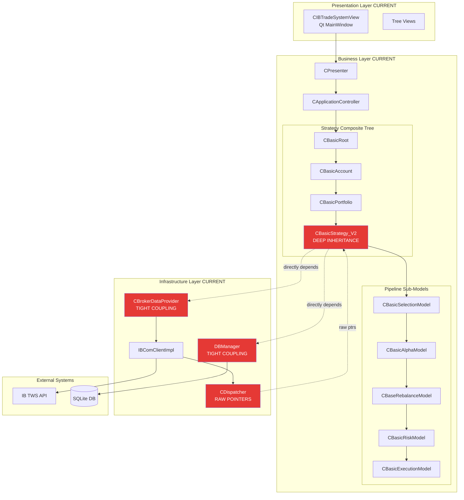
```mermaid
flowchart TB
    subgraph UI[Presentation Layer CURRENT]
        MainWindow[CIBTradeSystemView<br/>Qt MainWindow]
        TreeView[Tree Views]
    end
    
    subgraph Business[Business Layer CURRENT]
        Presenter[CPresenter]
        Controller[CApplicationController]
        
        subgraph StrategyHierarchy[Strategy Composite Tree]
            Root[CBasicRoot]
            Account[CBasicAccount]
            Portfolio[CBasicPortfolio]
            Strategy[CBasicStrategy_V2<br/>DEEP INHERITANCE]
        end
        
        subgraph Pipeline[Pipeline Sub-Models]
            Selection[CBasicSelectionModel]
            Alpha[CBasicAlphaModel]
            Rebalance[CBaseRebalanceModel]
            Risk[CBasicRiskModel]
            Execution[CBasicExecutionModel]
        end
    end
    
    subgraph Infra[Infrastructure Layer CURRENT]
        BrokerProvider[CBrokerDataProvider<br/>TIGHT COUPLING]
        IBClient[IBComClientImpl]
        Dispatcher[CDispatcher<br/>RAW POINTERS]
        DBManager[DBManager<br/>TIGHT COUPLING]
    end
    
    subgraph External[External Systems]
        IB[IB TWS API]
        Database[(SQLite DB)]
    end
    
    MainWindow --> Presenter
    Presenter --> Controller
    Controller --> Root
    Root --> Account
    Account --> Portfolio
    Portfolio --> Strategy
    
    Strategy --> Selection
    Selection --> Alpha
    Alpha --> Rebalance
    Rebalance --> Risk
    Risk --> Execution
    
    Strategy -.directly depends.-> BrokerProvider
    Strategy -.directly depends.-> DBManager
    
    BrokerProvider --> IBClient
    IBClient --> Dispatcher
    Dispatcher -.raw ptrs.-> Strategy
    
    IBClient --> IB
    DBManager --> Database
    
    style Strategy fill:#e53935,color:#fff
    style BrokerProvider fill:#e53935,color:#fff
    style Dispatcher fill:#e53935,color:#fff
    style DBManager fill:#e53935,color:#fff
```


**Problem Visualization**: Red boxes show tight coupling and problematic areas.

### Target Architecture Diagram

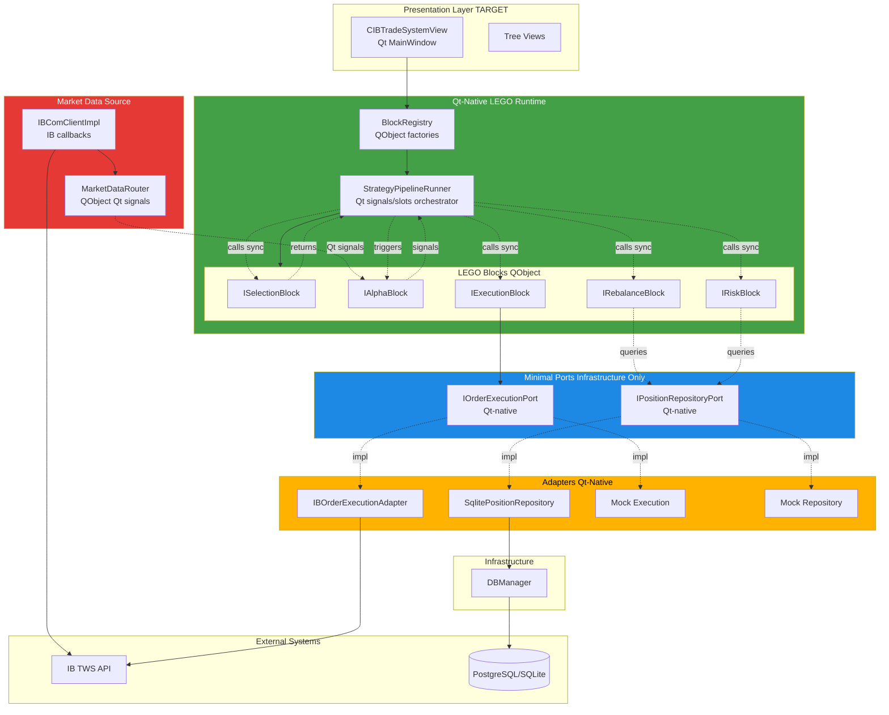
```mermaid
flowchart TB
    subgraph UI[Presentation Layer TARGET]
        MainWindowNew[CIBTradeSystemView<br/>Qt MainWindow]
        TreeViewNew[Tree Views]
    end
    
    subgraph QtRuntime[Qt-Native LEGO Runtime]
        BlockRegistry[BlockRegistry<br/>QObject factories]
        
        subgraph Blocks[LEGO Blocks QObject]
            Selection[ISelectionBlock]
            Alpha[IAlphaBlock]
            Rebalance[IRebalanceBlock]
            Risk[IRiskBlock]
            Execution[IExecutionBlock]
        end
        
        Runner[StrategyPipelineRunner<br/>Qt signals/slots orchestrator]
    end
    
    subgraph MinimalPorts[Minimal Ports Infrastructure Only]
        OrderPort[IOrderExecutionPort<br/>Qt-native]
        RepoPort[IPositionRepositoryPort<br/>Qt-native]
    end
    
    subgraph Adapters[Adapters Qt-Native]
        OrderAdapter[IBOrderExecutionAdapter]
        RepoAdapter[SqlitePositionRepository]
        MockOrderAdapter[Mock Execution]
        MockRepoAdapter[Mock Repository]
    end
    
    subgraph MarketData[Market Data Source]
        MarketRouter[MarketDataRouter<br/>QObject Qt signals]
        IBCallbacks[IBComClientImpl<br/>IB callbacks]
    end
    
    subgraph Infra[Infrastructure]
        DBManager[DBManager]
    end
    
    subgraph External[External Systems]
        IBTWS[IB TWS API]
        Database[(PostgreSQL/SQLite)]
    end
    
    MainWindowNew --> BlockRegistry
    BlockRegistry --> Runner
    Runner --> Blocks
    
    MarketRouter -.Qt signals.-> Alpha
    
    Runner -.calls sync.-> Selection
    Selection -.returns.-> Runner
    Runner -.triggers.-> Alpha
    Alpha -.signals.-> Runner
    Runner -.calls sync.-> Rebalance
    Runner -.calls sync.-> Risk
    Runner -.calls sync.-> Execution
    
    Execution --> OrderPort
    Rebalance -.queries.-> RepoPort
    Risk -.queries.-> RepoPort
    
    OrderPort -.impl.-> OrderAdapter
    OrderPort -.impl.-> MockOrderAdapter
    RepoPort -.impl.-> RepoAdapter
    RepoPort -.impl.-> MockRepoAdapter
    
    IBCallbacks --> MarketRouter
    IBCallbacks --> IBTWS
    OrderAdapter --> IBTWS
    RepoAdapter --> DBManager
    DBManager --> Database
    
    style QtRuntime fill:#43a047,color:#fff
    style MinimalPorts fill:#1e88e5,color:#fff
    style Adapters fill:#ffb300,color:#000
    style MarketData fill:#e53935,color:#fff
```


**Key Improvements** (Target Architecture):

- **Qt-native throughout**: QString, QDateTime, Q_GADGET contracts
- **LEGO blocks**: Composable QObjects wired via signals/slots
- **MarketDataRouter**: Replaces CDispatcher with typed Qt signals (no EventBus)
- **Minimal ports**: Only execution + repository (market data is signals)
- **Testable**: Mock adapters + replay via signal emission
- **Deterministic**: Correlation IDs flow through all contracts

---

## Phase 1: Foundation & Boundaries (Weeks 1-4)

### Goal

Establish clean boundaries and error handling without changing existing behavior.

### Phase 1 Transformation Diagram

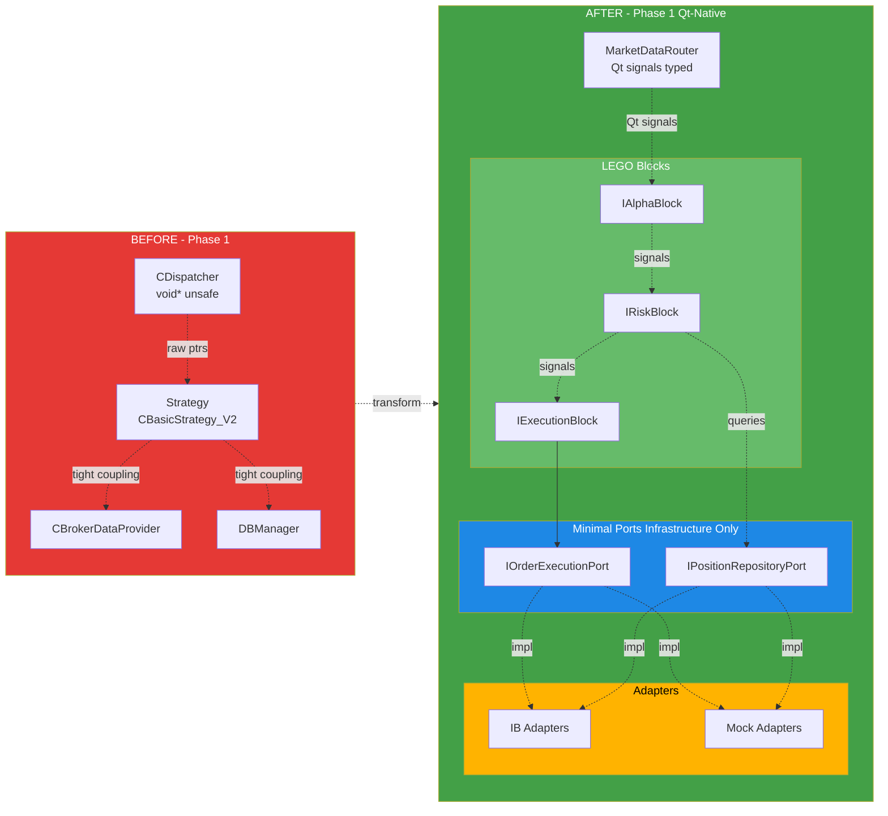
```mermaid
flowchart LR
    subgraph Before[BEFORE - Phase 1]
        OldStrategy[Strategy<br/>CBasicStrategy_V2]
        OldDispatcher[CDispatcher<br/>void* unsafe]
        OldBroker[CBrokerDataProvider]
        OldDB[DBManager]
        
        OldDispatcher -.raw ptrs.-> OldStrategy
        OldStrategy -.tight coupling.-> OldBroker
        OldStrategy -.tight coupling.-> OldDB
    end
    
    subgraph After[AFTER - Phase 1 Qt-Native]
        MarketRouter[MarketDataRouter<br/>Qt signals typed]
        
        subgraph Blocks[LEGO Blocks]
            AlphaBlock[IAlphaBlock]
            RiskBlock[IRiskBlock]
            ExecBlock[IExecutionBlock]
        end
        
        subgraph MinimalPorts[Minimal Ports Infrastructure Only]
            PortOrder[IOrderExecutionPort]
            PortRepo[IPositionRepositoryPort]
        end
        
        subgraph Adapters[Adapters]
            AdapterIB[IB Adapters]
            AdapterMock[Mock Adapters]
        end
        
        MarketRouter -.Qt signals.-> AlphaBlock
        AlphaBlock -.signals.-> RiskBlock
        RiskBlock -.signals.-> ExecBlock
        
        ExecBlock --> PortOrder
        RiskBlock -.queries.-> PortRepo
        
        PortOrder -.impl.-> AdapterIB
        PortOrder -.impl.-> AdapterMock
        PortRepo -.impl.-> AdapterIB
        PortRepo -.impl.-> AdapterMock
    end
    
    Before -.transform.-> After
    
    style Before fill:#e53935,color:#fff
    style After fill:#43a047,color:#fff
    style Blocks fill:#66bb6a,color:#fff
    style MinimalPorts fill:#1e88e5,color:#fff
    style Adapters fill:#ffb300,color:#000
```


**Impact**: 

- **MarketDataRouter replaces CDispatcher**: Type-safe Qt signals, no void* danger
- **Blocks communicate via Qt signals**: Natural Qt pattern, thread-safe
- **Minimal ports**: Only at infrastructure boundaries (execution, persistence)
- **No market data port**: Router feeds blocks directly

---

### 1.1 Error Handling with std::expected

**Why**: Replace inconsistent bool returns and exceptions with standard error handling.

**File to Create**: `[Common/Expected.h](Common/Expected.h)`

**Implementation**:

```cpp
// Standardize on tl::expected for consistency
// (std::expected requires C++23 and has slightly different API)
#include <tl/expected.hpp>

template<typename T, typename E = Error>
using Expected = tl::expected<T, E>;

// Helper for creating unexpected results
template<typename E>
auto make_unexpected(E&& error) {
    return tl::unexpected<std::decay_t<E>>(std::forward<E>(error));
}

// Structured error type (not just QString)
enum class ErrorCode {
    Success = 0,
    InvalidArgument,
    NotFound,
    BrokerConnectionFailed,
    DatabaseError,
    OrderRejected,
    InsufficientFunds,
    ConfigurationError,
    Timeout,
    UnknownError
};

struct Error {
    ErrorCode code;
    std::string message;
    std::string context;  // Where error occurred
    
    std::string toString() const {
        return "Error " + std::to_string(static_cast<int>(code)) + 
               ": " + message + " (context: " + context + ")";
    }
};

// No macros - use explicit C++17 if-init statements for clarity
// Example patterns shown in usage below
```

**Usage Example**:

```cpp
// Before (unclear what failure means)
bool placeOrder(const Order& order);

// After (explicit error information)
Expected<OrderId, Error> placeOrder(const Order& order) {
    if (order.quantity <= 0) {
        return make_unexpected(Error{
            ErrorCode::InvalidArgument,
            "Quantity must be positive",
            "placeOrder"
        });
    }
    
    // C++17 if-init statement for error checking
    if (auto validation = validateOrder(order); !validation) {
        return make_unexpected(validation.error());
    }
    
    // Try-assign pattern without macros
    auto orderIdResult = sendToBroker(order);
    if (!orderIdResult) {
        return make_unexpected(orderIdResult.error());
    }
    
    return *orderIdResult;
}

// Calling code
auto result = placeOrder(order);
if (result) {
    qInfo() << "Order placed:" << *result;
} else {
    qWarning() << QString::fromStdString(result.error().toString());
}
```

**What We Gain**:

- Standard C++ error handling
- Compile-time error checking
- Chainable operations
- Clear error context

**What We Lose**:

- Need tl::expected library (header-only, easy)
- Slightly more verbose than bool

**Migration**:

- New code uses Expected
- Wrap existing functions that return bool
- Update gradually, starting with critical paths
- Use C++17 if-init statements for error checking (no macros)

---

### 1.2 Pipeline Contracts + LEGO Block Interfaces (Qt-Native)

**Critical Decision**: Keep strategy runtime **Qt-native** to support:

- Visual Strategy Builder UI
- Qt plugin ecosystem (signals/slots)
- Q_GADGET data contracts (serializable, stable ABI)
- QSharedPointer block ownership
- Qt metatype system for dynamic composition

**Why Not "Pure C++ Domain"**: 

- Fights Qt plugin architecture
- Incompatible with signal/slot block composition
- Adds conversion overhead for no benefit
- Can always add pure-core engine later for headless servers

**What We Still Get**:

- Clean contracts via interfaces
- Testability via ports & mocks
- Deterministic replay via event recording
- Composition via block graph
- All without removing Qt

**Files to Create**:

- `[Pipeline/Contracts.h](Pipeline/Contracts.h)` - Data contracts (Q_GADGET): Signal, TargetPosition, ExecutionIntent
- `[Pipeline/ISelectionBlock.h](Pipeline/ISelectionBlock.h)` - Selection interface
- `[Pipeline/IAlphaBlock.h](Pipeline/IAlphaBlock.h)` - Alpha interface
- `[Pipeline/IRebalanceBlock.h](Pipeline/IRebalanceBlock.h)` - Rebalance interface
- `[Pipeline/IRiskBlock.h](Pipeline/IRiskBlock.h)` - Risk interface with scope
- `[Pipeline/IExecutionBlock.h](Pipeline/IExecutionBlock.h)` - Execution interface
- `[Pipeline/ISignalMergePolicy.h](Pipeline/ISignalMergePolicy.h)` - Merge policy interface
- `[Pipeline/Scope.h](Pipeline/Scope.h)` - Risk scope definitions

**Implementation**:

```cpp
// Pipeline/Contracts.h - Qt-friendly data contracts
#include <QSharedDataPointer>
#include <QMetaType>
#include <QDateTime>

namespace Pipeline {

// Signal - Alpha block output (NO sizing, direction + confidence only)
struct Signal {
    Q_GADGET
    Q_PROPERTY(QString symbol MEMBER symbol)
    Q_PROPERTY(double confidence MEMBER confidence)
    Q_PROPERTY(Direction direction MEMBER direction)
    Q_PROPERTY(QString correlationId MEMBER correlationId)
    
public:
    enum Direction { Buy, Sell, Hold };
    Q_ENUM(Direction)
    
    QString symbol;
    double confidence;  // 0.0 to 1.0
    Direction direction;
    QString correlationId;  // Trace ID for this signal through pipeline
    QDateTime timestamp;
    QString alphaBlockId;  // Which block generated this
    
    // Serialization for replay
    QJsonObject toJson() const;
    static Signal fromJson(const QJsonObject& obj);
};

// TargetPosition - Rebalance block output (adds sizing)
struct TargetPosition {
    Q_GADGET
    Q_PROPERTY(QString symbol MEMBER symbol)
    Q_PROPERTY(double targetQuantity MEMBER targetQuantity)
    Q_PROPERTY(QString reason MEMBER reason)
    Q_PROPERTY(QString correlationId MEMBER correlationId)
    
public:
    QString symbol;
    double targetQuantity;  // Absolute target quantity (positive or negative)
    double currentQuantity;  // Current position
    QString reason;  // Why this target
    QString correlationId;  // Inherited from Signal, traces through pipeline
    QDateTime timestamp;
    
    double deltaQuantity() const { return targetQuantity - currentQuantity; }
    
    QJsonObject toJson() const;
    static TargetPosition fromJson(const QJsonObject& obj);
};

// ExecutionIntent - Post-risk, pre-execution (final order intent)
struct ExecutionIntent {
    Q_GADGET
    Q_PROPERTY(QString symbol MEMBER symbol)
    Q_PROPERTY(double quantity MEMBER quantity)
    Q_PROPERTY(OrderType orderType MEMBER orderType)
    Q_PROPERTY(QString correlationId MEMBER correlationId)
    
public:
    enum OrderType { Market, Limit, Stop };
    Q_ENUM(OrderType)
    
    QString symbol;
    double quantity;  // Signed: positive = buy, negative = sell
    OrderType orderType;
    std::optional<double> limitPrice;
    QString riskApproval;  // Which risk blocks approved
    QString correlationId;  // Traces Signal → TargetPosition → ExecutionIntent
    QDateTime timestamp;
    
    // Helper: direction derived from quantity sign
    QString side() const { return quantity >= 0 ? "Buy" : "Sell"; }
    double absQuantity() const { return std::abs(quantity); }
    
    QJsonObject toJson() const;
    static ExecutionIntent fromJson(const QJsonObject& obj);
};

} // namespace Pipeline

Q_DECLARE_METATYPE(Pipeline::Signal)
Q_DECLARE_METATYPE(Pipeline::TargetPosition)
Q_DECLARE_METATYPE(Pipeline::ExecutionIntent)
```

```cpp
// Pipeline/Scope.h - Risk scope definitions
namespace Pipeline {

// Risk blocks operate at different scopes
enum class Scope {
    Strategy,   // Per-strategy risk (max position per symbol)
    Portfolio,  // Per-portfolio risk (correlation, sector exposure)
    Account     // Per-account risk (total capital, margin)
};

// Risk application order (fixed): Strategy → Portfolio → Account
inline const std::vector<Scope>& riskScopeOrder() {
    static const std::vector<Scope> order = {
        Scope::Strategy,
        Scope::Portfolio,
        Scope::Account
    };
    return order;
}

} // namespace Pipeline
```

```cpp
// Pipeline/IAlphaBlock.h - Alpha block interface
#include <QObject>
#include "Contracts.h"

namespace Pipeline {

// Alpha blocks emit signals only (no sizing)
// Multiple alpha blocks can run in parallel (fan-out)
class IAlphaBlock : public QObject {
    Q_OBJECT
    
public:
    virtual ~IAlphaBlock() = default;
    
    // Block metadata
    virtual QString id() const = 0;
    virtual QString name() const = 0;
    virtual QString description() const = 0;
    
    // Configuration
    virtual QJsonObject config() const = 0;
    virtual void setConfig(const QJsonObject& config) = 0;
    
    // Lifecycle
    virtual void initialize() = 0;
    virtual void shutdown() = 0;
    
public slots:
    // Called on market tick (required)
    virtual void onTick(const IBComm::MarketTick& tick) = 0;
    
    // Called on bar close (optional - only for bar-based alphas)
    virtual void onBarClose(const QString& symbol, const QDateTime& timestamp) { 
        Q_UNUSED(symbol); 
        Q_UNUSED(timestamp); 
        // Default: do nothing (tick-based alphas can ignore this)
    }
    
signals:
    // Alpha blocks emit signals (no sizing)
    void signalGenerated(const Pipeline::Signal& signal);
    
    // Block health/errors
    void errorOccurred(const QString& message);
};

} // namespace Pipeline
```

```cpp
// Pipeline/ISelectionBlock.h - Selection block interface
#include <QObject>
#include <QVector>
#include <QString>

namespace Pipeline {

// Selection blocks filter universe down to candidates
class ISelectionBlock : public QObject {
    Q_OBJECT
    
public:
    virtual ~ISelectionBlock() = default;
    
    // Block metadata
    virtual QString id() const = 0;
    virtual QString name() const = 0;
    virtual QString description() const = 0;
    
    // Configuration
    virtual QJsonObject config() const = 0;
    virtual void setConfig(const QJsonObject& config) = 0;
    
    // Lifecycle
    virtual void initialize() = 0;
    virtual void shutdown() = 0;
    
    // Selection logic (synchronous)
    virtual QVector<QString> select(const QVector<QString>& universe) = 0;
    
signals:
    void selectionComplete(const QVector<QString>& candidates);
    void errorOccurred(const QString& message);
};

} // namespace Pipeline
```

```cpp
// Pipeline/IRebalanceBlock.h - Rebalance block interface
#include <QObject>
#include "Contracts.h"

namespace Pipeline {

// Rebalance blocks convert Signals to TargetPositions (adds sizing)
// Can exist at Strategy/Portfolio/Account levels
class IRebalanceBlock : public QObject {
    Q_OBJECT
    
public:
    virtual ~IRebalanceBlock() = default;
    
    // Block metadata
    virtual QString id() const = 0;
    virtual QString name() const = 0;
    
    // Configuration
    virtual QJsonObject config() const = 0;
    virtual void setConfig(const QJsonObject& config) = 0;
    
    // Rebalance logic (synchronous)
    virtual QVector<TargetPosition> rebalance(
        const QVector<Signal>& signals,
        const QMap<QString, double>& currentPositions
    ) = 0;
    
signals:
    void rebalanceComplete(const QVector<TargetPosition>& targets);
    void errorOccurred(const QString& message);
};

} // namespace Pipeline
```

```cpp
// Pipeline/IRiskBlock.h - Risk block interface (scope-aware)
#include <QObject>
#include "Contracts.h"
#include "Scope.h"

namespace Pipeline {

struct RiskDecision {
    enum class Action { Approve, Reject, Modify };
    
    Action action;
    QString reason;
    std::optional<double> modifiedQuantity;  // If Action::Modify: new DELTA quantity (not absolute target)
    QString blockId;
};

// Risk blocks validate/modify target positions
// Multiple risk blocks per scope, applied sequentially within scope
class IRiskBlock : public QObject {
    Q_OBJECT
    Q_PROPERTY(Scope scope READ scope CONSTANT)
    
public:
    virtual ~IRiskBlock() = default;
    
    // Block metadata
    virtual QString id() const = 0;
    virtual QString name() const = 0;
    virtual Scope scope() const = 0;  // Which level this risk operates at
    
    // Configuration
    virtual QJsonObject config() const = 0;
    virtual void setConfig(const QJsonObject& config) = 0;
    
    // Risk evaluation (synchronous)
    virtual RiskDecision evaluate(
        const TargetPosition& target,
        const QVector<TargetPosition>& otherTargets  // For portfolio-level risks
    ) = 0;
    
signals:
    void riskViolation(const QString& symbol, const QString& reason);
};

} // namespace Pipeline
```

```cpp
// Pipeline/IExecutionBlock.h - Execution block interface
#include <QObject>
#include "Contracts.h"

namespace Pipeline {

// Execution block converts ExecutionIntents to actual orders
// Exactly ONE execution block per strategy
class IExecutionBlock : public QObject {
    Q_OBJECT
    
public:
    virtual ~IExecutionBlock() = default;
    
    // Block metadata
    virtual QString id() const = 0;
    virtual QString name() const = 0;
    
    // Configuration
    virtual QJsonObject config() const = 0;
    virtual void setConfig(const QJsonObject& config) = 0;
    
public slots:
    // Execute approved intents
    virtual void execute(const QVector<ExecutionIntent>& intents) = 0;
    
signals:
    void orderPlaced(const QString& symbol, const QString& orderId);
    void executionError(const QString& symbol, const QString& error);
};

} // namespace Pipeline
```

```cpp
// Pipeline/ISignalMergePolicy.h - Signal merge policy interface
#include <QObject>
#include "Contracts.h"

namespace Pipeline {

// Merges signals from multiple alpha blocks into single signal per symbol
class ISignalMergePolicy : public QObject {
    Q_OBJECT
    
public:
    virtual ~ISignalMergePolicy() = default;
    
    virtual QString id() const = 0;
    virtual QString name() const = 0;
    
    // Merge multiple signals for same symbol
    virtual Signal merge(const QVector<Signal>& signals) = 0;
};

// Common policies
class WeightedVoteMerge : public ISignalMergePolicy {
    // Each alpha has a weight, final confidence = weighted average
};

class MaxConfidenceMerge : public ISignalMergePolicy {
    // Take signal with highest confidence
};

class ConsensusMerge : public ISignalMergePolicy {
    // Require N% alphas to agree on direction
};

} // namespace Pipeline
```

**Note**: No separate Domain layer. All contracts use Qt types directly (QString for symbols, QDateTime for timestamps, double for prices/quantities). See Pipeline/Contracts.h above for Q_GADGET definitions.

**What We Gain**:

- **Clean contracts** via Q_GADGET interfaces (stable, serializable)
- **Testability** via mocks + replay (blocks still testable with QTest)
- **Composition** via explicit orchestration (fan-out, merge, scope stacking)
- **Plugin ecosystem** using Qt's native mechanisms (QLibrary, Q_PLUGIN_METADATA)
- **Visual Strategy Builder** can directly manipulate these blocks
- **Deterministic replay** by recording Signal/TargetPosition/ExecutionIntent

**What We Lose**:

- Can't run strategies headless without Qt (acceptable - can add later if needed)
- Qt dependency in "core" (but this is our product reality)

**Why This Approach**:

- **Embraces product vision**: LEGO blocks + Strategy Builder UI
- **Matches Qt ecosystem**: Signals/slots, plugins, Q_GADGET serialization
- **Still gets architecture wins**: Ports, adapters, replay, composition
- **Pragmatic**: Don't fight the framework, use it properly

**Migration**:

- Wrap existing CBasicAlphaModel → IAlphaBlock adapter
- Wrap existing risk code → IRiskBlock with explicit scope
- Keep using Qt types throughout (QString, QDateTime, QVector)

### LEGO Block Architecture Diagram

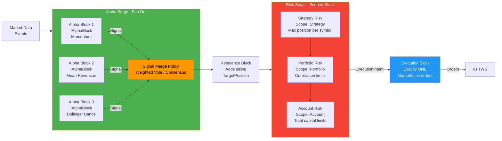
```mermaid
flowchart LR
    MarketData[Market Data<br/>Events]
    
    subgraph AlphaFanOut[Alpha Stage - Fan Out]
        direction TB
        Alpha1[Alpha Block 1<br/>IAlphaBlock<br/>Momentum]
        Alpha2[Alpha Block 2<br/>IAlphaBlock<br/>Mean Reversion]
        Alpha3[Alpha Block 3<br/>IAlphaBlock<br/>Bollinger Bands]
        
        Alpha1 -->|Signal| Merger
        Alpha2 -->|Signal| Merger
        Alpha3 -->|Signal| Merger
    end
    
    Merger[Signal Merge Policy<br/>Weighted Vote / Consensus]
    
    Rebalance[Rebalance Block<br/>Adds sizing<br/>TargetPosition]
    
    subgraph RiskStack[Risk Stage - Scoped Stack]
        direction TB
        RiskStrat[Strategy Risk<br/>Scope::Strategy<br/>Max position per symbol]
        RiskPort[Portfolio Risk<br/>Scope::Portfolio<br/>Correlation limits]
        RiskAcct[Account Risk<br/>Scope::Account<br/>Total capital limits]
        
        RiskStrat --> RiskPort
        RiskPort --> RiskAcct
    end
    
    Execution[Execution Block<br/>Exactly ONE<br/>Market/Limit orders]
    
    Broker[IB TWS]
    
    MarketData --> AlphaFanOut
    Merger --> Rebalance
    Rebalance --> RiskStack
    RiskStack -->|ExecutionIntent| Execution
    Execution -->|Orders| Broker
    
    style AlphaFanOut fill:#4caf50,color:#fff
    style Merger fill:#ff9800,color:#000
    style RiskStack fill:#f44336,color:#fff
    style Execution fill:#2196f3,color:#fff
```

**LEGO Block Semantics (Strategy Builder Invariants)**:

Matches existing pipeline architecture exactly:

1. **Selection Stage**: 1..N blocks
  - Input: Universe (all symbols from watchlist/screener)
  - Output: `QVector<QString>` (filtered candidates)
  - Can combine multiple selection criteria
  - **Maps to**: Existing `CBasicSelectionModel`
2. **Alpha Stage**: 1..N blocks (fan-out)
  - Input: Candidate symbols + market data
  - Output: `QVector<Signal>` (direction + confidence, **NO sizing**)
  - **INVARIANT**: Alpha blocks must NOT size positions
  - Run in parallel, independent
  - **Maps to**: Existing `CBasicAlphaModel` (currently 1-only, plan enables N)
3. **Merge Policy**: Required if N > 1 alphas
  - Input: Multiple `Signal` per symbol (from different alphas)
  - Output: One merged `Signal` per symbol
  - Policies: WeightedVote, MaxConfidence, Consensus, etc.
  - **Maps to**: New (enables multi-alpha strategies)
4. **Rebalance Stage**: 1 block **per level** (Strategy/Portfolio/Account)
  - Input: `QVector<Signal>` (direction + confidence)
  - Output: `QVector<TargetPosition>` (adds actual sizing)
  - Can exist at multiple hierarchy levels
  - **Maps to**: Existing `CBaseRebalanceModel` (already supports multi-level)
5. **Risk Stage**: 0..N blocks **per scope**
  - **Scope stacking**: Strategy → Portfolio → Account (fixed order)
  - Each block can: **Approve**, **Reject**, or **Modify**
  - Multiple blocks per scope execute sequentially
  - Input: `QVector<TargetPosition>`
  - Output: `QVector<ExecutionIntent>` (approved intents)
  - **Maps to**: Existing `CBasicRiskModel` priority system (100/200/300)
6. **Execution Stage**: **Exactly 1 block** (singleton invariant)
  - Input: `QVector<ExecutionIntent>`
  - Output: Orders to broker
  - Handles order routing, splitting, VWAP, etc.
  - **Maps to**: Existing `CBasicExecutionModel` (already 1-only)

**Key Benefit**: Visual Strategy Builder validates these invariants when composing blocks

---

### 1.3 Port Interfaces (Qt-Native, Infrastructure Boundary Only)

**Why**: Make system testable by defining interfaces for external dependencies (IB, DB). These ports use Qt-native types and sit at the infrastructure boundary, NOT in the core pipeline.

**Critical Clarification**: 

- For Qt-native LEGO runtime, `MarketDataRouter` (using Qt signals) feeds blocks directly
- Ports are only needed for **Execution** and **Position Repository** (DB access)
- Market data does NOT need a port interface if `MarketDataRouter` signals drive blocks

**Files to Create**:

- `[Ports/IOrderExecutionPort.h](Ports/IOrderExecutionPort.h)` - For execution block to place orders
- `[Ports/IPositionRepositoryPort.h](Ports/IPositionRepositoryPort.h)` - For DB access

**Implementation** (Qt-native types only):

```cpp
// Ports/IOrderExecutionPort.h - Qt-native
#include <QString>
#include <QDateTime>
#include "Common/Expected.h"
#include "Pipeline/Contracts.h"

namespace Ports {

struct OrderResult {
    int orderId;           // IB order ID
    QString symbol;
    double quantity;
    QString status;        // "Submitted", "Filled", "Rejected", etc.
    QDateTime timestamp;
};

class IOrderExecutionPort {
public:
    virtual ~IOrderExecutionPort() = default;
    
    // Place order based on execution intent (Qt-native)
    virtual Expected<OrderResult, Error> placeOrder(
        const Pipeline::ExecutionIntent& intent) = 0;
    
    // Cancel order
    virtual Expected<void, Error> cancelOrder(int orderId) = 0;
    
    // Query order status
    virtual Expected<OrderResult, Error> getOrderStatus(int orderId) = 0;
};

} // namespace Ports
```

```cpp
// Ports/IPositionRepositoryPort.h - Qt-native
#include <QString>
#include <QVector>
#include "Common/Expected.h"

namespace Ports {

struct PositionRow {
    QString symbol;
    double quantity;
    double avgCost;
    QString account;
    int strategyId;
};

class IPositionRepositoryPort {
public:
    virtual ~IPositionRepositoryPort() = default;
    
    // Get position for specific symbol (Qt-native)
    virtual Expected<PositionRow, Error> getPosition(
        int strategyId, 
        const QString& symbol) = 0;
    
    // Get all positions for strategy
    virtual Expected<QVector<PositionRow>, Error> getAllPositions(
        int strategyId) = 0;
    
    // Update position in DB
    virtual Expected<void, Error> updatePosition(
        const PositionRow& position) = 0;
};

} // namespace Ports
```

**What We Gain**:

- Clean testability (mock execution port for unit tests)
- Can swap IB for other brokers (just implement IOrderExecutionPort)
- DB abstraction (mock repository for tests)

**Why Minimal Ports**:

- Market data does NOT need a port - `MarketDataRouter` (QObject emitting signals) feeds blocks directly
- Only **Execution** and **DB access** need abstraction
- Simpler than full hexagonal architecture (no over-engineering)

**Port to Existing System Mapping**:


| Port Method        | Existing Implementation                |
| ------------------ | -------------------------------------- |
| `placeOrder()`     | `IBComClientImpl::placeOrderAPI()`     |
| `cancelOrder()`    | `IBComClientImpl::cancelOrderAPI()`    |
| `getOrderStatus()` | Cache from `IBComClientImpl` callbacks |
| `getPosition()`    | `DBManager` query                      |
| `updatePosition()` | `DBManager` update                     |


**Threading Contract**:

- **IB Callbacks** execute on IB worker thread  
- **MarketDataRouter** emits Qt signals with `Qt::QueuedConnection` (thread-safe)
- **Port methods** are thread-safe
- **LEGO blocks** receive via Qt signal/slot connections (Qt handles thread boundaries)

### Qt-Native LEGO Architecture Diagram

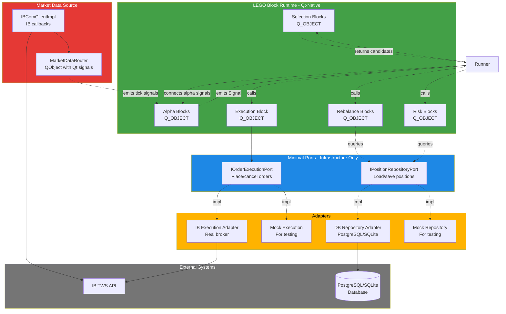
```mermaid
flowchart TB
    subgraph Core[LEGO Block Runtime - Qt-Native]
        Selection[Selection Blocks<br/>Q_OBJECT]
        Alpha[Alpha Blocks<br/>Q_OBJECT]
        Rebalance[Rebalance Blocks<br/>Q_OBJECT]
        Risk[Risk Blocks<br/>Q_OBJECT]
        Execution[Execution Block<br/>Q_OBJECT]
    end
    
    subgraph Ports[Minimal Ports - Infrastructure Only]
        OrderPort[IOrderExecutionPort<br/>Place/cancel orders]
        RepoPort[IPositionRepositoryPort<br/>Load/save positions]
    end
    
    subgraph Adapters[Adapters]
        IBExecAdapter[IB Execution Adapter<br/>Real broker]
        MockExecAdapter[Mock Execution<br/>For testing]
        DBAdapter[DB Repository Adapter<br/>PostgreSQL/SQLite]
        
        MockRepoAdapter[Mock Repository<br/>For testing]
    end
    
    subgraph ExternalMarket[Market Data Source]
        MarketRouter[MarketDataRouter<br/>QObject with Qt signals]
        IB[IBComClientImpl<br/>IB callbacks]
    end
    
    subgraph ExternalSystems[External Systems]
        IBTWS[IB TWS API]
        DB[(PostgreSQL/SQLite<br/>Database)]
    end
    
    MarketRouter -.emits tick signals.-> Alpha
    
    Runner -.calls.-> Selection
    Selection -.returns candidates.-> Runner
    Runner -.connects alpha signals.-> Alpha
    Alpha -.emits Signal.-> Runner
    Runner -.calls.-> Rebalance
    Runner -.calls.-> Risk
    Runner -.calls.-> Execution
    
    Execution --> OrderPort
    Rebalance -.queries.-> RepoPort
    Risk -.queries.-> RepoPort
    
    OrderPort -.impl.-> IBExecAdapter
    OrderPort -.impl.-> MockExecAdapter
    
    RepoPort -.impl.-> DBAdapter
    RepoPort -.impl.-> MockRepoAdapter
    
    IB --> MarketRouter
    IB --> IBTWS
    IBExecAdapter --> IBTWS
    DBAdapter --> DB
    
    style Core fill:#43a047,color:#fff
    style Ports fill:#1e88e5,color:#fff
    style Adapters fill:#ffb300,color:#000
    style ExternalMarket fill:#e53935,color:#fff
    style ExternalSystems fill:#757575,color:#fff
```


**Key Benefits**:

- **Qt-native throughout**: No Domain layer to maintain
- **MarketDataRouter feeds blocks directly**: No market data port needed
- **Minimal ports**: Only Execution and DB access abstracted
- **Mockable for tests**: Swap adapters without touching block code
- **One event system**: Qt signals/slots everywhere

---

### 1.4 Event System Decision: EventBus or Qt Signals?

**Critical Decision**: Your existing pipeline uses Qt signals/slots for stage chaining. `CDispatcher` only exists for IB callback distribution.

**Two Options**:

**Option A (Recommended)**: Keep Qt signals/slots as primary, replace CDispatcher only

- Blocks chain via Qt signals/slots (natural for QObject blocks)
- Replace `CDispatcher` unsafe raw-pointer usage with typed signal routing at IB boundary
- One event system (Qt native), not two

**Option B**: Add C++ EventBus throughout

- Two event systems (EventBus + Qt signals)
- Unclear ownership  
- More complexity

**Recommendation**: **Option A** - Keep Qt signals between blocks, improve IB boundary only.

### 1.4 Safer IB Data Router (Replaces CDispatcher)

**Why**: Replace `[CDispatcher](IBComm/Dispatcher.h)` unsafe raw pointers with Qt-native typed signals.

**File to Create**: `[IBComm/MarketDataRouter.h](IBComm/MarketDataRouter.h)`

**Implementation** (Qt-native replacement for CDispatcher):

```cpp
// IBComm/MarketDataRouter.h - Safer replacement for CDispatcher
#include <QObject>
#include <QDateTime>
#include <QMap>

namespace IBComm {

// Typed market data event (Qt-native, no variant needed - use signals directly)
struct MarketTick {
    Q_GADGET
    Q_PROPERTY(QString symbol MEMBER symbol)
    Q_PROPERTY(double bid MEMBER bid)
    Q_PROPERTY(double ask MEMBER ask)
    Q_PROPERTY(QDateTime timestamp MEMBER timestamp)
    
public:
    QString symbol;
    double bid;
    double ask;
    QDateTime timestamp;
    int reqId;
};

// Router distributes IB callbacks to subscribers via Qt signals
class MarketDataRouter : public QObject {
    Q_OBJECT
    
public:
    explicit MarketDataRouter(QObject* parent = nullptr)
        : QObject(parent) {}
    
    // Called from IB thread (IBComClientImpl callbacks)
    void onTickPrice(int reqId, const QString& symbol, double bid, double ask, const QDateTime& timestamp) {
        // Build MarketTick Q_GADGET
        MarketTick tick;
        tick.symbol = symbol;
        tick.bid = bid;
        tick.ask = ask;
        tick.timestamp = timestamp;
        
        // Emit typed signal (Qt queued connection = thread-safe)
        emit tick(tick);
    }
    
    void onBarClose(int reqId, const QString& symbol, const QDateTime& timestamp) {
        emit barClose(symbol, timestamp);
    }
    
signals:
    // Canonical signals - blocks connect to these
    void tick(const IBComm::MarketTick& tick);      // Every tick
    void barClose(const QString& symbol, const QDateTime& timestamp);  // Bar complete
    void connectionError(const QString& message);
};

} // namespace IBComm
```

**Execution Model (Signal-Driven Alpha + Synchronous Pipeline)**:

```cpp
// Simplified StrategyPipelineRunner showing execution model
class StrategyPipelineRunner : public QObject {
    Q_OBJECT
    
public:
    StrategyPipelineRunner(
        const BlockGraph& graph,
        MarketDataRouter* marketRouter,
        Ports::IOrderExecutionPort* executionPort,
        Ports::IPositionRepositoryPort* positionRepo,
        QObject* parent = nullptr)
        : QObject(parent), m_graph(graph) {
        
        // Connect market data signals to alpha blocks (event-driven)
        for (auto* alpha : m_graph.alphaBlocks) {
            connect(marketRouter, &MarketDataRouter::tick,
                    alpha, &IAlphaBlock::onTick,
                    Qt::QueuedConnection);  // Thread-safe
            
            connect(marketRouter, &MarketDataRouter::barClose,
                    this, &StrategyPipelineRunner::onBarClose,
                    Qt::QueuedConnection);
        }
        
        // Alpha blocks emit signals when they generate signals
        for (auto* alpha : m_graph.alphaBlocks) {
            connect(alpha, &IAlphaBlock::signalGenerated,
                    this, &StrategyPipelineRunner::onAlphaSignal,
                    Qt::QueuedConnection);
        }
    }
    
private slots:
    void onAlphaSignal(const Pipeline::Signal& signal) {
        m_collectedSignals.append(signal);
    }
    
    void onBarClose(const QString& symbol, const QDateTime& timestamp) {
        // Trigger pipeline execution (collect all alpha signals since last bar)
        runPipeline();
        m_collectedSignals.clear();
    }
    
private:
    void runPipeline() {
        // 1. Synchronous selection
        QVector<QString> candidates = m_graph.selectionBlock->select(m_universe);
        
        // 2. Alpha signals already collected via slots (m_collectedSignals)
        
        // 3. Merge signals (synchronous)
        auto mergedSignals = m_graph.mergePolicy ? 
            m_graph.mergePolicy->merge(m_collectedSignals) : m_collectedSignals;
        
        // 4. Rebalance (synchronous)
        auto targets = m_graph.strategyLevel.rebalance->rebalance(mergedSignals, getCurrentPositions());
        
        // 5. Multi-level risk (synchronous calls to blocks)
        auto intents = applyRiskStack(targets);
        
        // 6. Execution (synchronous call)
        m_graph.executionBlock->execute(intents);
    }
    
    QVector<Pipeline::ExecutionIntent> applyRiskStack(QVector<Pipeline::TargetPosition> targets) {
        // Apply risk blocks in fixed order: Strategy → Portfolio → Account
        for (auto* risk : m_graph.strategyLevel.risks) {
            targets = filterByRisk(targets, risk);
        }
        // Convert to ExecutionIntents...
        return convertToIntents(targets);
    }
    
    BlockGraph m_graph;
    QVector<Pipeline::Signal> m_collectedSignals;
    QVector<QString> m_universe;
};
```

**Key Execution Model Clarification**:

1. **Event-Driven Input**: MarketDataRouter emits `tick()` signals → Alpha blocks receive via `onTick()` slot
2. **Signal Collection**: Alpha blocks emit `signalGenerated()` → Runner collects in `m_collectedSignals`
3. **Synchronous Pipeline**: On bar-close trigger, Runner makes synchronous calls:
  - `Selection::select()` - returns candidates
  - `MergePolicy::merge()` - returns merged signals
  - `Rebalance::rebalance()` - returns target positions
  - `RiskStack::apply()` - filters/modifies targets
  - `Execution::execute()` - places orders

**Why This Hybrid Model**:

- **Alpha is event-driven**: Reacts to every tick (natural for momentum, volatility tracking)
- **Pipeline is synchronous**: Selection/Rebalance/Risk/Execution run once per bar (deterministic, easier to debug)
- **Thread-safe**: Qt::QueuedConnection handles cross-thread signal delivery
- **Simple**: No complex orchestration, clear execution order

**What We Gain**:

- Type safety via Qt signal/slot signatures (compile-time checked)
- Thread safety via `Qt::QueuedConnection` (no manual mutexes)
- Native Qt integration (signals/slots visible in Qt Creator)
- Simple execution model (signals for input, sync calls for pipeline)
- Direct replacement for unsafe `CDispatcher`
- One event system (Qt signals), not two

**What We Lose**:

- Nothing - Qt signals are simpler AND safer than custom EventBus

**Why This Approach**:

- Don't duplicate plumbing - your existing pipeline uses Qt signals successfully
- QObject blocks naturally support signals/slots
- Your composite tree already propagates signals through hierarchy
- `MarketDataRouter` with typed signals replaces `CDispatcher` cleanly

**Migration Strategy**:

- `MarketDataRouter` replaces `[CDispatcher](IBComm/Dispatcher.h)` at IB boundary only
- LEGO blocks chain via Qt signals/slots (already natural in your architecture)
- Existing signal/slot chains in pipeline continue to work
- Gradually wrap existing models as IAlphaBlock/IRiskBlock (emit same signals)

### IB Data Distribution Transformation

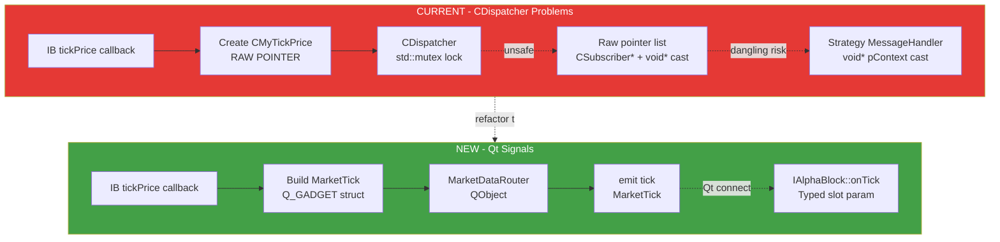
```mermaid
flowchart TB
    subgraph CurrentEvent[CURRENT - CDispatcher Problems]
        IBCallback1[IB tickPrice callback]
        CreateObj1[Create CMyTickPrice<br/>RAW POINTER]
        Dispatcher1[CDispatcher<br/>std::mutex lock]
        RawPtrList1[Raw pointer list<br/>CSubscriber* + void* cast]
        Subscriber1[Strategy MessageHandler<br/>void* pContext cast]
        
        IBCallback1 --> CreateObj1
        CreateObj1 --> Dispatcher1
        Dispatcher1 -.unsafe.-> RawPtrList1
        RawPtrList1 -.dangling risk.-> Subscriber1
    end
    
    subgraph NewEvent[NEW - Qt Signals]
        IBCallback2[IB tickPrice callback]
        BuildTick2[Build MarketTick<br/>Q_GADGET struct]
        Router2[MarketDataRouter<br/>QObject]
        EmitSignal2[emit tick<br/>MarketTick]
        AlphaSlot2[IAlphaBlock::onTick<br/>Typed slot param]
        
        IBCallback2 --> BuildTick2
        BuildTick2 --> Router2
        Router2 --> EmitSignal2
        EmitSignal2 -.Qt connect.-> AlphaSlot2
    end
    
    CurrentEvent -.refactor to.-> NewEvent
    
    style CurrentEvent fill:#e53935,color:#fff
    style NewEvent fill:#43a047,color:#fff
```


**Key Improvements**:

1. **Type Safety**: Qt signal/slot signatures instead of `void`* - compile-time checking
2. **Lifetime Safety**: Qt connection management - auto-disconnect on delete
3. **Thread Safety**: `Qt::QueuedConnection` handles cross-thread automatically
4. **Simplicity**: Native Qt mechanisms, no custom EventBus complexity
5. **Debuggability**: Visible in Qt Creator signals/slots inspector

---

### Phase 1 Deliverables

- Expected error handling implemented (tl::expected with make_unexpected helper, std::string for errors)
- **LEGO Block Contracts** (Q_GADGET): Signal, TargetPosition, ExecutionIntent (Qt-native, serializable)
- **Block Interfaces** (QObject): ISelectionBlock, IAlphaBlock, IRebalanceBlock, IRiskBlock, IExecutionBlock, ISignalMergePolicy
- **Scope definitions**: Strategy, Portfolio, Account (with fixed risk application order)
- **MarketDataRouter**: Qt-native replacement for CDispatcher (typed signals, no raw pointers)
- Port interfaces defined (aligned with IBrokerAPI, Qt-native types)
- **StrategyPipelineRunner skeleton**: Orchestrator that wires blocks together with Qt signals/slots
- **Merge policy implementations**: WeightedVote, MaxConfidence, Consensus
- Unit tests for contracts + interfaces (using QTest)
- **Invariant validation**: Ensure alpha blocks emit signals only, execution is singleton, etc.
- Documentation of LEGO semantics

### Phase 1 Success Metrics

- All new code compiles with Qt (no std::string domain types)
- Block interfaces (ISelectionBlock, IAlphaBlock, IRebalanceBlock, IRiskBlock, IExecutionBlock) compile and are mockable
- Contracts (Signal, TargetPosition, ExecutionIntent) serialize to/from JSON via Q_GADGET
- `MarketDataRouter` replaces `CDispatcher` at IB boundary with typed Qt signals
- Can create simple toy strategy: Selection(2 symbols) → Alpha(1 block) → Rebalance → Risk(no-op) → Execution(mock)
- Unit tests pass for contracts + merge policies (using QTest)
- `StrategyPipelineRunner` skeleton demonstrates Qt signal/slot wiring between blocks
- **Invariant validation**: Alpha blocks emit signals only (no sizing), execution is singleton
- No changes to existing CBaseModel strategies (run in parallel)

---

## Phase 2: Adapters & Replay Infrastructure (Weeks 5-8)

### Goal

Implement adapters for existing infrastructure and add deterministic replay capability.

### Phase 2 Transformation Diagram (Testing Modes)

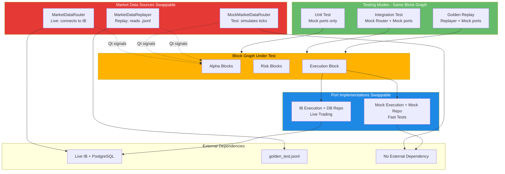
```mermaid
flowchart TB
    subgraph TestModes[Testing Modes - Same Block Graph]
        UnitTest[Unit Test<br/>Mock ports only]
        IntegrationTest[Integration Test<br/>Mock Router + Mock ports]
        GoldenReplay[Golden Replay<br/>Replayer + Mock ports]
    end
    
    subgraph BlockGraph[Block Graph Under Test]
        AlphaBlocks[Alpha Blocks]
        RiskBlocks[Risk Blocks]
        ExecBlock[Execution Block]
    end
    
    subgraph MarketDataSources[Market Data Sources Swappable]
        LiveRouter[MarketDataRouter<br/>Live: connects to IB]
        MockRouter[MockMarketDataRouter<br/>Test: simulates ticks]
        Replayer[MarketDataReplayer<br/>Replay: reads .jsonl]
    end
    
    subgraph PortImpls[Port Implementations Swappable]
        LivePorts[IB Execution + DB Repo<br/>Live Trading]
        MockPorts[Mock Execution + Mock Repo<br/>Fast Tests]
    end
    
    subgraph External[External Dependencies]
        LiveIB[Live IB + PostgreSQL]
        RecordedData[golden_test.jsonl]
        NoExternal[No External Dependency]
    end
    
    UnitTest --> BlockGraph
    IntegrationTest --> BlockGraph
    GoldenReplay --> BlockGraph
    
    LiveRouter -.Qt signals.-> AlphaBlocks
    MockRouter -.Qt signals.-> AlphaBlocks
    Replayer -.Qt signals.-> AlphaBlocks
    
    ExecBlock --> LivePorts
    ExecBlock --> MockPorts
    
    LiveRouter --> LiveIB
    LivePorts --> LiveIB
    Replayer --> RecordedData
    MockRouter --> NoExternal
    MockPorts --> NoExternal
    
    style TestModes fill:#66bb6a,color:#fff
    style BlockGraph fill:#ffb300,color:#000
    style MarketDataSources fill:#e53935,color:#fff
    style PortImpls fill:#1e88e5,color:#fff
```


**Key Achievement**: Same strategy code runs with different adapters - production, testing, or replay.

---

### 2.1 MarketDataRouter Implementation (Replaces CDispatcher)

**Critical**: MarketDataRouter feeds LEGO blocks directly via Qt signals - no IMarketDataPort needed.

**File to Create/Modify**: `[IBComm/MarketDataRouter.h](IBComm/MarketDataRouter.h)`

**Implementation** (Qt-native, replaces CDispatcher):

```cpp
// IBComm/MarketDataRouter.h
#include <QObject>
#include <QDateTime>
#include <QString>

namespace IBComm {

struct MarketTick {
    Q_GADGET
    Q_PROPERTY(QString symbol MEMBER symbol)
    Q_PROPERTY(double bid MEMBER bid)
    Q_PROPERTY(double ask MEMBER ask)
    Q_PROPERTY(QDateTime timestamp MEMBER timestamp)
    
public:
    QString symbol;
    double bid;
    double ask;
    QDateTime timestamp;
    
    double mid() const { return (bid + ask) / 2.0; }
};

class MarketDataRouter : public QObject {
    Q_OBJECT
    
public:
    explicit MarketDataRouter(QObject* parent = nullptr)
        : QObject(parent) {}
    
    // Called from IB thread (IBComClientImpl::tickPrice callback)
    void onTickPrice(int reqId, const QString& symbol, double bid, double ask) {
        MarketTick tick;
        tick.symbol = symbol;
        tick.bid = bid;
        tick.ask = ask;
        tick.timestamp = QDateTime::currentDateTime();
        
        // Emit canonical signal (thread-safe via Qt::QueuedConnection)
        emit tick(tick);
    }
    
    void onBarComplete(int reqId, const QString& symbol, const QDateTime& timestamp) {
        emit barClose(symbol, timestamp);
    }
    
    // Canonical signals - LEGO blocks connect to these
signals:
    void tick(const MarketTick& tick);              // Every tick
    void barClose(const QString& symbol, const QDateTime& timestamp);  // Bar complete
    
private:
    // Optional: maintain cache for "last price" queries
    QMap<QString, MarketTick> m_lastPriceCache;
};

} // namespace IBComm
```

**Integration with IB**: Modify `[IBComClientImpl::tickPrice](IBComm/IBComClientImpl.cpp)`:

```cpp
void IBComClientImpl::tickPrice(TickerId tickerId, TickType field, 
                                 double price, const TickAttrib& attribs) {
    // Keep existing CDispatcher code for now (gradual migration)
    CMyTickPrice myPrice;
    myPrice.reqId = tickerId;
    myPrice.price = price;
    m_DispatcherBrokerData.SendMessageToSubscribers(&myPrice, tickerId, RT_TICK_PRICE);
    
    // NEW: Also route through MarketDataRouter (Qt signals)
    if (m_marketDataRouter) {
        QString symbol = getSymbolForReqId(tickerId);
        double bid = price;  // Simplification, get real bid
        double ask = price;  // Get real ask
        
        m_marketDataRouter->onTickPrice(tickerId, symbol, bid, ask);
        // MarketDataRouter emits Qt signal → LEGO blocks receive it
    }
}
```

**Key Benefits**:

- **No Domain types**: Just QString, double, QDateTime
- **No EventBus**: Qt signals/slots only
- **Gradual migration**: CDispatcher stays until all consumers migrated to MarketDataRouter
- **Thread-safe**: Qt::QueuedConnection handles IB thread → main thread automatically

---

### 2.2 Repository Adapters (Qt-Native)

**Files to Create**:

- `[Adapters/SqlitePositionRepository.h](Adapters/SqlitePositionRepository.h)`

**Implementation** (Qt-native types only):

```cpp
// Adapters/SqlitePositionRepository.h
#include "Ports/IPositionRepositoryPort.h"

class SqlitePositionRepository : public Ports::IPositionRepositoryPort {
public:
    explicit SqlitePositionRepository(DBHandler* dbHandler)
        : m_dbHandler(dbHandler) {}
    
    Expected<Ports::PositionRow, Error> getPosition(
        int strategyId, 
        const QString& symbol) override {
        
        QSqlQuery query;
        query.prepare("SELECT * FROM OpenPositions WHERE strategyId = ? AND symbol = ?");
        query.addBindValue(strategyId);
        query.addBindValue(symbol.toQString());
        
        if (!query.exec()) {
            return make_unexpected(Error{
                ErrorCode::DatabaseError,
                query.lastError().text().toStdString(),
                "SqlitePositionRepository::getPosition"
            });
        }
        
        if (!query.next()) {
            return make_unexpected(Error{
                ErrorCode::NotFound,
                "Position not found",
                "SqlitePositionRepository::getPosition"
            });
        }
        
        // Convert from DB row to Qt-native struct
        Ports::PositionRow row;
        row.symbol = query.value("symbol").toString();
        row.quantity = query.value("quantity").toDouble();
        row.avgCost = query.value("average_price").toDouble();
        row.account = query.value("account").toString();
        row.strategyId = strategyId;
        
        return row;
    }
    
    Expected<void, Error> updatePosition(const Ports::PositionRow& position) override {
        QSqlQuery query(m_dbHandler->database());
        query.prepare("UPDATE positions SET quantity = ?, avg_cost = ? WHERE strategy_id = ? AND symbol = ?");
        query.addBindValue(position.quantity);
        query.addBindValue(position.avgCost);
        query.addBindValue(position.strategyId);
        query.addBindValue(position.symbol);
        
        if (!query.exec()) {
            return make_unexpected(Error{
                ErrorCode::DatabaseError,
                query.lastError().text().toStdString(),
                "SqlitePositionRepository::updatePosition"
            });
        }
        
        return {};  // Success
    }
    
    Expected<QVector<Ports::PositionRow>, Error> getAllPositions(int strategyId) override {
        QVector<Ports::PositionRow> positions;
        QSqlQuery query(m_dbHandler->database());
        query.prepare("SELECT * FROM positions WHERE strategy_id = ?");
        query.addBindValue(strategyId);
        
        if (!query.exec()) {
            return make_unexpected(Error{
                ErrorCode::DatabaseError,
                query.lastError().text().toStdString(),
                "SqlitePositionRepository::getAllPositions"
            });
        }
        
        while (query.next()) {
            Ports::PositionRow row;
            row.symbol = query.value("symbol").toString();
            row.quantity = query.value("quantity").toDouble();
            row.avgCost = query.value("average_price").toDouble();
            row.account = query.value("account").toString();
            row.strategyId = strategyId;
            positions.push_back(row);
        }
        
        return positions;
    }
    
private:
    DBHandler* m_dbHandler;
};
```

---

### 2.3 Mock Adapters for Testing (Qt-Native)

**Files to Create**:

- `[Adapters/MockExecutionAdapter.h](Adapters/MockExecutionAdapter.h)`
- `[Adapters/MockPositionRepository.h](Adapters/MockPositionRepository.h)`

**Note**: For market data testing, use `MockMarketDataRouter` (QObject emitting fake signals) instead of an adapter.

**Implementation**:

```cpp
// Adapters/MockExecutionAdapter.h
#include "Ports/IOrderExecutionPort.h"

class MockExecutionAdapter : public Ports::IOrderExecutionPort {
public:
    Expected<Ports::OrderResult, Error> placeOrder(
        const Pipeline::ExecutionIntent& intent) override {
        
        // Fake order placement
        Ports::OrderResult result;
        result.orderId = m_nextOrderId++;
        result.symbol = intent.symbol;
        result.quantity = intent.quantity;
        result.status = "Filled";  // Mock instant fill
        result.timestamp = QDateTime::currentDateTime();
        
        m_placedOrders.push_back(result);
        
        return result;
    }
    
    // Test inspection
    const QVector<Ports::OrderResult>& getPlacedOrders() const {
        return m_placedOrders;
    }
    
    void reset() {
        m_placedOrders.clear();
        m_nextOrderId = 1;
    }
    
private:
    int m_nextOrderId = 1;
    QVector<Ports::OrderResult> m_placedOrders;
};
```

```cpp
// Adapters/MockPositionRepository.h
#include "Ports/IPositionRepositoryPort.h"

class MockPositionRepository : public Ports::IPositionRepositoryPort {
public:
    Expected<Ports::PositionRow, Error> getPosition(
        int strategyId, 
        const QString& symbol) override {
        
        QString key = QString("%1:%2").arg(strategyId).arg(symbol);
        auto it = m_positions.find(key);
        if (it == m_positions.end()) {
            return make_unexpected(Error{
                ErrorCode::NotFound,
                "Position not found",
                "MockPositionRepository"
            });
        }
        return it->second;
    }
    
    Expected<void, Error> updatePosition(const Ports::PositionRow& position) override {
        QString key = QString("%1:%2").arg(position.strategyId).arg(position.symbol);
        m_positions[key] = position;
        return {};
    }
    
    Expected<QVector<Ports::PositionRow>, Error> getAllPositions(int strategyId) override {
        QVector<Ports::PositionRow> result;
        for (auto it = m_positions.begin(); it != m_positions.end(); ++it) {
            if (it.value().strategyId == strategyId) {
                result.push_back(it.value());
            }
        }
        return result;
    }
    
    // Test helpers
    void setPosition(const Ports::PositionRow& position) {
        QString key = QString("%1:%2").arg(position.strategyId).arg(position.symbol);
        m_positions[key] = position;
    }
    
    void reset() {
        m_positions.clear();
    }
    
private:
    QMap<QString, Ports::PositionRow> m_positions;
};
```

**Note on Market Data Mocking**:

No `MockMarketDataAdapter` needed. For testing, use `MockMarketDataRouter`:

```cpp
// Testing/MockMarketDataRouter.h
class MockMarketDataRouter : public QObject {
    Q_OBJECT
    
public:
    // Test helper: simulate tick
    void simulateTick(const QString& symbol, double bid, double ask) {
        IBComm::MarketTick marketTick;
        marketTick.symbol = symbol;
        marketTick.bid = bid;
        marketTick.ask = ask;
        marketTick.timestamp = QDateTime::currentDateTime();
        
        emit tick(marketTick);  // Same signal as real MarketDataRouter
    }
    
signals:
    void tick(const IBComm::MarketTick& tick);     // Same as MarketDataRouter
    void barClose(const QString& symbol, const QDateTime& timestamp);
};
```

**Usage in Tests**:

```cpp
MockMarketDataRouter mockRouter;
IAlphaBlock* alpha = new MomentumAlpha();

// Connect like live mode (same signals as MarketDataRouter)
connect(&mockRouter, &MockMarketDataRouter::tick,
        alpha, &IAlphaBlock::onTick);

// Simulate data
mockRouter.simulateTick("AAPL", 150.0, 150.5);
```

---

### 2.4 Deterministic Replay Infrastructure

**Why**: Critical for debugging production issues and backtesting. Enables "golden replay tests" where fixed input → fixed output.

**Recording Strategy for LEGO Blocks**:

Don't record everything blindly - record only what's needed for deterministic pipeline replay:

1. **Market Input Events**: Ticks or bars + timestamps (input to Selection/Alpha)
2. **Block Graph Configuration**: Which blocks, their configs, how they're wired
3. **Expected Outputs**: ExecutionIntents or placed orders (for regression testing)

**Do NOT record**:

- Internal block state (private members)
- Every Signal/TargetPosition (only final ExecutionIntents)
- UI events or user interactions

**Benefit**: Replay validates "given this market data + this block graph → expect these orders" deterministically.

**Files to Create**:

- `[Replay/MarketDataRecorder.h](Replay/MarketDataRecorder.h)` - Records MarketTick to `.jsonl`
- `[Replay/MarketDataReplayer.h](Replay/MarketDataReplayer.h)` - Replays by emitting Qt signals

**Determinism Strategy**:

No need for `IClock` abstraction. QDateTime timestamps are recorded in MarketTick events. During replay:

- MarketDataReplayer reads `.jsonl` file
- Emits Qt signals in recorded order with recorded timestamps
- Blocks process events identically to live mode
- Deterministic because signal sequence + timestamps are fixed

**Implementation**:

```cpp
// Replay/MarketDataRecorder.h - Qt-native (no Events::Event, no Domain types)
#include <QFile>
#include <QJsonDocument>
#include <QJsonObject>
#include "IBComm/MarketDataRouter.h"

class MarketDataRecorder : public QObject {
    Q_OBJECT
    
public:
    explicit MarketDataRecorder(const QString& filename, QObject* parent = nullptr)
        : QObject(parent)
        , m_file(filename) {
        m_file.open(QIODevice::WriteOnly | QIODevice::Text);
    }
    
    ~MarketDataRecorder() {
        m_file.close();
    }
    
public slots:
    // Record market ticks (Qt-native MarketTick from MarketDataRouter)
    void onMarketTick(const IBComm::MarketTick& tick) {
        QJsonObject obj;
        obj["type"] = "MarketTick";
        obj["symbol"] = tick.symbol;
        obj["bid"] = tick.bid;
        obj["ask"] = tick.ask;
        obj["timestamp"] = tick.timestamp.toString(Qt::ISODateWithMs);
        
        // Write as JSON lines (.jsonl)
        m_file.write(QJsonDocument(obj).toJson(QJsonDocument::Compact));
        m_file.write("\n");
        m_file.flush();
    }
    
    // Record execution intents (for validation)
    void onExecutionIntent(const Pipeline::ExecutionIntent& intent) {
        QJsonObject obj;
        obj["type"] = "ExecutionIntent";
        obj["symbol"] = intent.symbol;
        obj["quantity"] = intent.quantity;  // Signed: positive=buy, negative=sell
        obj["orderType"] = static_cast<int>(intent.orderType);
        obj["correlationId"] = intent.correlationId;
        obj["timestamp"] = intent.timestamp.toString(Qt::ISODateWithMs);
        
        m_file.write(QJsonDocument(obj).toJson(QJsonDocument::Compact));
        m_file.write("\n");
        m_file.flush();
    }
    
private:
    QFile m_file;
};

// Replay/MarketDataReplayer.h - Replays recorded ticks as Qt signals
#include <QFile>
#include <QJsonDocument>
#include <QVector>
#include "IBComm/MarketDataRouter.h"

class MarketDataReplayer : public QObject {
    Q_OBJECT
    
public:
    explicit MarketDataReplayer(const QString& filename, QObject* parent = nullptr)
        : QObject(parent) {
        loadRecording(filename);
    }
    
    // Replay all ticks (emits signals like MarketDataRouter)
    void replay() {
        for (const auto& marketTick : m_ticks) {
            emit tick(marketTick);
        }
    }
    
    // Replay until specific timestamp (for deterministic tests)
    void replayUntil(const QDateTime& until) {
        for (const auto& marketTick : m_ticks) {
            if (marketTick.timestamp > until) break;
            emit tick(marketTick);
        }
    }
    
signals:
    // Canonical signals - identical to MarketDataRouter (blocks connect to either)
    void tick(const IBComm::MarketTick& tick);
    void barClose(const QString& symbol, const QDateTime& timestamp);
    
private:
    QVector<IBComm::MarketTick> m_ticks;
    QVector<Pipeline::ExecutionIntent> m_expectedIntents;  // For validation
    
    void loadRecording(const QString& filename) {
        QFile file(filename);
        if (!file.open(QIODevice::ReadOnly | QIODevice::Text)) {
            qWarning() << "Failed to open replay file:" << filename;
            return;
        }
        
        while (!file.atEnd()) {
            QByteArray line = file.readLine();
            QJsonDocument doc = QJsonDocument::fromJson(line);
            QJsonObject obj = doc.object();
            
            QString type = obj["type"].toString();
            if (type == "MarketTick") {
                IBComm::MarketTick tick;
                tick.symbol = obj["symbol"].toString();
                tick.bid = obj["bid"].toDouble();
                tick.ask = obj["ask"].toDouble();
                tick.timestamp = QDateTime::fromString(obj["timestamp"].toString(), Qt::ISODateWithMs);
                m_ticks.append(tick);
            }
            else if (type == "ExecutionIntent") {
                Pipeline::ExecutionIntent intent;
                intent.symbol = obj["symbol"].toString();
                intent.quantity = obj["quantity"].toDouble();  // Signed quantity
                intent.orderType = static_cast<Pipeline::ExecutionIntent::OrderType>(obj["orderType"].toInt());
                intent.correlationId = obj["correlationId"].toString();
                intent.timestamp = QDateTime::fromString(obj["timestamp"].toString(), Qt::ISODateWithMs);
                m_expectedIntents.append(intent);
            }
        }
    }
    
public:
    // For golden replay tests
    const QVector<Pipeline::ExecutionIntent>& expectedIntents() const {
        return m_expectedIntents;
    }
};

**Usage in Golden Replay Test** (Qt-native):

```cpp
// test_golden_replay.cpp - Deterministic integration test
TEST_F(GoldenReplayTest, MomentumStrategyProducesExpectedOrders) {
    // 1. Load recorded market data
    MarketDataReplayer replayer("golden_test_2026_03_04.jsonl");
    
    // 2. Setup mock infrastructure
    MockExecutionAdapter mockExecution;
    MockPositionRepository mockRepo;
    
    // 3. Build block graph (Strategy Builder would do this)
    BlockGraph graph;
    graph.alphaBlocks.append(new MomentumAlphaBlock());  // One alpha
    graph.mergePolicy = nullptr;  // Not needed (only 1 alpha)
    graph.strategyLevel.rebalance = new SimpleRebalanceBlock();
    graph.strategyLevel.risks.append(new MaxPositionRiskBlock());
    graph.executionBlock = new MockExecutionBlock(&mockExecution);
    
    // 4. Create runner and connect signals
    StrategyPipelineRunner runner(graph, &replayer, &mockExecution, &mockRepo);
    
    // Connect replayer signals to blocks (identical to live MarketDataRouter)
    connect(&replayer, &MarketDataReplayer::tick,
            graph.alphaBlocks[0], &IAlphaBlock::onTick,
            Qt::DirectConnection);  // Sync for determinism
    
    // 5. Replay events (triggers pipeline via signals)
    replayer.replay();
    
    // 6. Assert against expected intents from recording
    const auto& expected = replayer.expectedIntents();
    const auto& actual = mockExecution.getPlacedOrders();
    
    QCOMPARE(actual.size(), expected.size());
    QCOMPARE(actual[0].symbol, QString("AAPL"));
    QCOMPARE(actual[0].quantity, 100.0);
    QCOMPARE(actual[0].correlationId, expected[0].correlationId);  // Full trace match
}
```

**What We Gain**:

- Deterministic testing (same input → same output)
- Can debug production issues by replaying
- Backtesting on real data
- Regression testing

**What We Lose**:

- Need to record events (disk space)
- Replay may not capture all state

**Why This Approach**:

- Critical for trading systems
- Solves "can't reproduce" bugs
- Enables continuous testing

**Recording Granularity** (What to Record for LEGO Blocks):

Record pipeline inputs and key outputs for replay:

1. **Market data events** (+ timestamps) - pipeline inputs
2. **Strategy configuration** (which blocks + merge policy + config) - at start
3. **Signal emissions** (optional, for debugging alpha blocks)
4. **ExecutionIntents** (final approved intents) - for regression testing
5. **Order events / fills** (external feedback)

**Don't record**:

- Internal block state (should be reconstructed from inputs)
- UI events
- Database queries (use mock repository in replay)
- Every tick (too much data - consider sampling or bar-close only)

**Determinism Rules** (Critical for Replay):

1. **Time from recorded ticks**: QDateTime in MarketTick events (no IClock abstraction needed)
2. **Randomness is seeded**: Any RNG in blocks uses injected seed, not random device
3. **Event-driven only**: Pipeline triggers on bar-close or tick signals, not wall-clock timers
4. **Config is immutable**: BlockGraph configuration recorded at start, doesn't change during replay

### Replay Infrastructure Diagram (Qt-Native Router/Replayer Symmetry)

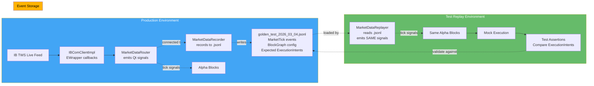
```mermaid
flowchart LR
    subgraph Production[Production Environment]
        LiveIB[IB TWS Live Feed]
        IBCallbacks[IBComClientImpl<br/>EWrapper callbacks]
        LiveRouter[MarketDataRouter<br/>emits Qt signals]
        Recorder[MarketDataRecorder<br/>records to .jsonl]
        AlphaBlocks1[Alpha Blocks]
        
        LiveIB --> IBCallbacks
        IBCallbacks --> LiveRouter
        LiveRouter -.tick signals.-> AlphaBlocks1
        LiveRouter -.connected to.-> Recorder
        Recorder -.writes.-> RecordedFile
    end
    
    subgraph Storage[Event Storage]
        RecordedFile[golden_test_2026_03_04.jsonl<br/>MarketTick events<br/>BlockGraph config<br/>Expected ExecutionIntents]
    end
    
    subgraph TestEnv[Test Replay Environment]
        Replayer[MarketDataReplayer<br/>reads .jsonl<br/>emits SAME signals]
        AlphaBlocks2[Same Alpha Blocks]
        MockExec[Mock Execution]
        Assertions[Test Assertions<br/>Compare ExecutionIntents]
        
        Replayer -.tick signals.-> AlphaBlocks2
        AlphaBlocks2 --> MockExec
        MockExec --> Assertions
        Assertions -.validate against.-> RecordedFile
    end
    
    RecordedFile -.loaded by.-> Replayer
    
    style Production fill:#42a5f5,color:#fff
    style Storage fill:#ffb300,color:#000
    style TestEnv fill:#66bb6a,color:#fff
```


**Key Insight: Router/Replayer Emit Identical Signals**

- **Production**: `MarketDataRouter::tick(const MarketTick&)` → blocks
- **Replay**: `MarketDataReplayer::tick(const MarketTick&)` → same blocks
- **Result**: Blocks receive identical signal sequences → deterministic outputs

**Workflow**:

1. **Production**: Recorder listens to MarketDataRouter signals, writes `.jsonl`
2. **Bug Report**: User reports unexpected ExecutionIntent at timestamp X
3. **Replay**: Replayer reads `.jsonl`, emits recorded signals in order
4. **Debug**: Blocks process identical tick sequence → reproduce issue
5. **Fix**: Modify block logic, replay again to verify fix
6. **Regression Test**: Keep replay as permanent golden test

---

### 2.5 Integration Test Harness (Qt-Native)

**File to Create**: `[tests/IntegrationTestHarness.h](tests/IntegrationTestHarness.h)`

**Implementation**:

```cpp
// tests/IntegrationTestHarness.h - Deterministic testing for block graphs
class IntegrationTestHarness : public QObject {
    Q_OBJECT
    
public:
    IntegrationTestHarness() {
        m_mockRouter = new MockMarketDataRouter(this);
        m_mockExecution = new MockExecutionAdapter();
        m_mockRepo = new MockPositionRepository();
    }
    
    // Run block graph with simulated market ticks (deterministic)
    void runBlockGraph(
        const BlockGraph& graph,
        const QVector<IBComm::MarketTick>& ticks) {
        
        StrategyPipelineRunner runner(graph, m_mockRouter, m_mockExecution, m_mockRepo, this);
        
        // Connect signals (identical to live mode)
        for (auto* alpha : graph.alphaBlocks) {
            connect(m_mockRouter, &MockMarketDataRouter::tick,
                    alpha, &IAlphaBlock::onTick,
                    Qt::DirectConnection);  // Synchronous for determinism
        }
        
        // Simulate ticks (triggers pipeline via Qt signals)
        for (const auto& tick : ticks) {
            m_mockRouter->simulateTick(tick.symbol, tick.bid, tick.ask);
            QCoreApplication::processEvents();  // Process synchronously
        }
    }
    
    // Accessors for assertions
    const QVector<Ports::OrderResult>& getPlacedOrders() const {
        return m_mockExecution->getPlacedOrders();
    }
    
    MockMarketDataRouter* router() { return m_mockRouter; }
    MockExecutionAdapter* execution() { return m_mockExecution; }
    MockPositionRepository* repository() { return m_mockRepo; }
    
private:
    MockMarketDataRouter* m_mockRouter;
    MockExecutionAdapter* m_mockExecution;
    MockPositionRepository* m_mockRepo;
};

// Example test (deterministic, no timing dependencies)
TEST_F(IntegrationTest, MomentumAlphaGeneratesSignalOnUptrend) {
    IntegrationTestHarness harness;
    
    // Build simple block graph
    BlockGraph graph;
    graph.alphaBlocks.append(new MomentumAlphaBlock());
    graph.mergePolicy = nullptr;  // Only 1 alpha, no merge needed
    graph.strategyLevel.rebalance = new SimpleRebalanceBlock();
    graph.strategyLevel.risks.clear();  // No risk checks for this test
    graph.executionBlock = new MockExecutionBlock(harness.execution());
    
    // Simulate uptrend (deterministic timestamps)
    QDateTime baseTime = QDateTime::currentDateTime();
    QVector<IBComm::MarketTick> ticks = {
        {"AAPL", 100.0, 100.5, baseTime},
        {"AAPL", 101.0, 101.5, baseTime.addSecs(60)},
        {"AAPL", 102.0, 102.5, baseTime.addSecs(120)},
        {"AAPL", 103.0, 103.5, baseTime.addSecs(180)},  // 3% increase
    };
    
    harness.runBlockGraph(graph, ticks);
    
    // Assert buy order was placed
    auto& orders = harness.getPlacedOrders();
    QCOMPARE(orders.size(), 1);
    QCOMPARE(orders[0].symbol, QString("AAPL"));
    QVERIFY(orders[0].quantity > 0);  // Buy signal
}
```

---

### Phase 2 Deliverables

- IB adapters (MarketData, OrderExecution) - Qt-native
- Repository adapters (Position, Trade) - Qt-native
- Mock adapters with full test coverage
- Event recording/replay infrastructure with determinism guarantees
- **Block-graph replay**: Records strategy configuration (which blocks) + market data + ExecutionIntents
- Integration test harness that builds strategies from blocks
- At least 3 integration tests using LEGO blocks
- **Golden Replay Test**: One recorded session with block configuration + expected ExecutionIntents (regression safety net)

### Phase 2 Success Metrics

- Can run strategies without IB connection (using mocks)
- Can replay recorded sessions deterministically (same input → same output)
- Golden Replay Test passes (permanent regression test)
- Integration tests pass reliably
- No regressions in live system
- Replay produces bit-identical results on repeated runs

---

## Phase 3: Block Registry + Plugins + Legacy Adapters (Weeks 9-14)

### Goal

Build the **Strategy Builder** infrastructure: block registry for discovery, plugin system for blocks (not whole strategies), and compatibility bridge wrapping existing models as blocks.

This is where LEGO blocks become **discoverable** and **pluggable**, and where legacy code gets wrapped instead of rewritten.

---

### 3.1 Block Registry (Discovery System)

**Goal**: Central registry where blocks register themselves for discovery by Strategy Builder UI.

**File to Create**: `[Pipeline/BlockRegistry.h](Pipeline/BlockRegistry.h)`

**Implementation**:

```cpp
// Pipeline/BlockRegistry.h
namespace Pipeline {

struct BlockDescriptor {
    QString id;
    QString name;
    QString category;  // "Alpha", "Risk", "Execution", etc.
    QString description;
    Scope scope;  // For risk blocks
    QJsonObject defaultConfig;
    
    // Factory function to create instance
    std::function<QObject*()> factory;
};

class BlockRegistry {
public:
    static BlockRegistry& instance() {
        static BlockRegistry registry;
        return registry;
    }
    
    // Register block (called from plugin init or static registration)
    void registerBlock(const BlockDescriptor& descriptor) {
        m_blocks[descriptor.id] = descriptor;
        emit blockRegistered(descriptor.id);
    }
    
    // Query blocks by category (for Strategy Builder UI)
    QVector<BlockDescriptor> getBlocksByCategory(const QString& category) const {
        QVector<BlockDescriptor> result;
        for (const auto& [id, desc] : m_blocks) {
            if (desc.category == category) {
                result.push_back(desc);
            }
        }
        return result;
    }
    
    // Create block instance
    Expected<QObject*, Error> createBlock(const QString& blockId) {
        auto it = m_blocks.find(blockId);
        if (it == m_blocks.end()) {
            return make_unexpected(Error{
                ErrorCode::NotFound,
                "Block not found in registry",
                "BlockRegistry::createBlock"
            });
        }
        
        return it->second.factory();
    }
    
    // For Strategy Builder UI dropdowns
    QVector<QString> listAlphaBlocks() const { return getBlockIdsByCategory("Alpha"); }
    QVector<QString> listRiskBlocks() const { return getBlockIdsByCategory("Risk"); }
    QVector<QString> listExecutionBlocks() const { return getBlockIdsByCategory("Execution"); }
    
signals:
    void blockRegistered(const QString& blockId);
    
private:
    QMap<QString, BlockDescriptor> m_blocks;
    
    QVector<QString> getBlockIdsByCategory(const QString& category) const {
        QVector<QString> ids;
        for (const auto& [id, desc] : m_blocks) {
            if (desc.category == category) {
                ids.push_back(id);
            }
        }
        return ids;
    }
};

// Convenience macro for static registration
#define REGISTER_BLOCK(BlockClass, id, name, category, description) \
    static bool BlockClass##_registered = []() { \
        Pipeline::BlockDescriptor desc; \
        desc.id = id; \
        desc.name = name; \
        desc.category = category; \
        desc.description = description; \
        desc.factory = []() -> QObject* { return new BlockClass(); }; \
        Pipeline::BlockRegistry::instance().registerBlock(desc); \
        return true; \
    }();

} // namespace Pipeline
```

**Usage**:

```cpp
// In block implementation file
REGISTER_BLOCK(MomentumAlphaBlock, 
              "momentum-alpha", 
              "Momentum Alpha", 
              "Alpha",
              "Generates signals based on price momentum");

// Strategy Builder UI populates dropdowns
auto alphaBlocks = BlockRegistry::instance().listAlphaBlocks();
// ["momentum-alpha", "mean-reversion-alpha", "bollinger-alpha", ...]
```

---

### 3.2 Legacy Model Adapters (Wrap Existing Code)

**Critical**: Don't rewrite existing models - wrap them as blocks for incremental migration.

**Files to Create**:

- `[Adapters/AlphaModelAdapter.h](Adapters/AlphaModelAdapter.h)`
- `[Adapters/RiskModelAdapter.h](Adapters/RiskModelAdapter.h)`
- `[Adapters/ExecutionModelAdapter.h](Adapters/ExecutionModelAdapter.h)`

**Implementation** (Qt-native StrategyPipelineRunner):

```cpp
// Pipeline/StrategyPipelineRunner.h - Qt-native LEGO block orchestrator
#include <QObject>
#include <QVector>
#include "Pipeline/Contracts.h"
#include "Pipeline/ISelectionBlock.h"
#include "Pipeline/IAlphaBlock.h"
#include "Pipeline/IRebalanceBlock.h"
#include "Pipeline/IRiskBlock.h"
#include "Pipeline/IExecutionBlock.h"
#include "Pipeline/ISignalMergePolicy.h"

namespace Pipeline {

struct BlockGraph {
    QVector<ISelectionBlock*> selectionBlocks;
    QVector<IAlphaBlock*> alphaBlocks;
    ISignalMergePolicy* mergePolicy;  // Required if alphaBlocks.size() > 1
    
    // Multi-level rebalance + risk (Strategy/Portfolio/Account)
    struct LevelBlocks {
        IRebalanceBlock* rebalance;  // Can be null
        QVector<IRiskBlock*> risks;   // Applied sequentially within level
    };
    
    LevelBlocks strategyLevel;
    LevelBlocks portfolioLevel;
    LevelBlocks accountLevel;
    
    IExecutionBlock* executionBlock;  // Exactly 1 (singleton)
    
    QJsonObject config;  // Strategy configuration
};

// Qt-native LEGO block orchestrator
class StrategyPipelineRunner : public QObject {
    Q_OBJECT
    
public:
    explicit StrategyPipelineRunner(
        const BlockGraph& graph,
        MarketDataRouter* marketRouter,
        Ports::IOrderExecutionPort* executionPort,
        Ports::IPositionRepositoryPort* positionRepo,
        QObject* parent = nullptr)
        : QObject(parent)
        , m_graph(graph)
        , m_executionPort(executionPort)
        , m_positionRepo(positionRepo) {
        
        // Connect MarketDataRouter signals to alpha blocks (event-driven)
        // NOTE: Selection is NOT connected - it's called synchronously
        for (auto* alpha : m_graph.alphaBlocks) {
            connect(marketRouter, &MarketDataRouter::tick,
                    alpha, &IAlphaBlock::onTick,
                    Qt::QueuedConnection);  // Thread-safe
            connect(marketRouter, &MarketDataRouter::barClose,
                    alpha, &IAlphaBlock::onBarClose,
                    Qt::QueuedConnection);
        }
    }
    
    // Multi-level orchestration algorithm (deterministic order)
    void runPipeline() {
        QString correlationId = QUuid::createUuid().toString();
        
        // 1. Selection: filter universe to candidates
        QVector<QString> candidates = runSelection();
        
        // 2. Alpha fan-out: generate signals from all alpha blocks
        QVector<Signal> alphaSignals = runAlphaBlocks(candidates, correlationId);
        
        // 3. Merge: combine signals if multiple alphas
        QVector<Signal> mergedSignals = mergeSignals(alphaSignals, correlationId);
        
        // 4. Rebalance multi-level: Strategy → Portfolio → Account
        QVector<TargetPosition> targets = runMultiLevelRebalance(mergedSignals, correlationId);
        
        // 5. Risk multi-level: Strategy → Portfolio → Account
        QVector<ExecutionIntent> intents = runMultiLevelRisk(targets, correlationId);
        
        // 6. Execution: single execution block processes intents
        executeIntents(intents);
    }
    
private:
    QVector<QString> runSelection() {
        // Call all selection blocks, combine results
        QVector<QString> allCandidates;
        for (auto* block : m_graph.selectionBlocks) {
            QVector<QString> candidates = block->select(m_universe);
            allCandidates.append(candidates);
        }
        return allCandidates;
    }
    
    QVector<Signal> runAlphaBlocks(const QVector<QString>& candidates, const QString& correlationId) {
        QVector<Signal> signals;
        for (auto* alpha : m_graph.alphaBlocks) {
            // Each alpha emits signals independently (fan-out)
            // Signals are collected via signal/slot connections
        }
        return signals;  // Collected from signal emissions
    }
    
    QVector<Signal> mergeSignals(const QVector<Signal>& alphaSignals, const QString& correlationId) {
        if (m_graph.alphaBlocks.size() <= 1) {
            return alphaSignals;  // No merge needed
        }
        
        if (!m_graph.mergePolicy) {
            qWarning() << "Multiple alphas but no merge policy!";
            return {};  // Invalid configuration
        }
        
        // Group signals by symbol
        QMap<QString, QVector<Signal>> bySymbol;
        for (const auto& sig : alphaSignals) {
            bySymbol[sig.symbol].append(sig);
        }
        
        // Merge per symbol
        QVector<Signal> merged;
        for (auto it = bySymbol.begin(); it != bySymbol.end(); ++it) {
            Signal mergedSignal = m_graph.mergePolicy->merge(it.value());
            mergedSignal.correlationId = correlationId;  // Preserve trace ID
            merged.append(mergedSignal);
        }
        
        return merged;
    }
    
    QVector<TargetPosition> runMultiLevelRebalance(
        const QVector<Signal>& signals, 
        const QString& correlationId) {
        
        QVector<TargetPosition> targets;
        
        // Apply rebalance at each level (Strategy → Portfolio → Account)
        // Each level can modify/override previous level's targets
        
        // Level 1: Strategy rebalance (per-strategy sizing)
        if (m_graph.strategyLevel.rebalance) {
            QMap<QString, double> currentPos = getCurrentPositions();
            targets = m_graph.strategyLevel.rebalance->rebalance(signals, currentPos);
            
            // Inherit correlation ID
            for (auto& target : targets) {
                target.correlationId = correlationId;
            }
        }
        
        // Level 2: Portfolio rebalance (can redistribute across strategies)
        if (m_graph.portfolioLevel.rebalance) {
            targets = m_graph.portfolioLevel.rebalance->rebalance(signals, getCurrentPositions());
            for (auto& target : targets) {
                target.correlationId = correlationId;
            }
        }
        
        // Level 3: Account rebalance (can clamp total exposure)
        if (m_graph.accountLevel.rebalance) {
            targets = m_graph.accountLevel.rebalance->rebalance(signals, getCurrentPositions());
            for (auto& target : targets) {
                target.correlationId = correlationId;
            }
        }
        
        return targets;
    }
    
    QVector<ExecutionIntent> runMultiLevelRisk(
        const QVector<TargetPosition>& targets,
        const QString& correlationId) {
        
        QVector<TargetPosition> approved = targets;
        
        // Apply risk checks at each scope (Strategy → Portfolio → Account)
        // Each risk block evaluates targets individually (one at a time)
        // Fixed order ensures deterministic behavior
        
        // Scope 1: Strategy risk (per-strategy limits)
        for (auto* risk : m_graph.strategyLevel.risks) {
            approved = applyRiskBlock(risk, approved);
        }
        
        // Scope 2: Portfolio risk (cross-strategy correlation, sector exposure)
        for (auto* risk : m_graph.portfolioLevel.risks) {
            approved = applyRiskBlock(risk, approved);
        }
        
        // Scope 3: Account risk (total capital, margin limits)
        for (auto* risk : m_graph.accountLevel.risks) {
            approved = applyRiskBlock(risk, approved);
        }
        
        // Convert approved targets to execution intents
        QVector<ExecutionIntent> intents;
        for (const auto& target : approved) {
            ExecutionIntent intent;
            intent.symbol = target.symbol;
            intent.quantity = target.deltaQuantity();  // Signed: positive=buy, negative=sell
            intent.orderType = ExecutionIntent::Market;
            intent.riskApproval = "Strategy/Portfolio/Account";
            intent.correlationId = target.correlationId;  // Inherited from target
            intent.timestamp = QDateTime::currentDateTime();
            intents.append(intent);
        }
        
        return intents;
    }
    
    // Helper: Apply one risk block to all targets (loops over each target)
    QVector<TargetPosition> applyRiskBlock(
        IRiskBlock* risk,
        const QVector<TargetPosition>& targets) {
        
        QVector<TargetPosition> approved;
        
        for (const auto& target : targets) {
            // Call risk->evaluate for THIS target, with otherTargets for context
            auto decision = risk->evaluate(target, targets);
            
            switch (decision.action) {
                case RiskDecision::Action::Approve:
                    approved.append(target);
                    break;
                    
                case RiskDecision::Action::Reject:
                    // Skip this target (filtered out)
                    qDebug() << "Risk rejected:" << target.symbol << decision.reason;
                    break;
                    
                case RiskDecision::Action::Modify: {
                    // Risk block reduces position size (e.g., clamp to max exposure)
                    // modifiedQuantity is the new DELTA quantity (not target)
                    auto modified = target;
                    if (decision.modifiedQuantity) {
                        modified.targetQuantity = modified.currentQuantity + *decision.modifiedQuantity;
                        modified.reason += QString(" [RiskModified: %1]").arg(decision.reason);
                    }
                    approved.append(modified);
                    break;
                }
            }
        }
        
        return approved;
    }
    
    void executeIntents(const QVector<ExecutionIntent>& intents) {
        if (!m_graph.executionBlock) {
            qWarning() << "No execution block configured!";
            return;
        }
        
        // Single execution block handles all intents
        for (const auto& intent : intents) {
            auto result = m_executionPort->placeOrder(intent);
            if (!result) {
                qWarning() << "Order failed:" << QString::fromStdString(result.error().toString());
            }
        }
    }
    
    QMap<QString, double> getCurrentPositions() {
        QMap<QString, double> positions;
        auto result = m_positionRepo->getAllPositions(m_graph.config["strategyId"].toInt());
        if (result) {
            for (const auto& pos : *result) {
                positions[pos.symbol] = pos.quantity;
            }
        }
        return positions;
    }
    
    BlockGraph m_graph;
    QVector<QString> m_universe;  // All symbols in watchlist
    Ports::IOrderExecutionPort* m_executionPort;
    Ports::IPositionRepositoryPort* m_positionRepo;
};

} // namespace Pipeline
```

**Multi-Level Orchestration Algorithm** (Production-Ready Spec):

```
1. Selection produces candidates (QVector<QString>)
2. Alpha fan-out produces Signal[] from N blocks (parallel/independent)
3. MergePolicy combines signals per symbol (required if N > 1)
4. Rebalance Multi-Level (each can override/modify):
   a. Strategy level: per-strategy sizing
   b. Portfolio level: redistribute across strategies
   c. Account level: clamp total exposure
5. Risk Multi-Level (each can Approve/Reject/Modify):
   a. Strategy scope: per-strategy limits
   b. Portfolio scope: correlation, sector exposure
   c. Account scope: total capital, margin
   Fixed order: Strategy → Portfolio → Account
6. Execution: single block executes all approved intents
```

**Key Properties**:

- **Deterministic**: Fixed scope ordering (Strategy → Portfolio → Account)
- **Traceable**: correlationId flows through all contracts
- **Qt-native**: Uses signals/slots, QString, QVector throughout
- **No Domain types**: Pure Qt from end to end

**Example - Wrapping CBasicAlphaModel**:

```cpp
// Adapters/AlphaModelAdapter.h
// Wraps existing CBasicAlphaModel as IAlphaBlock
class AlphaModelAdapter : public Pipeline::IAlphaBlock {
    Q_OBJECT
    
public:
    explicit AlphaModelAdapter(CBasicAlphaModel* legacyModel, QObject* parent = nullptr)
        : IAlphaBlock(parent)
        , m_legacyModel(legacyModel) {
        
        // Connect legacy model signals to new interface
        connect(m_legacyModel, &CBasicAlphaModel::Signals,
                this, &AlphaModelAdapter::onLegacySignal,
                Qt::QueuedConnection);
    }
    
    QString id() const override { return "legacy-alpha-" + QString::number(m_legacyModel->GetId()); }
    QString name() const override { return "Legacy Alpha Model"; }
    QString description() const override { return "Wrapped CBasicAlphaModel"; }
    
    QJsonObject config() const override {
        // Extract config from legacy model
        QJsonObject cfg;
        cfg["legacyId"] = m_legacyModel->GetId();
        return cfg;
    }
    
    void setConfig(const QJsonObject& config) override {
        // Apply to legacy model
    }
    
    void initialize() override {
        m_legacyModel->InitModel();
    }
    
    void shutdown() override {
        m_legacyModel->CloseModel();
    }
    
public slots:
    void onTick(const IBComm::MarketTick& tick) override {
        // Forward to legacy model's existing interface
        // CBasicAlphaModel likely handles market data via its MessageHandler
        // Extract mid price from tick
        double price = tick.mid();  // (bid + ask) / 2
        
        // Call legacy MessageHandler (adapt as needed based on CBasicAlphaModel API)
        m_legacyModel->MessageHandler(/* construct legacy message with symbol/price */);
    }
    
    void onBarClose(const QString& symbol, const QDateTime& timestamp) override {
        // Trigger legacy model update (if bar-based)
        m_legacyModel->Update();
    }
    
private slots:
    void onLegacySignal(const UnifiedModelData* data) {
        // Convert legacy UnifiedModelData to new Signal contract
        Pipeline::Signal signal;
        signal.symbol = data->Symbol;
        signal.confidence = data->Confidence;  // If exists
        signal.direction = convertDirection(data->Direction);
        signal.timestamp = QDateTime::currentDateTime();
        signal.alphaBlockId = id();
        
        emit signalGenerated(signal);
    }
    
private:
    CBasicAlphaModel* m_legacyModel;
    
    Pipeline::Signal::Direction convertDirection(int legacyDir) {
        // Convert from legacy direction to new enum
        if (legacyDir > 0) return Pipeline::Signal::Buy;
        if (legacyDir < 0) return Pipeline::Signal::Sell;
        return Pipeline::Signal::Hold;
    }
};
```

**Key Point**: Existing `CBasicAlphaModel` continues to work, just wrapped. No rewrite needed!

---

### 3.3 Strategy Graph Persistence (Save/Load Block Graphs)

**Why**: Enable Strategy Builder UI to save/load block configurations.

**File to Create**: `[Pipeline/BlockGraphSerializer.h](Pipeline/BlockGraphSerializer.h)`

**Implementation**:

```cpp
// Pipeline/BlockGraphSerializer.h
namespace Pipeline {

class BlockGraphSerializer {
public:
    static QJsonObject serialize(const BlockGraph& graph) {
        QJsonObject json;
        
        // Serialize block IDs (not pointers)
        QJsonArray selectionIds;
        for (auto* block : graph.selectionBlocks) {
            selectionIds.append(block->id());
        }
        json["selection"] = selectionIds;
        
        QJsonArray alphaIds;
        for (auto* block : graph.alphaBlocks) {
            alphaIds.append(block->id());
        }
        json["alphas"] = alphaIds;
        
        if (graph.mergePolicy) {
            json["mergePolicy"] = graph.mergePolicy->id();
        }
        
        // Multi-level blocks
        json["strategyRebalance"] = graph.strategyLevel.rebalance ? graph.strategyLevel.rebalance->id() : "";
        json["portfolioRebalance"] = graph.portfolioLevel.rebalance ? graph.portfolioLevel.rebalance->id() : "";
        json["accountRebalance"] = graph.accountLevel.rebalance ? graph.accountLevel.rebalance->id() : "";
        
        json["executionBlock"] = graph.executionBlock ? graph.executionBlock->id() : "";
        json["config"] = graph.config;
        
        return json;
    }
    
    static BlockGraph deserialize(const QJsonObject& json, BlockRegistry& registry) {
        BlockGraph graph;
        
        // Deserialize blocks by creating instances from registry
        QJsonArray selectionIds = json["selection"].toArray();
        for (const auto& val : selectionIds) {
            auto result = registry.createBlock(val.toString());
            if (result) {
                graph.selectionBlocks.append(qobject_cast<ISelectionBlock*>(*result));
            }
        }
        
        // ... similar for alphas, risks, etc.
        
        graph.config = json["config"].toObject();
        return graph;
    }
};

} // namespace Pipeline
```

**Usage** (Strategy Builder save/load):

```cpp
// Save strategy
BlockGraph graph = buildGraphFromUI();
QJsonObject json = BlockGraphSerializer::serialize(graph);
QFile file("strategy.json");
file.write(QJsonDocument(json).toJson());

// Load strategy
QFile file("strategy.json");
QJsonDocument doc = QJsonDocument::fromJson(file.readAll());
BlockGraph graph = BlockGraphSerializer::deserialize(doc.object(), BlockRegistry::instance());
```

---

### 3.2 Internal Plugin System (Blocks, Not Strategies)

**Core Principle**: Plugins provide **LEGO blocks**, not whole strategies. Strategy Builder UI assembles blocks into graphs.

**Why**: Same toolchain, version-locked Qt, internal use only (no ABI concerns).

**Files to Create**:

- `[Plugin/BlockPlugin.h](Plugin/BlockPlugin.h)`
- `[Plugin/PluginLoader.h](Plugin/PluginLoader.h)`

**Implementation**:

```cpp
// Plugin/BlockPlugin.h
namespace Plugin {

struct PluginMetadata {
    QString name;
    QString version;
    QString description;
    QString author;
};

// Block plugin provides factories for blocks + optional preset graphs
class IBlockPlugin {
public:
    virtual ~IBlockPlugin() = default;
    
    virtual PluginMetadata metadata() const = 0;
    
    // Return block descriptors (to register in BlockRegistry)
    virtual QVector<Pipeline::BlockDescriptor> blockDescriptors() const = 0;
    
    // Optional: provide preset block graphs (saved strategies)
    virtual QVector<Pipeline::PresetGraph> presetGraphs() const {
        return {};
    }
};

// Plugin must export C functions for discovery
#define EXPORT_BLOCK_PLUGIN(PluginClass) \
    extern "C" { \
        Q_DECL_EXPORT Plugin::IBlockPlugin* createBlockPlugin() { \
            return new PluginClass(); \
        } \
        Q_DECL_EXPORT void destroyBlockPlugin(Plugin::IBlockPlugin* plugin) { \
            delete plugin; \
        } \
    }

} // namespace Plugin
```

```cpp
// Plugin/PluginLoader.h
namespace Plugin {

class PluginLoader {
public:
    // Load plugin and register its blocks into BlockRegistry
    Expected<void, Error> loadPlugin(const QString& path) {
        QLibrary library(path);
        
        if (!library.load()) {
            return tl::unexpected(Error{
                ErrorCode::ConfigurationError,
                library.errorString().toStdString(),
                "PluginLoader::loadPlugin"
            });
        }
        
        // Resolve factory functions
        auto createFn = reinterpret_cast<IBlockPlugin*(*)()>(
            library.resolve("createBlockPlugin")
        );
        auto destroyFn = reinterpret_cast<void(*)(IBlockPlugin*)>(
            library.resolve("destroyBlockPlugin")
        );
        
        if (!createFn || !destroyFn) {
            return tl::unexpected(Error{
                ErrorCode::ConfigurationError,
                "Plugin missing required exports (createBlockPlugin/destroyBlockPlugin)",
                "PluginLoader::loadPlugin"
            });
        }
        
        // Create plugin instance
        IBlockPlugin* plugin = createFn();
        auto metadata = plugin->metadata();
        
        // Register all block descriptors from this plugin
        auto& registry = Pipeline::BlockRegistry::instance();
        for (const auto& descriptor : plugin->blockDescriptors()) {
            registry.registerBlock(descriptor);
        }
        
        // Store plugin info
        m_plugins[metadata.name] = PluginInfo{
            plugin,
            destroyFn,
            std::move(library),
            metadata
        };
        
        qInfo() << "Loaded block plugin:" << metadata.name
                << "version:" << metadata.version;
        
        return {};
    }
    
    QVector<PluginMetadata> listPlugins() const {
        QVector<PluginMetadata> result;
        for (auto it = m_plugins.begin(); it != m_plugins.end(); ++it) {
            result.push_back(it.value().metadata);
        }
        return result;
    }
    
    ~PluginLoader() {
        for (auto it = m_plugins.begin(); it != m_plugins.end(); ++it) {
            it.value().destroyFn(it.value().plugin);
        }
    }
    
private:
    struct PluginInfo {
        IBlockPlugin* plugin;
        void(*destroyFn)(IBlockPlugin*);
        QLibrary library;
        PluginMetadata metadata;
    };
    
    QMap<QString, PluginInfo> m_plugins;
};

} // namespace Plugin
```

**Plugin Implementation** (separate .so file):

```cpp
// MomentumBlocksPlugin.cpp (builds as libmomentum_blocks.so)
#include "Plugin/BlockPlugin.h"
#include "Pipeline/BlockRegistry.h"

// Example: Momentum Alpha Block
class MomentumAlphaBlock : public Pipeline::IAlphaBlock {
    Q_OBJECT
public:
    explicit MomentumAlphaBlock(QObject* parent = nullptr) : IAlphaBlock(parent) {}
    
    QString id() const override { return "momentum_alpha"; }
    QString name() const override { return "Momentum Alpha"; }
    QString description() const override { return "Momentum-based signal generation"; }
    
    QJsonObject config() const override {
        return QJsonObject{{"period", m_period}, {"threshold", m_threshold}};
    }
    
    void setConfig(const QJsonObject& config) override {
        m_period = config["period"].toInt(20);
        m_threshold = config["threshold"].toDouble(0.02);
    }
    
    void initialize() override {}
    void shutdown() override {}
    
public slots:
    void onTick(const IBComm::MarketTick& tick) override {
        // Momentum logic: calculate price change over m_period
        // ... track price history, calculate momentum ...
        double momentum = calculateMomentum(tick.symbol, tick.mid());
        
        if (std::abs(momentum) > m_threshold) {
            Pipeline::Signal signal;
            signal.symbol = tick.symbol;
            signal.direction = (momentum > 0) ? Pipeline::Signal::Buy : Pipeline::Signal::Sell;
            signal.confidence = std::min(std::abs(momentum), 1.0);
            signal.correlationId = QUuid::createUuid().toString();
            signal.timestamp = tick.timestamp;
            signal.alphaBlockId = id();
            
            emit signalGenerated(signal);
        }
    }
    
private:
    int m_period = 20;
    double m_threshold = 0.02;
    
    double calculateMomentum(const QString& symbol, double price) {
        // Implementation: track price history, calculate momentum
        return 0.0;  // Placeholder
    }
};

// Plugin class providing block descriptors
class MomentumBlocksPlugin : public Plugin::IBlockPlugin {
public:
    Plugin::PluginMetadata metadata() const override {
        return {
            "Momentum Blocks Plugin",
            "1.0.0",
            "Provides momentum-based alpha blocks",
            "Internal Team"
        };
    }
    
    QVector<Pipeline::BlockDescriptor> blockDescriptors() const override {
        QVector<Pipeline::BlockDescriptor> blocks;
        
        // Register MomentumAlphaBlock
        blocks.append({
            "momentum_alpha",
            "Momentum Alpha",
            "Alpha",
            "Generates signals based on momentum",
            Pipeline::Scope::Strategy,  // Not relevant for Alpha
            QJsonObject{{"period", 20}, {"threshold", 0.02}},
            []() -> QObject* { return new MomentumAlphaBlock(); }
        });
        
        // Could register more blocks here (e.g., momentum risk, momentum execution variations)
        
        return blocks;
    }
};

EXPORT_BLOCK_PLUGIN(MomentumBlocksPlugin);
```

**Usage** (Strategy Builder UI workflow):

```cpp
// 1. Load block plugins at startup
Plugin::PluginLoader pluginLoader;

QDir pluginDir("./block_plugins");
for (const QString& file : pluginDir.entryList({"*.so", "*.dll"})) {
    auto result = pluginLoader.loadPlugin(pluginDir.filePath(file));
    if (!result) {
        qWarning() << "Failed to load plugin:" << file << result.error().toString();
    }
}

// 2. Strategy Builder UI lists available blocks from BlockRegistry
auto& registry = Pipeline::BlockRegistry::instance();
auto alphaBlocks = registry.listBlocksByCategory("Alpha");
auto riskBlocks = registry.listBlocksByCategory("Risk");

// 3. User selects blocks in UI and configures them
// Strategy Builder builds a BlockGraph:

Pipeline::BlockGraph graph;

// Alpha stage (from plugin)
auto* momentumAlpha = registry.createBlock("momentum_alpha");
QJsonObject momentumConfig{{"period", 20}, {"threshold", 0.02}};
qobject_cast<Pipeline::IAlphaBlock*>(momentumAlpha)->configure(momentumConfig);
graph.alphaBlocks.append(qobject_cast<Pipeline::IAlphaBlock*>(momentumAlpha));

// Rebalance (built-in)
graph.strategyLevel.rebalance = new Pipeline::SimpleRebalanceBlock();

// Risk (plugin or built-in)
auto* maxPosRisk = registry.createBlock("max_position_risk");
graph.strategyLevel.risks.append(qobject_cast<Pipeline::IRiskBlock*>(maxPosRisk));

// Execution (built-in)
graph.executionBlock = new Pipeline::MarketOrderExecutionBlock();

// 4. Save graph to JSON (Strategy Builder "Save Strategy" button)
Pipeline::BlockGraphSerializer serializer;
serializer.save(graph, "momentum_strategy_v1.json");

// 5. Runner executes the graph
StrategyPipelineRunner runner(graph, marketRouter, executionPort, positionPort);
runner.runPipeline();
```

**What We Gain**:

- **Hot reload blocks** (modify momentum alpha, reload plugin, test immediately)
- **Version blocks independently** (momentum_alpha v1 vs v2)
- **Visual composition** (Strategy Builder UI assembles blocks, not code)
- **Incremental migration** (wrap legacy models as blocks, replace one at a time)

**What We Lose**:

- Plugin loading complexity (but Qt handles this well)
- Need consistent build environment (acceptable for internal use)

**Why This Approach**:

- **Aligns with product vision**: LEGO blocks + Strategy Builder UI
- **Scoped to internal use**: No ABI hell (same toolchain, same Qt)
- **Composable**: Blocks from different plugins work together

### Block Plugin Architecture Diagram

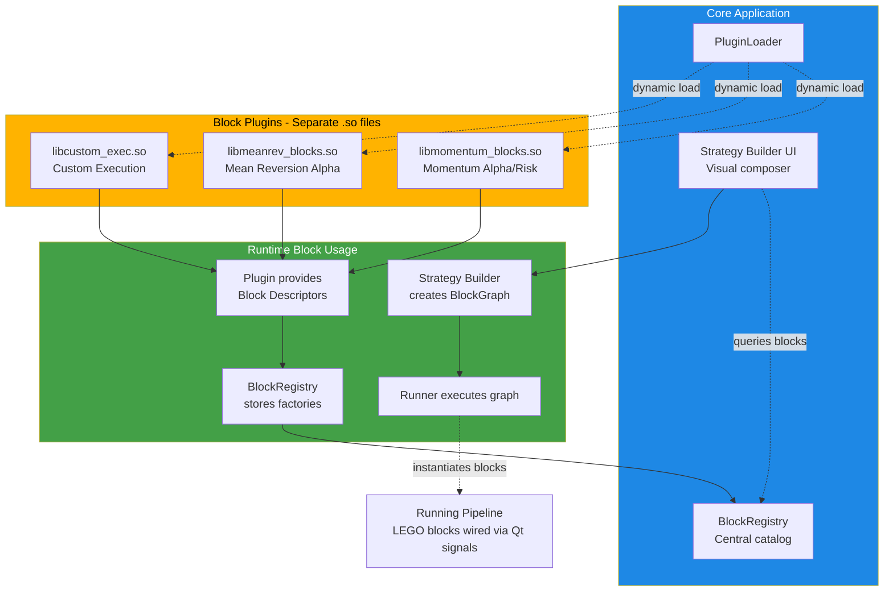
```mermaid
flowchart TB
    subgraph Core[Core Application]
        PluginLoader[PluginLoader]
        BlockRegistry[BlockRegistry<br/>Central catalog]
        StrategyBuilder[Strategy Builder UI<br/>Visual composer]
    end
    
    subgraph PluginFiles[Block Plugins - Separate .so files]
        Plugin1[libmomentum_blocks.so<br/>Momentum Alpha/Risk]
        Plugin2[libmeanrev_blocks.so<br/>Mean Reversion Alpha]
        Plugin3[libcustom_exec.so<br/>Custom Execution]
    end
    
    subgraph Runtime[Runtime Block Usage]
        Factory1[Plugin provides<br/>Block Descriptors]
        Factory2[BlockRegistry<br/>stores factories]
        Factory3[Strategy Builder<br/>creates BlockGraph]
        Factory4[Runner executes graph]
    end
    
    PluginLoader -.dynamic load.-> Plugin1
    PluginLoader -.dynamic load.-> Plugin2
    PluginLoader -.dynamic load.-> Plugin3
    
    Plugin1 --> Factory1
    Plugin2 --> Factory1
    Plugin3 --> Factory1
    Factory1 --> Factory2
    Factory2 --> BlockRegistry
    
    StrategyBuilder -.queries blocks.-> BlockRegistry
    StrategyBuilder --> Factory3
    Factory3 --> Factory4
    
    Factory4 -.instantiates blocks.-> RunningPipeline[Running Pipeline<br/>LEGO blocks wired via Qt signals]
    
    style Core fill:#1e88e5,color:#fff
    style PluginFiles fill:#ffb300,color:#000
    style Runtime fill:#43a047,color:#fff
```


**Benefits for Development**:

1. **Hot Reload**: Modify momentum strategy, reload plugin, test immediately - no full app restart
2. **Versioning**: Keep multiple versions (libmomentum_v1.so, libmomentum_v2.so) - A/B test
3. **Organization**: Separate strategy code from core app
4. **Distribution**: Ship new strategies as separate files

**Important Limitations**:

- **NOT true crash isolation**: In-process plugins can still crash the host or corrupt memory
- For true isolation, you'd need out-of-process (separate executable)
- This is acceptable for internal-only plugins built with same toolchain
- Plugins are "dynamically loaded code", not sandboxed

**Constraints** (Avoiding ABI Hell):

- Same compiler version
- Same Qt version  
- Same C++ standard
- Built together (CI pipeline)
- Version-locked dependencies

### Phase 3 Deliverables

- Block registry system (discovery + factories)
- Internal block plugin system (loads/registers blocks)
- At least 3 example blocks (MomentumAlpha, MaxPositionRisk, SimpleExecution)
- Legacy adapters wrapping CBasicAlphaModel, CBasicRiskModel as blocks
- StrategyPipelineRunner implementation (Qt signals orchestration)
- BlockGraph serialization (save/load strategies as JSON)
- Integration with Strategy Builder UI hooks (list/create blocks)

### Phase 3 Success Metrics

- Can build block graphs programmatically or via UI
- Plugins load and register blocks successfully
- Legacy models work as blocks (backward compatible)
- At least one complete strategy runs end-to-end using LEGO blocks
- BlockGraph save/load works correctly

---

## Phase 4: Supervision-Lite (Weeks 15-18)

### Goal

Add strategy isolation and crash containment without full actor complexity.

---

### 4.1 Per-Strategy Execution Context

**Why**: Isolate strategies so one crash doesn't affect others.

**Files to Create**:

- `[Supervision/StrategyExecutor.h](Supervision/StrategyExecutor.h)`
- `[Supervision/Supervisor.h](Supervision/Supervisor.h)`

**Implementation**:

```cpp
// Supervision/StrategyExecutor.h
namespace Supervision {

enum class OverflowPolicy {
    DropOldest,    // Drop oldest messages (good for market ticks)
    DropNewest,    // Drop incoming message (good for commands)
    Block          // Block sender (use with caution)
};

template<typename T>
class BoundedQueue {
public:
    explicit BoundedQueue(size_t maxSize, OverflowPolicy policy = OverflowPolicy::DropOldest)
        : m_maxSize(maxSize), m_policy(policy) {}
    
    bool push(T item) {
        std::unique_lock<std::mutex> lock(m_mutex);
        
        if (m_queue.size() >= m_maxSize) {
            switch (m_policy) {
                case OverflowPolicy::DropOldest:
                    m_queue.pop_front();
                    m_droppedCount++;
                    break;
                case OverflowPolicy::DropNewest:
                    m_droppedCount++;
                    return false;
                case OverflowPolicy::Block:
                    m_notFull.wait(lock, [this] { return m_queue.size() < m_maxSize; });
                    break;
            }
        }
        
        m_queue.push_back(std::move(item));
        m_notEmpty.notify_one();
        return true;
    }
    
    std::optional<T> pop(std::chrono::milliseconds timeout = std::chrono::milliseconds::max()) {
        std::unique_lock<std::mutex> lock(m_mutex);
        
        if (!m_notEmpty.wait_for(lock, timeout, [this] { return !m_queue.empty() || !m_running; })) {
            return std::nullopt;
        }
        
        if (m_queue.empty()) {
            return std::nullopt;
        }
        
        T item = std::move(m_queue.front());
        m_queue.pop_front();
        m_notFull.notify_one();
        return item;
    }
    
    void shutdown() {
        std::lock_guard<std::mutex> lock(m_mutex);
        m_running = false;
        m_notEmpty.notify_all();
    }
    
    size_t droppedCount() const {
        return m_droppedCount.load();
    }
    
private:
    size_t m_maxSize;
    OverflowPolicy m_policy;
    std::deque<T> m_queue;
    std::mutex m_mutex;
    std::condition_variable m_notEmpty;
    std::condition_variable m_notFull;
    std::atomic<size_t> m_droppedCount{0};
    bool m_running{true};
};

// Qt-native approach: Each strategy has its own QThread + event loop
class StrategyRuntime : public QObject {
    Q_OBJECT
    
public:
    explicit StrategyRuntime(
        QString name,
        const Pipeline::BlockGraph& graph,
        MarketDataRouter* marketRouter,
        Ports::IOrderExecutionPort* executionPort,
        Ports::IPositionRepositoryPort* positionRepo,
        QObject* parent = nullptr)
        : QObject(parent)
        , m_name(name)
        , m_graph(graph)
        , m_thread(new QThread(this)) {
        
        // Create runner in this thread
        m_runner = new StrategyPipelineRunner(graph, marketRouter, executionPort, positionRepo, this);
        
        // Move to dedicated thread
        this->moveToThread(m_thread);
        m_runner->moveToThread(m_thread);
        
        // MarketDataRouter will emit Qt signals across threads (Qt::QueuedConnection)
        // Blocks will process them on m_thread
    }
    
    ~StrategyRuntime() {
        stop();
        m_thread->wait();
        delete m_thread;
    }
    
    void start() {
        m_thread->start();
        m_running = true;
        emit started();
    }
    
    void stop() {
        m_running = false;
        m_thread->quit();
        emit stopped();
    }
    
    QString name() const { return m_name; }
    
    bool isHealthy() const {
        return m_thread->isRunning() && !m_crashed;
    }
    
signals:
    void started();
    void stopped();
    void crashed(const QString& error);
    
private:
    QString m_name;
    Pipeline::BlockGraph m_graph;
    StrategyPipelineRunner* m_runner = nullptr;
    QThread* m_thread;
    std::atomic<bool> m_running{false};
    std::atomic<bool> m_crashed{false};
};

} // namespace Supervision
```

```cpp
// Supervision/Supervisor.h
namespace Supervision {

enum class RestartPolicy {
    Never,        // Don't restart on crash
    Always,       // Always restart
    OnFailure     // Restart only if crashed (not stopped)
};

// Factory function type for recreating strategy runtime (for restarts)
using RuntimeFactory = std::function<StrategyRuntime*()>;

class Supervisor : public QObject {
    Q_OBJECT
    
public:
    void addStrategyRuntime(
        const QString& name,
        RuntimeFactory factory,
        RestartPolicy policy = RestartPolicy::OnFailure) {
        
        // Create initial runtime instance
        auto* runtime = factory();
        
        m_runtimes[name] = SupervisedRuntime{
            runtime,
            factory,  // Store factory for restarts
            policy,
            0  // restart count
        };
        
        // Connect crash signal
        connect(runtime, &StrategyRuntime::crashed,
                this, [this, name](const QString& error) {
            qCritical() << "Strategy crashed:" << name << error;
            restartStrategyRuntime(name);
        });
        
        runtime->start();
    }
    
    void checkHealth() {
        for (auto it = m_runtimes.begin(); it != m_runtimes.end(); ++it) {
            const QString& name = it.key();
            auto& supervised = it.value();
            
            if (!supervised.runtime->isHealthy()) {
                qWarning() << "Strategy unhealthy:" << name;
                
                if (supervised.policy == RestartPolicy::Always ||
                    supervised.policy == RestartPolicy::OnFailure) {
                    restartStrategyRuntime(name);
                }
            }
        }
    }
    
    void restartStrategyRuntime(const QString& name) {
        auto it = m_runtimes.find(name);
        if (it == m_runtimes.end()) return;
        
        auto& supervised = it.value();
        supervised.restartCount++;
        
        if (supervised.restartCount > 5) {
            qCritical() << "Strategy" << name 
                       << "failed to restart 5 times, giving up";
            supervised.policy = RestartPolicy::Never;
            return;
        }
        
        qInfo() << "Restarting strategy:" << name
                << "attempt:" << supervised.restartCount;
        
        // Stop and delete old runtime
        supervised.runtime->stop();
        delete supervised.runtime;
        
        // Create new runtime from factory (same BlockGraph config)
        supervised.runtime = supervised.factory();
        
        supervised.runtime->start();
    }
    
    void startMonitoring() {
        // Use Qt timer (native Qt approach)
        m_healthCheckTimer = new QTimer(this);
        connect(m_healthCheckTimer, &QTimer::timeout,
                this, &Supervisor::checkHealth);
        m_healthCheckTimer->start(10000);  // Check every 10 seconds
    }
    
    void stopMonitoring() {
        if (m_healthCheckTimer) {
            m_healthCheckTimer->stop();
        }
    }
    
private:
    struct SupervisedRuntime {
        StrategyRuntime* runtime;
        RuntimeFactory factory;  // For recreating runtime on restart
        RestartPolicy policy;
        int restartCount;
    };
    
    QMap<QString, SupervisedRuntime> m_runtimes;
    QTimer* m_healthCheckTimer = nullptr;
};

} // namespace Supervision
```

**Usage** (Qt-native approach):

```cpp
Supervision::Supervisor supervisor;

// Add strategy runtimes with supervision using factory pattern
supervisor.addStrategyRuntime(
    "momentum-aapl",
    []() {
        // Build BlockGraph
        Pipeline::BlockGraph graph;
        graph.alphaBlocks.append(new MomentumAlphaBlock());
        graph.strategyLevel.rebalance = new SimpleRebalanceBlock();
        graph.executionBlock = new MarketOrderExecutionBlock();
        
        // Create runtime (owns BlockGraph + Runner + QThread)
        return new StrategyRuntime("momentum-aapl", graph, 
                                   marketRouter, executionPort, positionRepo);
    },
    Supervision::RestartPolicy::OnFailure
);

supervisor.addStrategyRuntime(
    "meanrev-msft",
    []() { /* similar BlockGraph for mean reversion */ },
    Supervision::RestartPolicy::Always
);

// Start health monitoring (Qt timer, not separate thread)
supervisor.startMonitoring();

// If strategy crashes or becomes unhealthy, supervisor automatically restarts it using factory
```

**What We Gain**:

- Strategy isolation (crash doesn't affect others)
- Automatic restart on failure
- Health monitoring
- 80% of actor benefits with 20% complexity

**What We Lose**:

- Not as flexible as full actor system
- Limited message passing

**Why This Approach**:

- Simpler than actors
- Solves main problem (isolation)
- Incremental path to full actors if needed

### Supervision Architecture Diagram

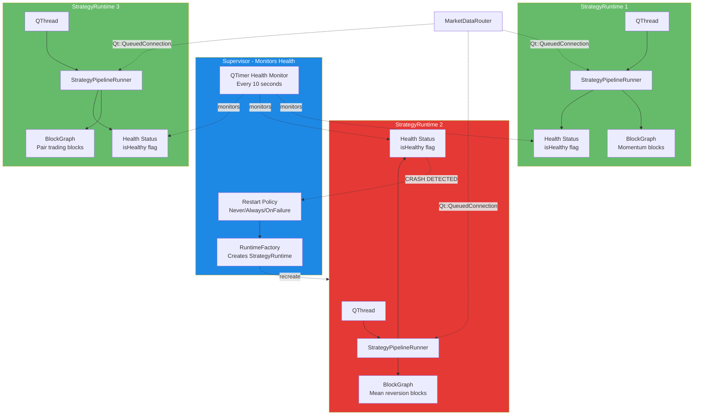
```mermaid
flowchart TB
    subgraph Supervisor[Supervisor - Monitors Health]
        HealthCheck[QTimer Health Monitor<br/>Every 10 seconds]
        RestartPolicy[Restart Policy<br/>Never/Always/OnFailure]
        RuntimeFactory[RuntimeFactory<br/>Creates StrategyRuntime]
    end
    
    subgraph Runtime1[StrategyRuntime 1]
        Thread1[QThread]
        Runner1[StrategyPipelineRunner]
        Graph1[BlockGraph<br/>Momentum blocks]
        Health1[Health Status<br/>isHealthy flag]
        
        Thread1 --> Runner1
        Runner1 --> Graph1
        Runner1 --> Health1
    end
    
    subgraph Runtime2[StrategyRuntime 2]
        Thread2[QThread]
        Runner2[StrategyPipelineRunner]
        Graph2[BlockGraph<br/>Mean reversion blocks]
        Health2[Health Status<br/>isHealthy flag]
        
        Thread2 --> Runner2
        Runner2 --> Graph2
        Runner2 --> Health2
    end
    
    subgraph Runtime3[StrategyRuntime 3]
        Thread3[QThread]
        Runner3[StrategyPipelineRunner]
        Graph3[BlockGraph<br/>Pair trading blocks]
        Health3[Health Status<br/>isHealthy flag]
        
        Thread3 --> Runner3
        Runner3 --> Graph3
        Runner3 --> Health3
    end
    
    MarketRouter[MarketDataRouter] -.Qt::QueuedConnection.-> Runner1
    MarketRouter -.Qt::QueuedConnection.-> Runner2
    MarketRouter -.Qt::QueuedConnection.-> Runner3
    
    HealthCheck -.monitors.-> Health1
    HealthCheck -.monitors.-> Health2
    HealthCheck -.monitors.-> Health3
    
    Health2 -.CRASH DETECTED.-> RestartPolicy
    RestartPolicy --> RuntimeFactory
    RuntimeFactory -.recreate.-> Runtime2
    
    style Supervisor fill:#1e88e5,color:#fff
    style Runtime1 fill:#66bb6a,color:#fff
    style Runtime2 fill:#e53935,color:#fff
    style Runtime3 fill:#66bb6a,color:#fff
```


**Crash Isolation Example**:

1. StrategyRuntime 2 (Mean Reversion) crashes due to uncaught exception in a risk block
2. Exception caught in StrategyPipelineRunner, sets `isHealthy = false`
3. QTimer health check in Supervisor detects unhealthy status
4. Supervisor applies restart policy (e.g., OnFailure → restart)
5. Supervisor calls `RuntimeFactory` to recreate StrategyRuntime 2 with same block graph config
6. New StrategyRuntime 2 starts fresh in its own QThread
7. **StrategyRuntime 1 and 3 continue unaffected** (isolated in separate QThreads)

### Current vs Supervision-Lite

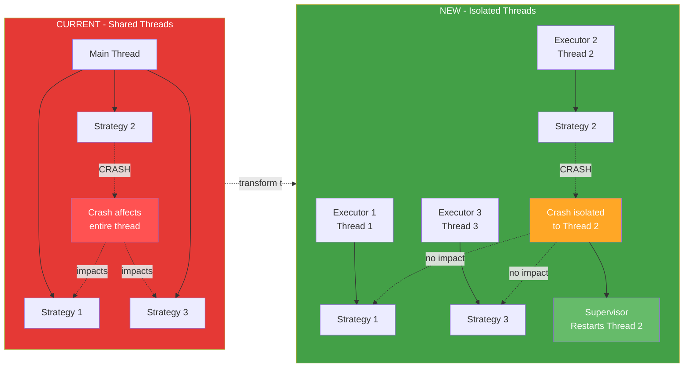
```mermaid
flowchart LR
    subgraph Current[CURRENT - Shared Threads]
        MainThread[Main Thread]
        Strategy1C[Strategy 1]
        Strategy2C[Strategy 2]
        Strategy3C[Strategy 3]
        
        MainThread --> Strategy1C
        MainThread --> Strategy2C
        MainThread --> Strategy3C
        
        Strategy2C -.CRASH.-> X[Crash affects<br/>entire thread]
        X -.impacts.-> Strategy1C
        X -.impacts.-> Strategy3C
    end
    
    subgraph New[NEW - Isolated Threads]
        Exec1[Executor 1<br/>Thread 1]
        Exec2[Executor 2<br/>Thread 2]
        Exec3[Executor 3<br/>Thread 3]
        
        Strat1N[Strategy 1]
        Strat2N[Strategy 2]
        Strat3N[Strategy 3]
        
        Exec1 --> Strat1N
        Exec2 --> Strat2N
        Exec3 --> Strat3N
        
        Strat2N -.CRASH.-> Isolated[Crash isolated<br/>to Thread 2]
        Isolated -.no impact.-> Strat1N
        Isolated -.no impact.-> Strat3N
        
        Supervisor2[Supervisor<br/>Restarts Thread 2]
        Isolated --> Supervisor2
    end
    
    Current -.transform to.-> New
    
    style Current fill:#e53935,color:#fff
    style New fill:#43a047,color:#fff
    style X fill:#ff5252,color:#fff
    style Isolated fill:#ffa726,color:#fff
    style Supervisor2 fill:#66bb6a,color:#fff
```


**What We Gain**: Crash blast radius limited to single strategy.

---

### Phase 4 Deliverables

- StrategyExecutor implementation
- Supervisor with restart policies
- Health monitoring
- Tests for crash recovery

### Phase 4 Success Metrics

- Strategies run in isolation
- One strategy crash doesn't affect others
- Supervisor successfully restarts crashed strategies
- Health checks detect unresponsive strategies

---

## Phase 5: Observability (Weeks 19-22)

### Goal

Add practical monitoring and debugging capabilities.

---

### 5.1 Structured Logging with Correlation IDs

**Why**: Better than distributed tracing for a desktop app. Correlation IDs enable end-to-end tracing of a decision from market tick → signal → target → execution.

**Critical**: Correlation IDs must flow through pipeline contracts (Signal, TargetPosition, ExecutionIntent) so you can trace a decision's full journey.

**Files to Update**:

- `[Pipeline/Contracts.h](Pipeline/Contracts.h)` - Add correlationId field to all contracts
- `[Logging/StructuredLogger.h](Logging/StructuredLogger.h)` - Thread-local correlation ID

**Updated Contracts** (add correlationId):

```cpp
// Pipeline/Contracts.h (updated)
namespace Pipeline {

struct Signal {
    Q_GADGET
    Q_PROPERTY(QString symbol MEMBER symbol)
    Q_PROPERTY(Direction direction MEMBER direction)
    Q_PROPERTY(double confidence MEMBER confidence)
    Q_PROPERTY(QDateTime timestamp MEMBER timestamp)
    Q_PROPERTY(QString alphaBlockId MEMBER alphaBlockId)
    Q_PROPERTY(QString correlationId MEMBER correlationId)  // ADDED for tracing
    
public:
    QString symbol;
    Direction direction;
    double confidence;
    QDateTime timestamp;
    QString alphaBlockId;
    QString correlationId;  // Flows through entire pipeline
    
    enum Direction { Buy, Sell, Hold };
    Q_ENUM(Direction)
};

struct TargetPosition {
    Q_GADGET
    // ... existing fields ...
    Q_PROPERTY(QString correlationId MEMBER correlationId)  // ADDED
    
public:
    QString symbol;
    double targetQty;
    QString reason;
    QDateTime timestamp;
    QString correlationId;  // Inherited from Signal
};

struct ExecutionIntent {
    Q_GADGET
    // ... existing fields ...
    Q_PROPERTY(QString correlationId MEMBER correlationId)  // ADDED
    
    // ... (see canonical definition in Pipeline/Contracts.h earlier)
};

} // namespace Pipeline
```

**Note**: Use the canonical `ExecutionIntent` from Phase 1 (line ~765) with:

- `quantity` (signed: positive=buy, negative=sell)
- `riskApproval` (not `approvedBy`)
- `correlationId` (traces Signal → TargetPosition → ExecutionIntent)

**Implementation**:

```cpp
namespace Logging {

struct LogEntry {
    QDateTime timestamp;
    QString correlationId;
    QString component;
    QString level;  // INFO, WARN, ERROR
    QString message;
    QVariantMap context;
    
    QString format() const {
        return QString("[%1] [%2] [%3] %4 %5")
            .arg(timestamp.toString(Qt::ISODate))
            .arg(correlationId)
            .arg(component)
            .arg(message)
            .arg(QJsonDocument::fromVariant(context).toJson(QJsonDocument::Compact));
    }
};

class StructuredLogger {
public:
    static StructuredLogger& instance() {
        static StructuredLogger logger;
        return logger;
    }
    
    void info(const QString& component, const QString& message, 
             const QVariantMap& context = {}) {
        log("INFO", component, message, context);
    }
    
    void warn(const QString& component, const QString& message,
             const QVariantMap& context = {}) {
        log("WARN", component, message, context);
    }
    
    void error(const QString& component, const QString& message,
              const QVariantMap& context = {}) {
        log("ERROR", component, message, context);
    }
    
    // Set correlation ID for current thread (thread-local, no map needed)
    static void setCorrelationId(const QString& id) {
        t_correlationId = id;
    }
    
    static QString getCorrelationId() {
        return t_correlationId.isEmpty() ? "none" : t_correlationId;
    }
    
    // Optional: register UI callback for log entries
    using LogCallback = std::function<void(const LogEntry&)>;
    void setUICallback(LogCallback callback) {
        std::lock_guard<std::mutex> lock(m_callbackMutex);
        m_uiCallback = std::move(callback);
    }
    
private:
    void log(const QString& level, const QString& component,
            const QString& message, const QVariantMap& context) {
        
        LogEntry entry{
            QDateTime::currentDateTime(),
            getCorrelationId(),
            component,
            level,
            message,
            context
        };
        
        // Write as JSON lines (.jsonl) for easy parsing
        QJsonObject json;
        json["timestamp"] = entry.timestamp.toString(Qt::ISODate);
        json["correlationId"] = entry.correlationId;
        json["component"] = entry.component;
        json["level"] = entry.level;
        json["message"] = entry.message;
        json["context"] = QJsonObject::fromVariantMap(entry.context);
        
        QString jsonLine = QJsonDocument(json).toJson(QJsonDocument::Compact);
        qInfo().noquote() << jsonLine;
        
        // Optionally notify UI via callback (not signal - not a QObject)
        {
            std::lock_guard<std::mutex> lock(m_callbackMutex);
            if (m_uiCallback) {
                m_uiCallback(entry);
            }
        }
    }
    
    // Thread-local storage for correlation ID (no map, no leaks)
    static thread_local QString t_correlationId;
    
    // UI callback (optional)
    std::mutex m_callbackMutex;
    LogCallback m_uiCallback;
};

// Helper macros
#define LOG_INFO(component, message, ...) \
    Logging::StructuredLogger::instance().info(component, message, ##__VA_ARGS__)

#define LOG_WARN(component, message, ...) \
    Logging::StructuredLogger::instance().warn(component, message, ##__VA_ARGS__)

#define LOG_ERROR(component, message, ...) \
    Logging::StructuredLogger::instance().error(component, message, ##__VA_ARGS__)

} // namespace Logging
```

**Usage**:

```cpp
// Set correlation ID at request entry point
Logging::StructuredLogger::instance().setCorrelationId(
    QUuid::createUuid().toString()
);

// Log with context
LOG_INFO("OrderExecution", "Placing order", {
    {"symbol", "AAPL"},
    {"quantity", 100},
    {"price", 150.25}
});

// Later in call chain
LOG_INFO("IBAdapter", "Sending to broker", {
    {"orderId", 12345}
});

// All logs share same correlation ID, easy to trace
```

**End-to-End Pipeline Trace** (Correlation ID flows through contracts):

```cpp
// 1. Market tick arrives at Alpha block, generate correlation ID
void MomentumAlpha::onMarketData(const QString& symbol, double price, const QDateTime& ts) {
    QString corrId = QUuid::createUuid().toString();
    
    Pipeline::Signal signal;
    signal.symbol = symbol;
    signal.direction = Pipeline::Signal::Buy;
    signal.confidence = 0.85;
    signal.correlationId = corrId;  // Set at entry point
    signal.timestamp = ts;
    signal.alphaBlockId = id();
    
    LOG_INFO("MomentumAlpha", "Generated buy signal", {
        {"correlationId", corrId},
        {"symbol", symbol},
        {"confidence", 0.85}
    });
    
    emit signalGenerated(signal);
}

// 2. Rebalance block inherits correlation ID from Signal
Pipeline::TargetPosition RebalanceBlock::rebalance(const Pipeline::Signal& signal, ...) {
    Pipeline::TargetPosition target;
    target.symbol = signal.symbol;
    target.targetQty = calculateSize(signal.confidence);
    target.correlationId = signal.correlationId;  // Inherit from signal
    target.timestamp = QDateTime::currentDateTime();
    
    LOG_INFO("RebalanceBlock", "Sized position", {
        {"correlationId", target.correlationId},
        {"symbol", target.symbol},
        {"qty", target.targetQty}
    });
    
    return target;
}

// 3. Risk block inherits correlation ID from TargetPosition
Pipeline::ExecutionIntent PortfolioRiskBlock::evaluate(const Pipeline::TargetPosition& target) {
    Pipeline::ExecutionIntent intent;
    intent.symbol = target.symbol;
    intent.quantity = target.deltaQuantity();  // Signed quantity
    intent.correlationId = target.correlationId;  // Inherit from target
    intent.riskApproval = "PortfolioRisk";
    intent.timestamp = QDateTime::currentDateTime();
    
    LOG_INFO("PortfolioRisk", "Approved intent", {
        {"correlationId", intent.correlationId},
        {"symbol", intent.symbol},
        {"side", intent.side()},  // Derived from quantity sign
        {"riskApproval", intent.riskApproval}
    });
    
    return intent;
}

// 4. Execution block sends order with same correlation ID
void ExecutionBlock::execute(const Pipeline::ExecutionIntent& intent) {
    int orderId = m_orderPort->placeOrder(intent.symbol, intent.quantity);
    
    LOG_INFO("ExecutionBlock", "Submitted order to IB", {
        {"correlationId", intent.correlationId},
        {"symbol", intent.symbol},
        {"orderId", orderId}
    });
}

// Now grep logs.jsonl for corrId to see full decision path:
// [MomentumAlpha] Generated buy signal for AAPL, confidence=0.85
// → [RebalanceBlock] Sized position, qty=100
// → [PortfolioRisk] Approved intent
// → [ExecutionBlock] Submitted order 12345
```

**Key Point**: Correlation ID flows through pipeline data contracts (`Signal` → `TargetPosition` → `ExecutionIntent`), enabling full end-to-end tracing even across thread boundaries and async signal/slot connections.

### Correlation ID Flow Diagram

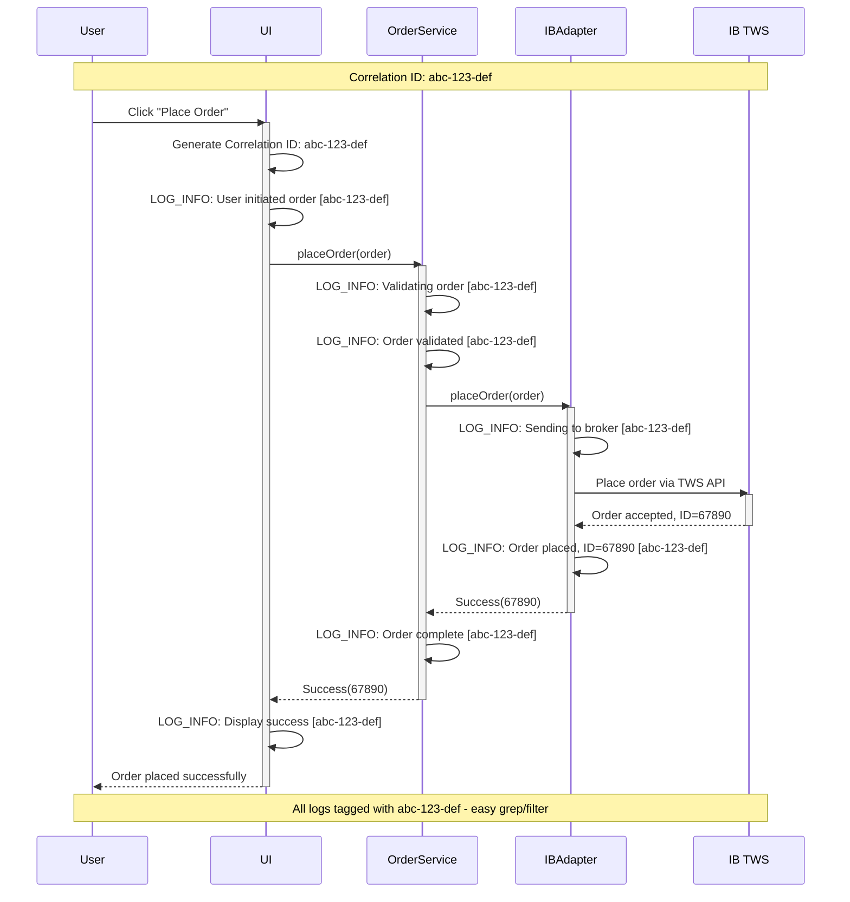
```mermaid
sequenceDiagram
    participant User
    participant UI
    participant OrderService
    participant IBAdapter
    participant IB as IB TWS
    
    Note over User,IB: Correlation ID: abc-123-def
    
    User->>UI: Click "Place Order"
    activate UI
    UI->>UI: Generate Correlation ID: abc-123-def
    UI->>UI: LOG_INFO: User initiated order [abc-123-def]
    
    UI->>OrderService: placeOrder(order)
    activate OrderService
    OrderService->>OrderService: LOG_INFO: Validating order [abc-123-def]
    OrderService->>OrderService: LOG_INFO: Order validated [abc-123-def]
    
    OrderService->>IBAdapter: placeOrder(order)
    activate IBAdapter
    IBAdapter->>IBAdapter: LOG_INFO: Sending to broker [abc-123-def]
    
    IBAdapter->>IB: Place order via TWS API
    activate IB
    IB-->>IBAdapter: Order accepted, ID=67890
    deactivate IB
    
    IBAdapter->>IBAdapter: LOG_INFO: Order placed, ID=67890 [abc-123-def]
    IBAdapter-->>OrderService: Success(67890)
    deactivate IBAdapter
    
    OrderService->>OrderService: LOG_INFO: Order complete [abc-123-def]
    OrderService-->>UI: Success(67890)
    deactivate OrderService
    
    UI->>UI: LOG_INFO: Display success [abc-123-def]
    UI-->>User: Order placed successfully
    deactivate UI
    
    Note over User,IB: All logs tagged with abc-123-def - easy grep/filter
```


**Debugging Workflow**:

1. User reports: "My order at 14:32 didn't work"
2. Find correlation ID from UI log at that time: `abc-123-def`
3. `grep "abc-123-def" logs/*.log` - gets complete flow
4. See exactly where it failed with full context

---

### 5.2 Metrics Collection

**File to Create**: `[Metrics/MetricsCollector.h](Metrics/MetricsCollector.h)`

**Implementation**:

```cpp
namespace Metrics {

class Histogram {
public:
    void record(double value) {
        std::lock_guard<std::mutex> lock(m_mutex);
        m_values.push_back(value);
        m_sum += value;
        m_count++;
    }
    
    double average() const {
        std::lock_guard<std::mutex> lock(m_mutex);
        return m_count > 0 ? m_sum / m_count : 0.0;
    }
    
    double percentile(int p) const {
        std::lock_guard<std::mutex> lock(m_mutex);
        if (m_values.empty()) return 0.0;
        
        auto sorted = m_values;
        std::sort(sorted.begin(), sorted.end());
        size_t index = (sorted.size() * p) / 100;
        return sorted[index];
    }
    
private:
    mutable std::mutex m_mutex;
    std::vector<double> m_values;
    double m_sum = 0.0;
    size_t m_count = 0;
};

class MetricsCollector {
public:
    void recordOrderPlaced(const QString& symbol) {
        m_ordersPlaced.fetch_add(1, std::memory_order_relaxed);
        
        LOG_INFO("Metrics", "Order placed", {
            {"symbol", symbol},  // Qt-native, no conversion
            {"total_orders", static_cast<qulonglong>(m_ordersPlaced.load())}
        });
    }
    
    void recordOrderLatency(int64_t microseconds) {
        m_latencyHistogram.record(microseconds);
    }
    
    void recordStrategyPnL(const std::string& strategyName, double pnl) {
        std::lock_guard<std::mutex> lock(m_mutex);
        m_strategyPnL[strategyName] = pnl;
    }
    
    struct Snapshot {
        uint64_t ordersPlaced;
        uint64_t ordersFilled;
        double avgLatencyMicros;
        double p99LatencyMicros;
        std::map<std::string, double> strategyPnL;
    };
    
    Snapshot getSnapshot() const {
        std::lock_guard<std::mutex> lock(m_mutex);
        return {
            m_ordersPlaced.load(),
            m_ordersFilled.load(),
            m_latencyHistogram.average(),
            m_latencyHistogram.percentile(99),
            m_strategyPnL
        };
    }
    
private:
    std::atomic<uint64_t> m_ordersPlaced{0};
    std::atomic<uint64_t> m_ordersFilled{0};
    Histogram m_latencyHistogram;
    
    mutable std::mutex m_mutex;
    std::map<std::string, double> m_strategyPnL;
};

} // namespace Metrics
```

---

### Phase 5 Deliverables

- Structured logging with correlation IDs
- Metrics collection (counters, histograms)
- Metrics dashboard (simple Qt widget)
- Integration with existing logging

### Phase 5 Success Metrics

- All operations logged with correlation IDs
- Can trace request end-to-end
- Metrics collected with < 1% overhead
- Dashboard shows real-time metrics

---

## Phase 6 (Optional): Performance Optimization

**Trigger**: Only if benchmarks show bottlenecks matching these criteria:

### Measurable Bottleneck Criteria

Phase 6 is triggered ONLY if any of these thresholds are exceeded:

1. **Dropped Messages**: > 10 market ticks dropped per minute under normal load
2. **Decision Latency**: p99 strategy decision latency > 100ms (from tick to order decision)
3. **CPU Usage**: > 80% CPU on single core during market hours
4. **Memory Growth**: > 100 MB/hour leak (sustained memory growth)
5. **Queue Depth**: Executor queue depth sustained > 50% of capacity

If none of these are hit, **skip Phase 6 entirely**.

### 6.1 Benchmark First

**Measurements Needed**:

- p50, p99, p999 latency (microseconds) - from tick received to order placed
- Throughput (messages/second) - tick processing rate
- CPU usage under load - per-thread breakdown
- Memory allocations/sec - using profiler
- Dropped messages - from BoundedQueue counters
- Queue depth - current vs maximum

**Benchmarking Tool**:

```cpp
class PerformanceBenchmark {
public:
    void benchmarkDispatcher() {
        // Send 100k market data updates
        // Measure latency distribution
    }
    
    void benchmarkObjectAllocation() {
        // Measure tick object allocation overhead
    }
    
    void generateReport() {
        // Output benchmarks to file
    }
};
```

### 6.2 Only If Proven Necessary

If benchmarks show:

- Dispatcher lock contention → Consider lock-free queue
- Allocation overhead → Consider object pool
- Can't keep up with feed → Consider batching

But **measure first**, optimize second.

---

## Complete Migration Path

### Phase-by-Phase Transformation

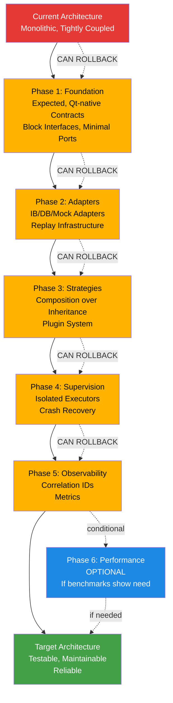
```mermaid
flowchart TB
    Current[Current Architecture<br/>Monolithic, Tightly Coupled]
    
    Phase1[Phase 1: Foundation<br/>Expected, Qt-native Contracts<br/>Block Interfaces, Minimal Ports]
    
    Phase2[Phase 2: Adapters<br/>IB/DB/Mock Adapters<br/>Replay Infrastructure]
    
    Phase3[Phase 3: Strategies<br/>Composition over Inheritance<br/>Plugin System]
    
    Phase4[Phase 4: Supervision<br/>Isolated Executors<br/>Crash Recovery]
    
    Phase5[Phase 5: Observability<br/>Correlation IDs<br/>Metrics]
    
    Phase6[Phase 6: Performance<br/>OPTIONAL<br/>If benchmarks show need]
    
    Target[Target Architecture<br/>Testable, Maintainable<br/>Reliable]
    
    Current --> Phase1
    Phase1 --> Phase2
    Phase2 --> Phase3
    Phase3 --> Phase4
    Phase4 --> Phase5
    Phase5 --> Target
    
    Phase5 -.conditional.-> Phase6
    Phase6 -.if needed.-> Target
    
    Current -.CAN ROLLBACK.-> Phase1
    Phase1 -.CAN ROLLBACK.-> Phase2
    Phase2 -.CAN ROLLBACK.-> Phase3
    Phase3 -.CAN ROLLBACK.-> Phase4
    Phase4 -.CAN ROLLBACK.-> Phase5
    
    style Current fill:#e53935,color:#fff
    style Phase1 fill:#ffb300,color:#000
    style Phase2 fill:#ffb300,color:#000
    style Phase3 fill:#ffb300,color:#000
    style Phase4 fill:#ffb300,color:#000
    style Phase5 fill:#ffb300,color:#000
    style Phase6 fill:#1e88e5,color:#fff
    style Target fill:#43a047,color:#fff
```


**Incremental and Reversible**: Each phase can be rolled back if issues arise.

### Data Flow Transformation (CDispatcher → MarketDataRouter)

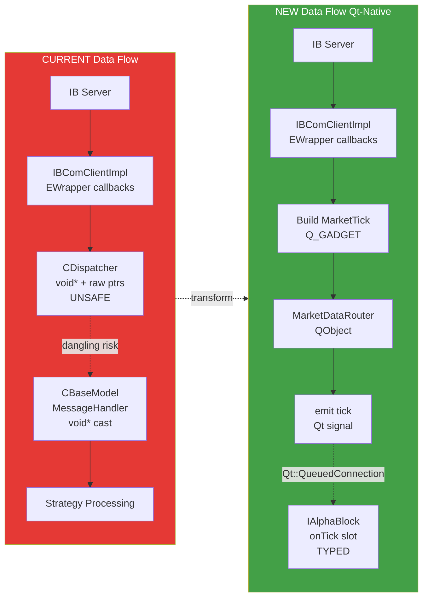
```mermaid
flowchart LR
    subgraph CurrentFlow[CURRENT Data Flow]
        direction TB
        IB1[IB Server]
        IBClient1[IBComClientImpl<br/>EWrapper callbacks]
        CDispatch1[CDispatcher<br/>void* + raw ptrs<br/>UNSAFE]
        CBase1[CBaseModel<br/>MessageHandler<br/>void* cast]
        Processing1[Strategy Processing]
        
        IB1 --> IBClient1
        IBClient1 --> CDispatch1
        CDispatch1 -.dangling risk.-> CBase1
        CBase1 --> Processing1
    end
    
    subgraph NewFlow[NEW Data Flow Qt-Native]
        direction TB
        IB2[IB Server]
        IBClient2[IBComClientImpl<br/>EWrapper callbacks]
        BuildTick[Build MarketTick<br/>Q_GADGET]
        Router[MarketDataRouter<br/>QObject]
        EmitSignal[emit tick<br/>Qt signal]
        AlphaBlock[IAlphaBlock<br/>onTick slot<br/>TYPED]
        
        IB2 --> IBClient2
        IBClient2 --> BuildTick
        BuildTick --> Router
        Router --> EmitSignal
        EmitSignal -.Qt::QueuedConnection.-> AlphaBlock
    end
    
    CurrentFlow -.transform.-> NewFlow
    
    style CurrentFlow fill:#e53935,color:#fff
    style NewFlow fill:#43a047,color:#fff
```


**Improvements**:

1. **Type Safety**: `void`* → Qt signal/slot typed parameters (compile-time checked)
2. **Lifetime Safety**: Qt manages connections (auto-disconnect on delete)
3. **Thread Safety**: `Qt::QueuedConnection` handles cross-thread automatically
4. **Simplicity**: Native Qt mechanisms (no custom EventBus)
5. **Testability**: Can use MarketDataReplayer emitting same signals

### Threading Model Comparison

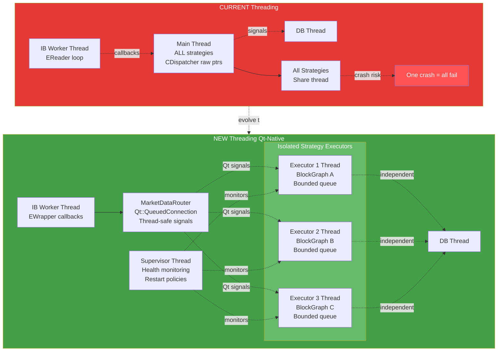
```mermaid
flowchart TB
    subgraph CurrentThreading[CURRENT Threading]
        IBThread1[IB Worker Thread<br/>EReader loop]
        MainThread1[Main Thread<br/>ALL strategies<br/>CDispatcher raw ptrs]
        DBThread1[DB Thread]
        
        IBThread1 -.callbacks.-> MainThread1
        MainThread1 -.signals.-> DBThread1
        
        MainThread1 --> AllStrategies[All Strategies<br/>Share thread]
        AllStrategies -.crash risk.-> CascadeFail[One crash = all fail]
    end
    
    subgraph NewThreading[NEW Threading Qt-Native]
        IBThread2[IB Worker Thread<br/>EWrapper callbacks]
        
        MarketRouter[MarketDataRouter<br/>Qt::QueuedConnection<br/>Thread-safe signals]
        
        DBThread2[DB Thread]
        
        subgraph Isolated[Isolated Strategy Executors]
            Exec1Thread[Executor 1 Thread<br/>BlockGraph A<br/>Bounded queue]
            Exec2Thread[Executor 2 Thread<br/>BlockGraph B<br/>Bounded queue]
            Exec3Thread[Executor 3 Thread<br/>BlockGraph C<br/>Bounded queue]
        end
        
        SupervisorThread[Supervisor Thread<br/>Health monitoring<br/>Restart policies]
        
        IBThread2 --> MarketRouter
        MarketRouter -.Qt signals.-> Exec1Thread
        MarketRouter -.Qt signals.-> Exec2Thread
        MarketRouter -.Qt signals.-> Exec3Thread
        
        Exec1Thread -.independent.-> DBThread2
        Exec2Thread -.independent.-> DBThread2
        Exec3Thread -.independent.-> DBThread2
        
        SupervisorThread -.monitors.-> Exec1Thread
        SupervisorThread -.monitors.-> Exec2Thread
        SupervisorThread -.monitors.-> Exec3Thread
    end
    
    CurrentThreading -.evolve to.-> NewThreading
    
    style CurrentThreading fill:#e53935,color:#fff
    style NewThreading fill:#43a047,color:#fff
    style CascadeFail fill:#ff5252,color:#fff
    style Isolated fill:#66bb6a,color:#fff
```


**Threading Evolution**:

- **Current**: All strategies on main thread - crash cascades
- **New**: Each strategy in own thread - crashes isolated
- **Benefit**: System resilience

---

## Summary of Changes from Original Plan

### Removed

- Full actor system + CQRS (too heavy)
- Marketplace plugins (ABI hell)
- Reactive streams (nice-to-have, not essential)
- Lock-free structures (premature optimization)

### Simplified

- Actor model → Supervision-lite
- Distributed tracing → Structured logging with correlation IDs
- Complex plugin system → Internal plugins only

### Added

- Qt-native runtime contracts + LEGO blocks
- Deterministic replay (MarketDataRecorder/Replayer)
- Block registry + plugin system
- Integration test harness

### Strengthened

- Align with existing architecture
- Typed Qt signals/slots (compile-time checked)
- Standard C++ error handling
- Respect existing pipeline

### Complete Architecture Comparison

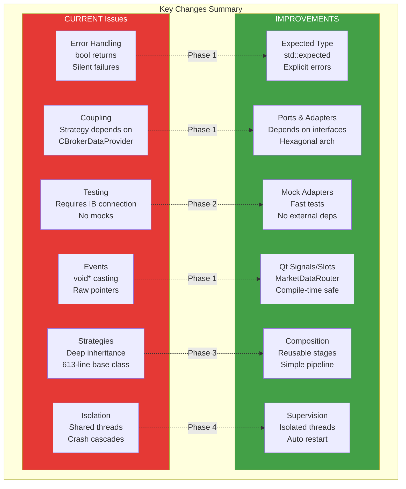
```mermaid
flowchart TB
    subgraph Comparison[Key Changes Summary]
        direction LR
        
        subgraph Current[CURRENT Issues]
            I1[Error Handling<br/>bool returns<br/>Silent failures]
            I2[Coupling<br/>Strategy depends on<br/>CBrokerDataProvider]
            I3[Testing<br/>Requires IB connection<br/>No mocks]
            I4[Events<br/>void* casting<br/>Raw pointers]
            I5[Strategies<br/>Deep inheritance<br/>613-line base class]
            I6[Isolation<br/>Shared threads<br/>Crash cascades]
        end
        
        subgraph Improvements[IMPROVEMENTS]
            A1[Expected Type<br/>std::expected<br/>Explicit errors]
            A2[Ports & Adapters<br/>Depends on interfaces<br/>Hexagonal arch]
            A3[Mock Adapters<br/>Fast tests<br/>No external deps]
            A4[Qt Signals/Slots<br/>MarketDataRouter<br/>Compile-time safe]
            A5[Composition<br/>Reusable stages<br/>Simple pipeline]
            A6[Supervision<br/>Isolated threads<br/>Auto restart]
        end
        
        I1 -.Phase 1.-> A1
        I2 -.Phase 1.-> A2
        I3 -.Phase 2.-> A3
        I4 -.Phase 1.-> A4
        I5 -.Phase 3.-> A5
        I6 -.Phase 4.-> A6
    end
    
    style Current fill:#e53935,color:#fff
    style Improvements fill:#43a047,color:#fff
```


### Testing Architecture Enabled by Refactoring

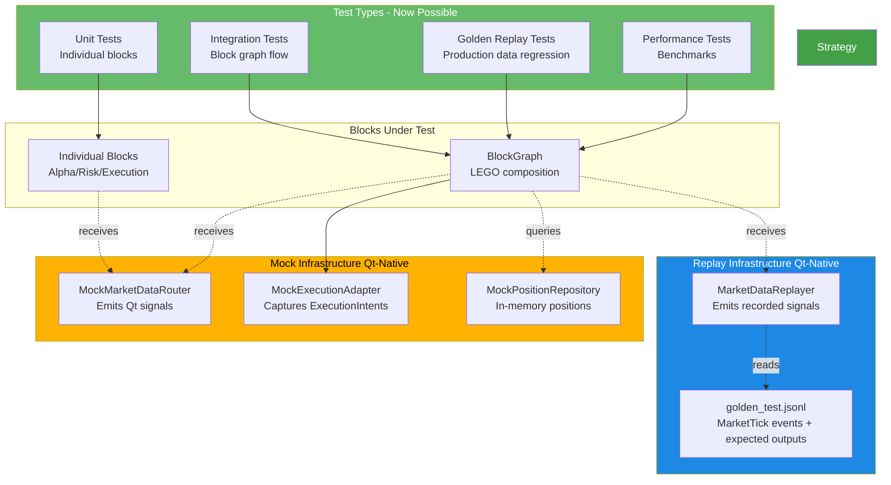
```mermaid
flowchart TB
    subgraph Tests[Test Types - Now Possible]
        Unit[Unit Tests<br/>Individual blocks]
        Integration[Integration Tests<br/>Block graph flow]
        GoldenReplay[Golden Replay Tests<br/>Production data regression]
        Performance[Performance Tests<br/>Benchmarks]
    end
    
    subgraph Mocks[Mock Infrastructure Qt-Native]
        MockRouter[MockMarketDataRouter<br/>Emits Qt signals]
        MockExec[MockExecutionAdapter<br/>Captures ExecutionIntents]
        MockRepo[MockPositionRepository<br/>In-memory positions]
    end
    
    subgraph ReplayInfra[Replay Infrastructure Qt-Native]
        RecordedFile[golden_test.jsonl<br/>MarketTick events + expected outputs]
        Replayer[MarketDataReplayer<br/>Emits recorded signals]
    end
    
    subgraph BlocksUnderTest[Blocks Under Test]
        BlockGraph[BlockGraph<br/>LEGO composition]
        IndividualBlocks[Individual Blocks<br/>Alpha/Risk/Execution]
    end
    
    Unit --> IndividualBlocks
    IndividualBlocks -.receives.-> MockRouter
    
    Integration --> BlockGraph
    BlockGraph -.receives.-> MockRouter
    BlockGraph --> MockExec
    BlockGraph -.queries.-> MockRepo
    
    GoldenReplay --> BlockGraph
    BlockGraph -.receives.-> Replayer
    Replayer -.reads.-> RecordedFile
    
    Performance --> BlockGraph
    
    style Tests fill:#66bb6a,color:#fff
    style Mocks fill:#ffb300,color:#000
    style ReplayInfra fill:#1e88e5,color:#fff
    style Strategy fill:#43a047,color:#fff
```


**Testing Pyramid**:

- **Unit Tests** (thousands): Fast, isolated, no I/O - test pipeline stages
- **Integration Tests** (hundreds): Medium speed, mock adapters - test strategies
- **Replay Tests** (dozens): Real data, deterministic - regression testing
- **Performance Tests** (few): Benchmarks, identify bottlenecks

---

## Success Criteria

### Phase 1

- Can test block graphs deterministically with QTest + MockMarketDataRouter + mock ports
- Error handling is type-safe (`tl::expected<T, Error>`)
- Qt signal/slot signatures are type-checked at compile time
- MarketDataRouter replaces unsafe CDispatcher

### Phase 2

- Can run strategies without IB connection
- Can replay recorded sessions deterministically
- Integration tests are reliable

### Phase 3

- Strategies built by composing stages
- Plugins load and work
- Tree structure preserved

### Phase 4

- Strategies isolated (crash doesn't propagate)
- Supervisor restarts crashed strategies

### Phase 5

- All operations have correlation IDs
- Metrics collected and visible

---

## Final Consistency Checklist (Qt-Native Throughout)

This plan is production-ready with a fully Qt-native LEGO block runtime:

### ✅ No Domain Layer

- ❌ **Deleted**: All `Domain::Symbol`, `Domain::Price`, `Domain::Timestamp` code blocks
- ❌ **Deleted**: `Interop/QtConversions.h` (not needed)
- ✅ **Uses**: QString, double, QDateTime directly throughout
- ✅ **Result**: Single architecture, not two competing ones

### ✅ One Event System (Qt Signals)

- ❌ **Deleted**: C++ EventBus implementation (std::variant, std::type_index)
- ❌ **Deleted**: EventBus Type-Safety Bug section (no longer relevant)
- ✅ **Uses**: Qt signals/slots for all block-to-block communication
- ✅ **Uses**: `MarketDataRouter` (QObject) at IB boundary only
- ✅ **Result**: Native Qt threading, no custom event infrastructure

### ✅ Minimal Ports (Infrastructure Only)

- ❌ **Deleted**: `IMarketDataPort` (MarketDataRouter signals feed blocks directly)
- ✅ **Kept**: `IOrderExecutionPort` (execution blocks need this)
- ✅ **Kept**: `IPositionRepositoryPort` (DB access)
- ✅ **All ports**: Use Qt-native types (QString, QVector, QDateTime)
- ✅ **Result**: Ports only at infrastructure boundary, not in core

### ✅ Q_GADGET Contracts Serializable

- ✅ **Contracts**: `Signal`, `TargetPosition`, `ExecutionIntent` all use `Q_GADGET`
- ✅ **Fields**: QString symbol, double quantity, QDateTime timestamp, QString correlationId
- ✅ **Serialization**: Qt-friendly Q_GADGET + explicit `toJson()`/`fromJson()` methods
- ✅ **Result**: Replay-friendly, testable, Qt-native

### ✅ Correlation IDs Flow Through Pipeline

- ✅ **Added**: `correlationId` field to all contracts
- ✅ **Flow**: Signal → TargetPosition → ExecutionIntent
- ✅ **Logging**: End-to-end tracing from tick to order
- ✅ **Result**: Can grep logs for one correlationId to see full decision path

### ✅ Determinism Throughout

- ✅ **Time**: QDateTime recorded in MarketTick events (no IClock abstraction)
- ✅ **Replay**: MarketDataReplayer emits Qt signals in recorded order with recorded timestamps
- ✅ **Tests**: Deterministic signal sequence = deterministic outcomes
- ❌ **Removed**: `QTest::qWait()` from tests (no sleeps, event-driven only)
- ✅ **Golden replay**: Fixed input `.jsonl` → fixed ExecutionIntent outputs
- ✅ **Result**: Reproducible debugging and regression testing

### ✅ LEGO Invariants Enforceable

- ✅ **Selection**: 1..N blocks → filtered candidates
- ✅ **Alpha**: 1..N blocks → Signal only (NO sizing)
- ✅ **Rebalance**: 1 per level (Strategy/Portfolio/Account)
- ✅ **Risk**: 0..N per scope, stacking order Strategy → Portfolio → Account
- ✅ **Execution**: Exactly 1 block (singleton)
- ✅ **Merge**: Required if N > 1 alphas
- ✅ **Result**: Strategy Builder can validate before running

### ✅ Legacy Adapters for Incremental Migration

- ✅ **Pattern**: Wrap `CBasicAlphaModel` as `IAlphaBlock` adapter
- ✅ **Benefit**: Existing code continues working while adopting LEGO blocks
- ✅ **Result**: No big-bang rewrite needed

### ✅ Block Registry for Discovery

- ✅ **Added**: `BlockRegistry` with static registration macro
- ✅ **Enables**: Strategy Builder UI dropdown population
- ✅ **Result**: Pluggable, discoverable blocks

### ✅ Bounded Queues with Backpressure

- ✅ **Executor**: Bounded queue with configurable size + OverflowPolicy
- ✅ **Monitoring**: Track dropped message count
- ✅ **Heartbeat**: `std::atomic<int64_t>` (lock-free guaranteed)
- ✅ **Result**: No memory bloat, measurable backpressure

### ✅ Phase 6 Criteria Measurable

- ✅ **Thresholds**: >10 dropped ticks/min, p99 >100ms, CPU >80%, memory growth >10MB/hour, queue depth >80%
- ✅ **Result**: Performance optimization only if proven necessary

---

## Implementation Timeline

### Migration Schedule

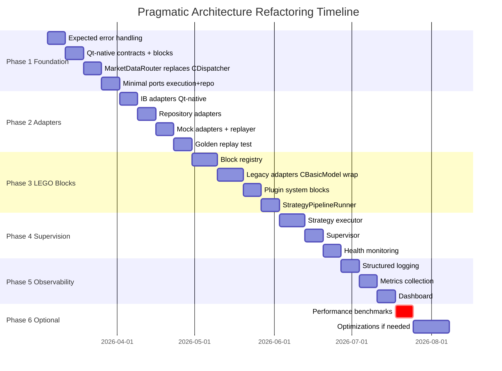
```mermaid
gantt
    title Pragmatic Architecture Refactoring Timeline
    dateFormat YYYY-MM-DD
    section Phase 1 Foundation
        Expected error handling         :p1a, 2026-03-05, 7d
        Qt-native contracts + blocks    :p1b, after p1a, 7d
        MarketDataRouter replaces CDispatcher :p1c, after p1b, 7d
        Minimal ports execution+repo    :p1d, after p1c, 7d
    section Phase 2 Adapters
        IB adapters Qt-native           :p2a, after p1d, 7d
        Repository adapters             :p2b, after p2a, 7d
        Mock adapters + replayer        :p2c, after p2b, 7d
        Golden replay test              :p2d, after p2c, 7d
    section Phase 3 LEGO Blocks
        Block registry                  :p3a, after p2d, 10d
        Legacy adapters CBasicModel wrap :p3b, after p3a, 10d
        Plugin system blocks            :p3c, after p3b, 7d
        StrategyPipelineRunner          :p3d, after p3c, 7d
    section Phase 4 Supervision
        Strategy executor               :p4a, after p3d, 10d
        Supervisor                      :p4b, after p4a, 7d
        Health monitoring               :p4c, after p4b, 7d
    section Phase 5 Observability
        Structured logging              :p5a, after p4c, 7d
        Metrics collection              :p5b, after p5a, 7d
        Dashboard                       :p5c, after p5b, 7d
    section Phase 6 Optional
        Performance benchmarks          :crit, p6a, after p5c, 7d
        Optimizations if needed         :p6b, after p6a, 14d
```


**Total Duration**: 

- **Phases 1-5**: ~18-22 weeks (4.5-5.5 months)
- **Phase 6 (Optional)**: +3 weeks if triggered

**Parallel Work Opportunities**:

- Documentation can run parallel to implementation
- Different developers can work on different phases
- Testing infrastructure can be built early

## Risk Assessment

### Technical Risks


| Risk                          | Likelihood | Impact | Mitigation                       |
| ----------------------------- | ---------- | ------ | -------------------------------- |
| Breaks existing functionality | Medium     | High   | Incremental, tests at each phase |
| Performance regression        | Low        | Medium | Benchmark before/after           |
| Integration issues            | Medium     | Medium | Mock adapters, integration tests |


### Schedule Risks


| Risk                         | Likelihood | Impact | Mitigation                              |
| ---------------------------- | ---------- | ------ | --------------------------------------- |
| Takes longer than 4-5 months | Medium     | Low    | Each phase delivers value independently |
| Scope creep                  | Medium     | Medium | Strict phase boundaries                 |


### Risk Mitigation Strategy

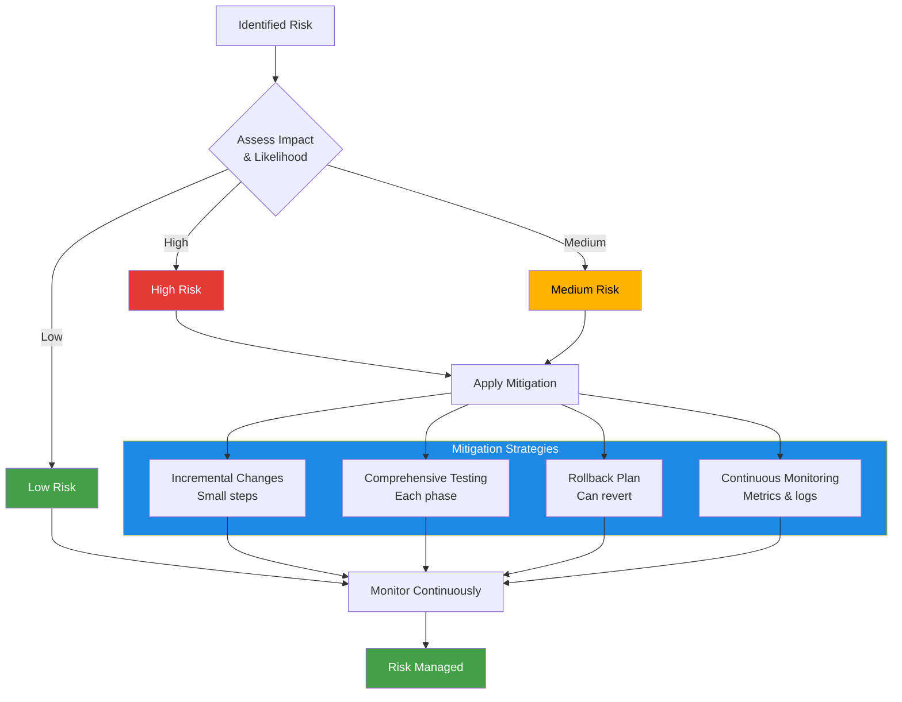
```mermaid
flowchart TB
    Risk[Identified Risk]
    
    Assess{Assess Impact<br/>& Likelihood}
    
    HighRisk[High Risk]
    MediumRisk[Medium Risk]
    LowRisk[Low Risk]
    
    Mitigate[Apply Mitigation]
    
    subgraph Mitigations[Mitigation Strategies]
        Incremental[Incremental Changes<br/>Small steps]
        Testing[Comprehensive Testing<br/>Each phase]
        Rollback[Rollback Plan<br/>Can revert]
        Monitoring[Continuous Monitoring<br/>Metrics & logs]
    end
    
    Monitor[Monitor Continuously]
    
    Success[Risk Managed]
    
    Risk --> Assess
    
    Assess -->|High| HighRisk
    Assess -->|Medium| MediumRisk
    Assess -->|Low| LowRisk
    
    HighRisk --> Mitigate
    MediumRisk --> Mitigate
    LowRisk --> Monitor
    
    Mitigate --> Incremental
    Mitigate --> Testing
    Mitigate --> Rollback
    Mitigate --> Monitoring
    
    Incremental --> Monitor
    Testing --> Monitor
    Rollback --> Monitor
    Monitoring --> Monitor
    
    Monitor --> Success
    
    style HighRisk fill:#e53935,color:#fff
    style MediumRisk fill:#ffb300,color:#000
    style LowRisk fill:#43a047,color:#fff
    style Mitigations fill:#1e88e5,color:#fff
    style Success fill:#43a047,color:#fff
```


**Risk Mitigation Principles**:

1. **Incremental**: Never big-bang rewrites - small, testable changes
2. **Reversible**: Each phase can be rolled back without data loss
3. **Validated**: Comprehensive tests before moving to next phase
4. **Monitored**: Metrics and logs track health at each step

---

## Complete Before/After Architecture

### Side-by-Side Comparison

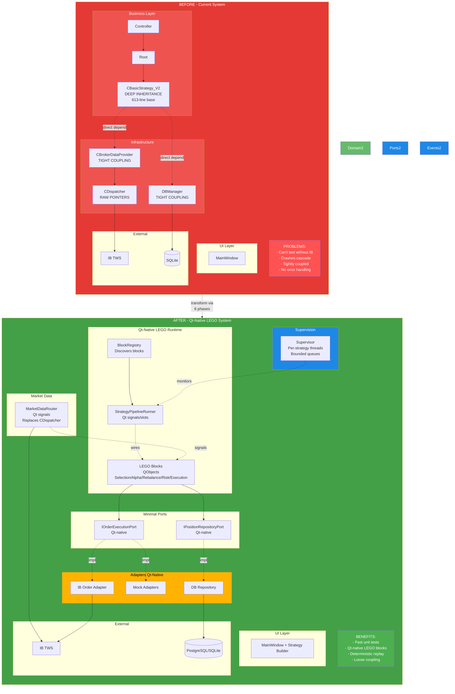
```mermaid
flowchart TB
    subgraph BeforeSystem[BEFORE - Current System]
        direction TB
        
        subgraph UI1[UI Layer]
            MainWin1[MainWindow]
        end
        
        subgraph Business1[Business Layer]
            Controller1[Controller]
            Root1[Root]
            Strategy1[CBasicStrategy_V2<br/>DEEP INHERITANCE<br/>613-line base]
            
            Controller1 --> Root1
            Root1 --> Strategy1
        end
        
        subgraph Infra1[Infrastructure]
            Broker1[CBrokerDataProvider<br/>TIGHT COUPLING]
            Dispatch1[CDispatcher<br/>RAW POINTERS]
            DB1[DBManager<br/>TIGHT COUPLING]
            
            Strategy1 -.direct depend.-> Broker1
            Strategy1 -.direct depend.-> DB1
            Broker1 --> Dispatch1
        end
        
        subgraph Ext1[External]
            IB1[IB TWS]
            SQLite1[(SQLite)]
        end
        
        Dispatch1 --> IB1
        DB1 --> SQLite1
        
        Problems1[PROBLEMS:<br/>- Can't test without IB<br/>- Crashes cascade<br/>- Tightly coupled<br/>- No error handling]
    end
    
    subgraph AfterSystem[AFTER - Qt-Native LEGO System]
        direction TB
        
        subgraph UI2[UI Layer]
            MainWin2[MainWindow + Strategy Builder]
        end
        
        subgraph Runtime2[Qt-Native LEGO Runtime]
            BlockReg[BlockRegistry<br/>Discovers blocks]
            Runner[StrategyPipelineRunner<br/>Qt signals/slots]
            Blocks[LEGO Blocks<br/>QObjects<br/>Selection/Alpha/Rebalance/Risk/Execution]
            
            BlockReg --> Runner
            Runner -.wires.-> Blocks
        end
        
        subgraph MarketSrc[Market Data]
            MktRouter[MarketDataRouter<br/>Qt signals<br/>Replaces CDispatcher]
            
            MktRouter -.signals.-> Blocks
        end
        
        subgraph MinPorts[Minimal Ports]
            PortOrd[IOrderExecutionPort<br/>Qt-native]
            PortRepo[IPositionRepositoryPort<br/>Qt-native]
            
            Blocks --> PortOrd
            Blocks --> PortRepo
        end
        
        subgraph Adapters2[Adapters Qt-Native]
            OrderAdapt[IB Order Adapter]
            RepoAdapt[DB Repository]
            MockAdapts[Mock Adapters]
            
            PortOrd -.impl.-> OrderAdapt
            PortOrd -.impl.-> MockAdapts
            PortRepo -.impl.-> RepoAdapt
        end
        
        subgraph Supervision2[Supervision]
            Supervisor[Supervisor<br/>Per-strategy threads<br/>Bounded queues]
            
            Supervisor -.monitors.-> Runner
        end
        
        subgraph Ext2[External]
            IB2[IB TWS]
            DB2[(PostgreSQL/SQLite)]
        end
        
        MktRouter --> IB2
        OrderAdapt --> IB2
        RepoAdapt --> DB2
        
        Benefits[BENEFITS:<br/>- Fast unit tests<br/>- Qt-native LEGO blocks<br/>- Deterministic replay<br/>- Loose coupling]
    end
    
    BeforeSystem -.transform via<br/>6 phases.-> AfterSystem
    
    style BeforeSystem fill:#e53935,color:#fff
    style AfterSystem fill:#43a047,color:#fff
    style Problems1 fill:#ff5252,color:#fff
    style Benefits fill:#4caf50,color:#fff
    style Business1 fill:#ef5350,color:#fff
    style Infra1 fill:#ef5350,color:#fff
    style Domain2 fill:#66bb6a,color:#fff
    style Ports2 fill:#1e88e5,color:#fff
    style Adapters2 fill:#ffb300,color:#000
    style Events2 fill:#1e88e5,color:#fff
    style Supervision2 fill:#1e88e5,color:#fff
```


## Conclusion

This revised plan is **pragmatic and achievable**:

- **4-5 months** (was 6-9)
- **Respects existing architecture** (pipeline, composite tree, Qt threading)
- **Focuses on real pain points** (testability, maintainability, reliability)
- **No over-engineering** (no HFT performance, no distributed systems complexity)
- **Incremental and reversible** (can pause anytime)

**Key principle**: Make the system testable and maintainable without rewriting it.

### Visual Summary of Transformation

The diagrams throughout this plan illustrate:

1. **Current State** (red): Tight coupling, deep inheritance, no testing
2. **Transformation Path** (yellow): Step-by-step refactoring through 6 phases
3. **Target State** (green): Loose coupling, composition, comprehensive testing

**Every diagram shows**:

- **What** changes (components, relationships)
- **Where** changes happen (specific layers, files)
- **Why** changes improve the system (testability, safety, maintainability)

