# IbTradeQt Architecture Documentation

## Table of Contents
1. [Project Overview](#project-overview)
2. [High-Level Architecture](#high-level-architecture)
3. [Component Architecture](#component-architecture)
4. [Design Patterns](#design-patterns)
5. [Strategy Framework Architecture](#strategy-framework-architecture)
6. [Data Flow Architecture](#data-flow-architecture)
7. [Threading Architecture](#threading-architecture)
8. [Database Architecture](#database-architecture)
9. [UI Architecture](#ui-architecture)
10. [Key Classes Reference](#key-classes-reference)

---

## Project Overview

**IbTradeQt** is a sophisticated Qt-based algorithmic trading platform designed for automated trading through Interactive Brokers (IB) TWS API. The system provides a flexible framework for implementing, testing, and executing multiple trading strategies with comprehensive market data management and portfolio tracking.

### Key Features
- Hierarchical portfolio and strategy management
- Real-time and historical market data processing
- Modular strategy pipeline architecture
- Multi-threaded execution for responsive UI
- Dual database system for market data and trading state
- Custom charting widgets for visualization
- Comprehensive order management and execution tracking

### Technology Stack

| Component | Technology |
|-----------|-----------|
| **GUI Framework** | Qt 6.x (QtCore, QtWidgets, QtCharts) |
| **Language** | C++17 |
| **Build System** | qmake (`.pro` files) |
| **Broker API** | Interactive Brokers TWS C++ API |
| **Market Data Storage** | PostgreSQL |
| **State Persistence** | SQLite |
| **Charting** | Qt Charts with custom candlestick widgets |
| **Decimal Precision** | Intel Binary Decimal Library (libbid) |

### Entry Point

The application starts in [`main.cpp`](main.cpp):
1. Initializes logging system (`MyLogger`)
2. Creates Qt application
3. Instantiates `CApplicationController`
4. Sets up MVC components via `setUpApplication()`
5. Shows main window and enters Qt event loop

---

## High-Level Architecture

IbTradeQt follows a **layered architecture** with clear separation of concerns:

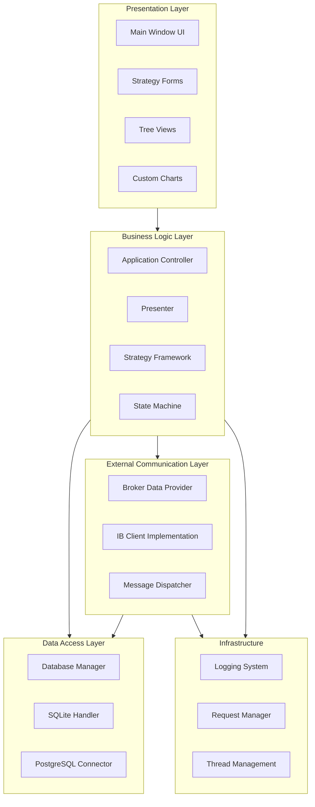

### Layer Responsibilities

**Presentation Layer:**
- Qt-based GUI components
- User input handling
- Data visualization (trees, charts, logs)
- No business logic

**Business Logic Layer:**
- Strategy execution and management
- Portfolio hierarchy management
- Market signal processing
- Risk management and position sizing

**Data Access Layer:**
- Database operations (SQLite for state, PostgreSQL for market data)
- Thread-safe database access
- Query management

**External Communication Layer:**
- Interactive Brokers API integration
- Market data subscription management
- Order placement and tracking
- Observer pattern for data distribution

---

## Component Architecture

The project is organized into distinct modules with well-defined responsibilities:

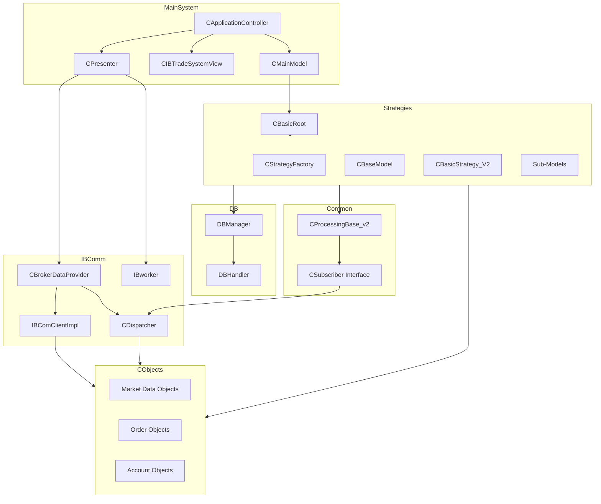

### Directory Structure

```
IbTradeQt/
├── MainSystem/          # Application core (MVC/MVP)
│   ├── capplicationcontroller.h/cpp   # Application lifecycle
│   ├── cpresenter.h/cpp               # MVP Presenter
│   ├── ibtradesystemview.h/cpp/.ui    # Main window
│   ├── cmainmodel.h/cpp               # Application model
│   └── portfolioconfigmodel.h/cpp     # Tree view model
│
├── IBComm/              # Interactive Brokers communication
│   ├── BrokerDataProvider.h/cpp       # Broker API facade
│   ├── IBComClientImpl.h/cpp          # IB client implementation
│   ├── Dispatcher.h/cpp               # Observer/publisher
│   └── IBworker.h/cpp                 # Worker thread
│
├── Strategies/          # Trading strategy framework
│   ├── Generic/         # Base framework
│   │   ├── cbasemodel.h/cpp           # Base model class
│   │   ├── cbasicstrategy_V2.h/cpp    # Base strategy
│   │   ├── cstrategyfactory.h/cpp     # Factory
│   │   ├── UnifiedModelData.h         # Pipeline data structure
│   │   └── [sub-models]               # Selection, Alpha, Risk, etc.
│   ├── PairTrader/      # Pair trading strategy
│   ├── AutoDeltAlignment/ # Delta hedging strategy
│   └── StateMachine/    # Model state management
│
├── DB/                  # Database abstraction
│   ├── dbmanager.h/cpp              # Database manager
│   ├── dbhandler.h/cpp              # SQLite handler
│   └── dbquery.h                    # Query definitions
│
├── CObjects/            # Common data objects
│   ├── ctickprice.h/cpp             # Price tick data
│   ├── chistoricaldata.h/cpp        # Historical data
│   ├── cposition.h/cpp              # Position data
│   └── [other data objects]
│
├── Common/              # Shared utilities
│   ├── cprocessingbase_v2.h/cpp     # Base processing class
│   ├── GlobalDef.h                  # Global definitions
│   └── NHelper.h/cpp                # Helper functions
│
├── ReqManager/          # Request ID management
│   └── globalreqmanager.h/cpp       # Request tracking
│
├── Logger/              # Logging infrastructure
│   └── mylogger.h/cpp               # Custom logger
│
├── CustomWidgets/       # Custom Qt widgets
│   └── qcandlestickchart.h/cpp      # Candlestick chart
│
└── Brokers/IB/          # IB TWS API SDK
    ├── Shared/          # IB client library
    └── addon/           # Helper classes
```

---

## Design Patterns

The system employs multiple design patterns for flexibility and maintainability:

### 1. Model-View-Presenter (MVP)

**Implementation:**
- **Model**: [`CMainModel`](MainSystem/cmainmodel.h) - Application data
- **View**: [`CIBTradeSystemView`](MainSystem/ibtradesystemview.h) - Main window
- **Presenter**: [`CPresenter`](MainSystem/cpresenter.h) - Mediator between view and model
- **Controller**: [`CApplicationController`](MainSystem/capplicationcontroller.h) - Application orchestrator

**Benefits:**
- Testable business logic (presenter is independent of UI)
- Clear separation of concerns
- Facilitates parallel UI and logic development

### 2. Observer/Subscriber Pattern

**Implementation:**
- **Observable**: [`CDispatcher`](IBComm/Dispatcher.h) - Publishes market data
- **Observer**: [`CSubscriber`](Common/cprocessingbase_v2.h) - Receives data callbacks
- **Facade**: [`CBrokerDataProvider`](IBComm/BrokerDataProvider.h) - Wraps dispatcher

**Key Methods:**
- `Subscribe(CSubscriber*, TickerId, tEReqType)` - Register observer
- `Unsubscribe(CSubscriber*, TickerId)` - Deregister observer
- `SendMessageToSubscribers(void*, TickerId, tEReqType)` - Notify observers

**Benefits:**
- Decouples data producers from consumers
- Multiple strategies can subscribe to same data
- Thread-safe notifications via mutex

### 3. Composite Pattern

**Implementation:**
The strategy hierarchy uses composite pattern where each node can contain children:

```
CBasicRoot (ROOT)
  └─ CBasicAccount (ACCOUNT)
      └─ CBasicPortfolio (PORTFOLIO)
          └─ CBasicStrategy_V2 (STRATEGY)
              ├─ CBasicSelectionModel
              ├─ CBasicAlphaModel
              ├─ CBaseRebalanceModel
              ├─ CBasicRiskModel
              └─ CBasicExecutionModel
```

**Common Interface**: [`CGenericModelApi`](Strategies/Generic/cgenericmodelApi.h)

**Benefits:**
- Uniform treatment of individual strategies and portfolios
- Flexible hierarchy construction
- Recursive operations (start/stop all strategies)

### 4. Factory Pattern

**Implementation**: [`CStrategyFactory`](Strategies/Generic/cstrategyfactory.h)

Creates strategy instances based on `ModelType` enum:
- `ROOT`, `ACCOUNT`, `PORTFOLIO`, `STRATEGY`
- Specific strategies: `STRATEGY_MA`, `STRATEGY_MOMENTUM`, `STRATEGY_BASIC_TEST`
- Sub-models: `STRATEGY_SELECTION_MODEL`, `STRATEGY_ALPHA_MODEL`, etc.

**Benefits:**
- Centralized object creation
- Easy to add new strategy types
- Decouples client code from concrete classes

### 5. Pipeline/Chain of Responsibility

**Implementation:**
Strategy sub-models form a processing pipeline:

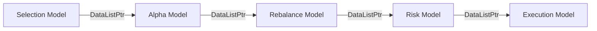

Each model:
1. Receives `DataListPtr` with market signals
2. Processes/filters/enhances data
3. Emits `dataProcessed(DataListPtr)` signal to next stage

**Benefits:**
- Modular, testable components
- Easy to swap implementations
- Clear data transformation flow

### 6. State Machine Pattern

**Implementation**: [`CModelState`](Strategies/StateMachine/cmodelstate.h)

Each model has a lifecycle state machine:

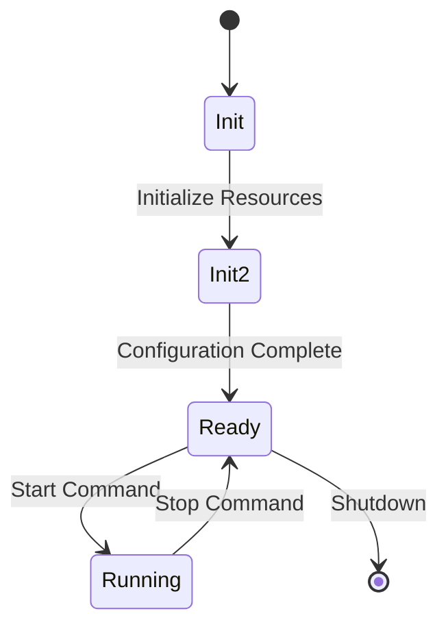

**States**: `MS_Init` → `MS_Init2` → `MS_Ready` → `MS_Running`

**Benefits:**
- Well-defined initialization sequence
- Prevents invalid state transitions
- Easier debugging and logging

### 7. Singleton Pattern

**Implementation:**
- [`GlobalReqManager`](ReqManager/globalreqmanager.h) - Request ID management
- Logger systems

**Note**: Singletons used sparingly for truly global resources.

---

## Strategy Framework Architecture

The strategy framework is the core of IbTradeQt, providing a flexible, composable system for algorithmic trading.

### Hierarchical Structure

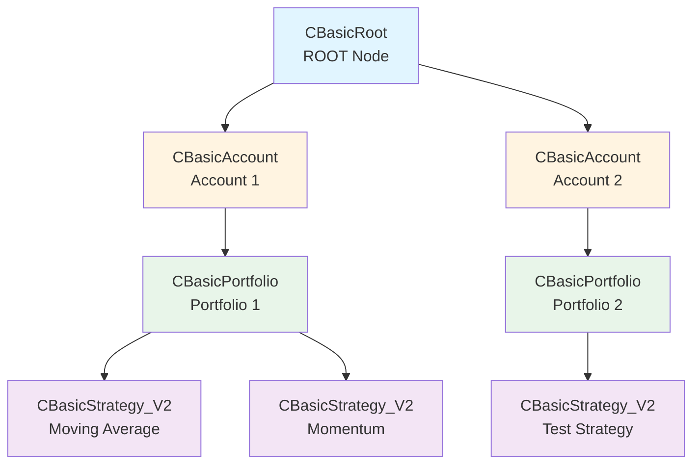

### Base Class Hierarchy

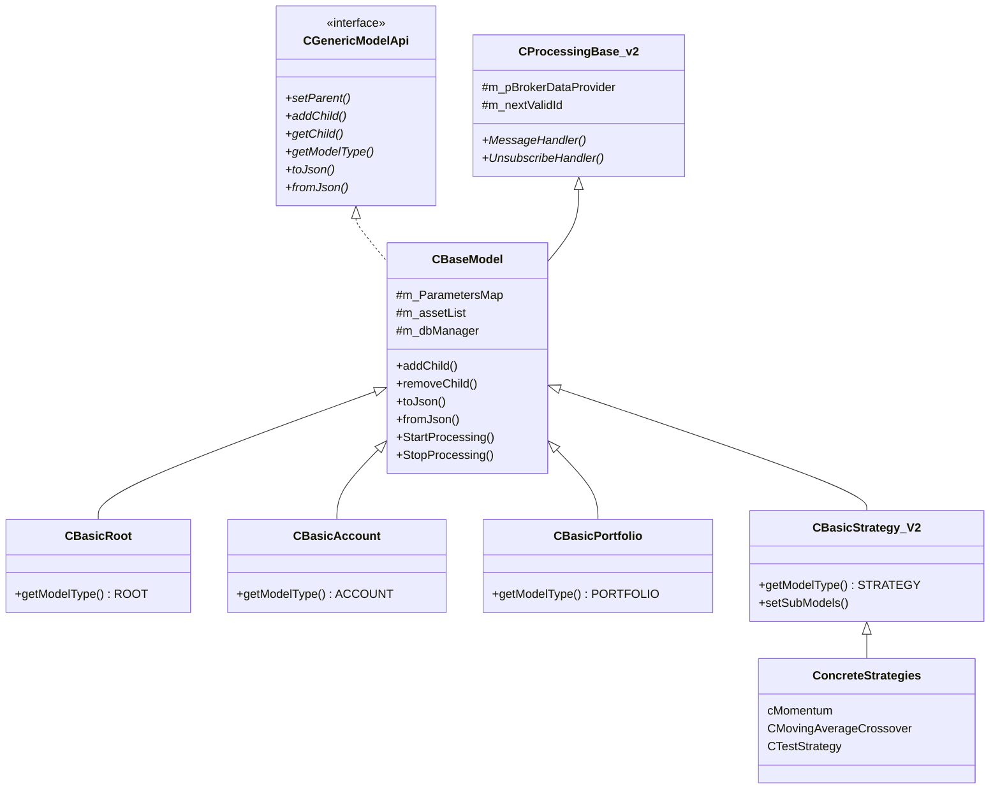

### Strategy Pipeline Architecture

Each strategy can be decomposed into five specialized sub-models:

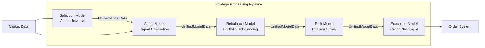

### UnifiedModelData Structure

Data flows between pipeline stages using a standardized structure defined in [`UnifiedModelData.h`](Strategies/Generic/UnifiedModelData.h):

```cpp
struct UnifiedModelData {
    QString symbol;           // Asset symbol
    eDirection direction;     // LONG/SHORT/UNDEFINED
    double probability;       // Signal confidence
    double amount;           // Quantity
    double currentPrice;     // Current market price
}
```

### Strategy Factory

[`CStrategyFactory`](Strategies/Generic/cstrategyfactory.h) creates all model types:

**Available Model Types:**
- `ROOT` → `CBasicRoot`
- `ACCOUNT` → `CBasicAccount`
- `PORTFOLIO` → `CBasicPortfolio`
- `STRATEGY` → `CBasicStrategy_V2`
- `STRATEGY_MA` → `CMovingAverageCrossover`
- `STRATEGY_MOMENTUM` → `cMomentum`
- `STRATEGY_BASIC_TEST` → `CTestStrategy`
- `STRATEGY_PIPELINE` → `CPipelineStrategyAdapter` (LEGO pipeline)
- `STRATEGY_SELECTION_MODEL` → `CBasicSelectionModel`
- `STRATEGY_ALPHA_MODEL` → `CBasicAlphaModel`
- `STRATEGY_REBALANCE_MODEL` → `CBaseRebalanceModel`
- `STRATEGY_RISK_MODEL` → `CBasicRiskModel`
- `STRATEGY_EXECTION_MODEL` → `CBasicExecutionModel`

### Strategy Configuration

Strategies store configuration in `QVariantMap` structures:
- **m_ParametersMap**: Strategy parameters (thresholds, periods, etc.)
- **m_assetList**: Asset universe
- **m_genericInfo**: Metadata and runtime info

**Persistence:**
- JSON serialization via `toJson()`/`fromJson()`
- Saved to file: `model_tree_config.json`
- Database storage via [`DBManager`](DB/dbmanager.h)

---

## Data Flow Architecture

### Interactive Brokers Connection Flow

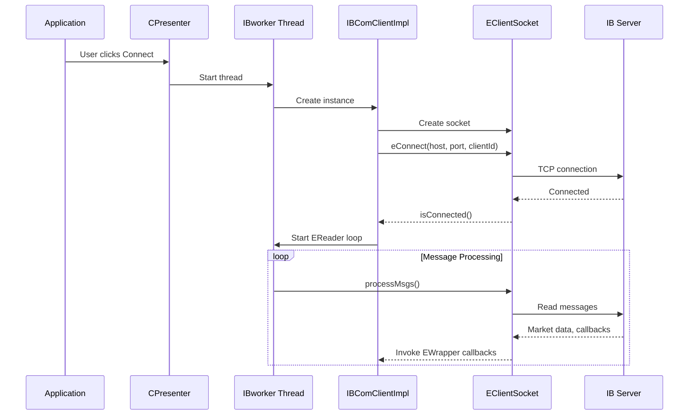

**Connection Details:**
- **Host**: `127.0.0.1` (localhost)
- **Port**: `4002` (IB Gateway) or `7497` (TWS Demo)
- **Client ID**: `1`
- **Configuration**: [`Common/GlobalDef.h`](Common/GlobalDef.h)

### Market Data Subscription Flow

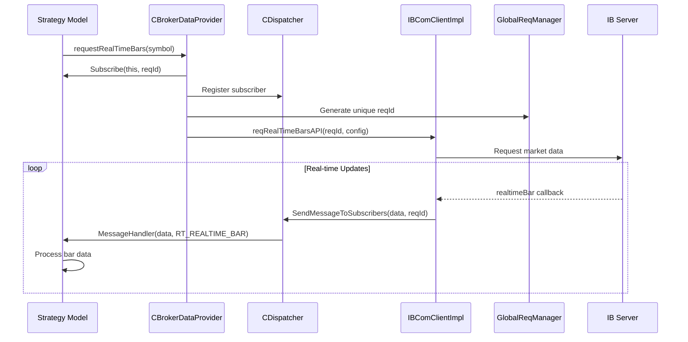

### Complete Data Flow: Price Update to Order

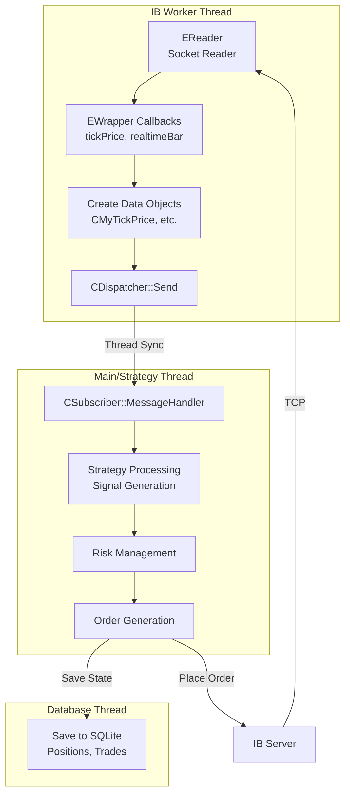

### Request Types

The system handles multiple request types defined in [`ReqManager/reqtype.h`](ReqManager/reqtype.h):

**Market Data:**
- `RT_TICK_PRICE` - Price updates (bid/ask/last)
- `RT_TICK_SIZE` - Volume updates
- `RT_REALTIME_BAR` - 5-second bars
- `RT_HISTORICAL_DATA` - Historical OHLCV data
- `RT_TICK_BY_TICK_DATA` - Tick-by-tick trades
- `RT_MKT_DEPTH` / `RT_MKT_DEPTH_L2` - Order book data

**Account & Orders:**
- `RT_REQ_POSITION` - Position updates
- `RT_REQ_ACCOUNT_SUMMURY` - Account information
- `RT_ORDER_STATUS` - Order state changes
- `RT_ORDER_EXECUTION` - Execution reports
- `RT_ORDER_COMMISSION` - Commission reports

**Options:**
- `RT_REQ_OPTION_PRICE` - Option pricing

### Data Object Types

Market data is encapsulated in type-safe objects in [`CObjects/`](CObjects/):

| Class | Purpose | Key Fields |
|-------|---------|------------|
| `CMyTickPrice` | Price tick | tickType, price, attribs |
| `CMyTickSize` | Size tick | tickType, size, attribs |
| `CHistoricalData` | Historical bar | open, high, low, close, volume, WAP |
| `CMyPosition` | Position | account, symbol, quantity, avgCost |
| `CExecutionReport` | Trade execution | orderId, execId, shares, price, side |
| `CCommissionReport` | Commission | commission, currency, realizedPnL |
| `CAccountSummary` | Account info | key, value, currency |

---

## Threading Architecture

IbTradeQt uses a multi-threaded architecture to ensure UI responsiveness while handling real-time market data and database operations.

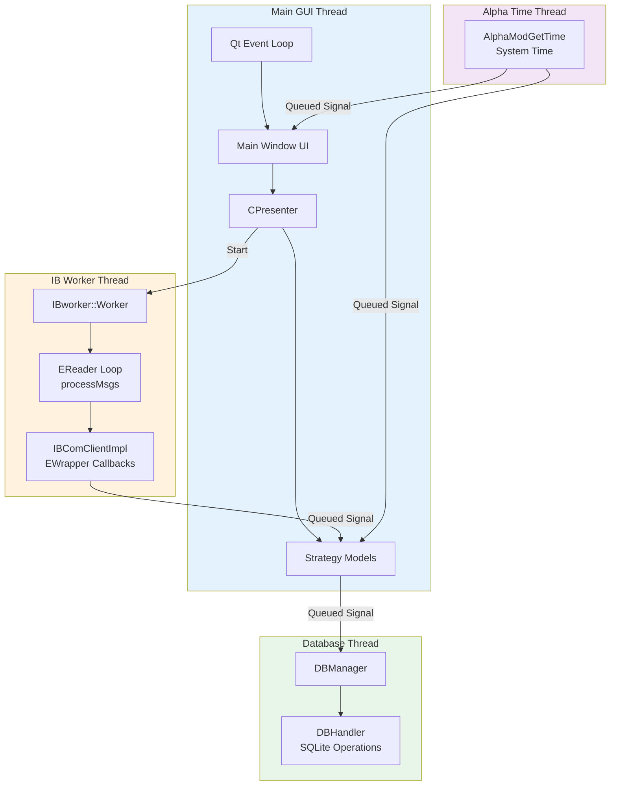

### Thread Details

#### Main GUI Thread
- **Purpose**: User interface and Qt event loop
- **Components**:
  - [`CIBTradeSystemView`](MainSystem/ibtradesystemview.h) - Main window
  - [`CPresenter`](MainSystem/cpresenter.h) - Application presenter
  - Strategy models (when processing is lightweight)
- **Communication**: Direct method calls and Qt signals

#### IB Worker Thread
- **Purpose**: Non-blocking IB API message processing
- **Implementation**: [`IBworker`](IBComm/IBworker.h)
- **Process Loop**:
  ```cpp
  void Worker::process() {
      while (!stopWorking) {
          m_pIBComClientIpml->processMessagesAPI(); // Calls EReader::processMsgs()
      }
  }
  ```
- **Synchronization**: 
  - `EReaderOSSignal` for message arrival notification
  - Qt queued connections for callbacks to main thread

#### Database Thread
- **Purpose**: Prevent blocking on SQLite operations
- **Implementation**: [`DBManager`](DB/dbmanager.h) moves [`DBHandler`](DB/dbhandler.h) to QThread
- **Operations**:
  - Insert/update positions
  - Record trades
  - Store strategy state
  - Fetch model info
- **Communication**: Qt signal/slot with `Qt::QueuedConnection`

#### Alpha Time Thread
- **Purpose**: Periodic time-based triggers
- **Implementation**: [`AlphaModGetTime`](AlphaModelGetTime/alphamodgettime.h)
- **Functionality**: Emits time signals for strategy scheduling

### Thread Synchronization

**Mechanisms Used:**
1. **Qt Signal/Slot Queued Connections**
   - Automatic thread-safe message passing
   - Event loop integration
   - Used for cross-thread communication

2. **std::mutex**
   - Protects subscriber list in [`CDispatcher`](IBComm/Dispatcher.h)
   - Critical sections for shared data structures

3. **QMutex**
   - Qt-specific mutex for some components
   - Integrates with Qt's threading model

**Thread Safety Strategy:**
- Immutable data objects where possible
- Message passing over shared memory
- Minimal locking with clear ownership

---

## Database Architecture

IbTradeQt uses two database systems for different purposes:

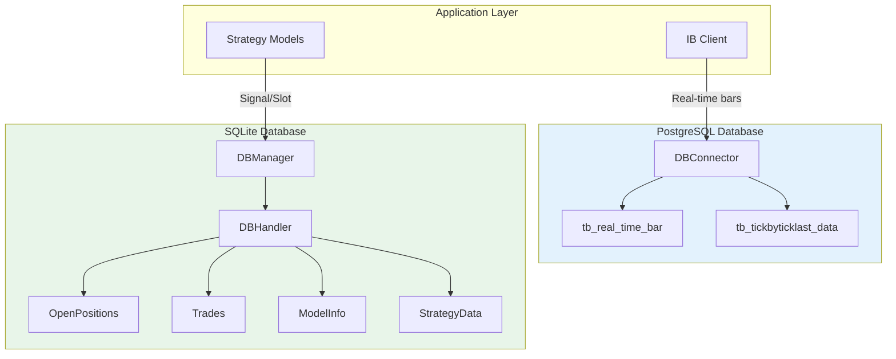

### PostgreSQL (Market Data)

**Purpose**: High-throughput storage of real-time market data

**Implementation**: `DBConnector` class (referenced but not in main source tree)

**Tables:**
- **tb_real_time_bar**
  - Columns: timestamp, ticker, open, high, low, close, volume, WAP, count
  - Stores 5-second real-time bars from IB
  
- **tb_tickbyticklast_data**
  - Stores tick-by-tick trade data
  - High-frequency data capture

**Usage Pattern:**
- Direct insertion as data arrives from IB
- Used for backtesting and analysis
- Separate from trading state

### SQLite (Trading State)

**Purpose**: Persistent storage of trading state, positions, and strategy configuration

**Implementation**: 
- [`DBManager`](DB/dbmanager.h) - Thread manager and signal router
- [`DBHandler`](DB/dbhandler.h) - Actual database operations

**Threading Model:**
```cpp
// DBManager constructor
DBManager::DBManager(QObject *parent) : QObject(parent) {
    QThread* thread = new QThread;
    DBHandler* handler = new DBHandler();
    handler->moveToThread(thread);  // Move to separate thread
    thread->start();
}
```

**Tables** (defined in [`DB/dbquery.h`](DB/dbquery.h)):

1. **OpenPositions**
   ```sql
   CREATE TABLE IF NOT EXISTS OpenPositions (
       id INTEGER PRIMARY KEY AUTOINCREMENT,
       strategyId INTEGER,
       symbol TEXT,
       quantity REAL,
       averagePrice REAL,
       marketPrice REAL,
       pnl REAL,
       date TEXT
   )
   ```

2. **Trades**
   ```sql
   CREATE TABLE IF NOT EXISTS Trades (
       id INTEGER PRIMARY KEY AUTOINCREMENT,
       strategyId INTEGER,
       symbol TEXT,
       quantity REAL,
       price REAL,
       pnl REAL,
       fee REAL,
       date TEXT,
       tradeType TEXT
   )
   ```

3. **ModelInfo**
   ```sql
   CREATE TABLE IF NOT EXISTS ModelInfo (
       id INTEGER PRIMARY KEY,
       modelType TEXT,
       configData TEXT
   )
   ```

4. **StrategyData**
   - Stores strategy-specific state and statistics
   - JSON-serialized strategy data

**Access Patterns:**
- **Write**: Asynchronous via signals (`signalAddNewTrade`, `signalUpdatePosition`)
- **Read**: Synchronous with callback signals (`signalModelInfoFetched`)
- **Thread Safety**: All operations queued through signal/slot mechanism

---

## Threading Architecture (Detailed)

### Thread Communication Patterns

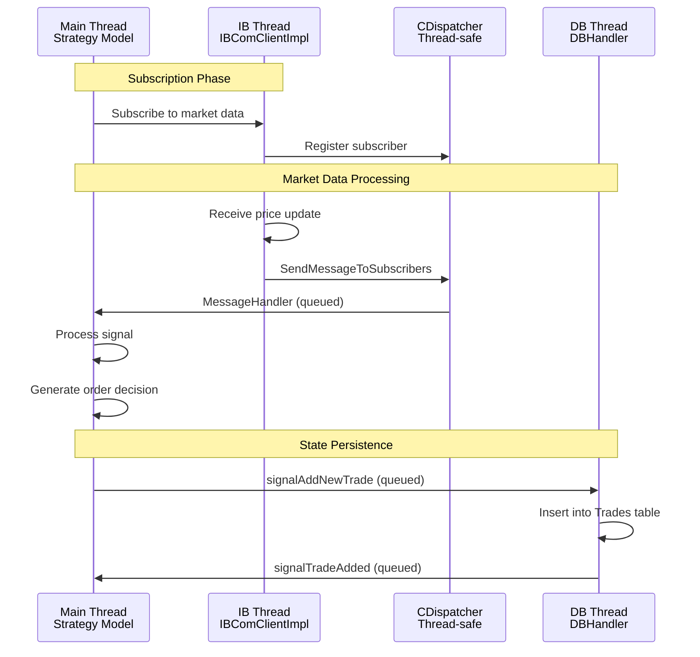

### Thread Lifecycle Management

**IB Worker Thread:**
```cpp
// Started in CPresenter constructor
workerThread = new QThread;
Worker *worker = new Worker(pIBBrokerClient.data());
worker->moveToThread(workerThread);

connect(workerThread, SIGNAL(started()), worker, SLOT(process()));
connect(worker, SIGNAL(finished()), workerThread, SLOT(quit()));

workerThread->start();
```

**Database Thread:**
```cpp
// Started in DBManager constructor
QThread* dbThread = new QThread;
DBHandler* handler = new DBHandler();
handler->moveToThread(dbThread);

// Connect signals AFTER moveToThread
connect(this, &DBManager::signalAddNewTrade, 
        handler, &DBHandler::slotAddNewTrade, 
        Qt::QueuedConnection);

dbThread->start();
```

### Critical Synchronization Points

1. **CDispatcher Subscriber List**
   - Protected by `std::mutex m_Mutex`
   - Locked during subscribe/unsubscribe/dispatch operations

2. **Request ID Generation**
   - [`GlobalReqManager`](ReqManager/globalreqmanager.h) manages ID allocation
   - Thread-safe ID generation for concurrent requests

3. **Qt Signal/Slot Across Threads**
   - `Qt::QueuedConnection` ensures thread-safe delivery
   - Copies data to prevent race conditions

---

## Data Flow Architecture (Detailed)

### Complete End-to-End Flow Example

Let's trace a complete scenario: **Strategy receives price update and places order**

```mermaid
flowchart TB
    Start([User Starts Strategy])
    
    subgraph Init[Initialization]
        Subscribe[Strategy Subscribes<br/>to Market Data]
        GenReqId[Generate Request ID]
        SendReq[Send Request to IB]
    end
    
    subgraph Reception[Data Reception IB Thread]
        IBRecv[IB Sends Price Update]
        Callback[tickPrice Callback]
        CreateTick[Create CMyTickPrice Object]
        Dispatch[Dispatcher Notifies Subscribers]
    end
    
    subgraph Processing[Processing Main Thread]
        MsgHandle[MessageHandler Called]
        ExtractData[Extract Price Data]
        Pipeline[Run Strategy Pipeline]
        
        subgraph PipelineSteps[Pipeline Steps]
            CheckSelection[Selection Model<br/>Asset in universe?]
            GenSignal[Alpha Model<br/>Generate signal]
            CalcRebal[Rebalance Model<br/>Target position]
            CheckRisk[Risk Model<br/>Position size OK?]
            PrepExec[Execution Model<br/>Create order]
        end
    end
    
    subgraph Execution[Order Execution]
        PlaceOrder[Place Order via IBrokerAPI]
        OrderConf[Receive Order Confirmation]
        SaveDB[Save Trade to Database]
    end
    
    Start --> Init
    Subscribe --> GenReqId
    GenReqId --> SendReq
    SendReq --> IBRecv
    
    IBRecv --> Callback
    Callback --> CreateTick
    CreateTick --> Dispatch
    Dispatch --> MsgHandle
    
    MsgHandle --> ExtractData
    ExtractData --> Pipeline
    Pipeline --> CheckSelection
    CheckSelection --> GenSignal
    GenSignal --> CalcRebal
    CalcRebal --> CheckRisk
    CheckRisk --> PrepExec
    
    PrepExec --> PlaceOrder
    PlaceOrder --> OrderConf
    OrderConf --> SaveDB
    
    SaveDB --> End([Complete])
    
    style Init fill:#e3f2fd
    style Reception fill:#fff3e0
    style Processing fill:#e8f5e9
    style Execution fill:#fce4ec
```

### Request Management Flow

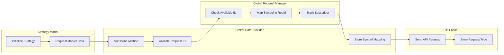

---

## UI Architecture

### Main Window Structure

The main application window ([`ibtradesystemview.ui`](MainSystem/ibtradesystemview.ui)) uses a docked layout:

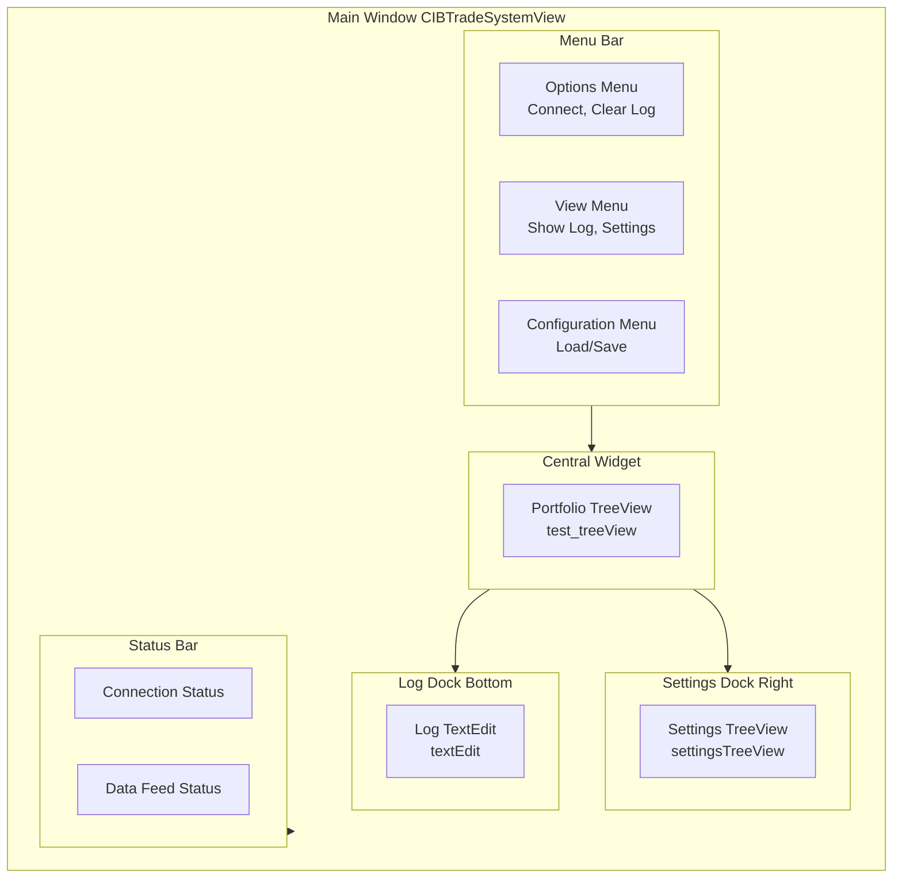

### MVP Interaction Pattern

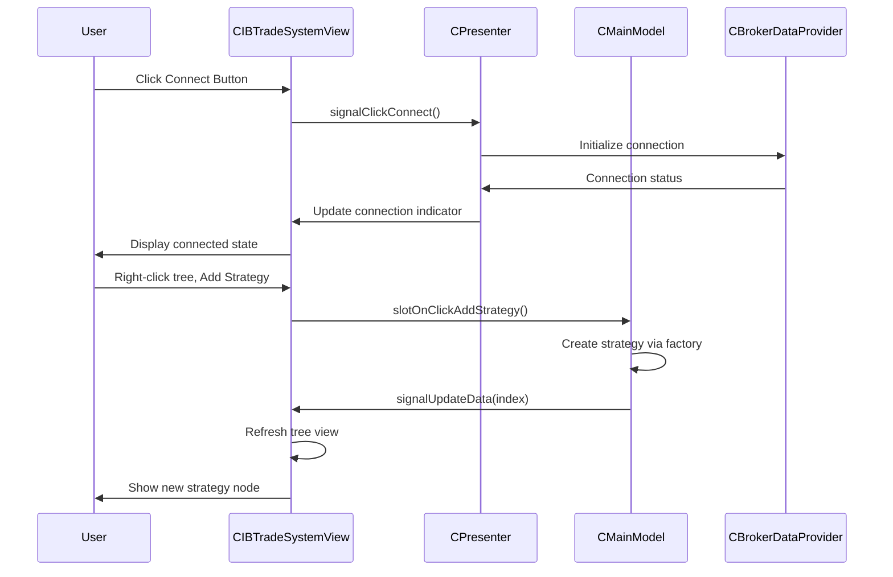

### Tree View Architecture

The portfolio hierarchy is displayed using Qt's Model/View architecture:

**Model**: [`CPortfolioConfigModel`](MainSystem/portfolioconfigmodel.h)
- Extends `QAbstractItemModel`
- Represents hierarchical strategy tree
- Handles add/remove/edit operations

**View**: `QTreeView` in main window
- Displays model in tree format
- Context menu for operations
- Drag-and-drop support

**Actions:**
- Add Account, Portfolio, Strategy
- Add sub-models (Selection, Alpha, Rebalance, Risk, Execution)
- Remove node
- Edit parameters

### Signal/Slot Architecture

Key connections established in [`CPresenter::MapSignals()`](MainSystem/cpresenter.cpp):

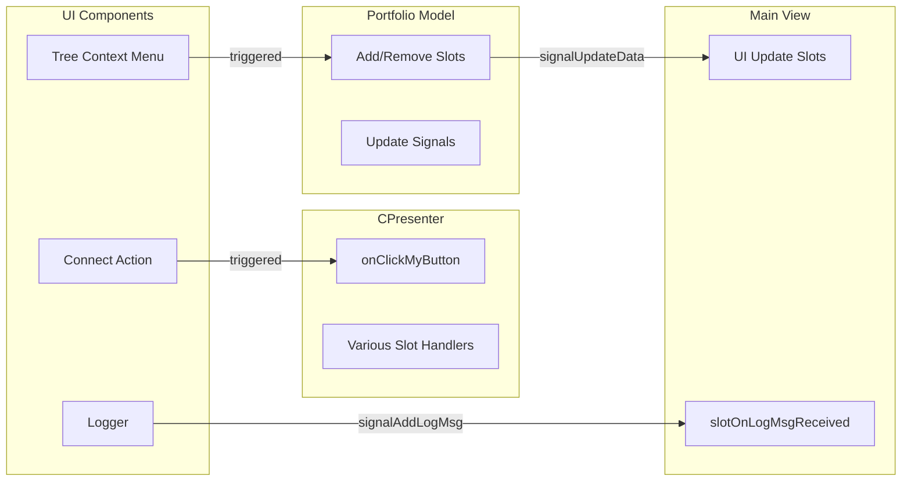

---

## Key Classes Reference

### Application Core

| Class | File | Responsibility |
|-------|------|----------------|
| `CApplicationController` | [`MainSystem/capplicationcontroller.h`](MainSystem/capplicationcontroller.h) | Application lifecycle management, component initialization |
| `CPresenter` | [`MainSystem/cpresenter.h`](MainSystem/cpresenter.h) | MVP presenter, mediates view and model, signal mapping |
| `CIBTradeSystemView` | [`MainSystem/ibtradesystemview.h`](MainSystem/ibtradesystemview.h) | Main window view, UI component management |
| `CMainModel` | [`MainSystem/cmainmodel.h`](MainSystem/cmainmodel.h) | Application data model |
| `CPortfolioConfigModel` | [`MainSystem/portfolioconfigmodel.h`](MainSystem/portfolioconfigmodel.h) | Tree view model for portfolio hierarchy |

### IB Communication

| Class | File | Responsibility |
|-------|------|----------------|
| `IBComClientImpl` | [`IBComm/IBComClientImpl.h`](IBComm/IBComClientImpl.h) | IB TWS API client, implements EWrapper callbacks |
| `CBrokerDataProvider` | [`IBComm/BrokerDataProvider.h`](IBComm/BrokerDataProvider.h) | Broker API facade, subscription management |
| `CDispatcher` | [`IBComm/Dispatcher.h`](IBComm/Dispatcher.h) | Observer pattern implementation, message routing |
| `IBworker` | [`IBComm/IBworker.h`](IBComm/IBworker.h) | Worker thread for IB message processing |
| `IBrokerAPI` | [`IBComm/IbrokerAPI.h`](IBComm/IbrokerAPI.h) | Abstract broker interface |

### Strategy Framework

| Class | File | Responsibility |
|-------|------|----------------|
| `CGenericModelApi` | [`Strategies/Generic/cgenericmodelApi.h`](Strategies/Generic/cgenericmodelApi.h) | Pure virtual interface for all models |
| `CBaseModel` | [`Strategies/Generic/cbasemodel.h`](Strategies/Generic/cbasemodel.h) | Base implementation with common functionality |
| `CBasicRoot` | [`Strategies/Generic/cbasicroot.h`](Strategies/Generic/cbasicroot.h) | Root node of strategy hierarchy |
| `CBasicAccount` | [`Strategies/Generic/cbasicaccount.h`](Strategies/Generic/cbasicaccount.h) | Account-level container |
| `CBasicPortfolio` | [`Strategies/Generic/cbasicportfolio.h`](Strategies/Generic/cbasicportfolio.h) | Portfolio management |
| `CBasicStrategy_V2` | [`Strategies/Generic/cbasicstrategy_V2.h`](Strategies/Generic/cbasicstrategy_V2.h) | Base strategy class |
| `cMomentum` | [`Strategies/Generic/cmomentum.h`](Strategies/Generic/cmomentum.h) | Momentum strategy implementation |
| `CMovingAverageCrossover` | [`Strategies/Generic/cmovingaveragecrossover.h`](Strategies/Generic/cmovingaveragecrossover.h) | Moving average strategy |
| `CTestStrategy` | [`Strategies/Generic/cteststrategy.h`](Strategies/Generic/cteststrategy.h) | Test/debugging strategy |
| `CStrategyFactory` | [`Strategies/Generic/cstrategyfactory.h`](Strategies/Generic/cstrategyfactory.h) | Factory for creating models |

### Strategy Sub-Models

| Class | File | Responsibility |
|-------|------|----------------|
| `CBasicSelectionModel` | [`Strategies/Generic/cbasicselectionmodel.h`](Strategies/Generic/cbasicselectionmodel.h) | Asset universe selection |
| `CBasicAlphaModel` | [`Strategies/Generic/cbasicalphamodel.h`](Strategies/Generic/cbasicalphamodel.h) | Signal generation |
| `CBaseRebalanceModel` | [`Strategies/Generic/cbaserebalancemodel.h`](Strategies/Generic/cbaserebalancemodel.h) | Portfolio rebalancing |
| `CBasicRiskModel` | [`Strategies/Generic/cbasicriskmodel.h`](Strategies/Generic/cbasicriskmodel.h) | Risk management |
| `CBasicExecutionModel` | [`Strategies/Generic/cbasicexecutionmodel.h`](Strategies/Generic/cbasicexecutionmodel.h) | Order execution |

### Database Layer

| Class | File | Responsibility |
|-------|------|----------------|
| `DBManager` | [`DB/dbmanager.h`](DB/dbmanager.h) | Database thread manager, signal router |
| `DBHandler` | [`DB/dbhandler.h`](DB/dbhandler.h) | SQLite operations implementation |
| `DbTrade` | [`DB/dbquery.h`](DB/dbquery.h) | Trade data structure |
| `OpenPosition` | [`DB/dbquery.h`](DB/dbquery.h) | Position data structure |
| `DbModelInfo` | [`DB/dbquery.h`](DB/dbquery.h) | Model configuration data |

### Common Components

| Class | File | Responsibility |
|-------|------|----------------|
| `CProcessingBase_v2` | [`Common/cprocessingbase_v2.h`](Common/cprocessingbase_v2.h) | Base class for data processors, subscriber interface |
| `CSubscriber` | [`Common/cprocessingbase_v2.h`](Common/cprocessingbase_v2.h) | Observer interface for market data |
| `GlobalReqManager` | [`ReqManager/globalreqmanager.h`](ReqManager/globalreqmanager.h) | Request ID allocation and tracking |
| `MyLogger` | [`Logger/mylogger.h`](Logger/mylogger.h) | Application-wide logging |

### Data Objects (CObjects)

| Class | File | Purpose |
|-------|------|---------|
| `CMyTickPrice` | [`CObjects/ctickprice.h`](CObjects/ctickprice.h) | Price tick data |
| `CMyTickSize` | [`CObjects/cticksize.h`](CObjects/cticksize.h) | Volume tick data |
| `CHistoricalData` | [`CObjects/chistoricaldata.h`](CObjects/chistoricaldata.h) | Historical bar data |
| `CMyPosition` | [`CObjects/cposition.h`](CObjects/cposition.h) | Position information |
| `CExecutionReport` | [`CObjects/cexecutionreport.h`](CObjects/cexecutionreport.h) | Trade execution details |
| `CCommissionReport` | [`CObjects/ccommissionreport.h`](CObjects/ccommissionreport.h) | Commission and P&L |
| `CAccountSummary` | [`CObjects/caccountsummary.h`](CObjects/caccountsummary.h) | Account summary data |
| `CDeltaObject` | [`CObjects/cdeltaobject.h`](CObjects/cdeltaobject.h) | Options delta data |

---

## Strategy State Machine

Each model implements a state machine for lifecycle management:

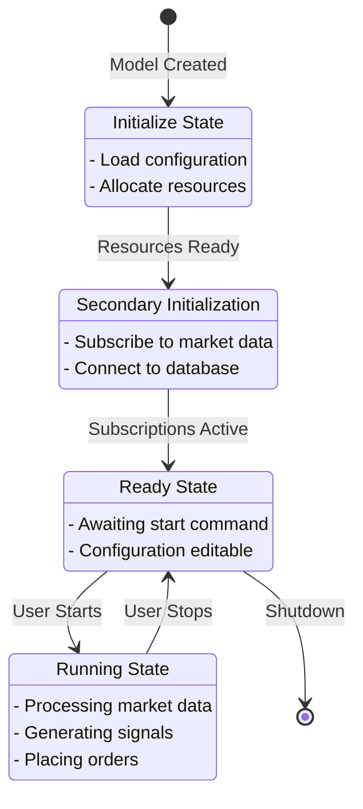

**State Definitions** ([`Strategies/StateMachine/cmodelstate.h`](Strategies/StateMachine/cmodelstate.h)):
- **MS_Init**: Initial state, loading configuration
- **MS_Init2**: Secondary initialization, establishing connections
- **MS_Ready**: Initialized and ready to run, but not processing
- **MS_Running**: Actively processing market data and trading

**State Interface:**
```cpp
class CModelState {
public:
    virtual void enterState(CBaseModel* model) = 0;
    virtual void handleEvent(CBaseModel* model, const e_modelStateEvent& event) = 0;
    virtual void exitState(CBaseModel* model) = 0;
    virtual e_modelState getStateID() const = 0;
};
```

---

## Configuration and Persistence

### Configuration Storage

**Runtime Configuration:**
- Stored in `QVariantMap` structures within each model
- Three main maps:
  - `m_ParametersMap` - Strategy parameters
  - `m_assetList` - Asset universe
  - `m_genericInfo` - Metadata

**File Persistence:**
- **Format**: JSON
- **File**: `model_tree_config.json` (in application directory)
- **Methods**: `toJson()` serialization, `fromJson()` deserialization
- **Scope**: Entire strategy tree hierarchy

**Database Persistence:**
- Model configuration stored in `ModelInfo` table
- Strategy state stored in `StrategyData` table
- Automatic persistence on changes

### JSON Serialization Example

Each model implements serialization:
```cpp
// Serialize model to JSON
QJsonObject CBaseModel::toJson() const {
    QJsonObject obj;
    obj["id"] = QString::number(m_id);
    obj["modelType"] = static_cast<int>(getModelType());
    obj["parameters"] = QJsonObject::fromVariantMap(m_ParametersMap);
    obj["assets"] = QJsonObject::fromVariantMap(m_assetList);
    
    // Serialize children
    QJsonArray children;
    for (const auto& child : m_Children) {
        children.append(child->toJson());
    }
    obj["children"] = children;
    
    return obj;
}
```

---

## Interactive Brokers API Integration

### EWrapper Callback Coverage

[`IBComClientImpl`](IBComm/IBComClientImpl.h) implements 117+ callback methods from the IB API:

**Key Callbacks by Category:**

**Market Data:**
- `tickPrice()` - Price updates
- `tickSize()` - Volume updates
- `tickString()` - String data
- `tickGeneric()` - Generic ticks
- `realtimeBar()` - 5-second bars
- `historicalData()` - Historical bars
- `updateMktDepth()` - Level 2 data

**Account & Portfolio:**
- `position()` - Position updates
- `positionEnd()` - Position list complete
- `accountSummary()` - Account information
- `updateAccountValue()` - Account value changes

**Orders:**
- `orderStatus()` - Order state changes
- `openOrder()` - Open order details
- `execDetails()` - Execution reports
- `commissionReport()` - Commission details

**Connection:**
- `connectionClosed()` - Connection lost
- `error()` - Error messages

### Request Methods

**Market Data Requests:**
- `reqRealTimeDataAPI()` - Subscribe to real-time data
- `reqRealTimeBarsAPI()` - Subscribe to 5-second bars
- `reqHistoricalDataAPI()` - Request historical data
- `reqTickByTickDataAPI()` - Tick-by-tick subscription

**Account & Position Requests:**
- `reqPositionsAPI()` - Request positions
- `reqAccountSummaryAPI()` - Request account summary
- `reqOpenOrdersAPI()` - Request open orders

**Order Operations:**
- `reqPlaceOrderAPI()` - Place new order
- `cancelOrderAPI()` - Cancel existing order
- `reqGlobalCancelAPI()` - Cancel all orders

---

## Build System

### qmake Project File

Build configuration is defined in [`ibtrading.pro`](ibtrading.pro):

**Key Settings:**
```qmake
QT += core gui charts sql printsupport network widgets
CONFIG += c++17
TEMPLATE = app
TARGET = ibtrading
```

**Platform-Specific Configuration:**
```qmake
unix: LIBS += -L$$PWD/Libs/ -lbid
win32: LIBS += -L$$PWD/Libs/win/ -lbid
```

**Include Paths:**
- IB SDK: `Brokers/IB/Shared/`
- Intel Decimal Library: `Libs/`
- Generated UI headers: `GeneratedIncludes/`

**Generated Files:**
- UI files compiled to `ui_*.h` headers
- Placed in `GeneratedIncludes/` directory
- Automatically generated by `uic` compiler

---

## Logging System

### MyLogger Architecture

[`MyLogger`](Logger/mylogger.h) provides categorized logging:

**Categories:**
- `logIBCOM` - IB communication
- `logPNL` - Profit & loss tracking
- `logMAIN` - Main application
- `logDB` - Database operations
- `logSTRATEGY` - Strategy execution

**Integration:**
- Qt logging categories (`QLoggingCategory`)
- Signal emitted for each log message: `signalAddLogMsg(QString)`
- Connected to main window text edit for display

**Usage:**
```cpp
qInfo(logSTRATEGY) << "Strategy started:" << strategyName;
qWarning(logIBCOM) << "Connection lost, attempting reconnect";
qCritical(logDB) << "Database error:" << errorMessage;
```

---

## Summary

IbTradeQt is a dual-architecture trading system in active transition from a legacy observer-based design to a modern, composable LEGO pipeline:

1. **Dual Data Path**
   - Legacy: `CDispatcher` -> `void*` -> `CSubscriber::MessageHandler()` (all 15+ message types)
   - New: `MarketDataRouter` -> typed Qt signals -> `StrategyPipelineRunner` (tick prices, tick sizes, bar closes)
   - Both paths run simultaneously from `IBComClientImpl` callbacks

2. **Two Strategy Models**
   - Legacy: `CBasicStrategy_V2` with hard-wired sub-models, tightly coupled to `CDispatcher`
   - New: `CPipelineStrategyAdapter` with composable LEGO blocks, Qt-native signals, and JSON configuration
   - Both types appear in the same portfolio tree and coexist in the same application

3. **Hexagonal Execution**
   - `IOrderExecutionPort` abstracts order placement -- swap between `MockExecutionAdapter` (DryRun) and `IBOrderExecutionAdapter` (Live) without changing pipeline logic
   - `OrderEventBridge` feeds IB order status/execution callbacks back to the adapter
   - Default mode is `DryRun` to prevent accidental live orders

4. **Supervision and Observability**
   - `Supervisor` manages runtime lifecycle with health checks and restart policies
   - `StructuredLogger` provides JSON-line correlation ID tracing
   - `MetricsCollector` tracks throughput, latency p99, and queue depth

5. **264 Tests Across 17 Suites**
   - Phase 1-6 unit tests for each architectural layer
   - Integration tests for default pipelines, UI adapter, and live execution wiring
   - Benchmarks validating <100ms p99 latency and zero message drops

The architecture prioritizes incremental migration: the legacy path is untouched, the new path is additive, and both paths are fully tested. See [REMAINING_GAPS.md](REMAINING_GAPS.md) for what remains before the legacy `CDispatcher` can be retired.

---

## LEGO Pipeline Architecture (New)

The LEGO Pipeline is a new strategy execution architecture that runs **alongside** the legacy `CDispatcher` path. It replaces the tightly-coupled `void*` observer pattern with Qt-native typed signals/slots, composable "LEGO blocks", and a supervision layer for crash recovery.

### Why a New Pipeline?

The legacy path (`CDispatcher` -> `CSubscriber` -> `MessageHandler` with `void*` casting) has served well but has inherent limitations:
- **No type safety** -- all data flows through `void*` pointers with manual casting
- **Tight coupling** -- strategies must inherit `CProcessingBase_v2` and implement `MessageHandler()`
- **No composability** -- the five sub-models (Selection, Alpha, Rebalance, Risk, Execution) are hard-wired in `CBasicStrategy_V2`
- **No supervision** -- a crashed strategy stays dead

The LEGO pipeline addresses all of these with typed Qt `Q_GADGET` contracts, composable blocks, and a supervision layer.

### Dual-Path Architecture

Both the legacy and new paths coexist. Market data from IB flows to **both** simultaneously:

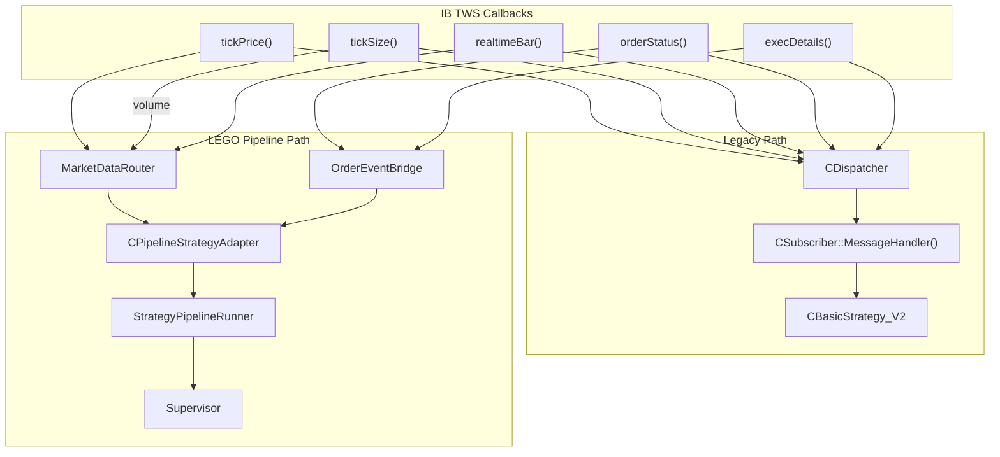

### Data Contracts (`Q_GADGET` Types)

All data flowing through the pipeline uses typed, serializable Qt value types defined in `Pipeline/Contracts.h`:

| Contract | Purpose | Key Fields |
|----------|---------|------------|
| `Signal` | Alpha block output | `symbol`, `confidence`, `direction` (Buy/Sell/Hold), `correlationId` |
| `TargetPosition` | Rebalance output | `symbol`, `targetQuantity`, `currentQuantity`, `reason` |
| `ExecutionIntent` | Risk-approved order | `symbol`, `quantity` (signed), `orderType` (Market/Limit/Stop) |
| `MarketTick` | Router output | `symbol`, `bid`, `ask`, `volume`, `timestamp` |

### Block Interfaces

Each pipeline stage has a pure interface. Blocks are composable -- swap any implementation without changing the rest:

```mermaid
flowchart LR
    subgraph Pipeline[LEGO Pipeline Stages]
        direction LR
        Selection["ISelectionBlock<br/>Asset Filter"]
        Alpha["IAlphaBlock<br/>Signal Generation"]
        Merge["ISignalMergePolicy<br/>Multi-Alpha Merge"]
        Rebalance["IRebalanceBlock<br/>Target Positions"]
        Risk["IRiskBlock<br/>Position Limits"]
        Execution["IExecutionBlock<br/>Order Placement"]
    end

    MarketTick["MarketTick"] --> Selection
    Selection -->|"filtered symbols"| Alpha
    Alpha -->|"Signal[]"| Merge
    Merge -->|"Signal[]"| Rebalance
    Rebalance -->|"TargetPosition[]"| Risk
    Risk -->|"ExecutionIntent[]"| Execution
    Execution -->|"IOrderExecutionPort"| Broker["IB TWS"]
```

| Interface | File | Concrete Blocks |
|-----------|------|-----------------|
| `ISelectionBlock` | `Pipeline/ISelectionBlock.h` | `PassAllSelectionBlock` |
| `IAlphaBlock` | `Pipeline/IAlphaBlock.h` | `MomentumAlphaBlock`, `MeanReversionAlphaBlock` |
| `ISignalMergePolicy` | `Pipeline/ISignalMergePolicy.h` | `FirstWinsMerge`, `WeightedVoteMerge`, `UnanimousMerge` |
| `IRebalanceBlock` | `Pipeline/IRebalanceBlock.h` | `SimpleRebalanceBlock` |
| `IRiskBlock` | `Pipeline/IRiskBlock.h` | `MaxPositionRiskBlock` |
| `IExecutionBlock` | `Pipeline/IExecutionBlock.h` | `MarketOrderExecutionBlock` |

### Ports and Adapters (Hexagonal Architecture)

The pipeline never talks directly to IB. Two **port interfaces** define the boundary:

```mermaid
flowchart LR
    subgraph Pipeline[Pipeline Core]
        ExecBlock["MarketOrderExecutionBlock"]
        PosQuery["Pipeline needs positions"]
    end

    subgraph Ports[Port Interfaces]
        IExec["IOrderExecutionPort"]
        IPos["IPositionRepositoryPort"]
    end

    subgraph Adapters[Adapters]
        IBExec["IBOrderExecutionAdapter<br/>(live orders)"]
        MockExec["MockExecutionAdapter<br/>(dry-run)"]
        MockPos["MockPositionRepository"]
        SqlPos["SqlitePositionRepository"]
    end

    ExecBlock --> IExec
    PosQuery --> IPos
    IExec --> IBExec
    IExec --> MockExec
    IPos --> MockPos
    IPos --> SqlPos

    IBExec -->|"reqPlaceOrderAPI()"| IB["IB TWS"]
```

| Port | Purpose | Live Adapter | Mock Adapter |
|------|---------|-------------|-------------|
| `IOrderExecutionPort` | Place/cancel orders, get status | `IBOrderExecutionAdapter` | `MockExecutionAdapter` |
| `IPositionRepositoryPort` | Query/update positions | `SqlitePositionRepository` | `MockPositionRepository` |

### MarketDataRouter

`MarketDataRouter` is the Qt-native replacement for `CDispatcher` for market data. It lives in `IBComm/MarketDataRouter.h`:

- **Input**: Called from `IBComClientImpl::tickPrice()`, `tickSize()`, and `realtimeBar()` callbacks
- **Output**: Emits typed Qt signals: `tick(MarketTick)`, `barClose(symbol, timestamp)`, `tickSizeUpdate(symbol, volume)`
- **Cache**: Maintains `m_lastPriceCache` for last-known prices per symbol
- **Thread safety**: Signals are delivered via `Qt::QueuedConnection` to strategy threads

### OrderEventBridge

`OrderEventBridge` (`Adapters/OrderEventBridge.h`) relays IB order callbacks to the pipeline's execution adapter:

- `IBComClientImpl::orderStatus()` --> `bridge.onOrderStatus()` --> `IBOrderExecutionAdapter::updateOrderStatus()`
- `IBComClientImpl::execDetails()` --> `bridge.onExecDetails()` --> `IBOrderExecutionAdapter::updateOrderStatus()`

This keeps `IBOrderExecutionAdapter` free of QObject overhead while providing thread-safe delivery.

### CPipelineStrategyAdapter (UI Bridge)

`CPipelineStrategyAdapter` (`Strategies/Generic/cpipelinestrategyadapter.h`) bridges the LEGO pipeline into the legacy `CGenericModelApi` tree. It inherits `CBaseModel` so it can appear in the portfolio tree alongside legacy strategies:

| CGenericModelApi Method | CPipelineStrategyAdapter Behavior |
|------------------------|----------------------------------|
| `modelType()` | Returns `STRATEGY_PIPELINE` |
| `getParameters()` | Flattens pipeline JSON config into `QVariantMap` |
| `setParameters()` | Updates pipeline config from edited `QVariantMap` |
| `start()` | Creates `StrategyRuntime` via `PipelineFactory`, wires to `MarketDataRouter` + `Supervisor` |
| `stop()` | Removes runtime from Supervisor |
| `toJson()` / `fromJson()` | Standard fields + `"pipelineConfig"` JSON object |
| `genericInfo()` | Runtime stats: pipeline runs, uptime, healthy status, execution mode |

**Execution Mode**: Each pipeline strategy has a `DryRun`/`Live` toggle (default: `DryRun`). In `DryRun`, orders go to `MockExecutionAdapter`. In `Live`, orders go to `IBOrderExecutionAdapter` via the global ports. Users toggle this from the tree parameter editor.

### Pipeline Factory

`PipelineFactory` (`Pipeline/PipelineFactory.h`) creates `BlockGraph` and `StrategyRuntime` instances from JSON config:

```cpp
// Build a block graph from JSON configuration
static BlockGraph buildGraph(const QJsonObject& config);

// Create a complete StrategyRuntime wired to MarketDataRouter
static StrategyRuntime* createRuntime(
    const QString& name,
    const QJsonObject& config,
    IOrderExecutionPort* execPort,
    IPositionRepositoryPort* posRepo,
    MarketDataRouter* router);
```

Uses `BlockRegistry` for block ID lookup and `BlockGraphSerializer` for JSON deserialization.

### Supervision Layer

The `Supervisor` (`Supervision/Supervisor.h`) manages the lifecycle of all running pipeline strategies:

```mermaid
flowchart TD
    SUP["Supervisor<br/>(QTimer: 10s health checks)"]

    RT1["StrategyRuntime<br/>SimpleMomentum"]
    RT2["StrategyRuntime<br/>DualAlpha"]

    BQ1["BoundedQueue<br/>(tick buffer)"]
    BQ2["BoundedQueue<br/>(tick buffer)"]

    SPR1["StrategyPipelineRunner"]
    SPR2["StrategyPipelineRunner"]

    SUP --> RT1
    SUP --> RT2
    RT1 --> BQ1
    RT1 --> SPR1
    RT2 --> BQ2
    RT2 --> SPR2
```

| Component | Role |
|-----------|------|
| `Supervisor` | Periodic health checks, restart crashed runtimes per `RestartPolicy` |
| `StrategyRuntime` | Owns a `BoundedQueue` + `StrategyPipelineRunner`, runs on its own thread |
| `BoundedQueue` | Lock-free tick buffer between MarketDataRouter and the pipeline thread |
| `StrategyPipelineRunner` | Executes the block graph: Selection -> Alpha -> Merge -> Rebalance -> Risk -> Execution |

### Observability

| Component | File | Purpose |
|-----------|------|---------|
| `StructuredLogger` | `Logging/StructuredLogger.h` | JSON-line structured logging with correlation IDs |
| `MetricsCollector` | `Metrics/MetricsCollector.h` | Counters/gauges for ticks processed, orders placed, latency p99 |

### Default Pipeline Configs

Two pre-built pipeline JSON configs are available in `Strategies/DefaultPipelines/`:

**`simple_momentum_pipeline.json`**: Single alpha (MomentumAlphaBlock, period=20, threshold=0.02), MaxPositionRiskBlock, MarketOrderExecutionBlock.

**`dual_alpha_pipeline.json`**: Two alphas (Momentum + MeanReversion) merged via WeightedVoteMerge, same risk/execution stack.

### Application Wiring

`CApplicationController` creates and wires all pipeline infrastructure at startup:

```cpp
// 1. Supervisor for runtime lifecycle
m_pSupervisor = new Supervision::Supervisor(this);
m_pSupervisor->startMonitoring(10000);

// 2. MarketDataRouter (created in CPresenter, wired to IBComClientImpl)
CPipelineStrategyAdapter::setGlobalRouter(pMainPresenter->marketDataRouter());
CPipelineStrategyAdapter::setGlobalSupervisor(m_pSupervisor);

// 3. Live execution adapter
m_pExecutionAdapter = new IBOrderExecutionAdapter(brokerApi);
m_pOrderEventBridge = new OrderEventBridge(m_pExecutionAdapter, this);
implClient->setOrderEventBridge(m_pOrderEventBridge);

// 4. Global ports for pipeline strategies
CPipelineStrategyAdapter::setGlobalExecutionPort(m_pExecutionAdapter);
CPipelineStrategyAdapter::setGlobalPositionRepo(&m_positionRepo);
```

### UI Integration

The tree view context menu has "Add Pipeline Strategy (LEGO)" alongside the legacy "Add New Strategy". When clicked:

1. `CPortfolioConfigModel::slotOnClickAddPipelineStrategy()` creates a `CPipelineStrategyAdapter` via `CStrategyFactory`
2. The adapter loads `simple_momentum_pipeline.json` as default config
3. The tree displays the pipeline's parameters (flattened from JSON) and info (runtime stats)
4. Users edit parameters (block configs, execution mode) directly in the tree
5. `PM_ITEM_PIPELINE_STRATEGY` is recognized in all tree operations (edit, remove, lookup, refresh)

### Test Coverage

The pipeline has **264 tests** across 17 test suites organized by phase:

| Phase | Suite | Tests | Focus |
|-------|-------|-------|-------|
| 1 | Contracts, MergePolicies, MarketDataRouter, BlockInterfaces, Expected, Scope | 69 | Core types and interfaces |
| 2 | Replay, Adapters, Integration | 44 | Adapters, replay, integration harness |
| 3 | BlockRegistry, PipelineRunner | 29 | Block registry, pipeline orchestration |
| 4 | Supervision | 20 | Supervisor, StrategyRuntime, BoundedQueue |
| 5 | Observability | 27 | StructuredLogger, MetricsCollector |
| 6 | Benchmark | 14 | Throughput, latency p99, queue depth |
| Integration | DefaultPipelines, PipelineStrategyAdapter, LiveExecutionWiring | 40 | End-to-end: factory, adapter, execution, UI bridge |

### Directory Structure (Pipeline Components)

```
IbTradeQt/
├── Pipeline/                    # Core pipeline framework
│   ├── Contracts.h              # Q_GADGET data types (Signal, TargetPosition, ExecutionIntent)
│   ├── Scope.h                  # Pipeline scope / context
│   ├── IAlphaBlock.h            # Alpha block interface
│   ├── ISelectionBlock.h        # Selection block interface
│   ├── IRebalanceBlock.h        # Rebalance block interface
│   ├── IRiskBlock.h             # Risk block interface
│   ├── IExecutionBlock.h        # Execution block interface
│   ├── ISignalMergePolicy.h     # Multi-alpha merge interface
│   ├── BlockRegistry.h          # Block ID → factory registry
│   ├── BlockGraphSerializer.h   # JSON <-> BlockGraph serialization
│   ├── StrategyPipelineRunner.h # Orchestrates one pipeline run
│   └── PipelineFactory.h        # Creates BlockGraph + StrategyRuntime from JSON
│
├── Blocks/                      # Concrete block implementations
│   ├── MomentumAlphaBlock.h     # Momentum alpha (period, threshold)
│   ├── MeanReversionAlphaBlock.h # Mean reversion alpha (window, stdDevThreshold)
│   ├── MaxPositionRiskBlock.h   # Max position size risk filter
│   └── MarketOrderExecutionBlock.h # Market order execution via IOrderExecutionPort
│
├── Ports/                       # Hexagonal architecture port interfaces
│   ├── IOrderExecutionPort.h    # Order placement/cancellation port
│   └── IPositionRepositoryPort.h # Position query/update port
│
├── Adapters/                    # Port adapters (live + mock)
│   ├── IBOrderExecutionAdapter.h # Live: calls IBrokerAPI::reqPlaceOrderAPI()
│   ├── MockExecutionAdapter.h   # Mock: records orders for testing
│   ├── MockPositionRepository.h # Mock: in-memory positions
│   ├── SqlitePositionRepository.h # Persistent: SQLite positions
│   ├── OrderEventBridge.h       # Relays IB orderStatus/execDetails to adapter
│   ├── AlphaModelAdapter.h      # Wraps legacy CBasicAlphaModel as IAlphaBlock
│   ├── RiskModelAdapter.h       # Wraps legacy CBasicRiskModel as IRiskBlock
│   └── ExecutionModelAdapter.h  # Wraps legacy CBasicExecutionModel as IExecutionBlock
│
├── Supervision/                 # Runtime lifecycle management
│   ├── Supervisor.h             # Health checks, restart policies
│   ├── StrategyRuntime.h        # Per-strategy thread + queue + runner
│   └── BoundedQueue.h           # Lock-free tick buffer
│
├── Logging/                     # Structured logging
│   └── StructuredLogger.h       # JSON-line logger with correlation IDs
│
├── Metrics/                     # Operational metrics
│   └── MetricsCollector.h       # Counters, gauges, snapshots
│
├── Replay/                      # Deterministic replay
│   ├── MarketDataRecorder.h     # Records ticks to file
│   └── MarketDataReplayer.h     # Replays ticks from file
│
├── Testing/                     # Test infrastructure
│   ├── MockMarketDataRouter.h   # Synchronous mock router for unit tests
│   └── IntegrationTestHarness.h # Wires complete pipeline for integration tests
│
├── Plugin/                      # Dynamic block loading
│   ├── BlockPlugin.h            # Plugin interface
│   └── PluginLoader.h           # QLibrary-based loader
│
├── Strategies/
│   ├── DefaultPipelines/        # Pre-built pipeline JSON configs
│   │   ├── simple_momentum_pipeline.json
│   │   └── dual_alpha_pipeline.json
│   └── Generic/
│       └── cpipelinestrategyadapter.h  # Bridges LEGO pipeline into CGenericModelApi tree
│
└── tests/
    └── integration/
        ├── tst_default_pipelines.h         # Default pipeline end-to-end tests
        ├── tst_pipeline_strategy_adapter.h  # Adapter config/lifecycle tests
        └── tst_live_execution_wiring.h      # Live execution, OrderEventBridge, tickSize tests
```

---

## Appendix: File Organization

### Complete Module Breakdown

**MainSystem/** - Application Core (8 files)
- Application controller, presenter, main view
- Portfolio and settings models
- Tree view management
- Icon handling

**IBComm/** - IB Communication (6 files)
- Broker API implementation
- Message dispatcher
- Worker thread management
- Data provider facade

**Strategies/** - Strategy Framework (30+ files)
- Generic base classes and interfaces
- Concrete strategy implementations
- Sub-model implementations (Selection, Alpha, Risk, etc.)
- State machine implementation

**DB/** - Database Layer (6 files)
- Database manager and handler
- Query definitions and data structures
- Thread management

**CObjects/** - Data Objects (8+ files)
- Market data structures
- Order and execution objects
- Account summary objects

**Common/** - Utilities (4 files)
- Processing base class
- Global definitions
- Helper functions

**ReqManager/** - Request Management (3 files)
- Request ID allocation
- Request type definitions
- Global request manager

**Logger/** - Logging (2 files)
- Custom logger implementation
- Category definitions

**CustomWidgets/** - Custom UI (2+ files)
- Candlestick chart widget
- Line chart widget

**Brokers/IB/** - IB SDK (50+ files)
- TWS API C++ client library
- Helper classes and samples

**GeneratedIncludes/** - Generated UI Headers
- Auto-generated from `.ui` files
- Not manually edited

---

*This architecture documentation provides a comprehensive overview of the IbTradeQt trading system. For issues and improvement suggestions, see [ISSUES_AND_IMPROVEMENTS.md](ISSUES_AND_IMPROVEMENTS.md).*
