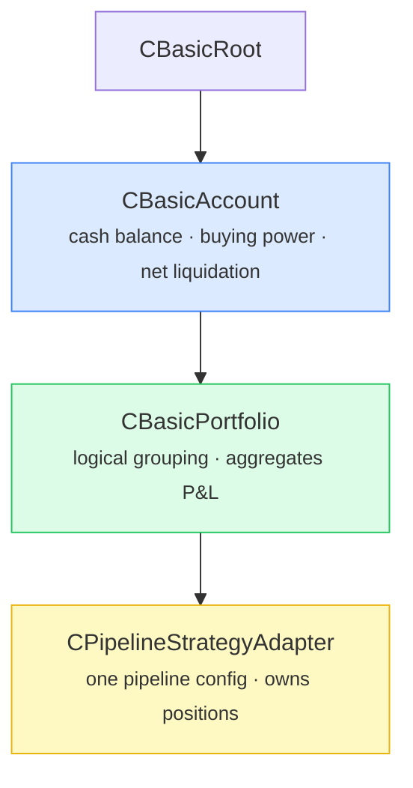
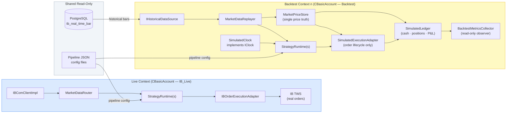
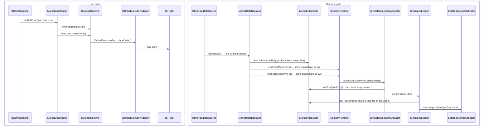
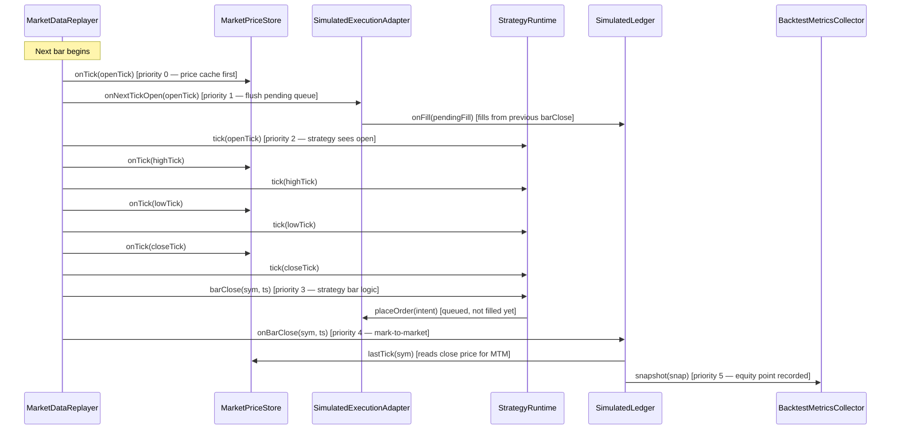

# Backtester Design — Isolated, Parallel-to-Live

**Status:** Design proposal  
**Target:** Run one or more backtest sessions in parallel with live broker trading, fully isolated, sharing no mutable state.

---

## Table of Contents

1. [Motivation and Goals](#1-motivation-and-goals)
2. [Backtest Scope — Strategy, Portfolio, or Account?](#2-backtest-scope--strategy-portfolio-or-account)
3. [One Broker per Account — Architecture Decision](#3-one-broker-per-account--architecture-decision)
4. [Current State — What Already Exists](#4-current-state--what-already-exists)
5. [The Core Problem — Static Globals in CPipelineStrategyAdapter](#5-the-core-problem--static-globals-in-cpipelinestrategyadapter)
6. [Proposed Architecture](#6-proposed-architecture)
7. [New Components to Build](#7-new-components-to-build)
8. [Data Flow — Live vs Backtest Side by Side](#8-data-flow--live-vs-backtest-side-by-side)
9. [Clock Abstraction — IClock Interface](#9-clock-abstraction--iclock-interface)
10. [Fill Model and Timing](#10-fill-model-and-timing)
11. [Historical Data Sources](#11-historical-data-sources)
12. [Performance Metrics](#12-performance-metrics)
13. [UI Integration](#13-ui-integration)
14. [Implementation Roadmap](#14-implementation-roadmap)
15. [File Map — New Files vs Modified Files](#15-file-map--new-files-vs-modified-files)
16. [Determinism and Event Ordering](#16-determinism-and-event-ordering)

---

## 1. Motivation and Goals

The pipeline strategy system is already broker-agnostic at the strategy level. The goal of this design is to:

- Run a full backtest of any pipeline strategy config against historical data **while live trading continues uninterrupted**.
- Keep the backtester **completely isolated** — it owns its own market data source, execution adapter, position repository, clock, and supervisor.
- Reuse 100% of the existing pipeline block code (alpha blocks, risk blocks, execution blocks) without modification.
- Produce a structured performance report (P&L curve, trade log, Sharpe, drawdown) at the end of the run.
- Allow multiple concurrent backtest sessions (e.g., parameter sweep).

**Non-goals for v1:**
- Order book simulation / market impact modeling.
- Transaction cost modelling beyond slippage bps (commissions, fees, borrow costs — fields reserved in `BacktestResult` but not computed).
- Options-specific P&L (multiplier, expiry settlement) — `InstrumentSpec` field stubbed in `ExecutionIntent` for future use.

---

## 2. Backtest Scope — Strategy, Portfolio, or Account?

The tree hierarchy in this codebase has four meaningful levels:



All three levels make sense as backtest targets, but they mean different things:

### Strategy-level backtest (v1 target)

Backtest a single `CPipelineStrategyAdapter` pipeline config in isolation.

- **Capital:** fixed initial capital injected into `BacktestSession` (e.g. $100k).
- **Positions:** tracked by `MockPositionRepository` scoped to that one strategy.
- **Orders:** routed through `SimulatedExecutionAdapter` — no interaction with other strategies.
- **Use case:** "Does this alpha block + risk model combination make money on AAPL/MSFT over 2024?"
- **Effort:** this is what the rest of this document describes.

### Portfolio-level backtest (v2)

Backtest all strategies under a `CBasicPortfolio` simultaneously, with a **shared capital pool**.

- **Capital:** one `BacktestCapitalPool` owned by the portfolio session, shared across child strategy sessions.
- **Positions:** each strategy has its own `MockPositionRepository`, but the capital pool enforces that total allocation cannot exceed the portfolio's starting capital.
- **Orders:** each strategy's `SimulatedExecutionAdapter` deducts from / returns to the shared pool on fill.
- **Use case:** "How does my three-strategy portfolio perform together? Do they over-concentrate in NVDA?"
- **Effort:** medium — requires a `BacktestCapitalPool` class and coordination between per-strategy sessions.

### Account-level backtest (v3)

Backtest all portfolios under a `CBasicAccount`, simulating the full account including buying power constraints, margin, and cross-portfolio netting.

- **Capital:** mirrors the real `CBasicAccount` fields: cash balance, buying power, net liquidation.
- **Positions:** aggregated across all portfolios, with margin calculations.
- **Use case:** "Would my account have been margin-called in March 2020?"
- **Effort:** hard — requires simulating broker margin rules, which are broker-specific.

### Decision

**v1 implements strategy-level backtest.** The `BacktestSession` API is designed so that v2 (portfolio) can wrap multiple `BacktestSession` instances with a shared `BacktestCapitalPool` without changing the strategy-level code. v3 is deferred — it requires broker-specific margin simulation that is out of scope.

The UI exposes backtest at all three levels (right-click on account, portfolio, or strategy node), but v1 only fully implements the strategy path. Portfolio and account nodes show a "Backtest (coming soon)" placeholder.

---

## 3. One Broker per Account — Architecture Decision

### Current state

`CApplicationController` creates a **single** `IBComClientImpl` and propagates it down the entire tree via `setBrokerDataProvider()`. Every account, portfolio, and strategy shares one broker connection object. This works for a single IB account but is architecturally incorrect for multi-account or multi-broker scenarios.

### Proposed rule: one broker connection per `CBasicAccount`

Each `CBasicAccount` should own its broker connection, not the application controller. The account knows its `BrokerType` and `ConnectionProfileRef` (these are already mandatory parameters on `CBasicAccount`). It should use them to create and own its connection.

```mermaid
graph TD
    subgraph Live["CBasicAccount — IB_Live (port 4001)"]
        L1["IBComClientImpl"]
        L2["MarketDataRouter\nOrderRouter\nPositionRouter"]
        L3["IBOrderExecutionAdapter"]
        L4["IBPositionRepositoryAdapter"]
        L1 --> L2
        L2 --> L3
        L2 --> L4
    end

    subgraph Paper["CBasicAccount — IB_Paper (port 7497)"]
        P1["IBComClientImpl"]
        P2["MarketDataRouter\nOrderRouter\nPositionRouter"]
        P3["IBOrderExecutionAdapter"]
        P1 --> P2
        P2 --> P3
    end

    subgraph BT["CBasicAccount — Backtest_2024"]
        B1["IHistoricalDataSource\n(PostgreSQL / CSV / IB / Yahoo / JSONL)"]
        B2["MarketDataReplayer"]
        B3["SimulatedExecutionAdapter\n(order lifecycle)"]
        B4["MarketPriceStore\n(single price truth)"]
        B5["SimulatedLedger\n(cash · positions · P&L)"]
        B6["BacktestMetricsCollector\n(read-only observer)"]
        B1 --> B2
        B2 --> B4
        B4 --> B3
        B4 --> B5
        B3 --> B5
        B5 --> B6
    end

    style Live fill:#dbeafe,stroke:#3b82f6
    style Paper fill:#dcfce7,stroke:#22c55e
    style BT fill:#fef9c3,stroke:#eab308
```



### What this means for the backtester

A **backtest account** is just a `CBasicAccount` with `BrokerType = "Backtest"`. It creates no real broker connection. Instead it creates a `BacktestSession` and wires the simulated ports into its child strategies. This is the cleanest integration point — the rest of the tree (portfolio, strategy) is completely unaware of whether the account is live or simulated.

> **Important:** `CBasicAccount` with `BrokerType = "Backtest"` is a **UI convenience** — it lets the user manage backtest sessions in the same tree as live accounts. The domain model treats it as a `SimulatedEnvironment`, not a real account. These two concepts must not be conflated in code.
>
> The static-global fallback in `CPipelineStrategyAdapter` **must never be silently used in backtest mode**. If a backtest strategy starts without injected dependencies, it must fail loudly:
> ```cpp
> // In CPipelineStrategyAdapter::start(), backtest path:
> Q_ASSERT_X(m_useInjectedContext,
>     "CPipelineStrategyAdapter::start",
>     "Backtest mode requires injected context — static globals must not be used");
> ```

### Migration path (not breaking the current single-broker setup)

The current `CApplicationController` single-broker wiring stays intact for now. The per-account broker ownership is introduced as an **opt-in** path:

1. Add `BrokerContext` struct to `CBasicAccount` (owns the connection + adapters).
2. `CApplicationController` can either inject a shared `BrokerContext` (current behavior) or let each account create its own (new behavior, activated when `BrokerType` is set per account).
3. The backtest account always creates its own `BrokerContext` — it never uses the shared one.

This means the live trading path is not broken by this change. The two modes coexist until a future refactor completes the migration.

### Summary

| Scenario | Broker wiring |
|----------|--------------|
| Single IB account (current) | One shared `IBComClientImpl` in `CApplicationController` — unchanged |
| Multiple live IB accounts | Each `CBasicAccount` owns its `IBComClientImpl` (future refactor) |
| Live + backtest in parallel | Live account uses shared `IBComClientImpl`; backtest account uses `BacktestSession` — **this is what we implement** |
| Paper trading alongside live | Two `CBasicAccount` nodes, each with their own `IBComClientImpl` on different ports (future) |

---

## 4. Current State — What Already Exists

The codebase already provides most of the building blocks:

| Component | File | Role in Backtester |
|-----------|------|--------------------|
| `MarketDataReplayer` | `Replay/MarketDataReplayer.h` | Emits `tick`, `barClose`, and `tickByTick` signals — identical to `MarketDataRouter`. Needs `addBar()`, `addTick()`, `addBarClose()`, `addTickByTick()` methods for programmatic population by data sources. |
| `MockExecutionAdapter` | `Adapters/MockExecutionAdapter.h` | Implements `IOrderExecutionPort`. Records all placed orders. Marks them instantly filled. Needs a fill model upgrade. |
| `MockPositionRepository` | `Adapters/MockPositionRepository.h` | Implements `IPositionRepositoryPort`. In-memory position tracking. Ready to use. |
| `IOrderExecutionPort` | `Ports/IOrderExecutionPort.h` | The clean order interface. Pipeline strategies call only this — no broker knowledge. |
| `IPositionRepositoryPort` | `Ports/IPositionRepositoryPort.h` | The clean position query interface. |
| `PipelineFactory::createRuntime` | `Pipeline/PipelineFactory.h` | Creates a `StrategyRuntime` from a JSON config + injected ports. Accepts optional `IClock*` (defaults to `WallClock`). No broker dependency. |
| `Supervisor` | `Supervision/Supervisor.h` | Manages strategy lifecycle. Can host backtest runtimes independently. |
| `MarketDataRecorder` | `Replay/MarketDataRecorder.h` | Records live sessions to JSONL for replay. |

**What is missing:**
- A historical data loader (reads from PostgreSQL `tb_real_time_bar`, CSV, IB API, or Yahoo Finance).
- An `IClock` interface injectable into alpha blocks (they currently call `QDateTime::currentDateTime()`).
- A realistic fill model in `MockExecutionAdapter` (currently instant-fill at mid-price).
- A `BacktestSession` orchestrator class.
- A `SimulatedLedger` as single owner of cash, positions, and P&L state during backtest.
- A `BacktestMetricsCollector` (read-only observer) that derives Sharpe, drawdown, equity curve from ledger snapshots.
- A `MarketPriceStore` as single price truth shared by the fill model and ledger.
- Per-instance dependency injection in `CPipelineStrategyAdapter` (currently uses static globals).

---

## 5. The Core Problem — Static Globals in CPipelineStrategyAdapter

The current `CPipelineStrategyAdapter` uses five static global pointers:

```cpp
// cpipelinestrategyadapter.h lines 269-273
static inline IBComm::MarketDataRouter* s_globalRouter = nullptr;
static inline Supervision::Supervisor*  s_globalSupervisor = nullptr;
static inline Ports::IOrderExecutionPort*       s_globalExecutionPort = nullptr;
static inline Ports::IPositionRepositoryPort*   s_globalPositionRepo = nullptr;
static inline Ports::IPositionRepositoryPort*   s_globalPersistentPositionRepo = nullptr;
```

This means all pipeline strategies share a single router, supervisor, and execution port. A backtest strategy added to the same adapter would either:
- Receive live market data (wrong), or
- Corrupt the live execution port by routing simulated orders through it (catastrophic).

**The fix** is to make `CPipelineStrategyAdapter` accept per-instance injected dependencies, while keeping the static globals as a convenience default for live strategies. This is a small, well-scoped change described in section 7.1.

---

## 6. Proposed Architecture



Each **backtest context** is a self-contained object graph. It has no shared mutable state with the live context or with other backtest contexts. `MarketPriceStore` is the single price cache — `SimulatedExecutionAdapter` and `SimulatedLedger` both read from it; neither maintains its own.

---

## 7. New Components to Build

### 7.1 Per-Instance Dependency Injection in `CPipelineStrategyAdapter`

**File:** `Strategies/Generic/cpipelinestrategyadapter.h` (modify)

Add an instance-level dependency injection method alongside the existing static setters:

```cpp
struct BacktestContext {
    IBComm::MarketDataRouter*          router   = nullptr;
    Supervision::Supervisor*           supervisor = nullptr;
    Ports::IOrderExecutionPort*        execPort = nullptr;
    Ports::IPositionRepositoryPort*    posRepo  = nullptr;
};

void injectBacktestContext(const BacktestContext& ctx) {
    m_injectedContext = ctx;
    m_useInjectedContext = true;
}
```

In `start()`, prefer `m_injectedContext` over the static globals when `m_useInjectedContext` is true. The live path is unchanged.

---

### 7.2 `BacktestSession`

**File:** `Backtest/BacktestSession.h` (new)

The orchestrator. Owns all backtest-specific objects and drives the replay loop.

```cpp
namespace Backtest {

struct BacktestConfig {
    QString            strategyConfigPath;  // path to pipeline JSON
    QDateTime          startDate;
    QDateTime          endDate;
    QStringList        symbols;
    BarResolution      resolution = BarResolution::Day1;
    double             initialCapital = 100'000.0;
    QString            dataSourceId;        // "postgres" | "csv" | "ib" | "yahoo" | "jsonl"
    QString            dataPath;            // file path or DB connection string (source-dependent)
    FillModelType      fillModel  = FillModelType::BidAsk;
    FillTiming         fillTiming = FillTiming::SignalOnClose_FillNextBarOpen; // safe default
    double             slippageBps = 1.0;   // basis points per side (used by SlippageBps model)
};

class BacktestSession : public QObject {
    Q_OBJECT
public:
    explicit BacktestSession(const BacktestConfig& config, QObject* parent = nullptr);

    // Optional: inject a live IBrokerAPI* for IB historical data source
    void setLiveBrokerApi(IBrokerAPI* api, IBComm::HistoricalDataRouter* router);

    // Preload-then-replay: all historical data is loaded into MarketDataReplayer
    // before the replay loop starts. This is not a streaming/live-feed model.
    // run() blocks until finished or cancelled; always call from a QThread.
    void run();
    void cancel();

    const BacktestResult& result() const;

signals:
    void progressChanged(int percent);
    void finished(const Backtest::BacktestResult& result);
    void failed(const QString& reason);

private:
    void buildObjectGraph();
    // loadHistoricalData() uses QEventLoop to handle both sync and async sources uniformly
    void loadHistoricalData();
    void driveReplayLoop();

    BacktestConfig                              m_config;
    std::unique_ptr<IHistoricalDataSource>      m_dataSource;
    std::unique_ptr<MarketDataReplayer>         m_replayer;
    std::unique_ptr<MarketPriceStore>           m_priceStore;
    std::unique_ptr<SimulatedClock>             m_clock;         // implements IClock
    std::unique_ptr<SimulatedExecutionAdapter>  m_execAdapter;
    std::unique_ptr<SimulatedLedger>            m_ledger;        // owns positions + cash
    std::unique_ptr<BacktestMetricsCollector>   m_metrics;       // read-only observer
    std::unique_ptr<Supervision::Supervisor>    m_supervisor;
    std::unique_ptr<CPipelineStrategyAdapter>   m_strategyAdapter;
    BacktestResult                              m_result;
    bool                                        m_cancelled = false;
    IBrokerAPI*                                 m_liveBrokerApi = nullptr;
    IBComm::HistoricalDataRouter*               m_liveHistRouter = nullptr;
};

} // namespace Backtest
```

---

### 7.3 `IHistoricalDataSource`

**File:** `Backtest/IHistoricalDataSource.h` (new)

A `QObject`-based interface with signals. All sources — synchronous (PostgreSQL, CSV, JSONL) and asynchronous (IB API, Yahoo Finance HTTP) — implement the same contract. `BacktestSession::loadHistoricalData()` uses a `QEventLoop` to wait for `loadFinished()`, making the session code identical regardless of source type.

`IBComm::HistoricalBar` (already defined in `IBComm/HistoricalDataRouter.h` with open, high, low, close, volume, timestamp, symbol) is the **canonical bar type** for all sources.

```cpp
namespace Backtest {

enum class BarResolution {
    Tick,    // real individual trades — JSONL and IB historical ticks only
    Sec5,    // 5-second bars — IB, PostgreSQL (if recorded at this resolution)
    Min1,
    Min5,
    Min15,
    Min30,
    Hour1,
    Day1     // Yahoo Finance maximum resolution
};

class IHistoricalDataSource : public QObject {
    Q_OBJECT
public:
    virtual ~IHistoricalDataSource() = default;

    // Non-blocking. Emits barLoaded/tickLoaded/tickByTickLoaded per event,
    // then loadFinished() or loadFailed().
    virtual void requestBars(const QStringList& symbols,
                             const QDateTime& from,
                             const QDateTime& to,
                             BarResolution resolution) = 0;

    virtual QString sourceId() const = 0;
    virtual bool requiresLiveBroker() const = 0;
    virtual bool supportsResolution(BarResolution r) const = 0;

signals:
    void barLoaded(const IBComm::HistoricalBar& bar);            // bar-level sources
    void tickLoaded(const IBComm::MarketTick& tick);             // tick sources (bid/ask)
    void tickByTickLoaded(const IBComm::TickByTickTrade& trade); // last-sale tick sources
    void loadFinished();
    void loadFailed(const QString& reason);
};

} // namespace Backtest
```

`BacktestSession::loadHistoricalData()` connects all three data signals to `MarketDataReplayer::addBar()`, `addTick()`, and `addTickByTick()` respectively, then calls `requestBars()` and spins a `QEventLoop` until `loadFinished` or `loadFailed`.

**Concrete implementations:**

| Class | File | Delivery | Requires broker | Max resolution | Limitations |
|-------|------|----------|-----------------|----------------|-------------|
| `PostgresHistoricalDataSource` | `Backtest/PostgresHistoricalDataSource.h` | Sync | No | Whatever was recorded | Only data recorded live |
| `CsvHistoricalDataSource` | `Backtest/CsvHistoricalDataSource.h` | Sync | No | Tick (if file has per-trade rows) | User must supply files |
| `JsonlHistoricalDataSource` | `Backtest/JsonlHistoricalDataSource.h` | Sync | No | Tick (exact recorded session) | Only recorded sessions |
| `IbHistoricalDataSource` | `Backtest/IbHistoricalDataSource.h` | Async | Yes (live `IBrokerAPI*`) | Tick (up to 30 days) | IB rate-limits ~60 req/10 min |
| `YahooFinanceDataSource` | `Backtest/YahooFinanceDataSource.h` | Async | No | Day1 only | Unofficial API; no intraday |

---

### 7.4 `IClock`, `WallClock`, `SimulatedClock`

**File:** `Common/IClock.h` (new)

A first-class clock interface. Alpha blocks that need the current time receive an `IClock*` via `IAlphaBlock::setClock()` rather than calling `QDateTime::currentDateTime()` directly. No thread-local state, no ambient globals.

```cpp
// Common/IClock.h

class IClock {
public:
    virtual ~IClock() = default;
    virtual QDateTime now() const = 0;
};

// Live path — returns wall clock time
class WallClock : public IClock {
public:
    QDateTime now() const override { return QDateTime::currentDateTime(); }
};

// Backtest path — time is advanced by BacktestSession replay loop
class SimulatedClock : public IClock {
public:
    void setCurrentTime(const QDateTime& t) { m_current = t; }
    QDateTime now() const override { return m_current; }
private:
    QDateTime m_current;
};
```

`IClock` is passed into `PipelineFactory::createRuntime()` as an optional parameter (defaults to a shared `WallClock` instance). The factory passes it to each alpha block via a new `setClock(IClock*)` method on `IAlphaBlock`:

```cpp
// Pipeline/IAlphaBlock.h — new method with default implementation
virtual void setClock(IClock* clock) { m_clock = clock; }
protected:
    IClock* m_clock = nullptr;  // nullptr → block uses QDateTime::currentDateTime()
```

The base implementation stores the pointer. Blocks that never call `m_clock->now()` are unaffected — the stored pointer is simply never used. Blocks that do need deterministic time replace `QDateTime::currentDateTime()` with `(m_clock ? m_clock->now() : QDateTime::currentDateTime())`. This is a one-line change per block and is backward compatible.

`BacktestSession` owns one `SimulatedClock` and advances it before each event:

```cpp
void BacktestSession::driveReplayLoop() {
    for (const auto& bar : m_replayer->events()) {
        m_clock->setCurrentTime(bar.timestamp);
        m_execAdapter->onNextTickOpen(bar.openTick);  // flush pending orders first
        emit m_replayer->tick(bar.openTick);
        // ... barClose events interleaved
    }
}
```

Two parallel backtest sessions each own their own `SimulatedClock` instance — no shared state, no thread-local tricks.

---

### 7.5 `SimulatedExecutionAdapter`

**File:** `Backtest/SimulatedExecutionAdapter.h` (new)

Responsible for order lifecycle only: accepting `ExecutionIntent`, computing fill price from `MarketPriceStore`, and notifying `SimulatedLedger`. Does **not** cache prices or track positions.

```cpp
namespace Backtest {

enum class FillModelType { Instant, MidPrice, BidAsk, SlippageBps };

enum class FillTiming {
    SignalOnClose_FillNextBarOpen,  // safe default — no look-ahead bias
    SignalOnTick_FillAtBidAsk,      // intrabar, fills at current bid/ask
    SignalOnClose_FillAtClose       // fills at close price — use only if intentional
};

class SimulatedExecutionAdapter : public Ports::IOrderExecutionPort {
    Q_OBJECT
public:
    explicit SimulatedExecutionAdapter(FillModelType model,
                                       double slippageBps,
                                       FillTiming timing,
                                       MarketPriceStore* priceStore,
                                       IClock* clock);

    Expected<Ports::OrderResult, Error> placeOrder(
        const Pipeline::ExecutionIntent& intent) override;

    Expected<void, Error> cancelOrder(int orderId) override;
    Expected<Ports::OrderResult, Error> getOrderStatus(int orderId) override;

    // Called by BacktestSession replay loop at the start of each new tick.
    // Flushes any pending orders queued during the previous barClose event.
    void onNextTickOpen(const IBComm::MarketTick& openTick);

    const QVector<FilledOrder>& filledOrders() const;

signals:
    void filled(const FilledOrder& fill);   // SimulatedLedger connects here

private:
    double computeFillPrice(const Pipeline::ExecutionIntent& intent,
                            const IBComm::MarketTick& tick) const;

    FillModelType               m_fillModel;
    double                      m_slippageBps;
    FillTiming                  m_fillTiming;
    MarketPriceStore*           m_priceStore;   // single price truth — no local cache
    IClock*                     m_clock;
    QVector<Pipeline::ExecutionIntent> m_pendingOrders; // queued during barClose
    QVector<FilledOrder>        m_filledOrders;
    QMap<int, FilledOrder>      m_orderById;
    int                         m_nextOrderId = 1;
};

} // namespace Backtest
```

**Fill price logic per model:**

| Model | Buy fill price | Sell fill price |
|-------|---------------|-----------------|
| `Instant` | `mid()` | `mid()` |
| `MidPrice` | `mid()` | `mid()` |
| `BidAsk` | `ask` | `bid` |
| `SlippageBps` | `ask * (1 + slippage)` | `bid * (1 - slippage)` |

---

### 7.6 `SimulatedLedger` — Single State Owner

**File:** `Backtest/SimulatedLedger.h` (new)

The single source of truth for all mutable financial state during a backtest: cash, positions, average cost, realized P&L, and unrealized P&L. No other component may independently track these values.

`SimulatedLedger` also implements `IPositionRepositoryPort` so that pipeline risk blocks can query it directly — replacing `MockPositionRepository` in the backtest path.

```cpp
namespace Backtest {

class SimulatedLedger : public QObject, public Ports::IPositionRepositoryPort {
    Q_OBJECT
public:
    explicit SimulatedLedger(double initialCapital,
                             MarketPriceStore* priceStore,
                             QObject* parent = nullptr);

    // IPositionRepositoryPort — read side used by pipeline risk blocks
    Expected<Ports::PositionRow, Error> getPosition(
        int strategyId, const QString& symbol) override;
    Expected<QVector<Ports::PositionRow>, Error> getAllPositions(
        int strategyId) override;

    // updatePosition() is intentionally unsupported in backtest mode.
    // Position state must only change through fills (onFill) to preserve
    // the single-owner invariant. Any call will Q_ASSERT and return an error.
    Expected<void, Error> updatePosition(
        const Ports::PositionRow& position) override;

    // Called by SimulatedExecutionAdapter on each fill
    void onFill(const FilledOrder& fill);

    // Called by BacktestSession replay loop at each bar boundary
    // Marks all positions to market and emits snapshot()
    void onBarClose(const QString& symbol, const QDateTime& ts);

    // State accessors
    double cash() const;
    double realizedPnl() const;
    double unrealizedPnl() const;   // mark-to-market via MarketPriceStore
    double portfolioValue() const;  // cash + unrealizedPnl

signals:
    // Emitted after each onBarClose() — BacktestMetricsCollector subscribes here
    void snapshot(const LedgerSnapshot& snap);

private:
    void applyFill(const FilledOrder& fill);

    double                          m_cash;
    double                          m_realizedPnl = 0.0;
    QMap<QString, Ports::PositionRow> m_positions; // symbol -> row
    MarketPriceStore*               m_priceStore;
};

} // namespace Backtest
```

**Ownership rules:**
- `SimulatedLedger` is the **only** component that writes to position state. Position transitions happen exclusively through `onFill()`.
- `SimulatedExecutionAdapter` calls `ledger->onFill()` after computing the fill price — it does not track positions itself.
- `MarketPriceStore` is injected; `SimulatedLedger` reads from it for mark-to-market but never writes to it.
- Pipeline risk blocks call `IPositionRepositoryPort::getPosition()` and `getAllPositions()` — they talk to `SimulatedLedger` directly via the port interface for reads.
- `IPositionRepositoryPort::updatePosition()` is **disabled** in backtest mode. The implementation calls `Q_ASSERT_X(false, ...)` and returns an error. This is intentional: allowing external callers to mutate positions would break the single-owner invariant and make state transitions untraceable. Corporate-action adjustments (splits, dividends) will be handled via a dedicated `applyAdjustment()` method on `SimulatedLedger` when needed, not through the generic port.

---

### 7.7 `BacktestMetricsCollector` — Read-Only Observer

**File:** `Backtest/BacktestMetricsCollector.h` (new)

A pure observer. Subscribes to `SimulatedLedger::snapshot()` and accumulates the equity curve. Computes all performance metrics only in `finalize()` — it never holds mutable business state.

```cpp
namespace Backtest {

struct LedgerSnapshot {
    QDateTime   timestamp;
    double      portfolioValue = 0.0;
    double      cash           = 0.0;
    double      unrealizedPnl  = 0.0;
    double      realizedPnl    = 0.0;
};

enum class DataQuality {
    RealTicks,          // tick-level source (JSONL, IB historical ticks)
    SynthesizedOHLC,    // bar-level source with 4-tick OHLC synthesis — indicative only
    DailyBars           // daily bar source (Yahoo Finance) — coarsest approximation
};

struct BacktestResult {
    QVector<FilledOrder>    tradeLog;
    QVector<LedgerSnapshot> equityCurve;
    double  totalReturn      = 0.0;
    double  annualizedReturn = 0.0;
    double  sharpeRatio      = 0.0;
    double  maxDrawdown      = 0.0;
    double  winRate          = 0.0;
    int     totalTrades      = 0;
    QDateTime startDate;
    QDateTime endDate;
    double  initialCapital   = 0.0;
    double  finalCapital     = 0.0;
    double  totalCommission  = 0.0;   // zero in v1, field reserved
    double  totalFees        = 0.0;   // zero in v1, field reserved
    DataQuality dataQuality  = DataQuality::SynthesizedOHLC; // shown in UI/report header
};

class BacktestMetricsCollector : public QObject {
    Q_OBJECT
public:
    explicit BacktestMetricsCollector(double initialCapital, QObject* parent = nullptr);

    BacktestResult finalize(const QDateTime& start, const QDateTime& end) const;

public slots:
    void onSnapshot(const LedgerSnapshot& snap);   // connected to SimulatedLedger::snapshot
    void onFill(const FilledOrder& fill);           // connected to SimulatedExecutionAdapter

private:
    double computeSharpe(const QVector<double>& dailyReturns) const;
    double computeMaxDrawdown(const QVector<LedgerSnapshot>& curve) const;

    double                      m_initialCapital;
    QVector<LedgerSnapshot>     m_equityCurve;
    QVector<FilledOrder>        m_trades;
};

} // namespace Backtest
```

**Key invariant:** `BacktestMetricsCollector` never writes to any position or cash state. It only reads snapshots emitted by `SimulatedLedger` and fill events emitted by `SimulatedExecutionAdapter`. If you need to know the current portfolio value mid-backtest, ask `SimulatedLedger`, not `BacktestMetricsCollector`.

---

### 7.8 `MarketPriceStore` — Single Price Truth

**File:** `Backtest/MarketPriceStore.h` (new)

Owns the last known bid/ask tick for every symbol seen during the backtest. Shared (by pointer) between `SimulatedExecutionAdapter` (fill price) and `SimulatedLedger` (mark-to-market). No other component caches prices independently.

```cpp
namespace Backtest {

class MarketPriceStore : public QObject {
    Q_OBJECT
public:
    explicit MarketPriceStore(QObject* parent = nullptr) : QObject(parent) {}

    IBComm::MarketTick lastTick(const QString& symbol) const {
        return m_cache.value(symbol);
    }
    bool hasTick(const QString& symbol) const {
        return m_cache.contains(symbol);
    }

public slots:
    void onTick(const IBComm::MarketTick& tick) {
        m_cache[tick.symbol] = tick;
    }

private:
    QMap<QString, IBComm::MarketTick> m_cache;
};

} // namespace Backtest
```

**Wiring in `BacktestSession::buildObjectGraph()`:**

```cpp
// MarketDataReplayer → MarketPriceStore (first, before StrategyRuntime)
connect(m_replayer.get(), &MarketDataReplayer::tick,
        m_priceStore.get(), &MarketPriceStore::onTick);

// MarketPriceStore injected into both consumers at construction
m_execAdapter  = std::make_unique<SimulatedExecutionAdapter>(
    m_config.fillModel, m_config.slippageBps,
    m_config.fillTiming, m_priceStore.get(), m_clock.get());

m_ledger = std::make_unique<SimulatedLedger>(
    m_config.initialCapital, m_priceStore.get());
```

---

## 8. Data Flow — Live vs Backtest Side by Side



The `StrategyRuntime`, alpha blocks, risk blocks, and execution blocks are **identical objects** in both paths. The only difference is what gets injected at construction time. `MarketPriceStore` is the single price truth — neither `SimulatedExecutionAdapter` nor `SimulatedLedger` maintains its own price cache.

---

## 9. Clock Abstraction — IClock Interface

Time is injected as a first-class dependency via `IClock`. There are no thread-local globals and no ambient helpers.

| Context | Clock used | How time advances |
|---------|-----------|-------------------|
| Live trading | `WallClock` | Returns `QDateTime::currentDateTime()` |
| Backtest | `SimulatedClock` | Advanced by `BacktestSession` before each event |
| Unit tests | `SimulatedClock` | Advanced manually by the test |

`PipelineFactory::createRuntime()` accepts an optional `IClock*` parameter. When `nullptr` is passed (live path), it creates and injects a shared `WallClock`. When a `SimulatedClock*` is passed (backtest path), all alpha blocks in that runtime use it.

Alpha blocks that need the current time call `m_clock->now()` where `m_clock` is set via `IAlphaBlock::setClock(IClock*)`. Blocks that never override `setClock()` are unaffected — they simply never call `m_clock`.

The `clockNow()` thread-local helper from the previous design is **removed**. The `SimulatedClock` thread-local singleton is **removed**.

---

## 10. Fill Model and Timing

### Fill price models

`SimulatedExecutionAdapter` computes fill price using `MarketPriceStore::lastTick(symbol)` — never a locally cached price. Fill price logic per model:

```cpp
double SimulatedExecutionAdapter::computeFillPrice(
    const Pipeline::ExecutionIntent& intent,
    const IBComm::MarketTick& tick) const
{
    bool isBuy = (intent.quantity > 0);
    switch (m_fillModel) {
    case FillModelType::Instant:
    case FillModelType::MidPrice:
        return tick.mid();
    case FillModelType::BidAsk:
        return isBuy ? tick.ask : tick.bid;
    case FillModelType::SlippageBps: {
        double base   = isBuy ? tick.ask : tick.bid;
        double factor = isBuy ? (1.0 + m_slippageBps / 10000.0)
                               : (1.0 - m_slippageBps / 10000.0);
        return base * factor;
    }
    }
    return tick.mid();
}
```

### Fill timing — preventing look-ahead bias

> **Warning — look-ahead bias:** A strategy that signals on `barClose` and fills using the same bar's close price is trading on information that only exists *after* the bar closes. This overstates results and is one of the most common backtesting errors. The `FillTiming` setting enforces the correct execution convention.

`FillTiming` is set in `BacktestConfig` and governs when queued orders are executed relative to the event that triggered them:

| `FillTiming` | When signal fires | When fill executes | Price used | Look-ahead risk |
|---|---|---|---|---|
| `SignalOnClose_FillNextBarOpen` | `barClose` event | Next `tick` (bar open) | Next bar's open bid/ask | None — **safe default** |
| `SignalOnTick_FillAtBidAsk` | `tick` event | Same `tick` | Current bid/ask | None — intrabar fill |
| `SignalOnClose_FillAtClose` | `barClose` event | Same bar close | Close-derived bid/ask | **Yes — use only if intentional** |

**Event ordering and the pending queue:**

When `FillTiming::SignalOnClose_FillNextBarOpen` is active, `SimulatedExecutionAdapter` queues orders placed during a `barClose` event and flushes them on the next `tick`:

```
Event sequence:
  tick(ts=09:30, open=185.00)   → flush pending queue (fill at 185.00 open)
  barClose(ts=09:30)            → strategy signals → placeOrder() → added to pending queue
  tick(ts=09:35, open=185.40)   → flush pending queue (fill at 185.40 open)
  barClose(ts=09:35)            → ...
```

`BacktestSession::driveReplayLoop()` calls `m_execAdapter->onNextTickOpen(tick)` at the start of each tick, before emitting the tick to the strategy. This guarantees the flush happens before any new signals can be generated for that tick.

---

## 11. Historical Data Sources

### Canonical bar type: `IBComm::HistoricalBar`

All sources produce `IBComm::HistoricalBar` (open, high, low, close, volume, timestamp, symbol). `MarketDataReplayer` receives bars via `addBar()` and synthesises events from them:

**OHLC tick synthesis** (for bar-level sources used with tick-sensitive strategies):

Each bar is expanded into four `MarketTick` events in this order, then a `barClose`:

```
tick(bid=ask=open)   → bar open price
tick(bid=ask=high)   → intrabar high (conservative for buy fills)
tick(bid=ask=low)    → intrabar low  (conservative for sell fills)
tick(bid=ask=close)  → bar close price
barClose(symbol, ts) → triggers strategy bar-close logic
```

> **Limitation — OHLC synthesis is an approximation only.**
>
> This technique is widely used in bar-level backtesting engines, but it has significant accuracy limits that must be understood before trusting results:
>
> - The intrabar tick sequence (open → high → low → close) is **assumed**, not real. The actual intrabar path is unknown from a bar alone.
> - Stop orders, limit orders, and any path-sensitive execution logic will produce **unreliable results** with synthesised ticks. A stop that would have been triggered mid-bar may or may not be triggered depending on the assumed OHLC sequence.
> - Strategies that react to individual bid/ask movements cannot be evaluated meaningfully from synthesised ticks.
> - Results produced from OHLC synthesis should be treated as **indicative only** and clearly labelled as such in the UI and report output (`BacktestResult::dataQuality = DataQuality::SynthesizedOHLC`).
>
> For reliable tick-sensitive evaluation, use a real tick source (JSONL recorded session or IB historical ticks).

The synthesis is configurable in `BacktestConfig` — it can be disabled for tick-level sources that provide real ticks.

### Source details

**PostgreSQL** — reads `tb_real_time_bar` synchronously:
```sql
SELECT symbol, timestamp, open, high, low, close, volume
FROM   tb_real_time_bar
WHERE  symbol = ANY(:symbols)
  AND  timestamp BETWEEN :from AND :to
ORDER  BY timestamp ASC;
```

**CSV** — standard OHLCV format. Tick-level CSV uses one row per trade:
```
symbol,timestamp,open,high,low,close,volume
AAPL,2025-01-02T09:30:00,185.00,186.50,184.80,186.20,1200000
```

**JSONL** — wraps `MarketDataReplayer::loadRecording()`. Supports real `MarketTick` and `TickByTickTrade` events as recorded by `MarketDataRecorder`. Best source for exact tick-level replay of a live session.

**IB historical data** — async. `IbHistoricalDataSource` receives an `IBrokerAPI*` and `HistoricalDataRouter*` at construction. Calls `reqHistoricalDataAPI()` per symbol for bars, or `reqHistoricalTicksAPI()` for tick resolution. Listens to `HistoricalDataRouter::barsReceived` and `historicalTicksLastReceived`. IB rate-limits historical requests to approximately 60 per 10 minutes — the source queues requests and emits `loadFinished()` only after all symbols complete.

**Yahoo Finance** — async HTTP. Uses `QNetworkAccessManager` to fetch:
```
https://query1.finance.yahoo.com/v8/finance/chart/{symbol}?interval=1d&range=...
```
Parses JSON response into `HistoricalBar` objects. Daily resolution only. No authentication required. This is an unofficial API and may change without notice — treat as best-effort.

### Tick-level backtest

`IAlphaBlock` already has three event slots (`onTick`, `onBarClose`, `onTickByTick`). A tick-level strategy uses `onTick` or `onTickByTick` and reacts to every price update. The backtester supports this by requesting `BarResolution::Tick` — no strategy code changes required.

| Source | Real ticks? | Notes |
|--------|------------|-------|
| JSONL | Yes | Exact recorded session — best option |
| IB historical | Yes (up to 30 days) | Via `reqHistoricalTicksAPI()` |
| PostgreSQL | Only if recorded at tick level | Depends on recording resolution |
| CSV | Yes if file has per-trade rows | User supplies data |
| Yahoo Finance | No | Daily bars only |

When a bar-level source is used with a tick-sensitive strategy, OHLC synthesis (four ticks per bar) provides reasonable approximation.

---

## 12. Performance Metrics

`BacktestMetricsCollector` is a **read-only observer** — it never writes to position or cash state. It subscribes to two signals:

- `SimulatedLedger::snapshot(LedgerSnapshot)` — emitted after each `barClose`; contains `portfolioValue`, `cash`, `unrealizedPnl`, `realizedPnl` at that point in time.
- `SimulatedExecutionAdapter::filled(FilledOrder)` — emitted on each fill.

`SimulatedLedger::onBarClose()` calls `MarketPriceStore::lastTick()` for each open position to compute mark-to-market value, then emits `snapshot()`. The metrics collector never touches prices directly.

Final metrics computed in `finalize()`:

| Metric | Formula | Source data |
|--------|---------|-------------|
| Total return | `(finalCapital - initialCapital) / initialCapital` | First and last `LedgerSnapshot` |
| Annualized return | `totalReturn ^ (252 / tradingDays) - 1` | Date range |
| Sharpe ratio | `mean(dailyReturns) / stddev(dailyReturns) * sqrt(252)` | Daily `portfolioValue` changes |
| Max drawdown | `max((peak - trough) / peak)` | Equity curve |
| Win rate | `winningTrades / totalTrades` | `FilledOrder` log |
| Total commission | Sum of `FilledOrder::commission` | Zero in v1 — field reserved |
| Total fees | Sum of `FilledOrder::fees` | Zero in v1 — field reserved |

`BacktestResult` carries `totalCommission` and `totalFees` fields (both zero in v1) so the struct's JSON serialisation format is stable and will not require a breaking change when transaction cost modelling is added.

---

## 13. UI Integration

### Entry points — right-click at any level of the tree

The context menu is extended at all three tree levels. In v1, only the strategy-level path is fully functional.

| Tree node | Context menu item | v1 behaviour |
|-----------|------------------|--------------|
| `CBasicAccount` | "Backtest account..." | Shows "coming in v2" dialog |
| `CBasicPortfolio` | "Backtest portfolio..." | Shows "coming in v2" dialog |
| `CPipelineStrategyAdapter` | "Backtest strategy..." | Opens `BacktestConfigDialog` (fully implemented) |

### Strategy-level backtest dialog

```
┌─────────────────────────────────────────┐
│  Run Backtest: "My Momentum Strategy"   │
├─────────────────────────────────────────┤
│  Start date:  [2024-01-01]              │
│  End date:    [2024-12-31]              │
│  Symbols:     [AAPL, MSFT, NVDA]        │
│  Data source: [PostgreSQL ▼]            │
│  Resolution:  [1 min ▼]                 │
│  Fill model:  [BidAsk ▼]               │
│  Fill timing: [Signal→NextBarOpen ▼]    │
│  Slippage:    [1.0] bps                 │
│  Capital:     [100,000]                 │
├─────────────────────────────────────────┤
│  [Cancel]              [Run Backtest]   │
└─────────────────────────────────────────┘
```

The dialog creates a `BacktestSession`, runs it in a `QThread`, and on `finished()` opens a `BacktestResultWidget` showing:
- **Data quality banner** — prominently displayed at the top of the result window. Shows `⚠ Synthesized OHLC bars — indicative only` when `DataQuality::SynthesizedOHLC`, or `✓ Real tick data` when `DataQuality::RealTicks`. This ensures users cannot miss the data quality caveat.
- Equity curve chart (Qt Charts)
- Trade log table (sortable `QTableView`)
- Summary metrics panel (total return, Sharpe, max drawdown, win rate)

### Live trading continues unaffected

The backtest runs in its own `QThread`. The live `MarketDataRouter`, `Supervisor`, and `IBOrderExecutionAdapter` are never touched. Multiple backtest sessions can run concurrently — each owns its own thread and object graph.

---

## 14. Implementation Roadmap

```mermaid
gantt
    title Implementation Phases
    dateFormat  D
    axisFormat  Phase %d

    section Phase 1 · Foundations
    IClock + WallClock + SimulatedClock    :p1a, 1, 0.5d
    setClock() on IAlphaBlock              :p1b, after p1a, 0.5d
    MarketPriceStore                       :p1c, after p1b, 0.5d
    SimulatedLedger                        :p1d, after p1c, 1d
    BacktestMetricsCollector               :p1e, after p1d, 1d
    SimulatedExecutionAdapter              :p1f, after p1e, 1d
    CPipelineStrategyAdapter DI refactor   :p1g, after p1f, 1d
    MarketDataReplayer new methods         :p1h, after p1g, 0.5d
    IHistoricalDataSource + JsonlSource    :p1i, after p1h, 0.5d
    BacktestSession orchestrator           :p1j, after p1i, 1d
    Unit tests                             :p1k, after p1j, 1d

    section Phase 2 · DB and IB Sources
    PostgresHistoricalDataSource           :p2a, after p1k, 1d
    IbHistoricalDataSource                 :p2b, after p2a, 1d
    Integration test                       :p2c, after p2b, 0.5d

    section Phase 3 · UI
    BacktestConfigDialog                   :p3a, after p2c, 1d
    BacktestResultWidget                   :p3b, after p3a, 1d
    Tree context menu wiring               :p3c, after p3b, 0.5d

    section Phase 4 · One Broker per Account
    BrokerContext struct in CBasicAccount  :p4a, after p3c, 1d
    CApplicationController opt-in path    :p4b, after p4a, 1d
    BrokerType=Backtest account            :p4c, after p4b, 1d

    section Phase 5 · Portfolio Backtest
    BacktestCapitalPool                    :p5a, after p4c, 1d
    PortfolioBacktestSession               :p5b, after p5a, 1d
    Portfolio UI                           :p5c, after p5b, 1d

    section Phase 6 · External Sources and Polish
    CsvHistoricalDataSource                :p6a, after p5c, 0.5d
    YahooFinanceDataSource                 :p6b, after p6a, 1d
    Export results to CSV                  :p6c, after p6b, 0.5d
```



### Phase 1 — Foundations (no UI, no DB) — ~4 days

Build the core state model and interfaces first, before the orchestrator. This order ensures `BacktestSession` is assembled from already-tested parts.

1. **`IClock` / `WallClock` / `SimulatedClock`** in `Common/IClock.h`. Add `setClock(IClock*)` to `IAlphaBlock`. *(~1h)*
2. **`MarketPriceStore`** — single price cache, `QObject` with `onTick` slot. *(~1h)*
3. **`SimulatedLedger`** — owns cash, positions, avg cost, realized P&L. Implements `IPositionRepositoryPort`. Emits `snapshot()` on bar close. *(~4h)*
4. **`BacktestMetricsCollector`** — read-only observer of `SimulatedLedger::snapshot`. Computes equity curve, Sharpe, drawdown, win rate in `finalize()`. `BacktestResult` struct includes `commission`/`fees` fields (zero in v1). *(~3h)*
5. **`SimulatedExecutionAdapter`** — order lifecycle, `FillModelType`, `FillTiming`, pending-order queue. Uses `MarketPriceStore*` for fill price. Emits `filled(FilledOrder)`. *(~3h)*
6. **Refactor `CPipelineStrategyAdapter`** — add `BacktestContext` struct, `injectBacktestContext()`, `ExecutionMode::Backtest`, `Q_ASSERT` guard. Static globals unchanged for live path. *(~2h)*
7. **Extend `MarketDataReplayer`** — add `addBar(HistoricalBar)` (with OHLC synthesis), `addTick()`, `addBarClose()`, `addTickByTick()`. Add `tickByTick` signal. *(~2h)*
8. **`IHistoricalDataSource`** interface + `JsonlHistoricalDataSource` (reuses existing JSONL format). *(~2h)*
9. **`BacktestSession`** orchestrator — `buildObjectGraph()`, `loadHistoricalData()` with `QEventLoop`, `driveReplayLoop()`. *(~3h)*
10. **Unit tests** — fill model, ledger accounting, metrics, full session with a JSONL fixture. *(~4h)*

### Phase 2 — Database and IB sources — ~2.5 days

11. **`PostgresHistoricalDataSource`** — reads `tb_real_time_bar`, emits `barLoaded`. *(~3h)*
12. **`IbHistoricalDataSource`** — async, wraps `IBrokerAPI*` + `HistoricalDataRouter*`, handles IB rate limiting, supports both bar and tick resolution. *(~5h)*
13. **Integration test** — full backtest against a month of recorded IB data. *(~2h)*

### Phase 3 — UI — ~2 days

14. **`BacktestConfigDialog`** — data source selector, date range, symbols, fill model, fill timing, capital. *(~3h)*
15. **`BacktestResultWidget`** — equity curve chart (Qt Charts), trade log table, metrics panel. *(~4h)*
16. **Wire into portfolio tree context menu** at all three levels (strategy: full; portfolio/account: placeholder). *(~2h)*

### Phase 4 — One broker per account — ~2 days

17. **`BrokerContext` struct in `CBasicAccount`** — owns `IBComClientImpl` + typed routers + adapters. *(~3h)*
18. **`CApplicationController` opt-in path** — per-account `BrokerContext` when `BrokerType` is set; shared connection otherwise. *(~3h)*
19. **`BrokerType = "Backtest"` account** — creates `BacktestSession` instead of `IBComClientImpl`. *(~3h)*

### Phase 5 — Portfolio-level backtest — ~2 days

20. **`BacktestCapitalPool`** — shared capital across multiple strategy sessions. *(~3h)*
21. **`PortfolioBacktestSession`** — wraps N `BacktestSession` instances. *(~3h)*
22. **Portfolio UI** — dialog and result aggregation. *(~3h)*

### Phase 6 — External sources and polish — ~2 days

23. **`CsvHistoricalDataSource`** — OHLCV CSV and tick-level CSV. *(~3h)*
24. **`YahooFinanceDataSource`** — daily bars via unofficial HTTP API. *(~3h)*
25. **Export results to CSV.** *(~1h)*

---

## 15. File Map — New Files vs Modified Files

### New files

```
Common/
  IClock.h                         — IClock interface + WallClock + SimulatedClock

Backtest/
  IHistoricalDataSource.h          — QObject-based interface with signals; BarResolution enum
  PostgresHistoricalDataSource.h   — reads tb_real_time_bar (sync)
  PostgresHistoricalDataSource.cpp
  CsvHistoricalDataSource.h        — reads OHLCV CSV and tick-level CSV (sync)
  CsvHistoricalDataSource.cpp
  JsonlHistoricalDataSource.h      — wraps MarketDataReplayer::loadRecording() (sync)
  IbHistoricalDataSource.h         — async, wraps IBrokerAPI* + HistoricalDataRouter*
  IbHistoricalDataSource.cpp
  YahooFinanceDataSource.h         — async HTTP, daily bars only
  YahooFinanceDataSource.cpp
  MarketPriceStore.h               — single price truth (last tick per symbol)
  SimulatedLedger.h                — single state owner: cash, positions, P&L
                                     updatePosition() disabled (Q_ASSERT + error return)
  SimulatedLedger.cpp
  BacktestMetricsCollector.h       — read-only observer; computes equity curve + metrics
  BacktestMetricsCollector.cpp
  SimulatedExecutionAdapter.h      — order lifecycle; FillModelType + FillTiming
  SimulatedExecutionAdapter.cpp
  BacktestSession.h                — orchestrator
  BacktestSession.cpp
  BacktestConfig.h                 — plain config struct (includes FillTiming, BarResolution)
  BacktestResult.h                 — plain result struct (includes commission, fees, DataQuality fields)
  LedgerSnapshot.h                 — snapshot struct emitted by SimulatedLedger
  FilledOrder.h                    — fill record struct
  DataQuality.h                    — enum: RealTicks | SynthesizedOHLC | DailyBars

UI/
  BacktestConfigDialog.h
  BacktestConfigDialog.cpp
  BacktestResultWidget.h
  BacktestResultWidget.cpp

Backtest/                           (Phase 4 — one broker per account)
  BrokerContext.h                  — owns IBComClientImpl + routers + adapters for one account
  PortfolioBacktestSession.h       — wraps N BacktestSession with shared capital (Phase 5)
  PortfolioBacktestSession.cpp
  BacktestCapitalPool.h            — shared capital pool for portfolio-level backtest
```

### Modified files

```
Strategies/Generic/cpipelinestrategyadapter.h
  — Add BacktestContext struct
  — Add injectBacktestContext() method
  — Add ExecutionMode::Backtest
  — start() prefers injected context when set
  — Q_ASSERT_X guard: backtest mode must not silently fall back to static globals

Replay/MarketDataReplayer.h
  — Add addBar(IBComm::HistoricalBar) with OHLC 4-tick synthesis
  — Add addTick(MarketTick), addBarClose(symbol, ts), addTickByTick(TickByTickTrade)
  — Add tickByTick(TickByTickTrade) signal

Pipeline/IAlphaBlock.h
  — Add virtual setClock(IClock* clock) with default implementation (stores pointer)
  — Add protected IClock* m_clock = nullptr

Pipeline/PipelineFactory.h
  — Add optional IClock* parameter to createRuntime() (defaults to shared WallClock)

Strategies/Generic/cbasicaccount.h / .cpp   (Phase 4)
  — Add optional BrokerContext member
  — When BrokerType == "Backtest", create BacktestSession instead of using shared IBComClientImpl
  — setBrokerDataProvider() still works for the shared-connection path (backward compatible)

MainSystem/capplicationcontroller.cpp        (Phase 4)
  — After creating accounts, check if each account has BrokerType set
  — If yes, let account create its own BrokerContext; if no, inject shared one as before
```

### Unchanged files (zero modifications needed)

```
Ports/IOrderExecutionPort.h        — already broker-agnostic
Ports/IPositionRepositoryPort.h    — already broker-agnostic
Supervision/Supervisor.h           — already supports multiple independent instances
IBComm/MarketDataRouter.h          — live path untouched
IBComm/HistoricalDataRouter.h      — IBComm::HistoricalBar already defined here; used as-is
IBComm/IBComClientImpl.h           — live path untouched
Adapters/IBOrderExecutionAdapter.h — live path untouched
Adapters/MockExecutionAdapter.h    — kept as-is for DryRun mode
Adapters/MockPositionRepository.h  — kept as-is for DryRun mode; SimulatedLedger replaces it in backtest
```

---

## 16. Determinism and Event Ordering

A backtester that produces different results on two runs of the same config is broken. This section defines the exact event ordering rules that `BacktestSession::driveReplayLoop()` must enforce. Any deviation is a bug.

### Sort key for all events

Every event in the replay queue is assigned a sort key:

```
(timestamp, eventTypePriority, symbol, sequenceNo)
```

- `timestamp` — the event's logical time (bar timestamp, tick timestamp).
- `eventTypePriority` — integer priority within the same timestamp (lower = earlier). See table below.
- `symbol` — alphabetical tiebreak within the same timestamp and type (ensures reproducibility across runs).
- `sequenceNo` — monotonically increasing counter assigned at load time; final tiebreak for events with identical timestamp, type, and symbol.

### Event type priority table

| Priority | Event | Notes |
|----------|-------|-------|
| 0 | `MarketPriceStore::onTick` | Price cache updated before any consumer sees the tick |
| 1 | `SimulatedExecutionAdapter::onNextTickOpen` | Pending orders from previous bar flushed before strategy sees new tick |
| 2 | `StrategyRuntime tick(MarketTick)` | Strategy alpha blocks receive the tick |
| 3 | `StrategyRuntime barClose(sym, ts)` | Bar boundary; strategy may place orders (queued, not filled yet) |
| 4 | `SimulatedLedger::onBarClose` | Mark-to-market after strategy has processed the bar |
| 5 | `SimulatedLedger::snapshot` → `BacktestMetricsCollector` | Equity snapshot after ledger is updated |

### Rules stated explicitly

1. **`MarketPriceStore` is always updated before any strategy callback.** When `MarketDataReplayer` emits `tick`, the `MarketPriceStore::onTick` slot is connected first in `buildObjectGraph()`. Qt direct connections within the same thread execute in connection order.

2. **Pending fills flush before the strategy sees the next tick.** `onNextTickOpen()` is called at priority 1, before the tick reaches alpha blocks at priority 2. A strategy cannot observe a fill from a previous bar and also react to the open tick that caused it in the same event cycle.

3. **`barClose` always follows all synthetic OHLC ticks for that bar.** For a bar synthesised into four ticks, the sequence is always: open tick → high tick → low tick → close tick → `barClose`. No tick from the next bar is emitted until `barClose` has been processed.

4. **`SimulatedLedger::onBarClose` runs after strategy `onBarClose`.** The ledger snapshot reflects the state *after* the strategy has had the opportunity to place orders on the bar close. Those orders are queued (not yet filled), so the snapshot does not include them — it is a clean end-of-bar mark-to-market.

5. **Multi-symbol ordering at the same timestamp.** When multiple symbols have events at the same timestamp, they are processed in alphabetical symbol order. This is arbitrary but reproducible. The same config will always produce the same order.

6. **No strategy callback sees a price that has not yet been emitted.** `MarketPriceStore` only contains prices from events that have already been processed. A strategy calling `priceStore->lastTick(sym)` during `onBarClose` will see the close tick price, not any future price.

### Sequence diagram for one bar cycle



### What this guarantees

- Two runs of the same `BacktestConfig` against the same data always produce byte-identical `BacktestResult`.
- A strategy cannot accidentally trade on a price it has not yet seen (no look-ahead bias from event ordering).
- The equity curve snapshot at each bar reflects the state after the strategy has processed the bar but before the next bar's fills are applied.
- Unit tests can advance time manually and assert exact state at each step.

---

*End of document.*
