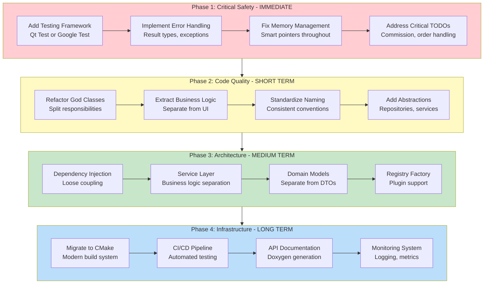

# IbTradeQt Issues and Improvements

## Table of Contents
1. [Executive Summary](#executive-summary)
2. [Critical Issues (High Priority)](#critical-issues-high-priority)
3. [Code Quality Issues](#code-quality-issues)
4. [Architectural Concerns](#architectural-concerns)
5. [Outstanding TODOs and Technical Debt](#outstanding-todos-and-technical-debt)
6. [Documentation Gaps](#documentation-gaps)
7. [Technology and Tooling](#technology-and-tooling)
8. [Improvement Roadmap](#improvement-roadmap)
9. [Specific Refactoring Suggestions](#specific-refactoring-suggestions)
10. [Best Practices Recommendations](#best-practices-recommendations)

---

## Executive Summary

IbTradeQt is a functional algorithmic trading platform with a well-designed architecture that uses appropriate design patterns (MVP, Observer, Composite, Factory). However, the codebase exhibits **significant technical debt** and **critical quality gaps** that pose risks for a financial trading system.

### Critical Findings

| Priority | Issue | Impact | Files Affected |
|----------|-------|--------|----------------|
| CRITICAL | No testing infrastructure | High risk of regressions, bugs in production | Entire codebase |
| CRITICAL | Insufficient error handling | Unhandled failures, potential data loss | [`capplicationcontroller.cpp`](MainSystem/capplicationcontroller.cpp), [`DBHandler`](DB/dbhandler.h), etc. |
| HIGH | Memory management issues | Potential leaks and dangling pointers | 37 instances of `new`, observer pattern in [`Dispatcher`](IBComm/Dispatcher.h) |
| HIGH | God classes | Difficult to maintain and test | [`IBComClientIpml.cpp`](IBComm/IBComClientIpml.cpp) (766 lines), [`portfolioconfigmodel.cpp`](MainSystem/portfolioconfigmodel.cpp) (1048 lines) |
| MEDIUM | Tight coupling | Difficult to mock and test | Strategy → Broker dependencies |
| MEDIUM | Inconsistent coding standards | Reduced readability | Mix of `NULL`/`nullptr`, naming conventions |

### Risk Assessment

For a trading system handling real money, the following are **unacceptable risks**:

1. **Zero automated testing** - No safety net for changes
2. **Silent error handling** - Failures may go unnoticed
3. **Manual memory management** - Potential crashes in production
4. **Unaddressed TODOs in order handling** - Risk of incorrect order execution

**Recommendation**: Address critical issues immediately before deploying to production with real funds.

---

## Critical Issues (High Priority)

### 1. No Testing Infrastructure

**Severity**: CRITICAL

**Current State:**
- Zero unit tests found in the codebase
- No testing framework configured (no Google Test, Qt Test, Catch2)
- No integration tests for IB API interaction
- No mock objects for testing in isolation
- `CTestStrategy` is a strategy implementation, not a test

**Impact:**
- No automated verification of functionality
- High risk of regressions when making changes
- Difficult to refactor with confidence
- Cannot verify order logic correctness
- Critical for financial software

**Recommended Actions:**
1. **Immediate**: Add Qt Test framework
   ```cpp
   // Example test structure
   class TestCBaseModel : public QObject {
       Q_OBJECT
   private slots:
       void testAddChild();
       void testRemoveChild();
       void testJsonSerialization();
       void testMessageHandler();
   };
   ```

2. Add mock broker for testing strategies without IB connection
3. Create test suite for:
   - Strategy signal generation
   - Order placement logic
   - Database operations
   - JSON serialization/deserialization
   - Observer pattern (subscribe/unsubscribe)
   - State machine transitions

4. Set up continuous integration (CI) to run tests automatically

**Files to Create:**
- `tests/` directory with test classes
- `tests.pro` or separate test configuration
- Mock implementations: `MockBrokerAPI`, `MockDispatcher`

---

### 2. Insufficient Error Handling

**Severity**: CRITICAL

**Issues Found:**

**A. File Operations Without Error Handling**

In [`capplicationcontroller.cpp`](MainSystem/capplicationcontroller.cpp):
```cpp
// Lines 86-88
if (!file.open(QIODevice::WriteOnly)) {
    qWarning() << "Could not open file for writing";
    // TODO: Handle error
    return;
}

// Lines 101-103
if (!file.open(QIODevice::ReadOnly)) {
    qWarning() << "Could not open file for reading";
    // TODO: Handle error
    return;
}
```

**Problem**: Errors are logged but not properly handled. No user notification, no fallback behavior.

**B. Limited Exception Handling**

**Statistics:**
- Only **36 catch blocks** across entire codebase
- Only **2 throw statements** found
- Most functions return `bool` or `void` without error context

**Problematic Patterns:**
```cpp
// Database operations return bool without details
bool addNewTrade(const DbTrade& trade);  // What failed? Why?

// Processing methods swallow errors
void MessageHandler(void* pContext, tEReqType _reqType) {
    // No try-catch, no error return
}
```

**C. Database Error Handling**

In [`dbhandler.cpp`](DB/dbhandler.cpp):
- Most queries check `query.lastError().isValid()` but only log errors
- No error propagation to caller
- No transaction rollback mechanism visible
- No retry logic for transient failures

**D. Order Handling TODOs**

Critical TODOs in order processing in [`IBComClientIpml.cpp`](IBComm/IBComClientIpml.cpp):
- Line 604: "TODO: add normal commission object!"
- Line 351, 403, 408: Data conversion TODOs
- Line 699: "Todo: add map"

**Impact:**
- Silent failures in production
- Difficult to diagnose issues
- Potential data inconsistency
- Risk of incorrect order execution
- User unaware of system problems

**Recommended Actions:**

1. **Implement Result/Error Types:**
   ```cpp
   // Create error handling infrastructure
   struct OperationResult {
       bool success;
       QString errorMessage;
       ErrorCode errorCode;
   };
   
   OperationResult placeOrder(const Order& order);
   ```

2. **Add Exception Safety:**
   ```cpp
   // RAII guards for resource management
   class DatabaseTransaction {
   public:
       DatabaseTransaction(QSqlDatabase& db);
       ~DatabaseTransaction();  // Auto-rollback if not committed
       void commit();
   private:
       QSqlDatabase& m_db;
       bool m_committed;
   };
   ```

3. **User Error Notification:**
   - Show error dialogs for critical failures
   - Add error status to UI
   - Implement error recovery workflows

4. **Complete TODO Items:**
   - Address all order-handling TODOs immediately
   - Test commission calculation thoroughly
   - Validate data conversions

---

### 3. Memory Management Issues

**Severity**: HIGH

**Problems Identified:**

**A. Manual Memory Management**

**Statistics:**
- 37 instances of `new` operator
- 6 instances of `delete` operator
- Only 38 instances of smart pointers (`QSharedPointer`, `shared_ptr`)

**Problematic Examples:**

In [`cpresenter.cpp`](MainSystem/cpresenter.cpp):
```cpp
workerThread = new QThread;
Worker *worker = new Worker(pIBBrokerClient.data());
// Who deletes these? Parent ownership unclear
```

In [`capplicationcontroller.cpp`](MainSystem/capplicationcontroller.cpp):
```cpp
pMainPresenter = new CPresenter(parent);
pMainView = new CIBTradeSystemView;
m_pDataRoot = new CBasicRoot();
pMainModel = new CMainModel(pMainPresenter, m_pDataRoot, nullptr);
```

**B. Raw Pointers in Observer Pattern**

In [`Dispatcher.h`](IBComm/Dispatcher.h):
```cpp
std::list<std::pair<Observer::CSubscriber*, TickerId>> m_lstListeners;
```

**Problem**: Raw pointers to subscribers risk:
- Dangling pointers if subscriber deleted without unsubscribe
- No lifetime management
- Potential crashes on notification

**C. Inconsistent Smart Pointer Usage**

- Some places use `QSharedPointer`: Strategy hierarchy
- Other places use raw pointers: Observer pattern, UI components
- No clear policy on when to use which

**D. Qt Parent Ownership Confusion**

Qt's parent-child ownership model is mixed with manual management:
```cpp
// Is this safe? Who owns worker?
Worker *worker = new Worker(pIBBrokerClient.data());
worker->moveToThread(workerThread);
```

**Impact:**
- Memory leaks in long-running application
- Potential crashes from dangling pointers
- Difficult to reason about object lifetimes
- Valgrind/sanitizer warnings likely

**Recommended Actions:**

1. **Adopt Smart Pointers Everywhere:**
   ```cpp
   // Replace raw pointers
   std::unique_ptr<QThread> workerThread;
   std::shared_ptr<Worker> worker;
   
   // Or use Qt's ownership
   auto* worker = new Worker(parent);  // Parent owns
   ```

2. **Fix Observer Pattern:**
   ```cpp
   // Use weak pointers to prevent dangling references
   std::list<std::pair<std::weak_ptr<Observer::CSubscriber>, TickerId>> m_lstListeners;
   
   // Or implement RAII subscription handle
   class SubscriptionHandle {
   public:
       ~SubscriptionHandle() { unsubscribe(); }
   };
   ```

3. **Document Ownership:**
   - Add comments clarifying ownership for each pointer
   - Use naming conventions: `owned_`, `borrowed_`, etc.

4. **Run Memory Analysis:**
   - Valgrind memcheck
   - AddressSanitizer
   - LeakSanitizer

---

### 4. Thread Safety Concerns

**Severity**: HIGH

**Issues:**

**A. Unclear Threading Model**
- No documentation of which classes are thread-safe
- Raw pointers shared between threads (observer pattern)
- Unclear data ownership across threads

**B. Potential Race Conditions**

In [`CDispatcher`](IBComm/Dispatcher.h):
```cpp
void SendMessageToSubscribers(void* pContext, const TickerId & id, tEReqType _reqType) {
    std::lock_guard<std::mutex> lock(m_Mutex);
    // Locked during iteration, but pContext is raw pointer
    // What if subscriber is deleted during callback?
}
```

**C. Shared Mutable State**

Multiple threads access:
- Subscriber lists
- Request ID maps
- Market data objects

Not always clear if access is synchronized.

**D. Qt Signal/Slot Thread Safety**

Most connections use `Qt::QueuedConnection` (good), but:
- Not consistently documented
- Some use `Qt::AutoConnection` (runtime decision)
- Unclear which signals cross thread boundaries

**Recommended Actions:**

1. **Document Thread Safety:**
   ```cpp
   // Add to class documentation
   /// @threadsafe This class can be accessed from multiple threads
   /// @note All public methods use internal locking
   class CDispatcher { ... };
   
   /// @not-threadsafe Must be accessed from main thread only
   class CIBTradeSystemView { ... };
   ```

2. **Use Thread-Safe Containers:**
   ```cpp
   // Replace manual locking with thread-safe queue
   #include <concurrent_queue>
   tbb::concurrent_queue<Message> m_messageQueue;
   ```

3. **Implement Thread Sanitizer:**
   - Run with ThreadSanitizer to detect races
   - Add to CI pipeline

4. **Clarify Data Ownership:**
   - Use immutable data objects where possible
   - Copy data for cross-thread communication
   - Avoid shared mutable state

---

## Code Quality Issues

### 1. God Classes

**Severity**: HIGH

**Large, Complex Classes:**

#### [`IBComClientIpml.cpp`](IBComm/IBComClientIpml.cpp) - 766+ lines

**Problems:**
- Implements 117+ callback methods from `EWrapper`
- Mixed responsibilities: connection, data parsing, dispatching
- Difficult to test in isolation
- Long methods with repetitive patterns

**Example of Repetition:**
```cpp
void IBComClientImpl::tickPrice(...) {
    CMyTickPrice myPrice;
    myPrice.reqId = tickerId;
    myPrice.field = tickType;
    myPrice.price = price;
    // ... more code
    m_DispatcherBrokerData.SendMessageToSubscribers(&myPrice, tickerId, RT_TICK_PRICE);
}

void IBComClientImpl::tickSize(...) {
    CMyTickSize mySize;
    mySize.reqId = tickerId;
    mySize.field = tickType;
    mySize.size = size;
    // ... more code
    m_DispatcherBrokerData.SendMessageToSubscribers(&mySize, tickerId, RT_TICK_SIZE);
}

// Similar pattern repeated for 10+ tick types
```

**Refactoring Suggestion:**
- Split into multiple classes: `IBConnection`, `IBMarketDataHandler`, `IBOrderHandler`, `IBAccountHandler`
- Use template method pattern for tick handling
- Extract common dispatcher logic

#### [`portfolioconfigmodel.cpp`](MainSystem/portfolioconfigmodel.cpp) - 1048+ lines

**Problems:**
- Implements tree model AND business logic
- 20+ slot methods for UI actions
- Model manipulation mixed with view concerns
- Difficult to test business logic

**Refactoring Suggestion:**
- Separate into: `PortfolioTreeModel` (Qt model) + `PortfolioManager` (business logic)
- Extract command pattern for operations (AddStrategy, RemoveNode, etc.)

#### [`cbasemodel.cpp`](Strategies/Generic/cbasemodel.cpp) - 613+ lines

**Problems:**
- 40+ virtual methods to override
- Mixed responsibilities: hierarchy, state machine, database, subscription
- Configuration, processing, and lifecycle all in one class

**Refactoring Suggestion:**
- Extract: `ModelHierarchy`, `ModelConfiguration`, `ModelStateMachine`, `ModelSubscriptionManager`
- Use composition over inheritance

---

### 2. Duplicated Code

**Severity**: MEDIUM

**Patterns Identified:**

**A. Tick Handler Boilerplate**

In [`IBComClientIpml.cpp`](IBComm/IBComClientIpml.cpp), similar pattern for all tick types:
```cpp
// Pattern repeated for: tickPrice, tickSize, tickString, tickGeneric, etc.
void IBComClientImpl::tickXXX(...) {
    CMyTickXXX myTick;
    myTick.reqId = tickerId;
    myTick.field = tickType;
    myTick.xxx = value;
    myTick.attribs = attribs;
    m_DispatcherBrokerData.SendMessageToSubscribers(&myTick, tickerId, RT_TICK_XXX);
}
```

**Solution:**
```cpp
template<typename TickType, typename ValueType>
void dispatchTick(TickerId id, int field, ValueType value, 
                  const TickAttrib& attribs, tEReqType reqType) {
    TickType tick;
    tick.reqId = id;
    tick.field = field;
    tick.setValue(value);  // Virtual method
    tick.attribs = attribs;
    m_DispatcherBrokerData.SendMessageToSubscribers(&tick, id, reqType);
}
```

**B. Data Object Classes**

Similar structure in [`CObjects/`](CObjects/):
- `CMyTickPrice`, `CMyTickSize`, `CMyTickGeneric`, `CMyTickString`
- All have: `reqId`, `field`, `attribs` fields
- Could share common base or use variant

**Solution:**
```cpp
// Base tick class
class CBaseTick {
protected:
    TickerId reqId;
    int field;
    TickAttrib attribs;
public:
    virtual ~CBaseTick() = default;
    // Common interface
};

// Or use std::variant
using TickData = std::variant<double, int, std::string>;
class CUnifiedTick {
    TickerId reqId;
    int field;
    TickData value;
    TickAttrib attribs;
};
```

**C. Database Query Patterns**

In [`dbhandler.cpp`](DB/dbhandler.cpp), similar patterns for different queries:
- Prepare query
- Bind values
- Execute
- Check error
- Log result

**Solution**: Query builder or ORM abstraction

---

### 3. Naming Inconsistencies

**Severity**: MEDIUM

**Problems:**

**A. Mixed Case Conventions**

| File/Class | Convention | Issue |
|------------|-----------|-------|
| `CBaseModel` | PascalCase with C prefix | Standard |
| `cmomentum` | camelCase with c prefix | Inconsistent |
| `pairtraderpm` | all lowercase | Inconsistent |
| `IBComClientIpml` | Abbreviation + typo? | "Ipml" vs "Impl" |
| `CProcessingBase_v2` | Underscore version | Inconsistent |

**B. Prefix Confusion**

Multiple prefix schemes:
- `C` prefix for classes: `CBaseModel`
- `c` prefix for classes: `cmomentum`
- `p` prefix for pointers: `pMainView`
- `m_` prefix for members: `m_ParametersMap`
- `m_p` prefix for member pointers: `m_pBrokerDataProvider`
- `I` prefix for interfaces: `IBrokerAPI`

**C. Abbreviation Inconsistency**

- `Ipml` vs `Impl` (implementation)
- `Mgr` vs `Manager`
- `Req` vs `Request`
- `Recv` vs `Receive`

**Impact:**
- Reduced code readability
- Difficult for new developers
- Inconsistent search results

**Recommended Actions:**

1. **Standardize Naming Convention:**
   ```
   Classes:       PascalCase (no prefix)
   Interfaces:    IPascalCase or PascalCaseInterface
   Member vars:   m_camelCase
   Parameters:    camelCase
   Constants:     UPPER_SNAKE_CASE
   ```

2. **Refactoring Examples:**
   - `cmomentum` → `MomentumStrategy` or `CMomentum`
   - `pairtraderpm` → `PairTradingModel` or `CPairTradingModel`
   - `IBComClientIpml` → `IBComClientImpl` (fix typo)
   - `CProcessingBase_v2` → `CProcessingBase` or `ProcessingBase`

3. **Create Style Guide:**
   - Document naming conventions
   - Add to README or CONTRIBUTING.md
   - Use clang-format for enforcement

---

### 4. Code Style Inconsistencies

**Severity**: MEDIUM

**Issues:**

**A. NULL vs nullptr**
- 13 instances of `NULL`
- 92 instances of `nullptr`
- Mixing old and modern C++ style

**Recommendation**: Use `nullptr` consistently (C++11+)

**B. Smart Pointer Usage**
- Some classes use `QSharedPointer`
- Others use `std::shared_ptr`
- Most use raw pointers
- No consistent policy

**Recommendation**: 
- Qt classes → `QSharedPointer`
- Standard classes → `std::unique_ptr` / `std::shared_ptr`
- Document in style guide

**C. Old Qt Patterns**

Mixed Qt 4 and Qt 5+ patterns:
```cpp
// Old style (Qt 4)
connect(sender, SIGNAL(someSignal()), receiver, SLOT(someSlot()));

// New style (Qt 5+)
connect(sender, &Sender::someSignal, receiver, &Receiver::someSlot);
```

**Recommendation**: Use new-style connections (compile-time checking)

**D. Signal/Slot Keywords**

Using old `signals:` and `slots:` instead of `Q_SIGNALS:` and `Q_SLOTS:`

**Recommendation**: Use modern macros

---

## Architectural Concerns

### 1. Tight Coupling

**Severity**: HIGH

**Issues:**

**A. Strategies Coupled to Broker Implementation**

Strategies inherit from [`CProcessingBase_v2`](Common/cprocessingbase_v2.h) which contains:
```cpp
CBrokerDataProvider* m_pBrokerDataProvider;  // Direct dependency
```

**Problem:**
- Cannot test strategies without broker
- Cannot swap broker implementations
- Violates Dependency Inversion Principle

**Solution:**
```cpp
// Inject dependencies via interface
class IMarketDataProvider {
public:
    virtual void subscribe(const QString& symbol) = 0;
    virtual void unsubscribe(const QString& symbol) = 0;
};

class CBaseModel {
public:
    CBaseModel(IMarketDataProvider* provider);  // Inject
};
```

**B. Direct Database Access**

Models directly create `DBManager` instances:
```cpp
DBManager m_dbManager;  // In CBaseModel
```

**Problem:**
- Cannot test without database
- Difficult to mock
- Violates Single Responsibility

**Solution:** Repository pattern
```cpp
class IStrategyRepository {
public:
    virtual void saveState(const StrategyState&) = 0;
    virtual StrategyState loadState(int id) = 0;
};
```

---

### 2. Missing Abstractions

**Severity**: HIGH

**Gaps Identified:**

**A. No Repository Pattern**

Direct SQL in [`DBHandler`](DB/dbhandler.cpp):
```cpp
void DBHandler::slotAddNewTrade(const DbTrade& trade) {
    QSqlQuery query(m_db);
    query.prepare("INSERT INTO Trades (strategyId, symbol, ...) VALUES (?, ?, ...)");
    query.addBindValue(trade.strategyId);
    // ... etc
}
```

**Problem:**
- Business logic coupled to SQL
- Cannot swap database implementations
- Difficult to test

**Solution:**
```cpp
class ITradeRepository {
public:
    virtual ~ITradeRepository() = default;
    virtual void addTrade(const Trade& trade) = 0;
    virtual std::vector<Trade> getTradesByStrategy(int strategyId) = 0;
};

class SqliteTradeRepository : public ITradeRepository { ... };
class MockTradeRepository : public ITradeRepository { ... };
```

**B. No Service Layer**

Application logic mixed throughout:
- UI code in models ([`portfolioconfigmodel.cpp`](MainSystem/portfolioconfigmodel.cpp))
- Business logic in presenters
- No clear service boundary

**Solution:**
```cpp
class StrategyService {
public:
    void startStrategy(int strategyId);
    void stopStrategy(int strategyId);
    StrategyStatistics getStatistics(int strategyId);
private:
    IStrategyRepository* m_repository;
    IBrokerAPI* m_broker;
};
```

**C. No Domain Model Separation**

Data transfer objects mixed with business objects:
- `DbTrade` used for both database and domain logic
- `CMyPosition` couples IB API structure to domain

**Solution:** Separate layers
```cpp
// Domain model (business logic)
class Position {
    std::string symbol;
    double quantity;
    double averagePrice;
    double unrealizedPnL() const;
};

// DTO (data transfer)
struct DbPosition {
    QString symbol;
    double quantity;
    double avgPrice;
};

// Mapper between layers
Position fromDb(const DbPosition& dto);
```

---

### 3. Mixed Responsibilities

**Severity**: MEDIUM

**Examples:**

**A. UI Logic in Models**

[`CPortfolioConfigModel`](MainSystem/portfolioconfigmodel.cpp) contains:
- Tree model implementation (correct)
- Strategy creation logic (should be in service)
- Database operations (should be in repository)
- User interaction logic (should be in controller)

**B. Business Logic in Views**

Some view classes contain logic beyond presentation:
- Data validation
- State management
- Complex calculations

**Solution:** Strict MVP/MVC separation
- **Model**: Pure data + business rules
- **View**: Display + user input
- **Presenter**: Coordination + application logic

---

### 4. Factory Pattern Limitations

**Severity**: LOW

**Current Implementation** in [`cstrategyfactory.cpp`](Strategies/Generic/cstrategyfactory.cpp):

```cpp
ptrGenericModelType CStrategyFactory::createNewStrategy(ModelType id) {
    switch (id) {
    case ModelType::ROOT:
        return QSharedPointer<CBasicRoot>::create();
    case ModelType::STRATEGY_MA:
        return QSharedPointer<CMovingAverageCrossover>::create();
    // ... 12 more cases
    }
}
```

**Problems:**
- Requires recompilation to add new strategies
- Switch statement gets long
- No plugin architecture

**Better Approach:**
```cpp
// Registry-based factory
class CStrategyFactory {
public:
    using Creator = std::function<ptrGenericModelType()>;
    
    static void registerStrategy(ModelType type, Creator creator) {
        registry()[type] = creator;
    }
    
    static ptrGenericModelType create(ModelType type) {
        auto it = registry().find(type);
        if (it != registry().end()) {
            return it->second();
        }
        return nullptr;
    }
    
private:
    static std::map<ModelType, Creator>& registry() {
        static std::map<ModelType, Creator> reg;
        return reg;
    }
};

// Self-registering strategies
struct AutoRegister {
    AutoRegister(ModelType type, CStrategyFactory::Creator creator) {
        CStrategyFactory::registerStrategy(type, creator);
    }
};

#define REGISTER_STRATEGY(Type, Class) \
    static AutoRegister reg_##Class(Type, []() { return QSharedPointer<Class>::create(); });

// In strategy implementation file:
REGISTER_STRATEGY(ModelType::STRATEGY_MOMENTUM, cMomentum);
```

**Benefits:**
- Compile-time registration
- Supports plugins
- No central switch statement

---

## Outstanding TODOs and Technical Debt

### Critical TODOs

**Commission Handling** - [`IBComClientIpml.cpp:604`](IBComm/IBComClientIpml.cpp)
```cpp
void IBComClientImpl::commissionReport(const CommissionReport& commissionReport) {
    CCommissionReport myComRep;
    // TODO: add normal commission object!
    
    m_DispatcherBrokerData.SendMessageToSubscribers(&myComRep, ...);
}
```

**Risk**: Commission data may be incomplete or incorrect, affecting P&L calculations.

**Action Required**: 
- Complete `CCommissionReport` implementation
- Verify all fields are populated
- Add tests for commission calculation

---

**Error Checking** - [`cbasicaccount.cpp:38`](Strategies/Generic/cbasicaccount.cpp)
```cpp
void CBasicAccount::StartProcessing(std::function<void()> completion) {
    // TODO: Error -> check if it working!
    
    if (m_Children.isEmpty()) {
        qInfo(logMAIN()) << "No PORTFOLIO, CBasicAccount stop processing";
        completion();
        return;
    }
    // ...
}
```

**Risk**: Strategy may fail silently without proper validation.

**Action Required**:
- Verify startup logic
- Add error returns
- Test edge cases

---

**Implementation Missing** - [`cprocessingbase_v2.h:87`](Common/cprocessingbase_v2.h)
```cpp
//Todo: implement??
virtual void OnReceiveLastTickByTickData(const CTickByTickDataLast & obj){}
```

**Risk**: Feature incomplete, may cause unexpected behavior.

---

**Data Conversion** - Multiple TODOs in [`IBComClientIpml.cpp`](IBComm/IBComClientIpml.cpp)

Lines 351, 403, 408, 456, 464, 564, 699 - Various data conversion and mapping TODOs.

**Impact**: Potential data loss or incorrect conversions between IB API and internal format.

---

**Performance** - [`globalreqmanager.cpp:56`](ReqManager/globalreqmanager.cpp)
```cpp
// Todo: replace QList by QVector for better performance
```

**Impact**: Minor performance issue, `QList` deprecated in Qt 6.

**Solution**: Use `QVector` or modern `std::vector`

---

**Memory Issue** - [`treeitem.cpp:103`](MainSystem/treeitem.cpp)
```cpp
// TODO: Something wrong with the memory
```

**Risk**: Acknowledged memory management issue, potential crashes.

**Action Required**: 
- Debug memory issue
- Use smart pointers
- Run Valgrind

---

### Commented Out Code

**Severity**: MEDIUM

**Statistics**: 100+ instances of large commented code blocks

**Examples:**

**Test Code in Production** - [`capplicationcontroller.cpp:36-52`](MainSystem/capplicationcontroller.cpp):
```cpp
/*** Test Code ***/
// DBManager m_dbManager;
// QDateTime currentDateTime = QDateTime::currentDateTime();
// DbTrade newTrade;
// newTrade.strategyId = 1;
// ... 15 lines of commented test code
/******* xxx *********/
```

**Disabled Features** - Throughout presenter and strategy files:
- Pair trading presenter (commented)
- Auto delta alignment presenter (commented)
- DBStore presenter (commented)

**Problem:**
- Clutters codebase
- Unclear if code is deprecated or temporarily disabled
- Maintenance burden (commented code may rot)

**Recommended Actions:**
1. **Delete dead code** - Use version control for history
2. **Re-enable features** - If still needed, uncomment and fix
3. **Document disabled features** - If temporarily disabled, add clear comment explaining why

---

## Documentation Gaps

### 1. Minimal Code Documentation

**Severity**: HIGH

**Current State:**
- Only **14 instances** of Doxygen-style comments (`/**`, `///`, `//!`)
- Most public APIs lack documentation
- No parameter descriptions
- No return value documentation
- No usage examples

**Example - Undocumented Interface:**

[`cgenericmodelApi.h`](Strategies/Generic/cgenericmodelApi.h):
```cpp
class CGenericModelApi {
public:
    virtual void setParent(ptrGenericModelType parent) = 0;
    virtual void addChild(ptrGenericModelType child) = 0;
    virtual ptrGenericModelType getChild(int index) = 0;
    // No documentation: What do these do? What are the constraints?
};
```

**Should Be:**
```cpp
/**
 * @brief Generic interface for hierarchical model components
 * 
 * This interface defines the common operations for all model types
 * in the strategy hierarchy (Root, Account, Portfolio, Strategy).
 */
class CGenericModelApi {
public:
    /**
     * @brief Set the parent model in the hierarchy
     * @param parent Parent model pointer (nullptr for root)
     */
    virtual void setParent(ptrGenericModelType parent) = 0;
    
    /**
     * @brief Add a child model to this node
     * @param child Child model to add
     * @throws std::invalid_argument if child type is incompatible
     */
    virtual void addChild(ptrGenericModelType child) = 0;
    
    /**
     * @brief Get child at specified index
     * @param index Zero-based child index
     * @return Child model pointer or nullptr if index out of range
     */
    virtual ptrGenericModelType getChild(int index) = 0;
};
```

**Recommended Actions:**
1. Add Doxygen comments to all public APIs
2. Document design decisions and trade-offs
3. Add usage examples for complex classes
4. Generate HTML documentation with Doxygen

---

### 2. Missing Project Documentation

**Severity**: MEDIUM

**What's Missing:**

- **No README.md** in project root
  - How to build?
  - Dependencies?
  - How to run?
  - Configuration?

- **No API Documentation**
  - How to create a new strategy?
  - How to use the observer pattern?
  - Database schema?

- **No Architecture Documentation** (now addressed)

- **No Contributing Guide**
  - Code style?
  - PR process?
  - Testing requirements?

**Recommended Actions:**

1. **Create README.md:**
   ```markdown
   # IbTradeQt
   
   Algorithmic trading platform for Interactive Brokers
   
   ## Prerequisites
   - Qt 6.x
   - PostgreSQL
   - Interactive Brokers TWS or Gateway
   
   ## Building
   qmake ibtrading.pro
   make
   
   ## Configuration
   - Edit GlobalDef.h for IB connection settings
   - Configure database connection in ...
   
   ## Usage
   1. Start IB TWS/Gateway
   2. Launch IbTradeQt
   3. Click Connect
   4. Add strategies via tree view context menu
   ```

2. **Create CONTRIBUTING.md:**
   - Coding standards
   - Testing requirements
   - PR guidelines

3. **Generate API Docs:**
   - Set up Doxygen
   - Generate HTML docs
   - Host on GitHub Pages

---

### 3. Inadequate Inline Documentation

**Severity**: LOW

**Issues:**
- Most inline comments just describe what code does (redundant)
- Few comments explain WHY (business logic, trade-offs)
- Complex algorithms lack explanation

**Examples of Good vs Bad Comments:**

**Bad (Obvious):**
```cpp
// Create strategy
auto strategy = factory.create(type);

// Add to list
strategies.append(strategy);
```

**Good (Explains Why):**
```cpp
// Use queued connection to ensure thread-safe delivery
// Market data arrives on IB thread, processed on main thread
connect(provider, &Provider::dataReceived, 
        this, &Strategy::onData, Qt::QueuedConnection);

// Intel Decimal Library required for precise commission calculations
// Standard floating point introduces unacceptable rounding errors
Decimal commission = calculateCommission(price, quantity);
```

---

## Technology and Tooling

### 1. Build System Limitations

**Severity**: MEDIUM

**Current**: qmake (`.pro` files)

**Problems:**
- qmake is deprecated by Qt (CMake is recommended)
- Limited cross-platform support
- Harder to integrate with modern tools
- Less flexible than CMake

**Migration Path:**

1. **Create CMakeLists.txt:**
   ```cmake
   cmake_minimum_required(VERSION 3.16)
   project(IbTradeQt VERSION 1.0 LANGUAGES CXX)
   
   set(CMAKE_CXX_STANDARD 17)
   set(CMAKE_CXX_STANDARD_REQUIRED ON)
   
   find_package(Qt6 REQUIRED COMPONENTS Core Widgets Charts Sql Network)
   
   add_executable(ibtrading
       main.cpp
       MainSystem/capplicationcontroller.cpp
       # ... all source files
   )
   
   target_link_libraries(ibtrading
       Qt6::Core
       Qt6::Widgets
       Qt6::Charts
       Qt6::Sql
       ${CMAKE_CURRENT_SOURCE_DIR}/Libs/libbid.a
   )
   ```

2. **Benefits:**
   - Better IDE support (CLion, VS Code CMake Tools)
   - Easier dependency management (Conan, vcpkg)
   - Standard build system
   - Better CI/CD integration

---

### 2. Qt API Usage

**Severity**: LOW

**Issues:**

**A. Deprecated Qt APIs**

Pattern found multiple times:
```cpp
QString text = ...;
const char* cstr = text.toLocal8Bit().data();
// DANGER: toLocal8Bit() returns temporary QByteArray
// .data() pointer becomes invalid immediately
```

**Problem**: Dangling pointer, undefined behavior

**Solution:**
```cpp
QByteArray bytes = text.toLocal8Bit();
const char* cstr = bytes.data();  // Safe, bytes stays in scope
```

**B. Old Signal/Slot Syntax**

Mix of compile-time safe and runtime-only connection syntax.

**C. Missing Qt 6 Features**

Not using:
- `QStringView` for efficient string handling
- `std::optional` return values
- Range-based algorithms

**Recommended Actions:**
1. Audit for deprecated Qt APIs
2. Migrate to new signal/slot syntax
3. Use Qt 6 modern features
4. Review Qt 6 migration guide

---

### 3. No Continuous Integration

**Severity**: MEDIUM

**Current State:**
- No CI/CD configuration found
- No automated builds
- No automated testing (because no tests exist)
- No static analysis in pipeline

**Recommended Actions:**

1. **Set Up GitHub Actions / GitLab CI:**
   ```yaml
   # .github/workflows/build.yml
   name: Build and Test
   
   on: [push, pull_request]
   
   jobs:
     build:
       runs-on: ubuntu-latest
       steps:
         - uses: actions/checkout@v2
         - name: Install Qt
           uses: jurplel/install-qt-action@v3
         - name: Build
           run: |
             qmake ibtrading.pro
             make
         - name: Run Tests
           run: ./tests/run_tests
         - name: Static Analysis
           run: clang-tidy ...
   ```

2. **Add Pre-commit Hooks:**
   - Format checking (clang-format)
   - Static analysis (clang-tidy)
   - Spell checking

3. **Code Coverage:**
   - Integrate gcov/lcov
   - Track coverage over time
   - Enforce minimum coverage (e.g., 70%)

---

## Improvement Roadmap

The following roadmap prioritizes improvements by impact and urgency:



---

## Phase 1: Critical Safety (IMMEDIATE)

**Goal**: Eliminate high-risk issues that could cause production failures or financial losses.

### Task 1: Add Comprehensive Testing Framework

**Effort**: 3-5 days

**Steps:**

1. **Set Up Qt Test Framework:**
   ```cpp
   // tests/test_base_model.h
   #include <QtTest>
   #include "Strategies/Generic/cbasemodel.h"
   
   class TestBaseModel : public QObject {
       Q_OBJECT
   
   private slots:
       void initTestCase();      // Before all tests
       void init();              // Before each test
       void cleanup();           // After each test
       
       void testAddChild();
       void testRemoveChild();
       void testJsonSerialization();
       void testStateTransitions();
       void testMessageHandler();
       
       void cleanupTestCase();   // After all tests
   };
   ```

2. **Create Mock Objects:**
   ```cpp
   // tests/mocks/MockBrokerAPI.h
   class MockBrokerAPI : public IBrokerAPI {
   public:
       MOCK_METHOD(void, reqRealTimeDataAPI, (TickerId, const RealTimeDataConfig&), (override));
       MOCK_METHOD(void, reqPlaceOrderAPI, (const Order&), (override));
       // ... etc
   };
   ```

3. **Priority Test Cases:**
   - Strategy signal generation
   - Order placement logic
   - Position calculation
   - Risk management rules
   - Database operations
   - JSON serialization
   - State machine transitions

4. **Integration Tests:**
   - End-to-end workflow tests
   - Database integration
   - Mock IB server for testing

---

### Task 2: Implement Proper Error Handling

**Effort**: 2-3 days

**Steps:**

1. **Create Error Infrastructure:**
   ```cpp
   // Common/Result.h
   enum class ErrorCode {
       Success,
       DatabaseError,
       BrokerConnectionFailed,
       InvalidConfiguration,
       OrderRejected,
       InsufficientFunds,
       // ... etc
   };
   
   template<typename T>
   class Result {
   public:
       static Result Success(T value) { return Result(std::move(value)); }
       static Result Error(ErrorCode code, QString message) { 
           return Result(code, message); 
       }
       
       bool isSuccess() const { return m_success; }
       const T& value() const { return m_value; }
       ErrorCode errorCode() const { return m_errorCode; }
       const QString& errorMessage() const { return m_errorMessage; }
       
   private:
       bool m_success;
       T m_value;
       ErrorCode m_errorCode;
       QString m_errorMessage;
   };
   ```

2. **Update Method Signatures:**
   ```cpp
   // Before:
   bool addChild(ptrGenericModelType child);
   
   // After:
   Result<void> addChild(ptrGenericModelType child);
   ```

3. **Add Exception Safety:**
   ```cpp
   // Use RAII for resource management
   class DatabaseTransaction {
   public:
       explicit DatabaseTransaction(QSqlDatabase& db) : m_db(db), m_committed(false) {
           m_db.transaction();
       }
       
       ~DatabaseTransaction() {
           if (!m_committed) {
               m_db.rollback();  // Auto-rollback on exception
           }
       }
       
       void commit() {
           m_db.commit();
           m_committed = true;
       }
       
   private:
       QSqlDatabase& m_db;
       bool m_committed;
   };
   ```

4. **Update File Operations:**
   ```cpp
   // In capplicationcontroller.cpp
   Result<void> CApplicationController::saveModelTree() {
       QFile file("model_tree_config.json");
       if (!file.open(QIODevice::WriteOnly)) {
           QString error = QString("Failed to open file: %1").arg(file.errorString());
           QMessageBox::critical(nullptr, "Save Error", error);
           return Result<void>::Error(ErrorCode::FileWriteError, error);
       }
       
       // ... save logic with error checking
       
       return Result<void>::Success();
   }
   ```

---

### Task 3: Fix Memory Management

**Effort**: 3-4 days

**Steps:**

1. **Audit All Raw Pointers:**
   - Create inventory of all `new` calls
   - Determine ownership for each
   - Plan migration strategy

2. **Migrate to Smart Pointers:**
   ```cpp
   // Before:
   CPresenter* pMainPresenter = new CPresenter(parent);
   
   // After (Qt parent ownership):
   auto* pMainPresenter = new CPresenter(parent);  // Parent owns
   
   // Or (explicit ownership):
   std::unique_ptr<CPresenter> pMainPresenter = std::make_unique<CPresenter>();
   ```

3. **Fix Observer Pattern:**
   ```cpp
   // Before:
   std::list<std::pair<Observer::CSubscriber*, TickerId>> m_lstListeners;
   
   // After:
   std::list<std::pair<std::weak_ptr<Observer::CSubscriber>, TickerId>> m_lstListeners;
   
   void Subscribe(std::shared_ptr<Observer::CSubscriber> subscriber, TickerId id) {
       std::lock_guard<std::mutex> lock(m_Mutex);
       m_lstListeners.push_back({subscriber, id});
   }
   
   void SendMessageToSubscribers(void* pContext, const TickerId& id, tEReqType type) {
       std::lock_guard<std::mutex> lock(m_Mutex);
       for (auto it = m_lstListeners.begin(); it != m_lstListeners.end();) {
           if (auto sub = it->first.lock()) {  // Check if still alive
               if (it->second == id) {
                   sub->MessageHandler(pContext, type);
               }
               ++it;
           } else {
               it = m_lstListeners.erase(it);  // Remove dead subscriber
           }
       }
   }
   ```

4. **Run Memory Analysis:**
   ```bash
   # Compile with sanitizers
   qmake ibtrading.pro CONFIG+=sanitizer CONFIG+=sanitize_address
   make
   
   # Run with Valgrind
   valgrind --leak-check=full --show-leak-kinds=all ./ibtrading
   ```

---

### Task 4: Address Critical TODOs

**Effort**: 1-2 days

**Priority Items:**

1. **Commission Report** - [`IBComClientIpml.cpp:604`](IBComm/IBComClientIpml.cpp)
   - Complete `CCommissionReport` object population
   - Verify all fields match IB API
   - Test commission calculations

2. **Error Checking** - [`cbasicaccount.cpp:38`](Strategies/Generic/cbasicaccount.cpp)
   - Verify strategy startup logic
   - Add validation for all initialization steps
   - Return error status

3. **Data Conversions** - [`IBComClientIpml.cpp`](IBComm/IBComClientIpml.cpp)
   - Complete all data mapping TODOs
   - Validate conversions with unit tests
   - Document expected formats

4. **Memory Issue** - [`treeitem.cpp:103`](MainSystem/treeitem.cpp)
   - Debug and fix memory problem
   - Replace with smart pointers if needed
   - Add tests to prevent regression

---

## Phase 2: Code Quality (SHORT TERM)

**Goal**: Improve maintainability, readability, and reduce technical debt.

### Task 1: Refactor God Classes

**Effort**: 5-7 days

**Target Classes:**

#### A. Split `IBComClientImpl` (766 lines)

**Current Responsibilities:**
- Connection management
- Market data callbacks
- Order callbacks
- Account callbacks
- Error handling
- Data object creation
- Dispatching

**Proposed Split:**
```
IBComClientImpl (connection management)
  ├─ IBMarketDataHandler (market data callbacks)
  ├─ IBOrderHandler (order callbacks)
  ├─ IBAccountHandler (account callbacks)
  └─ IBErrorHandler (error handling)
```

**Implementation:**
```cpp
class IBComClientImpl : public EWrapper, public IBrokerAPI {
public:
    IBComClientImpl(CDispatcher& dispatcher);
    
private:
    std::unique_ptr<IBMarketDataHandler> m_marketDataHandler;
    std::unique_ptr<IBOrderHandler> m_orderHandler;
    std::unique_ptr<IBAccountHandler> m_accountHandler;
    
    // Delegate callbacks
    void tickPrice(TickerId id, TickType field, double price, ...) override {
        m_marketDataHandler->handleTickPrice(id, field, price, ...);
    }
};
```

#### B. Split `CPortfolioConfigModel` (1048 lines)

**Proposed Split:**
```
CPortfolioTreeModel (Qt tree model only)
  + PortfolioManager (business logic)
  + StrategyCommandFactory (command pattern)
```

#### C. Refactor `CBaseModel` (613 lines)

**Extract Components:**
- `ModelHierarchy` - Parent/child management
- `ModelConfiguration` - Parameter management
- `ModelStateMachine` - State handling
- `ModelSubscriptionManager` - Market data subscriptions

Use composition:
```cpp
class CBaseModel {
private:
    ModelHierarchy m_hierarchy;
    ModelConfiguration m_config;
    ModelStateMachine m_stateMachine;
    ModelSubscriptionManager m_subscriptions;
};
```

---

### Task 2: Extract Business Logic from UI

**Effort**: 3-4 days

**Issues:**
- [`portfolioconfigmodel.cpp`](MainSystem/portfolioconfigmodel.cpp) has business logic
- View classes perform validation
- Data transformations in UI code

**Recommended Pattern:**

```cpp
// Service layer
class PortfolioService {
public:
    Result<int> createStrategy(ModelType type, int parentId);
    Result<void> deleteStrategy(int strategyId);
    Result<void> startStrategy(int strategyId);
    Result<void> stopStrategy(int strategyId);
    std::vector<StrategyInfo> getAllStrategies();
};

// Model becomes pure data
class CPortfolioTreeModel : public QAbstractItemModel {
public:
    void setPortfolioService(PortfolioService* service);
    // Only Qt model interface methods
};

// Controller uses service
class PortfolioController {
public:
    void onAddStrategyClicked() {
        auto result = m_service->createStrategy(type, parentId);
        if (result.isSuccess()) {
            m_model->refresh();
            m_view->selectStrategy(result.value());
        } else {
            m_view->showError(result.errorMessage());
        }
    }
private:
    PortfolioService* m_service;
    CPortfolioTreeModel* m_model;
    CIBTradeSystemView* m_view;
};
```

---

### Task 3: Standardize Naming Conventions

**Effort**: 2-3 days

**Action Items:**

1. **Define Standard:**
   ```
   Classes:        PascalCase (e.g., BaseModel, MomentumStrategy)
   Interfaces:     IPascalCase (e.g., IBrokerAPI, IRepository)
   Member vars:    m_camelCase (e.g., m_subscriberList)
   Local vars:     camelCase (e.g., tickerSymbol)
   Parameters:     camelCase (e.g., tickerId)
   Constants:      UPPER_SNAKE_CASE (e.g., MAX_RETRIES)
   Functions:      camelCase (e.g., placeOrder)
   ```

2. **Create .clang-format:**
   ```yaml
   BasedOnStyle: LLVM
   IndentWidth: 4
   ColumnLimit: 120
   PointerAlignment: Left
   # ... more rules
   ```

3. **Rename Classes (Examples):**
   - `cmomentum` → `MomentumStrategy`
   - `pairtraderpm` → `PairTradingModel`
   - `IBComClientIpml` → `IBComClientImpl` (fix typo)
   - `CProcessingBase_v2` → `ProcessingBase`

4. **Use Automated Tools:**
   ```bash
   # clang-rename for safe refactoring
   clang-rename -old-name=cmomentum -new-name=MomentumStrategy
   ```

---

### Task 4: Add Proper Abstractions

**Effort**: 4-5 days

**Abstractions to Add:**

#### A. Repository Pattern

```cpp
// Repositories/IStrategyRepository.h
class IStrategyRepository {
public:
    virtual ~IStrategyRepository() = default;
    
    virtual Result<StrategyConfig> load(int strategyId) = 0;
    virtual Result<void> save(const StrategyConfig& config) = 0;
    virtual Result<void> deleteStrategy(int strategyId) = 0;
    virtual std::vector<StrategyConfig> loadAll() = 0;
};

// Repositories/SqliteStrategyRepository.h
class SqliteStrategyRepository : public IStrategyRepository {
    // Implementation using DBHandler
};
```

#### B. Market Data Service

```cpp
// Services/IMarketDataService.h
class IMarketDataService {
public:
    virtual ~IMarketDataService() = default;
    
    virtual SubscriptionHandle subscribeToPrice(
        const QString& symbol,
        std::function<void(const PriceTick&)> callback) = 0;
        
    virtual Result<HistoricalData> getHistoricalBars(
        const QString& symbol,
        const QDateTime& from,
        const QDateTime& to) = 0;
};
```

#### C. Order Service

```cpp
// Services/IOrderService.h
class IOrderService {
public:
    virtual ~IOrderService() = default;
    
    virtual Result<OrderId> placeOrder(const Order& order) = 0;
    virtual Result<void> cancelOrder(OrderId orderId) = 0;
    virtual Result<OrderStatus> getOrderStatus(OrderId orderId) = 0;
    virtual std::vector<Position> getPositions() = 0;
};
```

**Benefits:**
- Testable without broker connection
- Swappable implementations (IB, paper trading, replay)
- Clear contracts and boundaries

---

## Phase 3: Architecture Improvements (MEDIUM TERM)

**Goal**: Reduce coupling, improve extensibility, enhance maintainability.

### Task 1: Implement Dependency Injection

**Effort**: 5-7 days

**Current Problem:**
```cpp
class CBaseModel {
public:
    CBaseModel() {
        // Hard-coded dependencies
        m_pBrokerDataProvider = getBrokerProvider();  // Global
        m_dbManager = DBManager();  // Direct instantiation
    }
};
```

**Solution:**
```cpp
// Dependency container
class ServiceContainer {
public:
    void registerBrokerService(std::shared_ptr<IBrokerAPI> broker);
    void registerMarketDataService(std::shared_ptr<IMarketDataService> marketData);
    void registerOrderService(std::shared_ptr<IOrderService> orderService);
    void registerRepository(std::shared_ptr<IStrategyRepository> repo);
    
    template<typename T>
    std::shared_ptr<T> resolve();
};

// Constructor injection
class CBaseModel {
public:
    CBaseModel(std::shared_ptr<IMarketDataService> marketData,
               std::shared_ptr<IStrategyRepository> repository) 
        : m_marketData(marketData), m_repository(repository) {}
        
private:
    std::shared_ptr<IMarketDataService> m_marketData;
    std::shared_ptr<IStrategyRepository> m_repository;
};

// Application setup
ServiceContainer container;
container.registerBrokerService(std::make_shared<IBBrokerService>());
container.registerMarketDataService(std::make_shared<IBMarketDataService>());

auto strategy = std::make_shared<MomentumStrategy>(
    container.resolve<IMarketDataService>(),
    container.resolve<IStrategyRepository>()
);
```

**Benefits:**
- Easy to mock for testing
- Runtime configuration
- Clear dependencies
- Support for multiple implementations

---

### Task 2: Add Service Layer

**Effort**: 4-5 days

**Services to Create:**

1. **StrategyService**
   ```cpp
   class StrategyService {
   public:
       Result<int> createStrategy(const StrategyConfig& config);
       Result<void> startStrategy(int strategyId);
       Result<void> stopStrategy(int strategyId);
       Result<StrategyStatistics> getStatistics(int strategyId);
       Result<void> updateConfiguration(int strategyId, const StrategyConfig& config);
   };
   ```

2. **PortfolioService**
   ```cpp
   class PortfolioService {
   public:
       Result<PortfolioSnapshot> getSnapshot();
       Result<PerformanceMetrics> calculatePerformance(const QDateTime& from, const QDateTime& to);
       Result<RiskMetrics> calculateRisk();
   };
   ```

3. **TradingService**
   ```cpp
   class TradingService {
   public:
       Result<OrderId> placeMarketOrder(const QString& symbol, double quantity);
       Result<OrderId> placeLimitOrder(const QString& symbol, double quantity, double price);
       Result<void> cancelOrder(OrderId orderId);
       Result<std::vector<Trade>> getTradeHistory(int strategyId);
   };
   ```

**Benefits:**
- Clear API boundaries
- Reusable business logic
- Testable without UI
- Support for REST API / RPC in future

---

### Task 3: Separate Domain Models from DTOs

**Effort**: 3-4 days

**Current Problem:**
```cpp
// DbTrade is both database DTO and domain object
struct DbTrade {
    int id;
    int strategyId;
    QString symbol;
    double quantity;
    double price;
    QString date;  // String format - should be QDateTime
    // Mixed concerns
};
```

**Solution:**
```cpp
// Domain model (business logic)
namespace Domain {
    class Trade {
    public:
        Trade(int strategyId, const QString& symbol, double quantity, double price,
              const QDateTime& timestamp);
        
        double calculatePnL(double currentPrice) const;
        bool isClosed() const;
        QDateTime getTimestamp() const;
        
    private:
        int m_strategyId;
        QString m_symbol;
        double m_quantity;
        double m_entryPrice;
        QDateTime m_timestamp;
    };
}

// Data transfer object (database)
namespace Dto {
    struct DbTrade {
        int id;
        int strategyId;
        QString symbol;
        double quantity;
        double price;
        double pnl;
        double fee;
        QString date;
        QString tradeType;
    };
}

// Mapper
class TradeMapper {
public:
    static Domain::Trade toDomain(const Dto::DbTrade& dto);
    static Dto::DbTrade toDto(const Domain::Trade& trade);
};
```

**Benefits:**
- Domain models have business logic methods
- DTOs are simple data containers
- Clear transformation points
- Easier to test business logic

---

### Task 4: Registry-Based Factory

**Effort**: 1-2 days

**Current Implementation** in [`cstrategyfactory.cpp`](Strategies/Generic/cstrategyfactory.cpp):
```cpp
ptrGenericModelType CStrategyFactory::createNewStrategy(ModelType id) {
    switch (id) {
    case ModelType::ROOT:
        return QSharedPointer<CBasicRoot>::create();
    case ModelType::STRATEGY_MA:
        return QSharedPointer<CMovingAverageCrossover>::create();
    // ... requires recompilation for new strategies
    }
}
```

**Improved Implementation:**
```cpp
// Self-registering strategies
class CStrategyFactory {
public:
    using CreatorFunc = std::function<ptrGenericModelType()>;
    
    static void registerCreator(ModelType type, const QString& name, CreatorFunc creator) {
        registry()[type] = {name, creator};
    }
    
    static ptrGenericModelType create(ModelType type) {
        auto& reg = registry();
        auto it = reg.find(type);
        return (it != reg.end()) ? it->second.creator() : nullptr;
    }
    
    static QStringList availableStrategies() {
        QStringList names;
        for (const auto& [type, info] : registry()) {
            names.append(info.name);
        }
        return names;
    }
    
private:
    struct StrategyInfo {
        QString name;
        CreatorFunc creator;
    };
    
    static std::map<ModelType, StrategyInfo>& registry() {
        static std::map<ModelType, StrategyInfo> reg;
        return reg;
    }
};

// Self-registration helper
template<typename T>
struct StrategyRegistrar {
    StrategyRegistrar(ModelType type, const QString& name) {
        CStrategyFactory::registerCreator(type, name, []() {
            return QSharedPointer<T>::create();
        });
    }
};

// In each strategy .cpp file:
static StrategyRegistrar<cMomentum> reg_momentum(
    ModelType::STRATEGY_MOMENTUM, "Momentum Strategy"
);
```

**Benefits:**
- No central switch statement
- Supports runtime plugin loading
- Easier to extend
- Can list available strategies dynamically

---

### Task 2: Remove Commented Code

**Effort**: 1 day

**Action Items:**

1. **Identify Categories:**
   - Dead code (never to be used again) → DELETE
   - Temporarily disabled features → RE-ENABLE or DOCUMENT
   - Alternative implementations → CREATE BRANCH or DELETE
   - Test code → MOVE TO tests/

2. **Delete Test Code:**
   - Remove test code from production files
   - Move to proper test suite

3. **Feature Toggle Pattern:**
   ```cpp
   // For features in development
   #ifdef FEATURE_PAIR_TRADING
       pairTradingPresenter = new PairTradingPresenter();
   #endif
   ```

4. **Version Control Philosophy:**
   - Trust git for history
   - Keep codebase clean
   - Comment only WHY, not WHAT

---

### Task 3: Standardize Code Style

**Effort**: 2 days

**Steps:**

1. **Create `.clang-format`:**
   ```yaml
   BasedOnStyle: LLVM
   Language: Cpp
   Standard: c++17
   IndentWidth: 4
   TabWidth: 4
   UseTab: Never
   ColumnLimit: 120
   PointerAlignment: Left
   DerivePointerAlignment: false
   SpacesBeforeTrailingComments: 2
   AllowShortFunctionsOnASingleLine: Empty
   AllowShortIfStatementsOnASingleLine: Never
   IndentCaseLabels: false
   BreakBeforeBraces: Linux
   ```

2. **Run clang-format:**
   ```bash
   find . -name "*.cpp" -o -name "*.h" | xargs clang-format -i
   ```

3. **Replace NULL with nullptr:**
   ```bash
   # Use clang-tidy modernize-use-nullptr
   clang-tidy -checks='modernize-use-nullptr' -fix *.cpp
   ```

4. **Add to CI:**
   ```yaml
   - name: Check formatting
     run: |
       clang-format --dry-run --Werror *.cpp *.h
   ```

---

### Task 4: Improve Error Messages

**Effort**: 2 days

**Current Issues:**
```cpp
qWarning() << "Error";  // Not helpful
qCritical() << "Failed";  // What failed? Why?
```

**Better Logging:**
```cpp
qWarning(logIBCOM) << "Connection to IB failed:"
                   << "host=" << host 
                   << "port=" << port 
                   << "reason=" << errorMessage;

qCritical(logDB) << "Database query failed:"
                 << "query=" << query.lastQuery()
                 << "error=" << query.lastError().text()
                 << "database=" << query.database().databaseName();
```

**Structured Logging:**
```cpp
class LogContext {
public:
    LogContext& add(const QString& key, const QVariant& value);
    QString format() const;
};

logger.warning(logIBCOM) 
    << LogContext()
        .add("event", "connection_failed")
        .add("host", host)
        .add("port", port)
        .add("attempt", retryCount)
        .format();
```

---

## Phase 4: Infrastructure (LONG TERM)

**Goal**: Modernize tooling, improve developer experience, enhance observability.

### Task 1: Migrate to CMake

**Effort**: 3-4 days

**Benefits:**
- Industry standard build system
- Better IDE integration (CLion, VS Code)
- Modern dependency management (Conan, vcpkg)
- Easier cross-platform builds
- Better CI/CD integration

**Migration Steps:**

1. **Create Root CMakeLists.txt:**
   ```cmake
   cmake_minimum_required(VERSION 3.16)
   project(IbTradeQt VERSION 1.0.0 LANGUAGES CXX)
   
   set(CMAKE_CXX_STANDARD 17)
   set(CMAKE_CXX_STANDARD_REQUIRED ON)
   set(CMAKE_AUTOMOC ON)
   set(CMAKE_AUTOUIC ON)
   set(CMAKE_AUTORCC ON)
   
   find_package(Qt6 REQUIRED COMPONENTS 
       Core Widgets Charts Sql Network PrintSupport)
   
   add_subdirectory(MainSystem)
   add_subdirectory(IBComm)
   add_subdirectory(Strategies)
   add_subdirectory(DB)
   add_subdirectory(Common)
   ```

2. **Modular Structure:**
   - Create `CMakeLists.txt` in each subdirectory
   - Build libraries for each module
   - Link into main executable

3. **Testing Support:**
   ```cmake
   enable_testing()
   add_subdirectory(tests)
   ```

4. **Conan for Dependencies:**
   ```ini
   [requires]
   qt/6.5.0
   gtest/1.13.0
   
   [generators]
   CMakeDeps
   CMakeToolchain
   ```

---

### Task 2: CI/CD Pipeline

**Effort**: 2-3 days

**GitHub Actions Workflow:**

```yaml
name: CI/CD

on:
  push:
    branches: [ main, develop ]
  pull_request:
    branches: [ main ]

jobs:
  build-and-test:
    runs-on: ${{ matrix.os }}
    strategy:
      matrix:
        os: [ubuntu-latest, windows-latest]
        qt-version: [6.5.0]
        
    steps:
      - uses: actions/checkout@v3
      
      - name: Install Qt
        uses: jurplel/install-qt-action@v3
        with:
          version: ${{ matrix.qt-version }}
          
      - name: Configure CMake
        run: cmake -B build -DCMAKE_BUILD_TYPE=Release
        
      - name: Build
        run: cmake --build build --config Release
        
      - name: Run Tests
        run: ctest --test-dir build --output-on-failure
        
      - name: Static Analysis
        run: |
          clang-tidy --config-file=.clang-tidy src/**/*.cpp
          
      - name: Code Coverage
        if: matrix.os == 'ubuntu-latest'
        run: |
          lcov --capture --directory build --output-file coverage.info
          lcov --summary coverage.info
          
      - name: Upload Coverage
        uses: codecov/codecov-action@v3
        with:
          file: coverage.info

  static-analysis:
    runs-on: ubuntu-latest
    steps:
      - uses: actions/checkout@v3
      
      - name: clang-tidy
        run: clang-tidy --checks='*' src/**/*.cpp
        
      - name: cppcheck
        run: cppcheck --enable=all --error-exitcode=1 src/
```

---

### Task 3: Generate API Documentation

**Effort**: 2-3 days

**Steps:**

1. **Set Up Doxygen:**
   ```ini
   # Doxyfile
   PROJECT_NAME           = "IbTradeQt"
   PROJECT_BRIEF          = "Algorithmic Trading Platform"
   OUTPUT_DIRECTORY       = docs/
   INPUT                  = MainSystem/ IBComm/ Strategies/ DB/ Common/
   RECURSIVE              = YES
   EXTRACT_ALL            = YES
   EXTRACT_PRIVATE        = NO
   EXTRACT_STATIC         = YES
   GENERATE_HTML          = YES
   GENERATE_LATEX         = NO
   CALL_GRAPH             = YES
   CALLER_GRAPH           = YES
   ```

2. **Add Documentation Comments:**
   ```cpp
   /**
    * @brief Base class for all trading strategy models
    * 
    * CBaseModel provides common functionality for strategy hierarchy nodes:
    * - Parent/child relationship management
    * - Configuration persistence (JSON, database)
    * - Market data subscription handling
    * - State machine lifecycle management
    * 
    * @note This class is abstract and should not be instantiated directly
    * @see CBasicStrategy_V2 for concrete strategy implementation
    * @see CGenericModelApi for the interface contract
    * 
    * @par Threading
    * This class is not thread-safe. All methods must be called from
    * the main thread. Market data callbacks arrive on the main thread
    * via Qt's queued signal/slot mechanism.
    * 
    * @par Example Usage
    * @code
    * auto strategy = QSharedPointer<MomentumStrategy>::create();
    * strategy->setParameter("period", 20);
    * strategy->setParameter("threshold", 0.02);
    * strategy->StartProcessing();
    * @endcode
    */
   class CBaseModel : public CProcessingBase_v2, public CGenericModelApi {
       // ...
   };
   ```

3. **Generate and Publish:**
   ```bash
   doxygen Doxyfile
   # Publish to GitHub Pages
   ```

---

### Task 4: Monitoring and Observability

**Effort**: 3-4 days

**Components:**

1. **Metrics Collection:**
   ```cpp
   class MetricsCollector {
   public:
       void recordOrderPlaced(const QString& symbol, double quantity);
       void recordOrderFilled(OrderId id, double fillPrice);
       void recordStrategyPnL(int strategyId, double pnl);
       void recordLatency(const QString& operation, int64_t microseconds);
       
       Metrics getMetrics() const;
   };
   ```

2. **Health Checks:**
   ```cpp
   class HealthMonitor {
   public:
       enum Status { Healthy, Degraded, Unhealthy };
       
       Status checkBrokerConnection();
       Status checkDatabaseConnection();
       Status checkStrategyHealth(int strategyId);
       
       HealthReport generateReport();
   };
   ```

3. **Audit Trail:**
   ```cpp
   class AuditLogger {
   public:
       void logOrderPlaced(const Order& order, const QString& user);
       void logOrderCancelled(OrderId id, const QString& reason);
       void logConfigurationChange(const QString& field, const QVariant& oldValue, const QVariant& newValue);
       void logStrategyStarted(int strategyId);
   };
   ```

4. **Performance Monitoring:**
   - Track order latency
   - Strategy execution time
   - Database query performance
   - Memory usage over time

---

## Specific Refactoring Suggestions

### 1. Extract IBMarketDataHandler

**Before**: All callbacks in [`IBComClientImpl`](IBComm/IBComClientImpl.h)

**After**:

```cpp
// IBComm/IBMarketDataHandler.h
class IBMarketDataHandler {
public:
    IBMarketDataHandler(CDispatcher& dispatcher);
    
    void handleTickPrice(TickerId id, TickType field, double price, const TickAttrib& attribs);
    void handleTickSize(TickerId id, TickType field, Decimal size, const TickAttrib& attribs);
    void handleRealtimeBar(TickerId id, long time, double open, double high, 
                          double low, double close, Decimal volume, Decimal wap, int count);
    void handleHistoricalData(TickerId id, const Bar& bar);
    
private:
    CDispatcher& m_dispatcher;
    
    template<typename TickType, typename ValueType>
    void dispatchTick(TickerId id, TickType field, ValueType value, 
                     const TickAttrib& attribs, tEReqType reqType);
};
```

**Benefits:**
- Single responsibility
- Easier to test
- Reduces `IBComClientImpl` complexity

---

### 2. Extract PortfolioManager from Model

**Before**: Business logic in [`portfolioconfigmodel.cpp`](MainSystem/portfolioconfigmodel.cpp)

**After**:

```cpp
// MainSystem/PortfolioManager.h
class PortfolioManager {
public:
    Result<int> addAccount(const QString& name);
    Result<int> addPortfolio(int accountId, const QString& name);
    Result<int> addStrategy(int portfolioId, ModelType strategyType);
    Result<void> removeNode(int nodeId);
    Result<void> startNode(int nodeId);
    Result<void> stopNode(int nodeId);
    
    ptrGenericModelType getRoot() const;
    
private:
    ptrGenericModelType m_root;
    CStrategyFactory m_factory;
    std::map<int, ptrGenericModelType> m_nodeMap;
};

// MainSystem/CPortfolioTreeModel.h
class CPortfolioTreeModel : public QAbstractItemModel {
public:
    void setPortfolioManager(PortfolioManager* manager);
    
    // Only Qt model interface
    QModelIndex index(int row, int column, const QModelIndex& parent) const override;
    QModelIndex parent(const QModelIndex& child) const override;
    int rowCount(const QModelIndex& parent) const override;
    int columnCount(const QModelIndex& parent) const override;
    QVariant data(const QModelIndex& index, int role) const override;
    
private:
    PortfolioManager* m_manager;
};
```

---

### 3. Implement Result Type for Error Handling

**Create**: [`Common/Result.h`](Common/Result.h)

```cpp
template<typename T>
class Result {
public:
    static Result Success(T value) {
        Result r;
        r.m_success = true;
        r.m_value = std::move(value);
        return r;
    }
    
    static Result Error(const QString& message, int code = -1) {
        Result r;
        r.m_success = false;
        r.m_errorMessage = message;
        r.m_errorCode = code;
        return r;
    }
    
    bool isSuccess() const { return m_success; }
    bool isError() const { return !m_success; }
    
    const T& value() const { 
        Q_ASSERT(m_success);
        return m_value; 
    }
    
    const QString& error() const { return m_errorMessage; }
    int errorCode() const { return m_errorCode; }
    
    // Monadic operations
    template<typename Func>
    auto map(Func f) const -> Result<decltype(f(m_value))> {
        if (m_success) {
            return Result<decltype(f(m_value))>::Success(f(m_value));
        }
        return Result<decltype(f(m_value))>::Error(m_errorMessage, m_errorCode);
    }
    
    template<typename Func>
    auto flatMap(Func f) const -> decltype(f(m_value)) {
        if (m_success) {
            return f(m_value);
        }
        using ReturnType = decltype(f(m_value));
        return ReturnType::Error(m_errorMessage, m_errorCode);
    }
    
private:
    bool m_success;
    T m_value;
    QString m_errorMessage;
    int m_errorCode;
};

// Specialization for void
template<>
class Result<void> {
    // Similar but no value member
};
```

**Usage Example:**
```cpp
Result<int> PortfolioManager::addStrategy(int portfolioId, ModelType type) {
    auto portfolio = findNode(portfolioId);
    if (!portfolio) {
        return Result<int>::Error("Portfolio not found", ErrorCode::NotFound);
    }
    
    if (portfolio->getModelType() != ModelType::PORTFOLIO) {
        return Result<int>::Error("Parent must be a portfolio", ErrorCode::InvalidType);
    }
    
    auto strategy = m_factory.create(type);
    if (!strategy) {
        return Result<int>::Error("Failed to create strategy", ErrorCode::FactoryError);
    }
    
    portfolio->addChild(strategy);
    int strategyId = generateId();
    m_nodeMap[strategyId] = strategy;
    
    return Result<int>::Success(strategyId);
}

// Usage with error handling:
auto result = portfolioMgr->addStrategy(portfolioId, ModelType::STRATEGY_MA);
if (result.isSuccess()) {
    int strategyId = result.value();
    view->selectStrategy(strategyId);
} else {
    QMessageBox::warning(view, "Error", result.error());
}
```

---

### 4. Apply SOLID Principles

**Current Violations:**

#### Single Responsibility Principle (SRP)
- `CBaseModel` has too many responsibilities
- `IBComClientImpl` handles all IB callbacks
- `CPortfolioConfigModel` mixes UI and business logic

**Fix**: Split classes by responsibility

#### Open/Closed Principle (OCP)
- `CStrategyFactory` requires modification to add strategies
- Hard-coded type checks instead of polymorphism

**Fix**: Registry pattern, virtual methods

#### Liskov Substitution Principle (LSP)
- Generally followed well in hierarchy

#### Interface Segregation Principle (ISP)
- `CGenericModelApi` has 40+ virtual methods
- Classes forced to implement methods they don't need

**Fix**: Split into smaller interfaces
```cpp
class IModelHierarchy {
    virtual void setParent(ptrGenericModelType parent) = 0;
    virtual void addChild(ptrGenericModelType child) = 0;
};

class IModelConfiguration {
    virtual QJsonObject toJson() const = 0;
    virtual void fromJson(const QJsonObject& json) = 0;
};

class IModelLifecycle {
    virtual void StartProcessing() = 0;
    virtual void StopProcessing() = 0;
};

// Models implement only what they need
class CBasicRoot : public IModelHierarchy, public IModelConfiguration { };
```

#### Dependency Inversion Principle (DIP)
- High-level strategies depend on concrete `CBrokerDataProvider`
- No abstractions between layers

**Fix**: Dependency injection with interfaces

---

## Best Practices Recommendations

### C++17/20 Modern Practices

**1. Use std::optional for Optional Returns:**
```cpp
// Before:
CMyPosition* findPosition(const QString& symbol) {
    // Returns nullptr if not found - unsafe
}

// After:
std::optional<CMyPosition> findPosition(const QString& symbol) {
    // Explicit optional return
}

// Usage:
if (auto pos = findPosition(symbol)) {
    // Use pos.value()
}
```

**2. Use std::variant for Type-Safe Unions:**
```cpp
using TickValue = std::variant<double, int, QString, Decimal>;

class CUnifiedTick {
    TickValue value;
    
    template<typename T>
    std::optional<T> getValue() const {
        if (auto* val = std::get_if<T>(&value)) {
            return *val;
        }
        return std::nullopt;
    }
};
```

**3. Use Structured Bindings:**
```cpp
// Before:
for (const auto& pair : m_lstListeners) {
    CSubscriber* sub = pair.first;
    TickerId id = pair.second;
}

// After:
for (const auto& [subscriber, tickerId] : m_lstListeners) {
    // Direct access
}
```

**4. Use std::string_view for Efficiency:**
```cpp
// Before:
void processSymbol(const QString& symbol);

// After (when read-only):
void processSymbol(QStringView symbol);
```

**5. Use constexpr for Compile-Time Constants:**
```cpp
constexpr int MAX_RETRIES = 3;
constexpr double MIN_POSITION_SIZE = 0.01;
```

---

### Qt 6 Best Practices

**1. Use New Signal/Slot Syntax:**
```cpp
// Old (runtime check):
connect(sender, SIGNAL(valueChanged(int)), receiver, SLOT(onValueChanged(int)));

// New (compile-time check):
connect(sender, &Sender::valueChanged, receiver, &Receiver::onValueChanged);
```

**2. Use Q_PROPERTY for Model Data:**
```cpp
class StrategyModel : public QObject {
    Q_OBJECT
    Q_PROPERTY(QString name READ name WRITE setName NOTIFY nameChanged)
    Q_PROPERTY(double pnl READ pnl NOTIFY pnlChanged)
    
public:
    QString name() const { return m_name; }
    void setName(const QString& name) {
        if (m_name != name) {
            m_name = name;
            emit nameChanged();
        }
    }
    
signals:
    void nameChanged();
    void pnlChanged();
    
private:
    QString m_name;
    double m_pnl;
};
```

**3. Use QScopedPointer for Ownership:**
```cpp
// For exclusive ownership within a class
class MyClass {
private:
    QScopedPointer<Database> m_database;  // Auto-deleted
};
```

**4. Prefer Qt Containers for Qt Types:**
```cpp
QList<QString> symbols;      // Better than std::vector<QString>
QMap<QString, double> prices;  // Better than std::map<QString, double>
```

---

### Trading System Specific Patterns

**1. Audit Trail:**
```cpp
class AuditLogger {
public:
    void logTrade(int strategyId, const QString& symbol, double quantity, 
                  double price, const QDateTime& timestamp, const QString& reason);
    void logConfigChange(int modelId, const QString& field, 
                        const QVariant& oldValue, const QVariant& newValue);
    void logStrategyAction(int strategyId, const QString& action, const QString& reason);
};
```

**2. Idempotent Operations:**
```cpp
// Ensure operations are idempotent
Result<void> startStrategy(int strategyId) {
    auto strategy = findStrategy(strategyId);
    if (strategy->isRunning()) {
        return Result<void>::Success();  // Already running, OK
    }
    return strategy->start();
}
```

**3. Circuit Breaker Pattern:**
```cpp
class CircuitBreaker {
public:
    bool allowOrder() {
        if (m_failureCount > m_threshold) {
            if (QDateTime::currentDateTime() < m_resetTime) {
                return false;  // Circuit open
            }
            m_failureCount = 0;  // Reset
        }
        return true;
    }
    
    void recordFailure() {
        m_failureCount++;
        if (m_failureCount > m_threshold) {
            m_resetTime = QDateTime::currentDateTime().addSecs(m_cooldownSeconds);
        }
    }
    
private:
    int m_failureCount = 0;
    int m_threshold = 5;
    int m_cooldownSeconds = 60;
    QDateTime m_resetTime;
};
```

**4. Position Reconciliation:**
```cpp
class PositionReconciler {
public:
    struct Discrepancy {
        QString symbol;
        double internalPosition;
        double brokerPosition;
        double difference;
    };
    
    std::vector<Discrepancy> reconcile() {
        auto internalPositions = loadInternalPositions();
        auto brokerPositions = loadBrokerPositions();
        return comparePositions(internalPositions, brokerPositions);
    }
};
```

**5. Risk Limits:**
```cpp
class RiskManager {
public:
    bool checkOrderRisk(const Order& order) {
        if (order.quantity * order.price > m_maxOrderValue) {
            return false;
        }
        
        double totalExposure = calculateExposure();
        if (totalExposure + order.quantity * order.price > m_maxExposure) {
            return false;
        }
        
        return true;
    }
    
private:
    double m_maxOrderValue;
    double m_maxExposure;
    double m_maxDrawdown;
};
```

---

## Documentation Standards

### Code Comment Guidelines

**What to Document:**

1. **Public APIs** - All parameters, return values, exceptions
2. **Design Decisions** - Why this approach over alternatives
3. **Trade-offs** - Performance vs readability, accuracy vs speed
4. **Non-obvious Behavior** - Side effects, threading requirements
5. **Business Rules** - Domain-specific constraints

**What NOT to Document:**

1. **Obvious Code** - Self-explanatory statements
2. **Generated Code** - Auto-generated files
3. **Temporary Code** - TODOs for unfinished work

**Examples:**

```cpp
// BAD - Restates the code
// Get the symbol
QString symbol = getSymbol();

// Loop through positions
for (const auto& pos : positions) {
    // ...
}

// GOOD - Explains why
// Use local8Bit for IB API compatibility (expects char*, not UTF-16)
const char* symbolCStr = symbol.toLocal8Bit().constData();

// Lock during iteration to prevent concurrent modification
// from IB callback thread
std::lock_guard<std::mutex> lock(m_mutex);
for (const auto& [subscriber, reqId] : m_subscribers) {
    // ...
}
```

---

## Summary and Priority Matrix

### Issues Priority Matrix

| Issue | Severity | Effort | ROI | Priority |
|-------|----------|--------|-----|----------|
| No testing | CRITICAL | High | Very High | P0 - Do First |
| Error handling gaps | CRITICAL | Medium | Very High | P0 - Do First |
| Memory management | HIGH | Medium | High | P1 - Do Next |
| Thread safety | HIGH | Medium | High | P1 - Do Next |
| God classes | HIGH | High | Medium | P2 |
| Tight coupling | HIGH | High | Medium | P2 |
| Missing abstractions | HIGH | Medium | Medium | P2 |
| TODOs | HIGH | Low | High | P1 - Do Next |
| Commented code | MEDIUM | Low | Low | P3 |
| Naming inconsistency | MEDIUM | Medium | Low | P3 |
| Documentation | MEDIUM | High | Medium | P2 |
| Build system | MEDIUM | Medium | Low | P4 |
| Code style | LOW | Low | Low | P4 |

### Recommended Action Plan

**Week 1-2 (Critical):**
1. Set up Qt Test framework
2. Write tests for critical paths (order placement, position tracking)
3. Fix error handling in file operations and database
4. Address all critical TODOs

**Week 3-4 (High Priority):**
1. Migrate to smart pointers
2. Fix observer pattern lifetime issues
3. Run memory sanitizers and fix issues
4. Add error result types

**Month 2 (Code Quality):**
1. Refactor god classes
2. Extract business logic from UI
3. Add repository pattern
4. Standardize naming

**Month 3 (Architecture):**
1. Implement dependency injection
2. Add service layer
3. Separate domain models from DTOs
4. Improve factory pattern

**Month 4+ (Infrastructure):**
1. Migrate to CMake
2. Set up CI/CD
3. Generate API documentation
4. Add monitoring and observability

---

## Conclusion

IbTradeQt has a solid architectural foundation with appropriate design patterns, but **critical quality gaps pose significant risks for a production trading system**. The absence of automated testing and insufficient error handling are unacceptable for financial software.

**Immediate Actions Required:**
1. Do not deploy to production with real funds until testing infrastructure is in place
2. Address critical TODOs in order and commission handling
3. Fix memory management issues
4. Implement proper error handling

**Long-term Vision:**
With systematic improvements following this roadmap, IbTradeQt can become a robust, maintainable, and extensible trading platform suitable for production use.

---

*For architecture details, see [ARCHITECTURE.md](ARCHITECTURE.md).*
