# IbTradeQt Pipeline Architecture
## Selection → Alpha → Rebalance → Risk → Execution

---

## Table of Contents

1. [Executive Summary](#executive-summary)
2. [System Overview](#system-overview)
3. [Hierarchical Architecture](#hierarchical-architecture)
4. [Pipeline Components](#pipeline-components)
5. [Data Flow](#data-flow)
6. [Multi-Level Risk and Rebalance Management](#multi-level-risk-and-rebalance-management)
7. [Implementation Details](#implementation-details)
8. [Concrete Examples](#concrete-examples)
9. [State Management](#state-management)
10. [Database Persistence](#database-persistence)

---

## Executive Summary

The IbTradeQt trading system implements a **modular, composable pipeline architecture** for algorithmic trading. The core concept is a five-stage processing pipeline:

```
Selection → Alpha → Rebalance → Risk → Execution
```

Each stage is a pluggable, independently configurable component that transforms and enriches trading data before passing it to the next stage.

**Key Design Principles:**
- **Composability**: Multiple models can exist at each stage
- **Hierarchy**: Models operate at Account, Portfolio, and Strategy levels
- **Priority**: Higher-level models (Account/Portfolio) override lower-level decisions
- **Modularity**: Each stage is independently testable and swappable
- **Signal/Slot Communication**: Qt's thread-safe signal/slot mechanism connects stages

---

## System Overview

### Core Architecture Philosophy

The system uses a **composite pattern** where each node in the hierarchy (Account, Portfolio, Strategy) inherits from `CBaseModel`, which provides:

1. **Child management**: Each node can contain N children
2. **Pipeline models**: Each node can have Selection, Alpha, Rebalance, Risk, and Execution models
3. **Lifecycle management**: State machine for initialization and execution
4. **Data flow**: Signal/slot connections for passing data through the pipeline

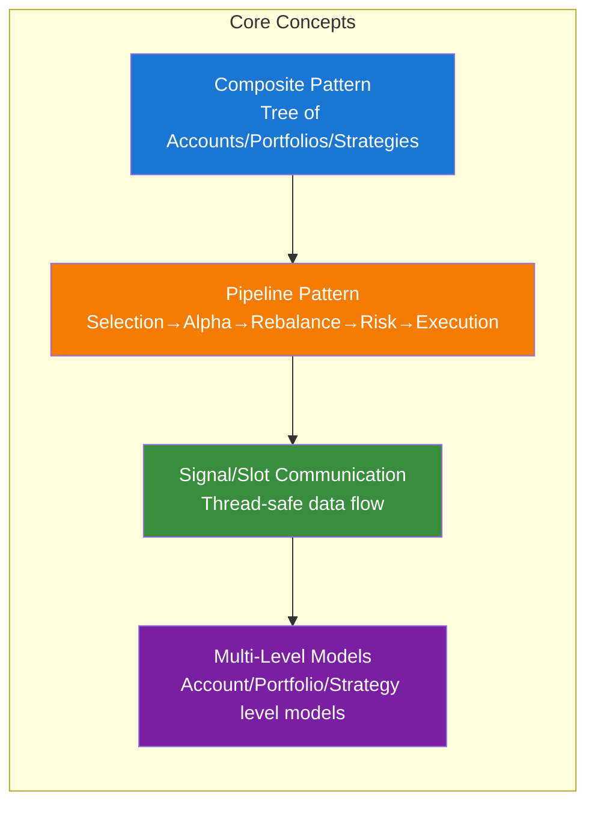

---

## Hierarchical Architecture

### Complete System Hierarchy

The system implements a four-level hierarchy with pipeline models at multiple levels:

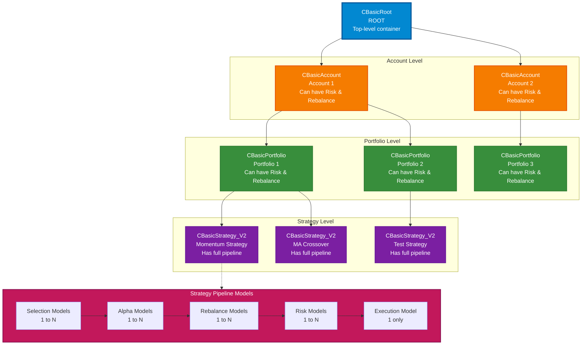

### Model Type Hierarchy

All nodes inherit from `CBaseModel` which implements `CGenericModelApi`:

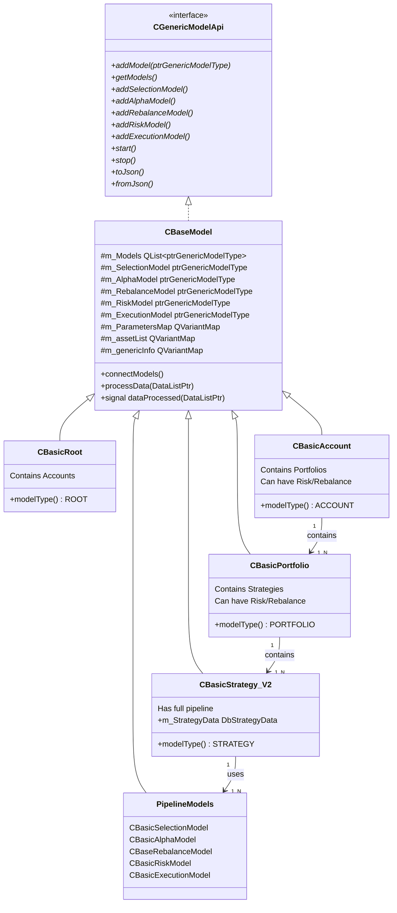

### Cardinality Rules

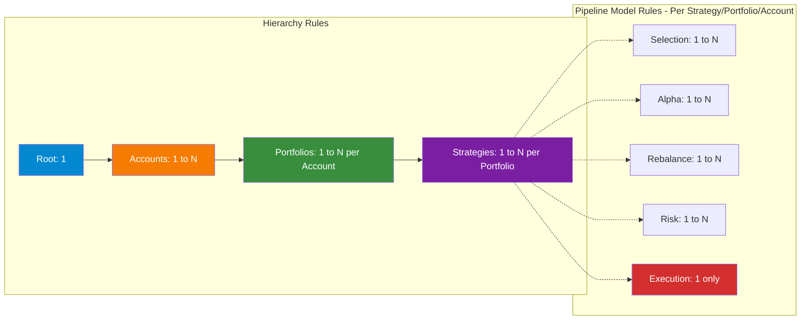

**Implementation Note**: Currently, the code allows adding pipeline models (Selection, Alpha, Rebalance, Risk, Execution) to Strategy nodes. The architecture supports adding Risk and Rebalance models to Account and Portfolio levels as well (since they inherit from `CBaseModel`), though the UI currently only exposes this for Strategy level.

---

## Pipeline Components

### The Five-Stage Pipeline

Each strategy processes trading signals through five sequential stages:

```mermaid
flowchart LR
    MD[Market Data<br/>Price Updates<br/>Historical Data]
    
    subgraph Pipeline[Strategy Processing Pipeline]
        direction LR
        
        S[1. Selection Model<br/><br/>Asset Universe<br/>Filtering]
        A[2. Alpha Model<br/><br/>Signal Generation<br/>Direction & Confidence]
        R[3. Rebalance Model<br/><br/>Position Sizing<br/>Portfolio Allocation]
        RS[4. Risk Model<br/><br/>Risk Checks<br/>Limits Validation]
        E[5. Execution Model<br/><br/>Order Placement<br/>Trade Execution]
        
        S -->|DataListPtr<br/>symbols| A
        A -->|DataListPtr<br/>+direction<br/>+probability| R
        R -->|DataListPtr<br/>+amount| RS
        RS -->|DataListPtr<br/>validated| E
    end
    
    MD --> S
    E --> Orders[Order System<br/>Interactive Brokers]
    Orders --> DB[(Database<br/>Trades<br/>Positions)]
    
    style S fill:#1976d2,color:#fff
    style A fill:#f57c00,color:#fff
    style R fill:#388e3c,color:#fff
    style RS fill:#d32f2f,color:#fff
    style E fill:#7b1fa2,color:#fff
    style MD fill:#616161,color:#fff
    style Orders fill:#455a64,color:#fff
    style DB fill:#546e7a,color:#fff
```

### 1. Selection Model

**Purpose**: Define the asset universe for the strategy

**Input**: Market data (implicit) or timer trigger
**Output**: `DataListPtr` containing list of symbols

**Implementation**: [`CBasicSelectionModel`](Strategies/Generic/cbasicselectionmodel.h)

**Key Responsibilities**:
- Filter assets based on criteria (e.g., S&P 500, sector, liquidity)
- Maintain list of tradeable instruments
- Can be static (config-based) or dynamic (data-driven)

**Example Implementation**:

```cpp
void CBasicSelectionModel::processData(DataListPtr data) {
    // Parse configured assets from parameters
    auto assets = this->m_ParametersMap["Selected_Assets"].toString();
    assets.remove(" ");
    auto assetList = assets.split(",");
    
    // Create output data list
    m_pAssetList->clear();
    for (const QString &str : assetList) {
        m_pAssetList->append(UnifiedModelData(str, DIRECTION_UNDEFINED, 0, 0));
    }
    
    // Pass to next stage (Alpha)
    emit dataProcessed(m_pAssetList);
}
```

**Output Data Structure**:
```cpp
UnifiedModelData {
    symbol: "AAPL",        // Asset symbol
    direction: UNDEFINED,  // Not set yet
    probability: 0.0,      // Not set yet
    amount: 0.0,           // Not set yet
    currentPrice: 0.0      // Not set yet
}
```

---

### 2. Alpha Model

**Purpose**: Generate trading signals (direction and confidence)

**Input**: `DataListPtr` from Selection Model (list of symbols)
**Output**: `DataListPtr` with `direction` and `probability` populated

**Implementation**: [`CBasicAlphaModel`](Strategies/Generic/cbasicalphamodel.h)

**Key Responsibilities**:
- Request historical/real-time data for symbols
- Apply trading algorithm (momentum, mean reversion, ML model, etc.)
- Determine signal direction: `DIRECTION_UP` (long) or `DIRECTION_DOWN` (short)
- Calculate signal confidence (`probability` field)
- Rank and filter signals

**Example Implementation** (Momentum-based):

```cpp
void CBasicAlphaModel::processData(DataListPtr data) {
    m_pProcessingData = data;
    
    // Request historical data for each symbol
    for (auto &item : *data) {
        histConfiguration.symbol = item.symbol;
        reqestHistoricalData(histConfiguration);
    }
}

void CBasicAlphaModel::slotCbkRecvHistoricalData(...) {
    // Calculate momentum for each asset
    for (const auto &symbol : m_historicalData.keys()) {
        double momentum = calculateMomentum(m_historicalData.value(symbol));
        momentumMap.insert(symbol, momentum);
    }
    
    // Rank by momentum and select top N
    std::sort(sortedMomentum.begin(), sortedMomentum.end(), 
              [](auto &a, auto &b) { return a.second > b.second; });
    
    // Create output with direction and confidence
    m_pProcessedData->clear();
    for (int i = 0; i < TOP_N && i < sortedMomentum.size(); ++i) {
        m_pProcessedData->append(
            UnifiedModelData(
                symbol,
                DIRECTION_UP,      // Signal direction
                momentum,          // Confidence/probability
                0.0,               // Amount not set yet
                currentPrice
            )
        );
    }
    
    emit dataProcessed(m_pProcessedData);
}
```

**Output Data Structure**:
```cpp
UnifiedModelData {
    symbol: "AAPL",
    direction: DIRECTION_UP,    // ✓ Set by Alpha
    probability: 0.85,          // ✓ Set by Alpha (signal strength)
    amount: 0.0,                // Not set yet
    currentPrice: 175.50        // ✓ Set by Alpha
}
```

---

### 3. Rebalance Model

**Purpose**: Calculate position sizes and portfolio allocation

**Input**: `DataListPtr` with symbols, directions, and confidence
**Output**: `DataListPtr` with `amount` populated (number of shares/contracts)

**Implementation**: [`CBaseRebalanceModel`](Strategies/Generic/cbaserebalancemodel.h)

**Key Responsibilities**:
- Access available buying power (BP) from parent strategy
- Query current open positions from database
- Calculate target portfolio weights
- Determine position sizes (number of shares)
- Handle rebalancing logic (equal weight, risk parity, confidence-weighted, etc.)

**Example Implementation** (Equal Weight):

```cpp
void CBaseRebalanceModel::processData(DataListPtr data) {
    if (nullptr != m_ParentModel) {
        CBasicStrategy_V2* parentModel = static_cast<CBasicStrategy_V2*>(this->getParentModel());
        
        // Get available buying power
        auto params = m_ParentModel->getParameters();
        qreal buyingPower = params["BP"].toReal();
        
        // Equal allocation across all signals
        qreal allocationPerAsset = buyingPower / data->length();
        
        // Calculate shares for each position
        for (auto &item : *data) {
            auto shares = static_cast<quint32>(allocationPerAsset / item.currentPrice);
            item.amount = shares;
            
            qCDebug() << item.symbol << item.direction 
                      << "Price:" << item.currentPrice
                      << "Shares:" << shares;
        }
        
        emit dataProcessed(data);
    }
}
```

**Output Data Structure**:
```cpp
UnifiedModelData {
    symbol: "AAPL",
    direction: DIRECTION_UP,
    probability: 0.85,
    amount: 28.0,              // ✓ Set by Rebalance (shares to trade)
    currentPrice: 175.50
}
```

**Rebalancing Strategies**:
- **Equal Weight**: Allocate BP equally across all signals
- **Confidence-Weighted**: Allocate more to higher-probability signals
- **Risk Parity**: Allocate based on asset volatility
- **Custom**: User-defined allocation logic

---

### 4. Risk Model

**Purpose**: Validate positions against risk limits and constraints

**Input**: `DataListPtr` with complete position information
**Output**: `DataListPtr` (filtered/modified to comply with risk rules)

**Implementation**: [`CBasicRiskModel`](Strategies/Generic/cbasicriskmodel.h)

**Key Responsibilities**:
- Check position size limits
- Validate portfolio-level exposure
- Enforce concentration limits
- Apply stop-loss/take-profit rules
- Risk budget management
- Reject or modify positions that violate risk rules

**Current Implementation** (Pass-through):
```cpp
void CBasicRiskModel::processData(DataListPtr data) {
    // Basic implementation: pass through all positions
    // Production implementation would validate risk limits
    emit dataProcessed(data);
}
```

**Production Risk Checks** (To Be Implemented):
```cpp
void CBasicRiskModel::processData(DataListPtr data) {
    auto riskValidatedData = createDataList();
    
    for (auto &item : *data) {
        // Check 1: Position size limit
        if (item.amount * item.currentPrice > m_maxPositionValue) {
            item.amount = m_maxPositionValue / item.currentPrice;
        }
        
        // Check 2: Portfolio concentration
        double positionWeight = (item.amount * item.currentPrice) / getTotalPortfolioValue();
        if (positionWeight > m_maxConcentration) {
            continue; // Skip this position
        }
        
        // Check 3: Sector exposure
        if (getSectorExposure(item.symbol) > m_maxSectorExposure) {
            continue; // Skip this position
        }
        
        riskValidatedData->append(item);
    }
    
    emit dataProcessed(riskValidatedData);
}
```

---

### 5. Execution Model

**Purpose**: Execute validated trades via broker API

**Input**: `DataListPtr` with validated positions
**Output**: Orders placed with broker

**Implementation**: [`CBasicExecutionModel`](Strategies/Generic/cbasicexecutionmodel.h)

**Key Responsibilities**:
- Convert `UnifiedModelData` to broker orders
- Place market/limit orders via Interactive Brokers API
- Handle order confirmations and fills
- Track execution status
- Save completed trades to database
- Handle partial fills and order rejections

**Implementation**:

```cpp
void CBasicExecutionModel::processData(DataListPtr data) {
    for (const auto &item : *data) {
        if (item.direction == DIRECTION_UP) {
            // Long position: Buy
            auto orderId = requestPlaceMarketOrder(
                item.symbol, 
                item.amount, 
                OA_BUY
            );
        }
        else if (item.direction == DIRECTION_DOWN) {
            // Short position: Sell
            auto orderId = requestPlaceMarketOrder(
                item.symbol, 
                item.amount, 
                OA_SELL
            );
        }
    }
}

// Handle execution confirmation
void CBasicExecutionModel::slotRecvExecutionReport(const CExecutionReport &obj) {
    // Create database trade record
    DbTrade newTrade;
    newTrade.strategyId = getParentModel()->getId().toString(QUuid::WithoutBraces);
    newTrade.symbol = obj.getTicker();
    newTrade.quantity = obj.getAmount();
    newTrade.price = obj.getAvgPrice();
    newTrade.execId = obj.getExecId();
    newTrade.tradeType = (m_Order.getDirection() == OA_SELL) ? "SELL" : "BUY";
    newTrade.date = QDateTime::currentDateTime().toString("yyyy-MM-dd HH:mm:ss.zzz");
    
    // Persist to database
    emit m_dbManager.signalAddNewTrade(newTrade);
}
```

**Order Types Supported**:
- Market orders (current implementation)
- Limit orders (extensible)
- Stop orders (extensible)
- Bracket orders (extensible)

---

## Data Flow

### UnifiedModelData Structure

Data flows through the pipeline using a standardized structure:

```cpp
struct UnifiedModelData {
    QString symbol;           // Asset symbol (e.g., "AAPL", "EUR.USD")
    eDirection direction;     // DIRECTION_UP, DIRECTION_DOWN, DIRECTION_FLAT, DIRECTION_UNDEFINED
    double probability;       // Signal confidence/strength [0.0 - 1.0]
    double amount;           // Position size (shares/contracts)
    double currentPrice;     // Current market price
}

using DataListPtr = QSharedPointer<QList<UnifiedModelData>>;
```

### Data Transformation Flow

```mermaid
graph TB
    subgraph Stage1[Selection Model]
        S1[Input: Timer/Market Data]
        S2[Process: Filter Asset Universe]
        S3[Output: List of Symbols<br/>symbol=AAPL<br/>direction=UNDEFINED<br/>probability=0.0<br/>amount=0.0]
    end
    
    subgraph Stage2[Alpha Model]
        A1[Input: List of Symbols]
        A2[Process: Calculate Signals<br/>Request Historical Data<br/>Apply Trading Logic]
        A3[Output: Symbols + Signals<br/>symbol=AAPL<br/>direction=UP ✓<br/>probability=0.85 ✓<br/>amount=0.0]
    end
    
    subgraph Stage3[Rebalance Model]
        R1[Input: Symbols + Signals]
        R2[Process: Portfolio Allocation<br/>Query Open Positions<br/>Calculate Position Sizes]
        R3[Output: Symbols + Amounts<br/>symbol=AAPL<br/>direction=UP<br/>probability=0.85<br/>amount=28 ✓]
    end
    
    subgraph Stage4[Risk Model]
        RS1[Input: Complete Positions]
        RS2[Process: Risk Validation<br/>Check Limits<br/>Apply Constraints]
        RS3[Output: Validated Positions<br/>symbol=AAPL<br/>direction=UP<br/>probability=0.85<br/>amount=28 ✓✓]
    end
    
    subgraph Stage5[Execution Model]
        E1[Input: Validated Positions]
        E2[Process: Place Orders<br/>Track Fills<br/>Handle Confirmations]
        E3[Output: Order IDs<br/>Execution Reports<br/>Database Records]
    end
    
    S1 --> S2 --> S3
    S3 -->|dataProcessed signal| A1
    A1 --> A2 --> A3
    A3 -->|dataProcessed signal| R1
    R1 --> R2 --> R3
    R3 -->|dataProcessed signal| RS1
    RS1 --> RS2 --> RS3
    RS3 -->|dataProcessed signal| E1
    E1 --> E2 --> E3
    
    style S2 fill:#1976d2,color:#fff
    style A2 fill:#f57c00,color:#fff
    style R2 fill:#388e3c,color:#fff
    style RS2 fill:#d32f2f,color:#fff
    style E2 fill:#7b1fa2,color:#fff
```

### Signal/Slot Connection Mechanism

The pipeline stages are connected using Qt's signal/slot mechanism:

```cpp
void CBaseModel::connectModels() {
    QList<QSharedPointer<CBaseModel>> models = {
        m_SelectionModel.staticCast<CBaseModel>(),
        m_AlphaModel.staticCast<CBaseModel>(),
        m_RebalanceModel.staticCast<CBaseModel>(),
        m_RiskModel.staticCast<CBaseModel>(),
        m_ExecutionModel.staticCast<CBaseModel>()
    };
    
    // Connect strategy to first non-null model
    for (auto &currentModel : models) {
        if (!currentModel.isNull()) {
            QObject::connect(this, &CBaseModel::dataProcessed,
                           currentModel.data(), &CBaseModel::processData);
            break;
        }
    }
    
    // Connect each model to the next
    QSharedPointer<CBaseModel> previousModel = nullptr;
    for (auto &currentModel : models) {
        if (!currentModel.isNull()) {
            if (!previousModel.isNull()) {
                QObject::connect(previousModel.data(), &CBaseModel::dataProcessed,
                               currentModel.data(), &CBaseModel::processData);
            }
            previousModel = currentModel;
        }
    }
}
```

**Connection Pattern**:
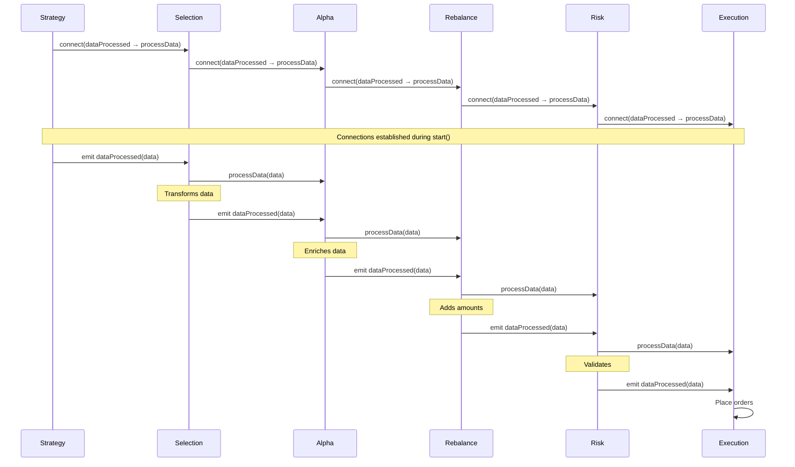

**Thread Safety**: All signals use `Qt::QueuedConnection` or `Qt::AutoConnection` to ensure thread-safe delivery across IB callback thread and main thread.

---

## Multi-Level Risk and Rebalance Management

### Architecture Support for Multi-Level Models

One of the key architectural features is that **Risk and Rebalance models can exist at three levels**:

1. **Strategy Level** (lowest priority)
2. **Portfolio Level** (medium priority)
3. **Account Level** (highest priority)

This allows for **hierarchical risk management** where higher-level constraints override lower-level decisions.

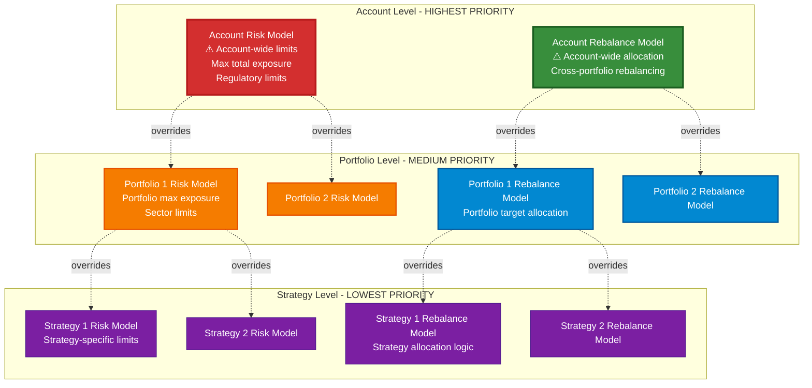

### Priority and Override Logic

**Conceptual Flow** (for Risk Model execution):

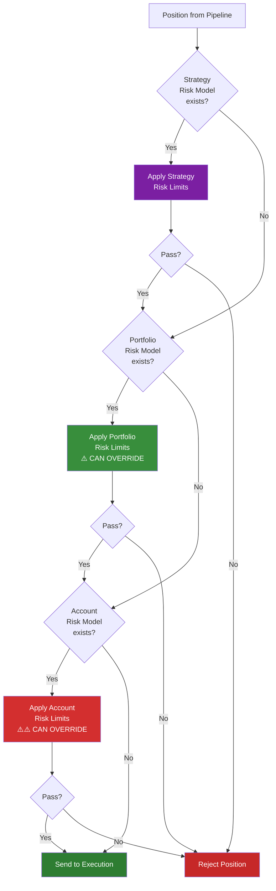

### Implementation Details

**Data Structure** (in `CBaseModel`):

```cpp
class CBaseModel : public CProcessingBase_v2, public CGenericModelApi {
protected:
    // Child models (Accounts, Portfolios, Strategies)
    QList<ptrGenericModelType> m_Models;
    
    // Pipeline models (can exist at ANY level)
    ptrGenericModelType m_SelectionModel;
    ptrGenericModelType m_AlphaModel;
    ptrGenericModelType m_RebalanceModel;    // ← Can be at Account/Portfolio/Strategy
    ptrGenericModelType m_RiskModel;         // ← Can be at Account/Portfolio/Strategy
    ptrGenericModelType m_ExecutionModel;
};
```

**Key Implementation Points**:

1. **All levels inherit from `CBaseModel`**:
   - `CBasicRoot` → `CBaseModel`
   - `CBasicAccount` → `CBaseModel`
   - `CBasicPortfolio` → `CBaseModel`
   - `CBasicStrategy_V2` → `CBaseModel`

2. **Each level can have pipeline models**:
   ```cpp
   // Account can have Risk and Rebalance
   account->addRiskModel(accountRiskModel);
   account->addRebalanceModel(accountRebalanceModel);
   
   // Portfolio can have Risk and Rebalance
   portfolio->addRiskModel(portfolioRiskModel);
   portfolio->addRebalanceModel(portfolioRebalanceModel);
   
   // Strategy always has full pipeline
   strategy->addSelectionModel(selectionModel);
   strategy->addAlphaModel(alphaModel);
   strategy->addRebalanceModel(rebalanceModel);
   strategy->addRiskModel(riskModel);
   strategy->addExecutionModel(executionModel);  // Only 1 execution model
   ```

3. **Execution Model is singular**:
   - Only **one** Execution Model per strategy
   - This is the final stage where orders are placed
   - All pipeline models are 1-N except Execution which is 1-1

---

## Implementation Details

### Model Creation Factory

All models are created via [`CStrategyFactory`](Strategies/Generic/cstrategyfactory.h):

```cpp
enum class ModelType {
    NONE,
    ROOT,
    ACCOUNT,
    PORTFOLIO,
    STRATEGY,
    STRATEGY_BASIC_TEST,
    STRATEGY_MA,
    STRATEGY_MOMENTUM,
    STRATEGY_SELECTION_MODEL,
    STRATEGY_ALPHA_MODEL,
    STRATEGY_REBALANCE_MODEL,
    STRATEGY_RISK_MODEL,
    STRATEGY_EXECTION_MODEL
};

ptrGenericModelType CStrategyFactory::createNewStrategy(ModelType type) {
    switch(type) {
        case ModelType::ROOT:
            return QSharedPointer<CBasicRoot>::create();
        case ModelType::ACCOUNT:
            return QSharedPointer<CBasicAccount>::create();
        case ModelType::PORTFOLIO:
            return QSharedPointer<CBasicPortfolio>::create();
        case ModelType::STRATEGY_MOMENTUM:
            return QSharedPointer<cMomentum>::create();
        case ModelType::STRATEGY_SELECTION_MODEL:
            return QSharedPointer<CBasicSelectionModel>::create();
        case ModelType::STRATEGY_ALPHA_MODEL:
            return QSharedPointer<CBasicAlphaModel>::create();
        case ModelType::STRATEGY_REBALANCE_MODEL:
            return QSharedPointer<CBaseRebalanceModel>::create();
        case ModelType::STRATEGY_RISK_MODEL:
            return QSharedPointer<CBasicRiskModel>::create();
        case ModelType::STRATEGY_EXECTION_MODEL:
            return QSharedPointer<CBasicExecutionModel>::create();
        default:
            return nullptr;
    }
}
```

### Model Lifecycle

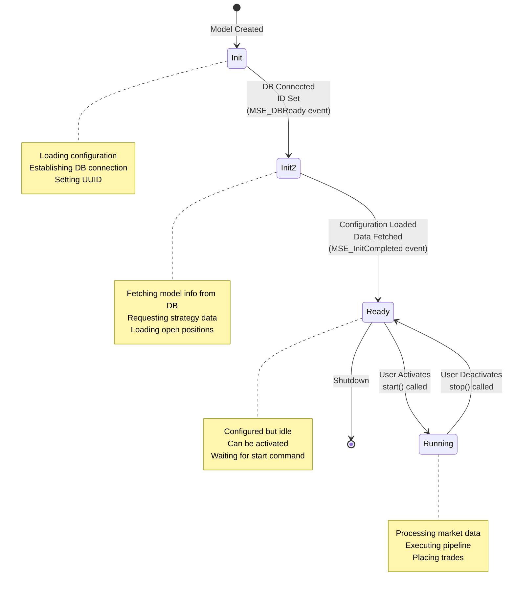

**State Machine Implementation**:
- Defined in [`CModelState`](Strategies/StateMachine/cmodelstate.h)
- Concrete states in [`cmodelstateimpl.h`](Strategies/StateMachine/cmodelstateimpl.h)
- Each model has `std::unique_ptr<CModelState> currentState`

### Strategy Initialization Flow

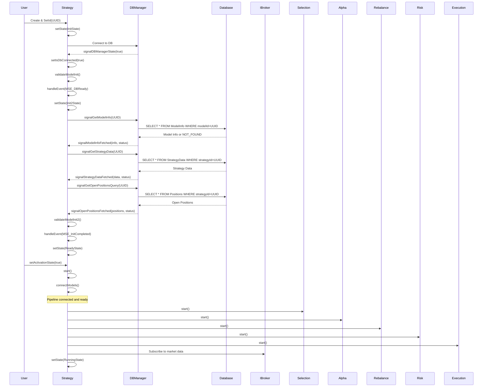

---

## Concrete Examples

### Example 1: Momentum Strategy Complete Flow

Let's trace a complete execution cycle for a Momentum strategy:

**Configuration**:
- Strategy: Momentum
- Selection: AAPL, MSFT, GOOGL, NVDA
- Alpha: 1-year momentum, top 3
- Rebalance: Equal weight allocation
- Risk: Pass-through (no limits)
- Execution: Market orders

```mermaid
flowchart TB
    Start([Timer Triggers<br/>Every 10 seconds])
    
    subgraph Sel[Selection Model]
        SelP[Read parameter:<br/>Selected_Assets=AAPL,MSFT,GOOGL,NVDA]
        SelO[Create DataList:<br/>4 symbols, direction=UNDEFINED]
    end
    
    subgraph Alph[Alpha Model - Momentum]
        AlpReq[Request 1-year historical data<br/>for AAPL, MSFT, GOOGL, NVDA]
        AlpWait[Wait for all 4 responses]
        AlpCalc[Calculate momentum:<br/>NVDA: +125%<br/>AAPL: +45%<br/>MSFT: +32%<br/>GOOGL: +15%]
        AlpSort[Sort by momentum<br/>Select top 3:<br/>NVDA, AAPL, MSFT]
        AlpOut[Output DataList:<br/>3 symbols<br/>direction=UP<br/>probability=momentum %]
    end
    
    subgraph Rebal[Rebalance Model]
        RebBP[Get buying power:<br/>BP = $10,000]
        RebCalc[Equal allocation:<br/>$10,000 / 3 = $3,333 each]
        RebShares[Calculate shares:<br/>NVDA@$500: 6 shares<br/>AAPL@$175: 19 shares<br/>MSFT@$320: 10 shares]
        RebOut[Output with amounts]
    end
    
    subgraph Rsk[Risk Model]
        RskCheck[Validate positions<br/>Current: pass-through]
        RskOut[Output validated data]
    end
    
    subgraph Exec[Execution Model]
        ExecPlace[Place orders:<br/>BUY 6 NVDA @Market<br/>BUY 19 AAPL @Market<br/>BUY 10 MSFT @Market]
        ExecWait[Wait for fills]
        ExecConf[Receive execution reports]
        ExecDB[Save trades to DB:<br/>Trades table<br/>Update Positions table]
    end
    
    Start --> SelP --> SelO
    SelO -->|emit dataProcessed| AlpReq
    AlpReq --> AlpWait --> AlpCalc --> AlpSort --> AlpOut
    AlpOut -->|emit dataProcessed| RebBP
    RebBP --> RebCalc --> RebShares --> RebOut
    RebOut -->|emit dataProcessed| RskCheck
    RskCheck --> RskOut
    RskOut -->|emit dataProcessed| ExecPlace
    ExecPlace --> ExecWait --> ExecConf --> ExecDB
    
    style Sel fill:#1976d2,color:#fff
    style Alph fill:#f57c00,color:#fff
    style Rebal fill:#388e3c,color:#fff
    style Rsk fill:#d32f2f,color:#fff
    style Exec fill:#7b1fa2,color:#fff
```

**Timeline** (Typical):
1. **T=0ms**: Timer triggers, Selection emits data
2. **T=1ms**: Alpha receives data, requests historical data from IB
3. **T=500ms**: Historical data arrives (async, IB callback thread)
4. **T=505ms**: Alpha calculates momentum, sorts, emits top 3
5. **T=506ms**: Rebalance calculates position sizes, emits
6. **T=507ms**: Risk validates (pass-through), emits
7. **T=508ms**: Execution places 3 market orders
8. **T=1000-2000ms**: Orders fill, execution reports received
9. **T=2500ms**: All trades saved to database

---

### Example 2: Multi-Level Risk Management

**Scenario**: A strategy generates a large position that gets limited by portfolio and account risk models.

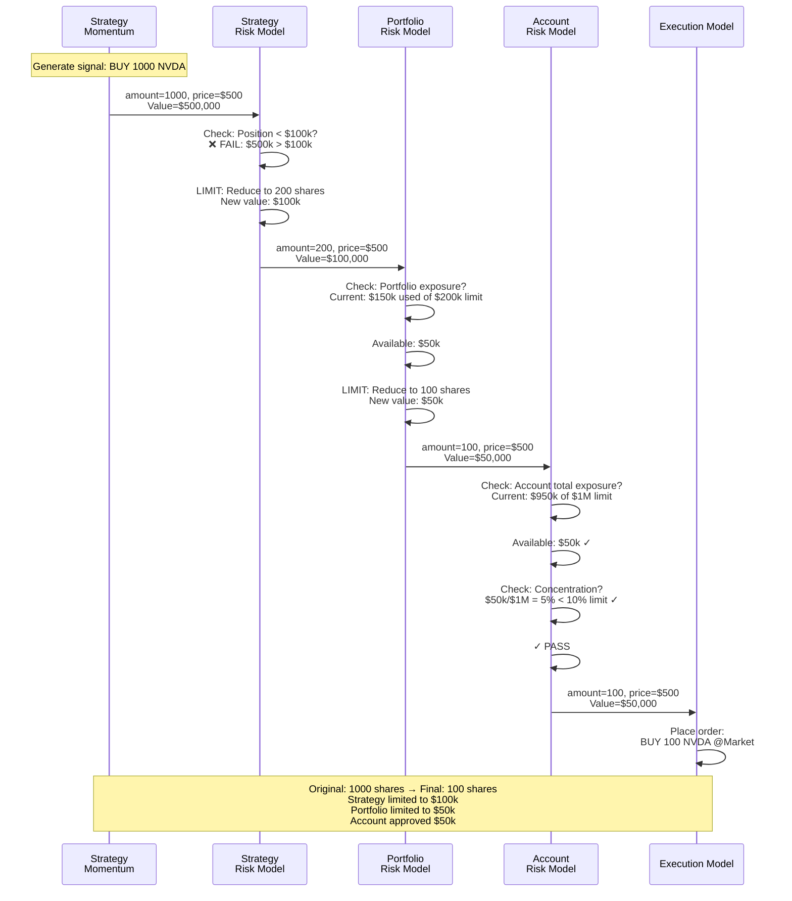

**Risk Limit Cascade**:
- Strategy wanted: 1000 shares ($500k)
- Strategy risk limit: Max $100k per position → **200 shares**
- Portfolio risk limit: Only $50k available → **100 shares**
- Account risk limit: Approved → **100 shares executed**

---

### Example 3: Multi-Strategy Portfolio

**Scenario**: Portfolio with 2 strategies, each with different pipeline configurations

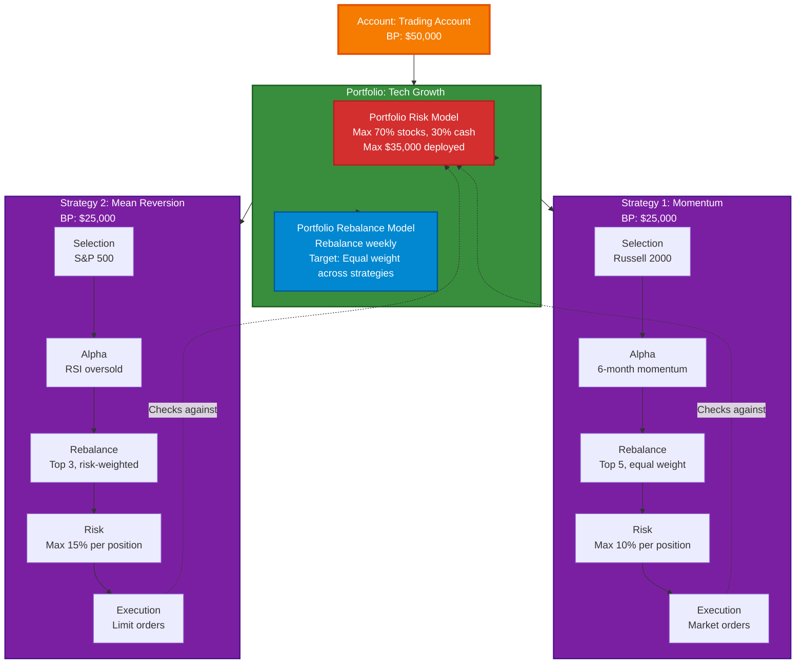

**Execution Flow**:

1. User activates Portfolio
2. Portfolio activates both Strategy 1 and Strategy 2
3. Each strategy runs independently:
   - Momentum: Analyzes Russell 2000, selects top 5 momentum stocks
   - Mean Reversion: Analyzes S&P 500, selects top 3 oversold stocks
4. Each strategy's Execution Model checks Portfolio Risk Model
5. Portfolio Risk Model ensures total exposure < $35k across both strategies
6. Orders placed via Interactive Brokers API

---

## State Management

### Model States

Each model progresses through a state machine:

```cpp
enum class e_modelState {
    MS_Init,      // Initial state, setting up
    MS_Init2,     // Secondary init, loading data
    MS_Ready,     // Ready to run
    MS_Running    // Actively processing
};

enum class e_modelStateEvent {
    MSE_DBReady,          // DB connection established
    MSE_InitCompleted,    // Configuration loaded
    MSE_Start,            // User activated
    MSE_Stop              // User deactivated
};
```

### Activation Propagation

Activation state propagates down the hierarchy:

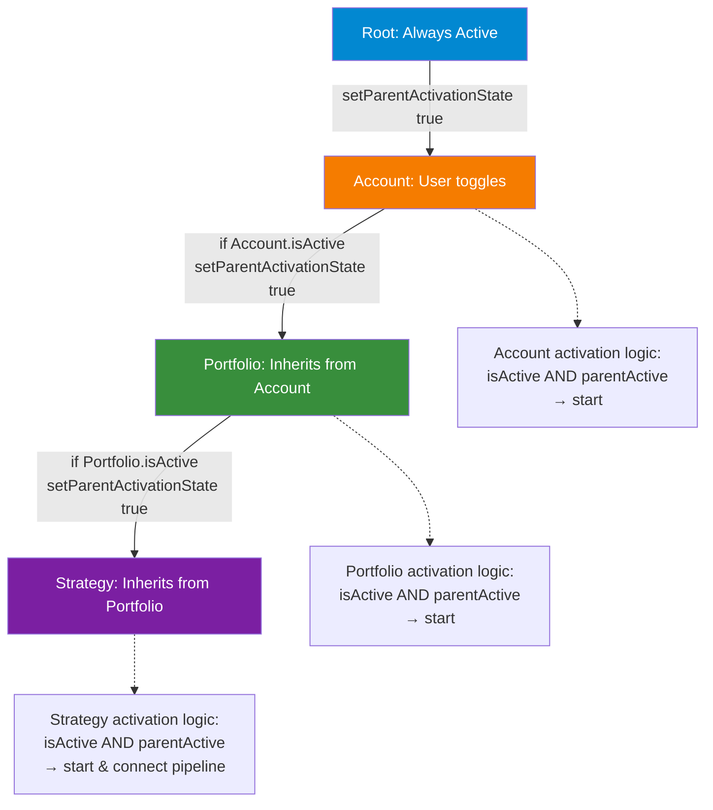

**Implementation**:

```cpp
void CBaseModel::setActivationState(bool state) {
    this->m_InfoMap[CIM_IsStarted] = state;
    
    // Propagate to children
    for (auto model : m_Models) {
        if (true == getParentActivatedState()) {
            model->setParentActivationState(state);
        }
    }
    
    // Start/stop if conditions met
    if (isConnectedTotheServer()) {
        if ((true == state) && (true == getParentActivatedState())) {
            start();  // Activate this model
        } else {
            stop();   // Deactivate this model
        }
    }
}
```

**Activation Conditions**:
A model runs only when:
1. `isActive` = true (user-configured checkbox)
2. `parentActivated` = true (parent is running)
3. `serverConnected` = true (IB connection active)

---

## Database Persistence

### Database Schema

The system uses **SQLite** for trading state persistence:

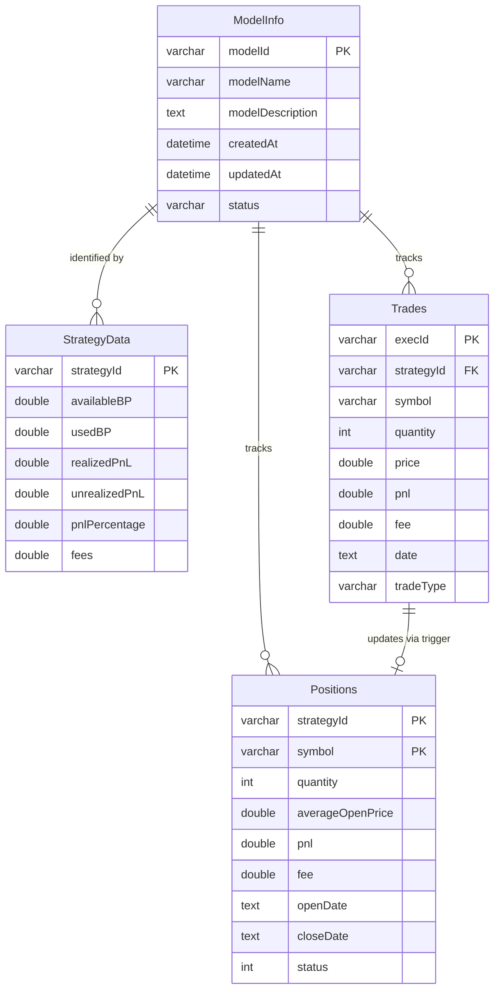

### Data Persistence Flow

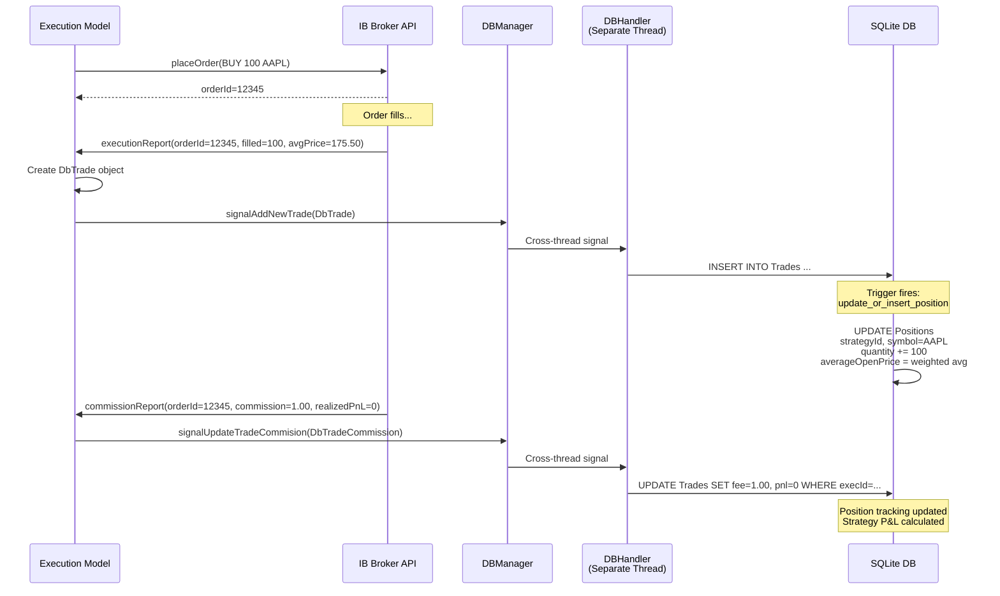

### Threading Model

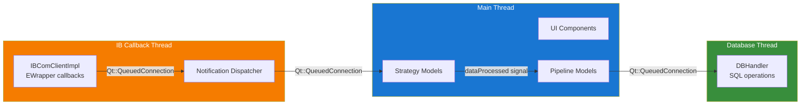

**Thread Safety**:
- IB callbacks arrive on IB's thread
- Dispatched to main thread via `Qt::QueuedConnection`
- Database operations on dedicated thread
- All cross-thread communication via queued signals

---

## Implementation Details

### Key Classes and Files

| Component | Header File | Implementation | Purpose |
|-----------|------------|----------------|---------|
| **Base Model** | `cbasemodel.h` | `cbasemodel.cpp` | Base class for all models |
| **Root** | `cbasicroot.h` | `cbasicroot.cpp` | Top-level container |
| **Account** | `cbasicaccount.h` | `cbasicaccount.cpp` | Account-level management |
| **Portfolio** | `cbasicportfolio.h` | `cbasicportfolio.cpp` | Portfolio-level management |
| **Strategy** | `cbasicstrategy_V2.h` | `cbasicstrategy_V2.cpp` | Base strategy class |
| **Selection Model** | `cbasicselectionmodel.h` | `cbasicselectionmodel.cpp` | Asset universe filtering |
| **Alpha Model** | `cbasicalphamodel.h` | `cbasicalphamodel.cpp` | Signal generation |
| **Rebalance Model** | `cbaserebalancemodel.h` | `cbaserebalancemodel.cpp` | Position sizing |
| **Risk Model** | `cbasicriskmodel.h` | `cbasicriskmodel.cpp` | Risk validation |
| **Execution Model** | `cbasicexecutionmodel.h` | `cbasicexecutionmodel.cpp` | Order execution |
| **Model API** | `cgenericmodelApi.h` | - | Common interface |
| **Data Structure** | `UnifiedModelData.h` | - | Pipeline data format |
| **Factory** | `cstrategyfactory.h` | `cstrategyfactory.cpp` | Model creation |

### Configuration Storage

Each model stores configuration in three `QVariantMap` structures:

```cpp
class CBaseModel {
protected:
    QVariantMap m_ParametersMap;  // User-configurable parameters
    QVariantMap m_assetList;      // Current positions/assets
    QVariantMap m_genericInfo;    // Runtime information/statistics
};
```

**Example Parameters** (Momentum Strategy):

```cpp
m_ParametersMap = {
    {"BP", 10000.0},                    // Buying power
    {"Cycle Time", 10000},              // Execution interval (ms)
    {"Momentum period", 1},             // Lookback period
    {"Momentum period resolution", "year"}, // Period unit
    {"Number of elements", 3}           // Top N to select
}
```

**Example Generic Info** (Runtime Statistics):

```cpp
m_genericInfo = {
    {"Id", "a7f3e9c2-4b1a-..."},       // Model UUID
    {"Name", "Momentum"},               // Display name
    {"PnL (%)", 15.3},                  // Performance
    {"Realized PnL", 1530.0},           // Closed P&L
    {"Unrealized PnL", 250.0},          // Open P&L
    {"Selected Assets", "NVDA, AAPL, MSFT"}  // Current holdings
}
```

### JSON Serialization

The entire hierarchy can be serialized to/from JSON:

```cpp
QJsonObject CBaseModel::toJson() const {
    QJsonObject json;
    json["m_uuid"] = m_uuid.toString(QUuid::WithoutBraces);
    json["modelType"] = static_cast<int>(modelType());
    json["parameters"] = QJsonObject::fromVariantMap(m_ParametersMap);
    json["assetList"] = QJsonObject::fromVariantMap(m_assetList);
    json["genericInfo"] = QJsonObject::fromVariantMap(m_genericInfo);
    
    // Serialize child models (Accounts/Portfolios/Strategies)
    QJsonArray modelsArray;
    for (const auto& model : m_Models) {
        modelsArray.append(model->toJson());
    }
    json["models"] = modelsArray;
    
    // Serialize pipeline models
    if (m_SelectionModel) json["selectionModel"] = m_SelectionModel->toJson();
    if (m_AlphaModel) json["alphaModel"] = m_AlphaModel->toJson();
    if (m_RebalanceModel) json["rebalanceModel"] = m_RebalanceModel->toJson();
    if (m_RiskModel) json["riskModel"] = m_RiskModel->toJson();
    if (m_ExecutionModel) json["executionModel"] = m_ExecutionModel->toJson();
    
    return json;
}
```

**JSON Structure Example**:

```json
{
  "m_uuid": "a7f3e9c2-4b1a-...",
  "modelType": 11,
  "parameters": {
    "BP": 10000.0,
    "Cycle Time": 10000
  },
  "models": [
    {
      "m_uuid": "b2c4d1e3-...",
      "modelType": 8,
      "models": []
    }
  ],
  "selectionModel": { ... },
  "alphaModel": { ... },
  "rebalanceModel": { ... },
  "riskModel": { ... },
  "executionModel": { ... }
}
```

---

## Complete End-to-End Execution Flow

### Full System Flow with All Components

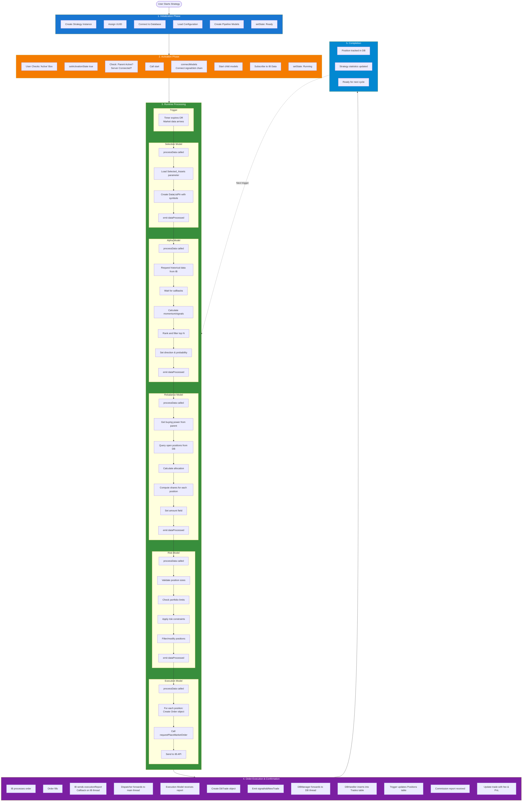

---

## Advanced Topics

### Multiple Models Per Stage

The architecture supports **multiple models at each pipeline stage** (except Execution, which is 1:1):

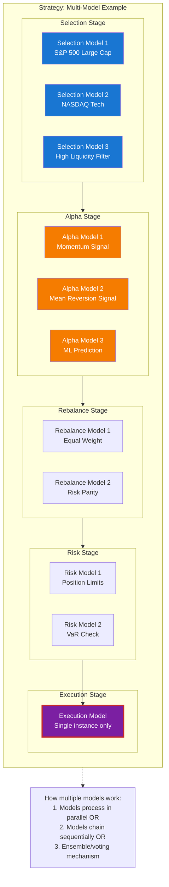

**Implementation Note**: The code currently supports storing multiple models in `m_Models` list. The exact behavior for multiple Selection/Alpha models (parallel vs sequential vs ensemble) would be defined by custom implementations of these model classes.

---

### Extensibility

The system is designed for easy extension:

**Adding a New Strategy Type**:

1. Create class inheriting from `CBasicStrategy_V2`
2. Implement `processData()` for custom logic
3. Add to `ModelType` enum
4. Add to `CStrategyFactory::createNewStrategy()`

**Adding a New Pipeline Model**:

1. Create class inheriting from `CBaseModel`
2. Implement `processData(DataListPtr)` and `emit dataProcessed(DataListPtr)`
3. Add to `ModelType` enum
4. Add to factory

**Example: Custom Risk Model with VaR**:

```cpp
class CVaRRiskModel : public CBaseModel {
public:
    void processData(DataListPtr data) override {
        auto validatedData = createDataList();
        
        for (auto &item : *data) {
            double var95 = calculateVaR(item.symbol, 0.95);
            double positionRisk = item.amount * item.currentPrice * var95;
            
            if (positionRisk < m_maxVaR) {
                validatedData->append(item);
            } else {
                // Reduce position to meet VaR limit
                item.amount = (m_maxVaR / var95) / item.currentPrice;
                validatedData->append(item);
            }
        }
        
        emit dataProcessed(validatedData);
    }
    
private:
    double calculateVaR(const QString& symbol, double confidence);
    double m_maxVaR;
};
```

---

## Configuration Management

### UI Integration

The system includes a Qt-based UI for configuring the hierarchy:

**Portfolio Configuration Model**: [`CPortfolioConfigModel`](MainSystem/CPortfolioConfigModel.h)

```mermaid
graph TB
    UI[Tree View UI<br/>IBTradeSystemView]
    
    subgraph ConfigModel[CPortfolioConfigModel]
        direction TB
        Tree[TreeItem Hierarchy<br/>Visual representation]
        Slots[Action Slots<br/>Add/Remove/Update]
    end
    
    subgraph DataModel[Data Model]
        direction TB
        Root[CBasicRoot]
        Models[Model Hierarchy]
    end
    
    UI <-->|Qt Model/View| ConfigModel
    ConfigModel <-->|Binds to| DataModel
    
    subgraph Actions[User Actions]
        A1[Add Account]
        A2[Add Portfolio]
        A3[Add Strategy]
        A4[Add Selection Model]
        A5[Add Alpha Model]
        A6[Add Rebalance Model]
        A7[Add Risk Model]
        A8[Add Execution Model]
        A9[Remove Model]
        A10[Edit Parameters]
    end
    
    UI --> Actions
    Actions -.-> Slots
    
    style UI fill:#1976d2,color:#fff
    style ConfigModel fill:#f57c00,color:#fff
    style DataModel fill:#388e3c,color:#fff
    style Actions fill:#7b1fa2,color:#fff
```

**Key UI Operations**:

```cpp
// Add models via UI
void CPortfolioConfigModel::slotOnClickAddAccount() {
    auto model = QSharedPointer<CBasicAccount>::create();
    model->setName("Account");
    model->setId(QUuid::createUuid());
    m_pRoot->addModel(model);
}

void CPortfolioConfigModel::slotOnClickAddStrategy() {
    // Finds selected portfolio, creates strategy, adds to portfolio
    auto model = CStrategyFactory::createNewStrategy(ModelType::STRATEGY_MOMENTUM);
    portfolio->addModel(model);
}

void CPortfolioConfigModel::slotOnClickAddSelectionModel() {
    // Finds selected strategy, creates selection model
    auto model = CStrategyFactory::createNewStrategy(ModelType::STRATEGY_SELECTION_MODEL);
    strategy->addSelectionModel(model);
}
```

### Configuration Persistence

**JSON File**: `model_tree_config.json`

```json
{
  "m_uuid": "root-uuid",
  "modelType": 7,
  "models": [
    {
      "m_uuid": "account-uuid-1",
      "modelType": 8,
      "parameters": {
        "Account": "DU1234567"
      },
      "riskModel": {
        "m_uuid": "account-risk-uuid",
        "modelType": 17,
        "parameters": {
          "Max_Account_Exposure": 1000000.0
        }
      },
      "models": [
        {
          "m_uuid": "portfolio-uuid-1",
          "modelType": 9,
          "parameters": {
            "Portfolio_Param": 100.1
          },
          "rebalanceModel": {
            "m_uuid": "portfolio-rebalance-uuid",
            "modelType": 16,
            "parameters": {
              "Rebalance_Frequency": "weekly"
            }
          },
          "models": [
            {
              "m_uuid": "strategy-uuid-1",
              "modelType": 13,
              "parameters": {
                "BP": 10000.0,
                "Cycle Time": 10000
              },
              "selectionModel": { ... },
              "alphaModel": { ... },
              "rebalanceModel": { ... },
              "riskModel": { ... },
              "executionModel": { ... }
            }
          ]
        }
      ]
    }
  ]
}
```

---

## Design Benefits

### 1. Modularity

Each pipeline stage is independently:
- **Testable**: Mock data can be injected at any stage
- **Swappable**: Replace implementations without affecting other stages
- **Configurable**: Parameters stored in `QVariantMap`

### 2. Composability

Multiple strategies can coexist with different configurations:
- Strategy A: Momentum with daily rebalancing
- Strategy B: Mean reversion with weekly rebalancing
- Both in same portfolio, sharing account-level risk limits

### 3. Flexibility

The architecture supports:
- **Multiple models per stage**: Ensemble methods, parallel signals
- **Multi-level risk management**: Hierarchical constraints
- **Dynamic reconfiguration**: Parameters can be updated at runtime
- **Custom implementations**: Extend base classes for domain-specific logic

### 4. Safety

- **Type-safe pointers**: `QSharedPointer<CGenericModelApi>`
- **Thread-safe communication**: Qt signal/slot with queued connections
- **State machine**: Prevents invalid state transitions
- **Database transactions**: ACID guarantees for trade records

### 5. Observability

The system provides visibility at every level:
- **Logging**: Per-model logging categories
- **Statistics**: Real-time P&L, positions, performance
- **UI Representation**: Tree view of entire hierarchy
- **Database History**: All trades and positions persisted

---

## Future Enhancements

### Planned Features

1. **Multi-Level Risk/Rebalance Execution**:
   - Currently supported in data structures
   - Need to implement priority/override logic
   - UI support for adding to Account/Portfolio levels

2. **Multiple Models Per Stage**:
   - Architecture supports it
   - Define ensemble/aggregation logic
   - Parallel vs sequential execution

3. **Advanced Risk Models**:
   - VaR calculation
   - CVaR (Conditional VaR)
   - Portfolio correlation analysis
   - Dynamic position sizing based on volatility

4. **Advanced Rebalance Models**:
   - Time-based rebalancing (daily/weekly/monthly)
   - Threshold-based rebalancing (rebalance when drift > X%)
   - Tax-aware rebalancing (minimize capital gains)

5. **Backtesting Integration**:
   - Run pipeline on historical data
   - Simulate execution without placing real orders
   - Performance analysis and optimization

---

## Conclusion

The IbTradeQt pipeline architecture provides a **robust, flexible, and extensible framework** for algorithmic trading. The five-stage pipeline (Selection → Alpha → Rebalance → Risk → Execution) combined with hierarchical model management (Account → Portfolio → Strategy) enables sophisticated trading strategies with proper risk management and portfolio allocation.

**Key Strengths**:
- ✅ Modular and composable design
- ✅ Multi-level risk and rebalance support
- ✅ Thread-safe execution
- ✅ Comprehensive persistence
- ✅ Extensible architecture
- ✅ Qt-based UI integration

**Production Readiness**:
- Core architecture: ✅ Implemented
- Basic pipeline models: ✅ Implemented
- Database persistence: ✅ Implemented
- Multi-level models: ⚠️ Partially implemented (data structures ready, logic pending)
- Advanced risk models: ⏳ To be implemented

---

## Quick Reference

### Pipeline Stage Responsibilities Summary

| Stage | Input | Enriches | Output | Purpose |
|-------|-------|----------|--------|---------|
| **Selection** | Timer/Event | `symbol` | List of symbols | Define tradeable universe |
| **Alpha** | Symbols | `direction`, `probability`, `currentPrice` | Signals | Generate trading signals |
| **Rebalance** | Signals | `amount` | Sized positions | Calculate position sizes |
| **Risk** | Positions | Validates/filters | Validated positions | Apply risk limits |
| **Execution** | Validated | Orders | Execution reports | Execute trades |

### Model Level Capabilities

| Level | Selection | Alpha | Rebalance | Risk | Execution | Child Models |
|-------|-----------|-------|-----------|------|-----------|--------------|
| **Root** | ❌ | ❌ | ❌ | ❌ | ❌ | Accounts |
| **Account** | ❌ | ❌ | ✅ | ✅ | ❌ | Portfolios |
| **Portfolio** | ❌ | ❌ | ✅ | ✅ | ❌ | Strategies |
| **Strategy** | ✅ (1-N) | ✅ (1-N) | ✅ (1-N) | ✅ (1-N) | ✅ (1-1) | Pipeline Models |

### File Location Reference

```
IbTradeQt/
├── Strategies/Generic/
│   ├── cbasemodel.h/cpp                    - Base model class
│   ├── cbasicroot.h/cpp                    - Root node
│   ├── cbasicaccount.h/cpp                 - Account node
│   ├── cbasicportfolio.h/cpp               - Portfolio node
│   ├── cbasicstrategy_V2.h/cpp             - Base strategy
│   ├── cbasicselectionmodel.h/cpp          - Selection model
│   ├── cbasicalphamodel.h/cpp              - Alpha model
│   ├── cbaserebalancemodel.h/cpp           - Rebalance model
│   ├── cbasicriskmodel.h/cpp               - Risk model
│   ├── cbasicexecutionmodel.h/cpp          - Execution model
│   ├── cgenericmodelApi.h                  - Common interface
│   ├── UnifiedModelData.h                  - Data structure
│   ├── ModelType.h                         - Enum definitions
│   ├── cstrategyfactory.h/cpp              - Factory pattern
│   ├── cmomentum.h/cpp                     - Momentum strategy
│   └── cmovingaveragecrossover.h/cpp       - MA crossover strategy
├── MainSystem/
│   ├── CPortfolioConfigModel.h/cpp         - UI model binding
│   └── PortfolioModelDefines.h             - Constants
├── DB/
│   ├── dbmanager.h/cpp                     - DB thread manager
│   ├── dbhandler.h/cpp                     - SQL operations
│   ├── dbdatatypes.h                       - Data structures
│   └── dbquery.h                           - SQL queries
└── Strategies/StateMachine/
    ├── cmodelstate.h                       - State interface
    └── cmodelstateimpl.h                   - State implementations
```

---

## Glossary

| Term | Definition |
|------|------------|
| **Pipeline** | Five-stage processing: Selection → Alpha → Rebalance → Risk → Execution |
| **UnifiedModelData** | Standardized data structure flowing through pipeline |
| **DataListPtr** | `QSharedPointer<QList<UnifiedModelData>>` |
| **BP** | Buying Power - available capital for trading |
| **ptrGenericModelType** | `QSharedPointer<CGenericModelApi>` - shared pointer to model |
| **Signal/Slot** | Qt's mechanism for callback-based communication |
| **ModelType** | Enum identifying model type (ROOT, ACCOUNT, STRATEGY, etc.) |
| **Composite Pattern** | Design pattern where nodes can contain children |
| **State Machine** | Init → Init2 → Ready → Running |

---

**Document Version**: 1.0  
**Last Updated**: 2026-03-04  
**Architecture Status**: Implemented and Active
