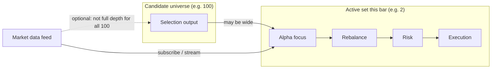
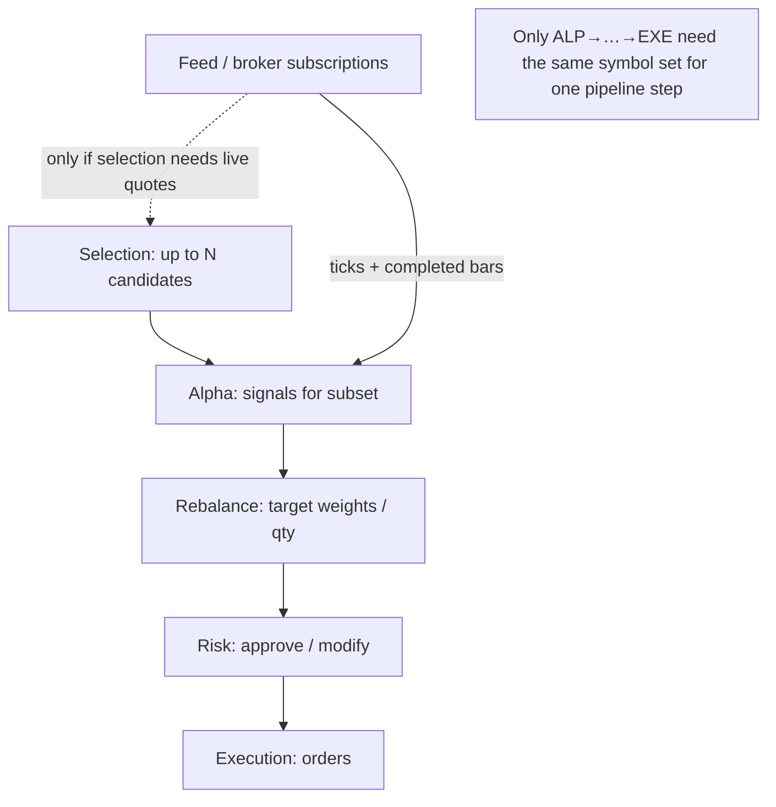
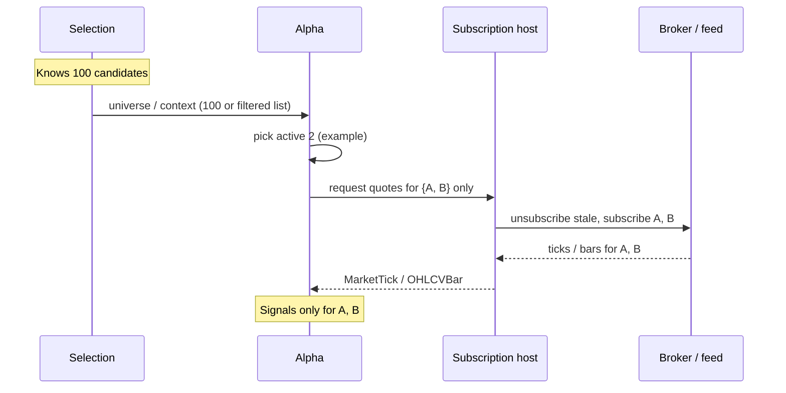
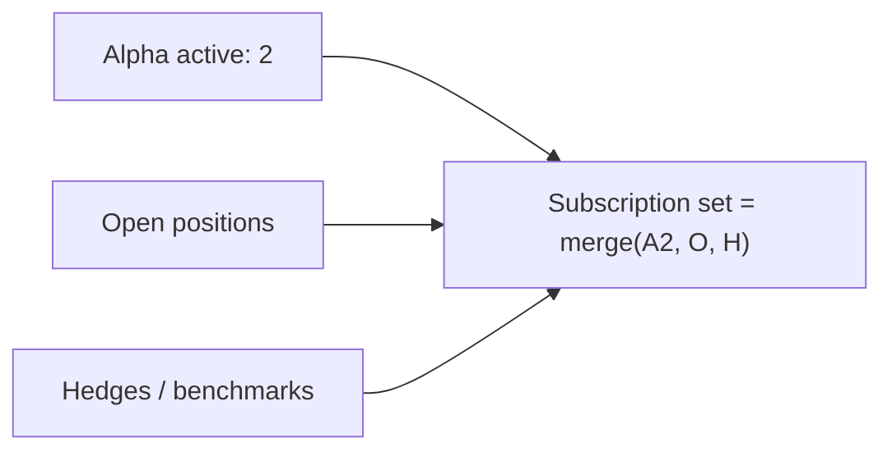

# Dynamic market-data subscription: from many candidates to few active names

This note explains **in plain language** how you can think about **who needs market data** when the **selection** layer proposes many symbols, but **alpha / rebalance / risk / execution** only care about a **small subset** at each step.

It is a **design guide**, not a guarantee that every behavior below is already implemented end-to-end in code.

---

## 1. The idea in one sentence

**Subscribe (or load) market data for the symbols you will actually trade or evaluate on the next bar—not necessarily for every name the selection block ever mentioned.**

---

## 2. Why this matters

| Layer | Role | Data need |
|--------|------|-----------|
| **Selection** | Produces a **large candidate** universe (e.g. 100 tickers from a list, scanner, or filter). | Often you only need **light** data to rank/filter, or you reuse a precomputed universe. |
| **Alpha** | Turns prices into **signals**; may **focus** on only a few names (e.g. top 2 by momentum). | Needs **full** tick/bar stream for those names it evaluates **this** bar. |
| **Rebalance** | Turns signals into **target positions**. | Needs prices/positions mainly for **symbols that have a non-zero target** (often the same small set). |
| **Risk** | Approves/modifies targets. | Same **active book** as rebalance. |
| **Execution** | Sends orders. | Only for **symbols you trade** (again, often the same small set). |

If you subscribed to **all 100** names at full depth forever, you waste bandwidth, IB lines, and CPU. If you subscribe only to **2**, you must **update subscriptions** when the active set **changes** (e.g. next bar the alpha picks different names).

---

## 3. Conceptual picture

**Key point:** **Market data** should be aligned with the **active set** (the symbols that alpha + downstream layers use **now**), not always with the full **candidate** list.

---

## 4. End-to-end flow (logical)

For your example:

- **100** = candidate tickers from selection.
- **2** = symbols the alpha actually uses to emit signals **this** evaluation (e.g. top-2 rule).
- **Rebalance / risk / execution** should operate on those **2** (plus any positions you must hedge/monitor—see §7).

---

## 5. Subscription scope vs pipeline “universe”

Two different ideas people mix up:

| Concept | Meaning |
|--------|---------|
| **Candidate universe** | Everything selection **could** trade (e.g. 100). |
| **Active subscription set** | Symbols for which the app **currently** requests **streaming** (or replay slice). |
| **Runner universe** | What `StrategyPipelineRunner` considers **tradeable** for selection + sizing—ideally consistent with subscription **or** a superset with lazy subscribe. |

**Ideal:** keep **active subscription set** as close as possible to **symbols the next alpha evaluation needs**, plus any **open positions** risk must see.

---

## 6. How dynamic subscription can work (mechanism)

Steps in words:

1. **Selection** outputs or bounds the candidate list (100).
2. **Alpha** (or a dedicated “subscription policy” next to it) decides the **active 2** for this bar or session.
3. A **single place** (host / adapter / `CPipelineStrategyAdapter`-style sync) tells the broker: **drop** symbols you no longer need, **add** new ones.
4. **Only** those streams feed **`ingestTick` / `ingestOhlcvBar`** for the strategy (or the runner filters—see §8).

Rebalance, risk, and execution then naturally only need data for **positions and targets** involving those symbols—often the same **2**, sometimes **2 + hedges**.

---

## 7. Risk and execution: “only 2” with caveats

- **Rebalance** needs prices (and sometimes vol) for **symbols in the target portfolio**.
- **Risk** may need **extra** symbols: e.g. index for beta, or **every open position** even if alpha did not fire this bar (for stop-loss).
- **Execution** only needs **symbols with orders**.

So the **minimal** subscription is not always “alpha’s 2” only—it is:

**Active alpha set ∪ open positions ∪ risk overlays (indices, hedges).**

---

## 8. Relation to the current pipeline shape

Today’s LEGO pipeline is built so that:

- **Market data enters only via** `StrategyPipelineRunner::ingestTick` / `ingestOhlcvBar` (and optional tick-by-tick).
- **Blocks** do not subscribe themselves; the **app** wires **one feed** (router or replayer) to the runner.

**Dynamic subscription** is therefore an **orchestration** concern:

- **Who** computes the active symbol set (often: alpha logic + position/risk policy).
- **Who** calls the broker to **change** subscriptions (presenter / adapter / supervisor).
- **When** to refresh (on bar close, on universe change, on timer).

That keeps the **pipeline** deterministic and testable while **live** behavior stays efficient.

---

## 9. Summary

| Question | Short answer |
|----------|----------------|
| Can alpha “use only 2” of 100? | **Yes**—alpha logic chooses the active subset; data feeds should follow that subset (+ positions/risk). |
| Do rebalance / risk / execution need 100 streams? | **No**—they need data for **targets and positions**, usually **O(active)** not **O(candidates)**. |
| What must we implement? | **Policy** for the active set + **one place** that updates broker subscriptions + **clear merge** with open positions and risk overlays. |

---

## 10. See also

- `docs/PIPELINE_ARCHITECTURE.md` — pipeline layers and broker boundary.
- `Pipeline/UniverseResolver.h` — how selection config resolves static symbol lists vs external universe.
- `Strategies/Generic/cpipelinestrategyadapter.h` — `syncLiveMarketDataSubscriptionsTo` / `computeTradeableSymbolSet` for live wiring patterns.
