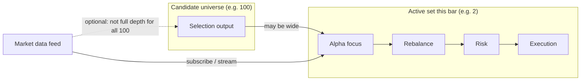
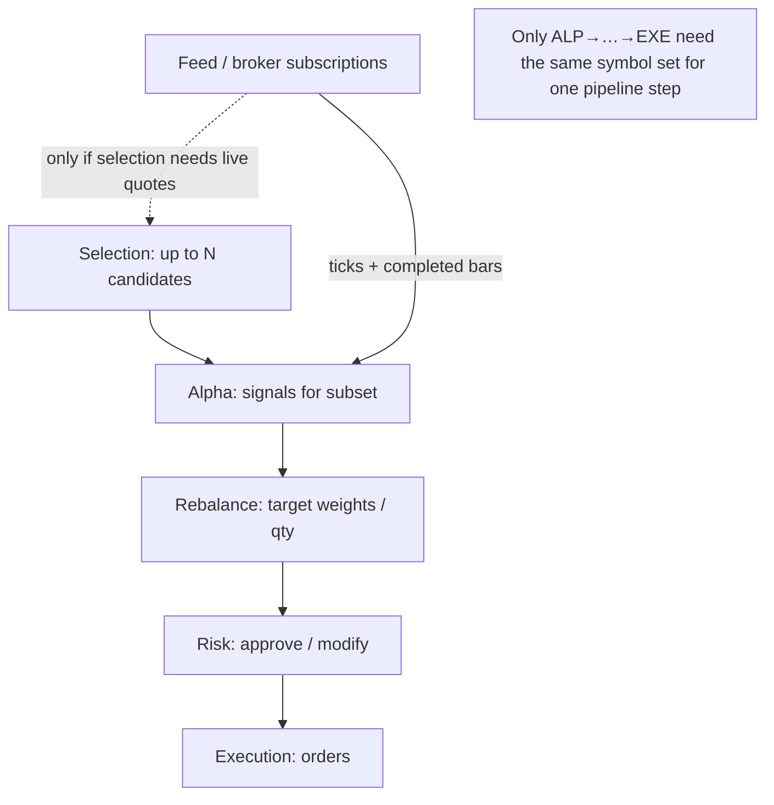
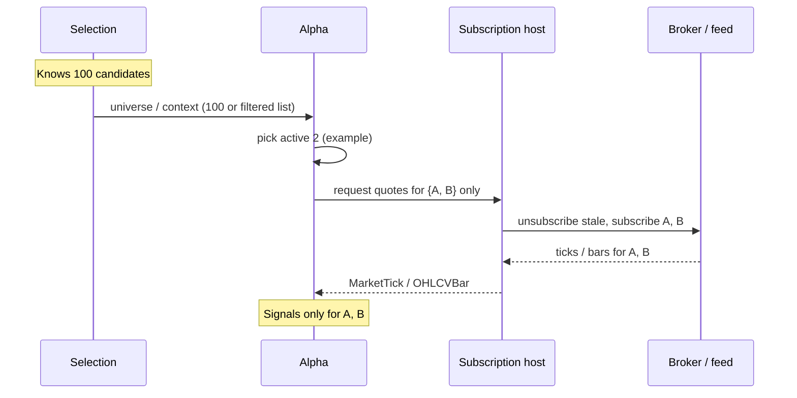
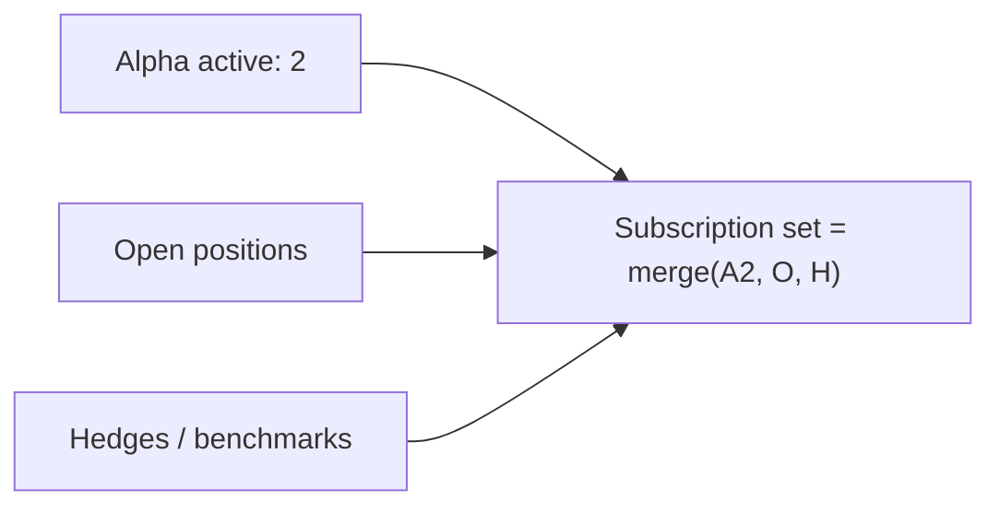

# Dynamic market-data subscription: from many candidates to few active names

This note explains **in plain language** how you can think about **who needs market data** when the **selection** layer proposes many symbols, but **alpha / rebalance / risk / execution** only care about a **small subset** at each step.

It is a **design guide**, not a guarantee that every behavior below is already implemented end-to-end in code.

---

## 1. The idea in one sentence

**Subscribe (or load) market data for the symbols you will actually trade or evaluate on the next bar—not necessarily for every name the selection block ever mentioned.**

---

## 2. Why this matters

| Layer | Role | Data need |
|--------|------|-----------|
| **Selection** | Produces a **large candidate** universe (e.g. 100 tickers from a list, scanner, or filter). | Often you only need **light** data to rank/filter, or you reuse a precomputed universe. |
| **Alpha** | Turns prices into **signals**; may **focus** on only a few names (e.g. top 2 by momentum). | Needs **full** tick/bar stream for those names it evaluates **this** bar. |
| **Rebalance** | Turns signals into **target positions**. | Needs prices/positions mainly for **symbols that have a non-zero target** (often the same small set). |
| **Risk** | Approves/modifies targets. | Same **active book** as rebalance. |
| **Execution** | Sends orders. | Only for **symbols you trade** (again, often the same small set). |

If you subscribed to **all 100** names at full depth forever, you waste bandwidth, IB lines, and CPU. If you subscribe only to **2**, you must **update subscriptions** when the active set **changes** (e.g. next bar the alpha picks different names).

---

## 3. Conceptual picture

**Key point:** **Market data** should be aligned with the **active set** (the symbols that alpha + downstream layers use **now**), not always with the full **candidate** list.

---

## 4. End-to-end flow (logical)

For your example:

- **100** = candidate tickers from selection.
- **2** = symbols the alpha actually uses to emit signals **this** evaluation (e.g. top-2 rule).
- **Rebalance / risk / execution** should operate on those **2** (plus any positions you must hedge/monitor—see §7).

---

## 5. Subscription scope vs pipeline “universe”

Two different ideas people mix up:

| Concept | Meaning |
|--------|---------|
| **Candidate universe** | Everything selection **could** trade (e.g. 100). |
| **Active subscription set** | Symbols for which the app **currently** requests **streaming** (or replay slice). |
| **Runner universe** | What `StrategyPipelineRunner` considers **tradeable** for selection + sizing—ideally consistent with subscription **or** a superset with lazy subscribe. |

**Ideal:** keep **active subscription set** as close as possible to **symbols the next alpha evaluation needs**, plus any **open positions** risk must see.

---

## 6. How dynamic subscription can work (mechanism)

Steps in words:

1. **Selection** outputs or bounds the candidate list (100).
2. **Alpha** (or a dedicated “subscription policy” next to it) decides the **active 2** for this bar or session.
3. A **single place** (host / adapter / `CPipelineStrategyAdapter`-style sync) tells the broker: **drop** symbols you no longer need, **add** new ones.
4. **Only** those streams feed **`ingestTick` / `ingestOhlcvBar`** for the strategy (or the runner filters—see §8).

Rebalance, risk, and execution then naturally only need data for **positions and targets** involving those symbols—often the same **2**, sometimes **2 + hedges**.

---

## 7. Risk and execution: “only 2” with caveats

- **Rebalance** needs prices (and sometimes vol) for **symbols in the target portfolio**.
- **Risk** may need **extra** symbols: e.g. index for beta, or **every open position** even if alpha did not fire this bar (for stop-loss).
- **Execution** only needs **symbols with orders**.

So the **minimal** subscription is not always “alpha’s 2” only—it is:

**Active alpha set ∪ open positions ∪ risk overlays (indices, hedges).**

---

## 8. Relation to the current pipeline shape

Today’s LEGO pipeline is built so that:

- **Market data enters only via** `StrategyPipelineRunner::ingestTick` / `ingestOhlcvBar` (and optional tick-by-tick).
- **Blocks** do not call `reqMktData` themselves; the **app** wires **one feed** (router or replayer) to the runner.
- **Blocks may request** a streaming symbol set via **`Pipeline::IDataSubscriptionPort`** on `PipelineRuntimeContext::subscription`. The strategy **`CPipelineStrategyAdapter`** implements that port, merges contributions in **`SubscriptionRequestStore`** with `UniverseResolver` / `assetList()` inside **`computeTradeableSymbolSet()`**, then applies diffs through **`refreshMarketUniverseAndSubscriptions()`** (queued when a block updates its request).

**Dynamic subscription** is therefore an **orchestration** concern:

- **Who** computes the active symbol set (universe config + optional block requests + later: positions / overlays).
- **Who** calls the broker to **change** subscriptions (still **`CPipelineStrategyAdapter::syncLiveMarketDataSubscriptionsTo`** only).
- **When** to refresh: after **`setDesiredSymbols` / `clearOwner`** (adapter schedules refresh on its thread).

That keeps the **pipeline** deterministic and testable while **live** behavior stays efficient.

---

## 9. Option C in this codebase (coordinator + central ingress)

These pieces implement the **hybrid** described in `docs/PIPELINE_ARCHITECTURE.md` (central feed + subscription union + read-through accessors):

| Piece | Role |
|-------|------|
| **`Pipeline::IDataSubscriptionPort`** (`Pipeline/IDataSubscriptionPort.h`) | Blocks call **`setDesiredSymbols(ownerId, symbols)`** / **`clearOwner`**; wire subscribe stays out of blocks. |
| **`Pipeline::SubscriptionRequestStore`** | Thread-safe owner → symbols map; merged into **`computeTradeableSymbolSet()`**. |
| **`Pipeline::MarketDataCoordinator`** (`Pipeline/MarketDataCoordinator.{h,cpp}`) | Computes **subscribe / unsubscribe** diffs for the union of symbols strategies need. |
| **`CPipelineStrategyAdapter::syncLiveMarketDataSubscriptionsTo`** | Applies that union to the live market-data path (no per-block `reqMktData`). |
| **`StrategyPipelineRunner::ingestTick` / `ingestOhlcvBar`** | Sole ingress from `MarketDataRouter` or `MarketDataReplayer` to pipeline blocks. |
| **`Pipeline::mergeModelDataWithTickSignals`** (`Pipeline/SemanticPipelineChain.{h,cpp}`) | Single merge of semantic `ModelDataList` with tick-accumulated `Signal`s before conversion to `Signal` for rebalance (one mapping choke point). |
| **`IMarketDataAccessor` / `IHistoricalRead`** | Blocks read prices or history through **injected** ports; backtest uses `BacktestMarketDataAccessor` / `BacktestHistoricalReadAdapter`, live uses the same interfaces with `LiveHistoricalReadAdapter` + broker (`LiveHistoricalReadAdapter::setBrokerDataProvider`). |

---

## 10. Summary

| Question | Short answer |
|----------|----------------|
| Can alpha “use only 2” of 100? | **Yes**—alpha logic chooses the active subset; data feeds should follow that subset (+ positions/risk). |
| Do rebalance / risk / execution need 100 streams? | **No**—they need data for **targets and positions**, usually **O(active)** not **O(candidates)**. |
| What must we implement? | **Policy** for the active set + **one place** that updates broker subscriptions + **clear merge** with open positions and risk overlays. |

---

## 11. See also

- `docs/PIPELINE_ARCHITECTURE.md` — pipeline layers and broker boundary.
- `Pipeline/UniverseResolver.h` — how selection config resolves static symbol lists vs external universe.
- `Strategies/Generic/cpipelinestrategyadapter.h` — `IDataSubscriptionPort` implementation, `syncLiveMarketDataSubscriptionsTo` / `computeTradeableSymbolSet` for live wiring patterns.

---

## 12. What is implemented in this repo (as of the subscription port work)

### 12.1 Wire-level kinds (`IDataSubscriptionPort`)

`Pipeline::IDataSubscriptionPort` (`Pipeline/IDataSubscriptionPort.h`) supports a **bitmask** of `SubscriptionKind` per owner contribution:

| Kind | Meaning | Live path |
|------|-----------|-----------|
| **TopOfBook** | Level-1 / last quote style stream | `reqMktData`-style subscription via `MarketDataCoordinator` + `CPipelineStrategyAdapter::syncLiveMarketDataSubscriptionsTo` |
| **RealtimeBars** | Streaming OHLC bars | Routed through the RT-bars coordinator in the same sync |
| **TickByTick** | Tick-by-tick trades | Routed through the TBT coordinator (`reqTickByTickData`-style config) |

`setDesiredSymbols` defaults to **TopOfBook** only. Use `setDesiredSymbolsWithKinds(ownerId, symbols, kindMask)` when a block needs multiple APIs for the same symbol (OR bits together).

`SubscriptionRequestStore::mergeSymbolKindMasks(baseSymbols)` OR-combines masks per symbol; base universe symbols get **TopOfBook** by default so the tradeable set always has a sensible minimum.

### 12.2 One evaluation epoch per pipeline run

`StrategyPipelineRunner` calls **`beginPipelineEvaluation()`** on the injected port **after** evaluation gating passes and **before** selection runs, and **`endPipelineEvaluation()`** when the run finishes (via `emitPipelineCompleted`, including early exits).

On **`CPipelineStrategyAdapter`**, that maps to:

- **Begin:** `SubscriptionRequestStore::clearAll()` + defer broker refresh (`m_deferSubscriptionRefresh = true`) so blocks refill owner rows during the same run without stale cross-run data.
- **End:** clear defer + `refreshMarketUniverseAndSubscriptions()` (merges block requests with `computeBaseSymbolList()`, updates supervisor universe / backtest runner universe, and in **Live** mode applies the three coordinator channels to IB).

### 12.3 Base symbol list (tradeable superset)

`CPipelineStrategyAdapter::computeBaseSymbolList()` unions:

- Resolved **selection / asset list** (via `UniverseResolver` / `assetList()`),
- **Open positions** for the strategy (when live position data is available),
- **Backtest profile default benchmark** and optional **`subscriptionOverlaySymbols`** in pipeline JSON (extra indices/hedges/overlays).

`computeTradeableSymbolSet()` returns `mergeUnion(computeBaseSymbolList())` against `SubscriptionRequestStore`.

### 12.4 Runtime wiring

| Mode | `PipelineRuntimeContext::subscription` | `marketData` (last tick) |
|------|----------------------------------------|---------------------------|
| **Live** (`StrategyRuntime`) | `CPipelineStrategyAdapter` (same object implements the port) | `RouterMarketDataAccessor` after `connectToMarketData` (delegates to `MarketDataRouter::lastPrice` / `hasLastTick`) |
| **Backtest session** (`BacktestSession`) | `NoOpSubscriptionPort` (no broker effect; blocks may still call the port for tests) | `BacktestMarketDataAccessor` |

### 12.5 Stable owner IDs from pipeline JSON

`PipelineFactory` sets `QObject::objectName` from each block entry’s **`"id"`** field when present. `Pipeline::subscriptionOwnerId` (`Pipeline/BlockSubscriptionUtils.h`) prefers `objectName()` so owner keys look like `alpha:<pipeline-instance-id>` instead of only `alpha:<type>:<pointer>`.

### 12.6 Tests

- **Store / bitmask:** `tests/phase1/tst_subscription_request_store.h` (`mergeSymbolKindMasks`, recording port contract).
- **Runner + port:** `tests/phase3/tst_pipeline_runner.h` — `subscriptionEpoch_recordingPort_seesBeginSelectionThenEnd` uses `RunnerRecordingSubscriptionPort` with a real `StrategyPipelineRunner` + `StaticListSelectionBlock` (verifies **begin → block `setDesired` → end** ordering).
- **Adapter epoch (pure backtest):** `tests/integration/tst_pipeline_strategy_adapter.h` — `CPipelineStrategyAdapter` **begin / setDesired / end** on a started pure-backtest adapter (no crash; `QCoreApplication::processEvents` after end).
