# IbTradeQt Architecture Documentation

## Table of Contents
1. [Project Overview](#project-overview)
2. [High-Level Architecture](#high-level-architecture)
3. [Backend Service Layer](#backend-service-layer)
4. [Component Architecture](#component-architecture)
5. [Design Patterns](#design-patterns)
6. [Strategy Framework Architecture](#strategy-framework-architecture)
7. [Strategy Catalog and Versioning](#strategy-catalog-and-versioning)
8. [Data Flow Architecture](#data-flow-architecture)
9. [Threading Architecture](#threading-architecture)
10. [Database Architecture](#database-architecture)
11. [UI Architecture](#ui-architecture)
12. [CLI Architecture](#cli-architecture)
13. [Key Classes Reference](#key-classes-reference)

---

## Project Overview

**IbTradeQt** is a Qt-based algorithmic trading platform designed for automated trading through Interactive Brokers (IB) TWS API. The system provides a flexible framework for implementing, testing, and executing trading strategies with a composable pipeline architecture, a backend-service persistence layer, and support for multiple clients (GUI, CLI, future MCP).

### Key Features
- Hierarchical portfolio and strategy management (Account → Portfolio → Strategy)
- Composable LEGO pipeline blocks (Selection → Alpha → Rebalance → Risk → Execution)
- **Backend service as single system boundary** — all mutations flow through `ISystemBackend`
- SQLite-backed persistent model tree (`model_nodes` table)
- Real-time and historical market data processing via typed signal routers
- Multi-threaded execution for responsive UI
- Client-independent architecture (GUI, CLI, future MCP all use the same backend API)

### Technology Stack

| Component | Technology |
|-----------|-----------|
| **GUI Framework** | Qt 6.x (QtCore, QtWidgets, QtCharts, QtSql) |
| **Language** | C++17 |
| **Build System** | qmake (`.pro` files) |
| **Broker API** | Interactive Brokers TWS C++ API |
| **Model Persistence** | SQLite (`model_nodes`, `app_metadata` tables) |
| **Market Data Storage** | PostgreSQL |
| **Trading State Storage** | SQLite (positions, trades, strategy data) |
| **Decimal Precision** | Intel Binary Decimal Library (libbid) |

### Entry Point

The application starts in `main.cpp`:
1. Initializes logging system (`MyLogger`)
2. Creates Qt application
3. Instantiates `CApplicationController`
4. Sets up MVC components via `setUpApplication()`
5. Shows main window and enters Qt event loop

---

## High-Level Architecture

IbTradeQt uses a **backend-service architecture** where `ISystemBackend` is the single boundary between clients and the rest of the system:

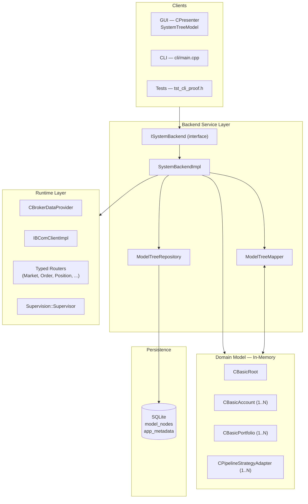

### Architectural Principles

1. **ISystemBackend is the only mutation path** — no client may call `addModel()`, `fromJson()`, or `setActivationState()` directly. All changes go through the backend.
2. **DB-first consistency** — the order for any mutation is: validate → persist to DB → mutate in-memory → rebuild UUID index → emit signal.
3. **Persistent vs runtime state are strictly separated** — `config_json` in the DB stores only stable configuration (parameters, assetList, pipelineConfig). Runtime state (PnL, displayState, broker connection) lives in memory and is never written back to `model_nodes`.
4. **ROOT is synthetic** — `CBasicRoot` is never persisted. Only accounts, portfolios, and strategies have rows in `model_nodes`. The root is reconstructed in memory during `loadFromDb()`.
5. **Blocks are embedded** — pipeline blocks are stored inside the strategy's `config_json.pipelineConfig`, not as independent rows.

---

## Backend Service Layer

This is the core architectural addition. It separates the presentation and runtime layers from persistence and domain logic.

### Interface — `ISystemBackend`

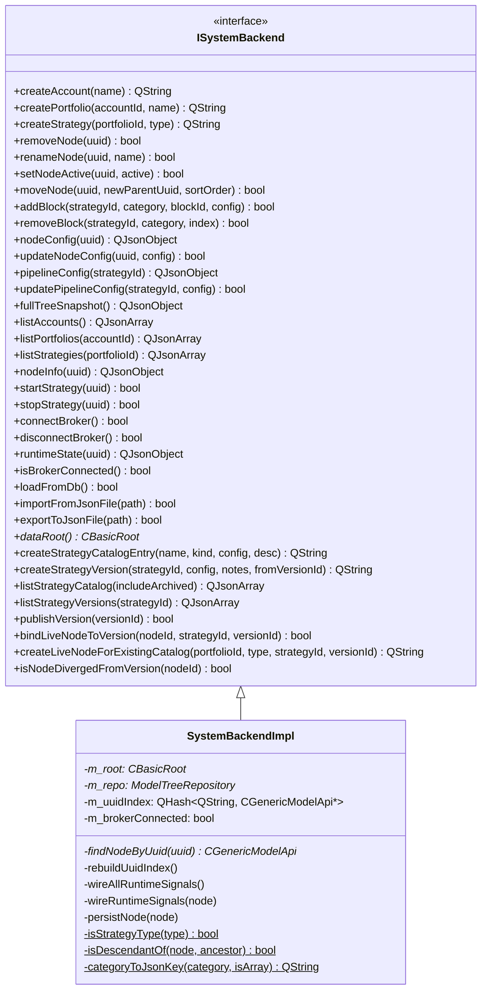

### Signals emitted by ISystemBackend

| Signal | When |
|--------|------|
| `nodeCreated(uuid, parentUuid, modelType)` | Account/portfolio/strategy created |
| `nodeRemoved(uuid)` | Node removed from tree |
| `nodeRenamed(uuid, newName)` | Node renamed |
| `nodeActiveChanged(uuid, active)` | Active state toggled |
| `nodeMoved(uuid, newParentUuid)` | Node moved in tree |
| `configChanged(uuid)` | Node config updated |
| `pipelineConfigChanged(uuid, config)` | Pipeline config updated |
| `treeLoaded()` | Tree loaded from DB or imported |
| `strategyStateChanged(uuid, displayState)` | Runtime: strategy state changed |
| `pnlUpdated(uuid, pnl)` | Runtime: PnL updated |
| `brokerConnectionChanged(connected)` | Runtime: broker connect/disconnect |
| `strategyCatalogChanged(strategyId)` | Strategy catalog entry created/updated |
| `strategyVersionCreated(strategyId, versionId)` | New version snapshot created |
| `nodeConfigDiverged(nodeId)` | Live node config differs from pinned version |

### DB-First Mutation Pattern

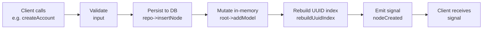

If the DB write fails, in-memory state is never mutated.

### Repository — `ModelTreeRepository`

Direct CRUD access to the `model_nodes` SQLite table. Operates only on `ModelNodeRecord` DTOs — it has no knowledge of domain objects.

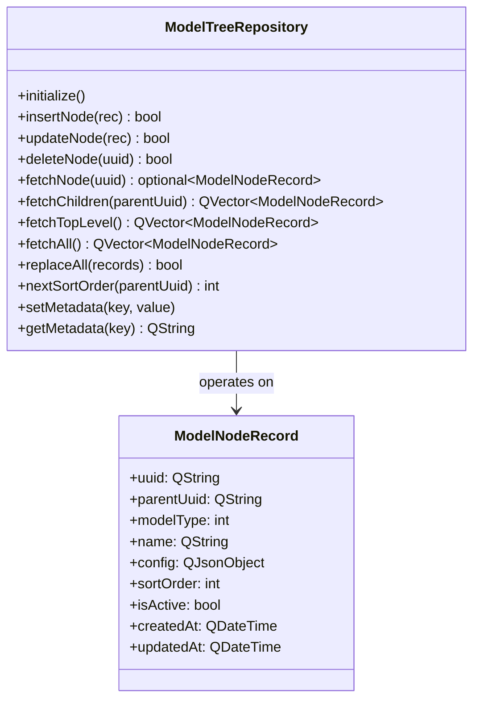

**Database schema:**

```sql
CREATE TABLE IF NOT EXISTS model_nodes (
    uuid        TEXT PRIMARY KEY,
    parent_uuid TEXT,
    model_type  INTEGER NOT NULL,
    name        TEXT    NOT NULL,
    config_json TEXT    NOT NULL DEFAULT '{}',
    sort_order  INTEGER NOT NULL DEFAULT 0,
    is_active   INTEGER NOT NULL DEFAULT 1,
    created_at  TEXT    NOT NULL,
    updated_at  TEXT    NOT NULL,
    FOREIGN KEY(parent_uuid) REFERENCES model_nodes(uuid)
);

CREATE TABLE IF NOT EXISTS app_metadata (
    key   TEXT PRIMARY KEY,
    value TEXT NOT NULL
);
```

Key metadata entries:
- `schema_version` — current schema version (value: `"3"`)
- `model_tree_migrated_from_json` — migration flag (value: `"true"` after one-time JSON import)

### Mapper — `ModelTreeMapper`

Handles the translation between `CBasicRoot` domain objects and `ModelNodeRecord` DTOs.

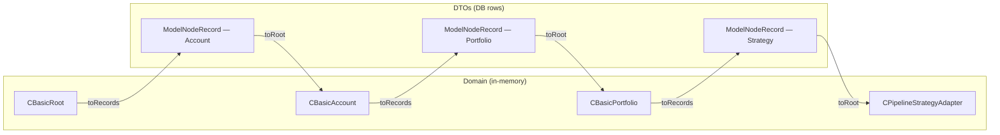

**Key rules:**
- `toRecords()` — traverses the domain tree recursively, excludes `CBasicRoot` (synthetic), sets `parentUuid` to empty for top-level accounts.
- `nodeConfigJson()` — strips `"models"` array and `"genericInfo"` from `toJson()` output before storing. Only stable config persists.
- `toRoot()` — creates a synthetic `CBasicRoot`, reconstructs tree from sorted records using `createFromRecord()`.
- Children are appended via `parent->getModels().append(model)` to bypass `CBasicAccount::setBrokerDataProvider` during reconstruction.

### Startup and Migration Flow

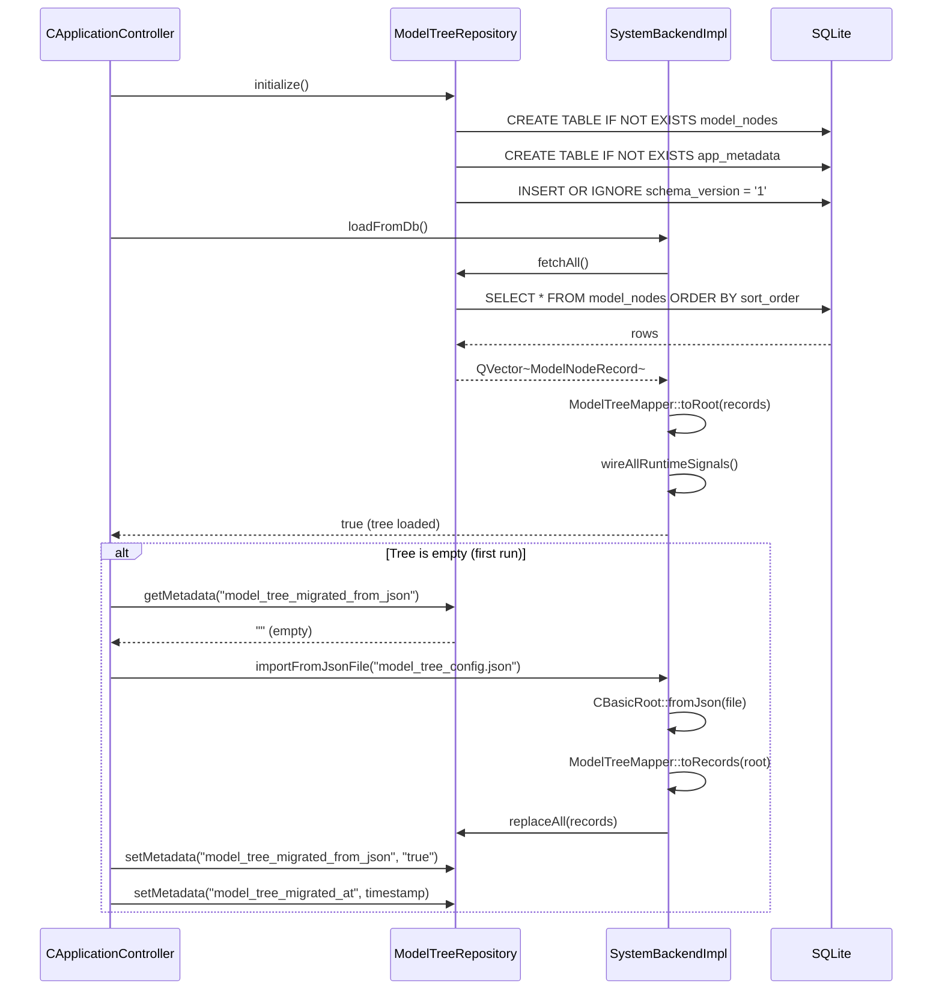

---

## Component Architecture

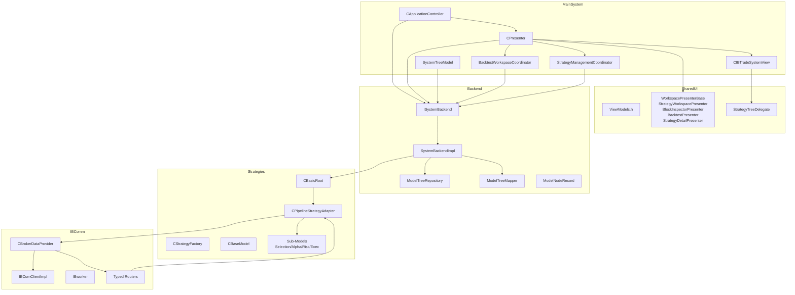

### Directory Structure

```
IbTradeQt/
├── Backend/                 # Backend service layer (NEW)
│   ├── ISystemBackend.h              # Pure-virtual interface
│   ├── SystemBackendImpl.h/cpp       # Concrete implementation
│   ├── ModelTreeRepository.h/cpp     # SQLite CRUD (DTO only)
│   ├── ModelTreeMapper.h/cpp         # Domain ↔ DTO mapping
│   └── ModelNodeRecord.h             # DTO struct
│
├── MainSystem/              # Application core (MVP)
│   ├── capplicationcontroller.h/cpp   # Lifecycle, backend init, migration
│   ├── cpresenter.h/cpp               # Thin router — delegates to coordinators
│   ├── BacktestWorkspaceCoordinator.h/cpp   # Backtest tab wiring
│   ├── StrategyManagementCoordinator.h/cpp  # Strategy Management tab wiring
│   ├── ibtradesystemview.h/cpp/.ui    # Main window
│   ├── cmainmodel.h/cpp               # Application model
│   ├── SystemTreeModel.h/cpp          # QAbstractItemModel for tree view
│   ├── SystemTreeDelegate.h/cpp       # Delegate (uses StrategyTreeDelegate)
│   ├── style/operations-console.qss   # Main stylesheet (tree font, etc.)
│   └── portfolioconfigmodel.h/cpp     # Legacy tree model (kept for reference)
│
├── SharedUI/                # Shared UI components (presenters, models, ViewModels)
│   ├── ViewModels.h                   # DTOs for Presenter→View
│   ├── IWorkspaceView.h               # View interface
│   ├── WorkspacePresenterBase.h/cpp   # Base presenter
│   ├── StrategyWorkspacePresenter.h/cpp
│   ├── BacktestPresenter.h/cpp
│   ├── BlockInspectorPresenter.h/cpp
│   ├── StrategyDetailPresenter.h/cpp
│   ├── PipelineDiagramModel.h/cpp
│   ├── StrategyTreeDelegate.h/cpp     # Column-aware tree painting
│   ├── AbstractPipelineTreeModel.h    # Abstract tree model
│   └── StrategyTreePanel.h/cpp        # Reusable tree panel
│
├── cli/                     # Standalone CLI client (NEW)
│   ├── main.cpp                       # CLI entry point
│   └── cli.pro                        # qmake project
│
├── tests/                   # Unit/integration tests
│   ├── main.cpp                       # Test runner (39 test suites)
│   ├── tests.pro                      # Test project
│   └── backend/                       # Backend-specific tests
│       ├── tst_model_tree_repository.h
│       ├── tst_system_backend.h
│       ├── tst_persistence.h
│       ├── tst_runtime.h
│       └── tst_cli_proof.h
│
├── IBComm/                  # IB communication
│   ├── BrokerDataProvider.h/cpp
│   ├── IBComClientImpl.h/cpp
│   ├── MarketDataRouter.h
│   ├── OrderRouter.h
│   ├── PositionRouter.h
│   ├── HistoricalDataRouter.h
│   ├── AccountRouter.h
│   ├── TimeRouter.h
│   └── IBworker.h/cpp
│
├── Strategies/              # Trading strategy framework
│   ├── Generic/             # Base classes + CPipelineStrategyAdapter
│   └── StateMachine/        # Model state management
│
├── Pipeline/                # LEGO pipeline blocks and interfaces
├── Blocks/                  # Concrete block implementations
├── Ports/                   # Hexagonal port interfaces
├── Adapters/                # Port adapters (live + mock)
├── Supervision/             # Runtime lifecycle (Supervisor, StrategyRuntime)
│
├── StrategyManagementUI/    # Strategy Management tab (catalog + detail)
│   ├── StrategyCatalogModel.h/cpp     # QAbstractItemModel for catalog tree
│   ├── StrategyCatalogPanel.h/cpp     # Left panel: tree + search + filter
│   ├── StrategyDetailPanel.h/cpp      # Right panel: metadata + versions + actions
│   └── StrategyManagementPanel.h/cpp  # Splitter container (tab widget)
│
├── DB/                      # Legacy SQLite (positions, trades)
├── CObjects/                # Common data objects
├── Common/                  # Shared utilities
├── ReqManager/              # Request ID management
├── Logger/                  # Logging infrastructure
└── docs/                    # Documentation (this directory)
```

---

## Design Patterns

### 1. Backend Service (System Boundary)

**Implementation:** `ISystemBackend` / `SystemBackendImpl`

All clients (GUI, CLI, tests) interact with the system exclusively through this interface. No client calls domain methods directly.

**Benefits:**
- One mutation path — easy to enforce invariants and validate
- One event source — all state changes emit signals from one place
- Client independence — swapping GUI for CLI or MCP requires no domain changes
- Testable without GUI

### 2. Repository Pattern with DTOs

**Implementation:** `ModelTreeRepository` + `ModelNodeRecord`

The repository knows only about `ModelNodeRecord` DTOs. It has no knowledge of `CBasicRoot`, `CBaseModel`, or any domain class. Mapping is the responsibility of `ModelTreeMapper`.

**Benefits:**
- Repository is easy to unit test in isolation
- Domain model changes don't break the persistence layer
- Clean schema evolution path

### 3. Model-View-Presenter (MVP)

**Implementation:**
- **Model**: `CBasicRoot` domain hierarchy (accessed via `ISystemBackend::dataRoot()`)
- **View**: `CIBTradeSystemView` — main window
- **Presenter**: `CPresenter` — routes UI commands to `ISystemBackend`
- **Controller**: `CApplicationController` — orchestrates startup, migration, backend init

### 4. Typed Router Pattern

Six typed routers forward IB callbacks as Qt signals:
- `MarketDataRouter` — tick prices, sizes, bar closes, tick-by-tick
- `OrderRouter` — order status, executions, commissions, next valid ID
- `PositionRouter` — position updates and snapshots
- `HistoricalDataRouter` — historical bar data
- `AccountRouter` — account summary
- `TimeRouter` — current time

### 5. Composite Pattern

```
CBasicRoot (ROOT — synthetic, not persisted)
  └─ CBasicAccount (ACCOUNT)
      └─ CBasicPortfolio (PORTFOLIO)
          └─ CPipelineStrategyAdapter (STRATEGY_PIPELINE)
              ├─ CBasicSelectionModel
              ├─ CBasicAlphaModel
              ├─ CBaseRebalanceModel
              ├─ CBasicRiskModel
              └─ CBasicExecutionModel
```

Common interface: `CGenericModelApi`

### 6. Factory Pattern

`CStrategyFactory` creates instances from `ModelType` enum. Used by `SystemBackendImpl` when creating new nodes.

### 7. Pipeline / Chain of Responsibility

```mermaid
flowchart LR
    Selection[Selection] -->|Signal[]| Alpha[Alpha]
    Alpha -->|Signal[]| Merge[Merge Policy]
    Merge -->|Signal[]| Rebalance[Rebalance]
    Rebalance -->|TargetPosition[]| Risk[Risk]
    Risk -->|ExecutionIntent[]| Execution[Execution]
```

### 8. State Machine

Each model (`CBaseModel`) has a lifecycle state machine:

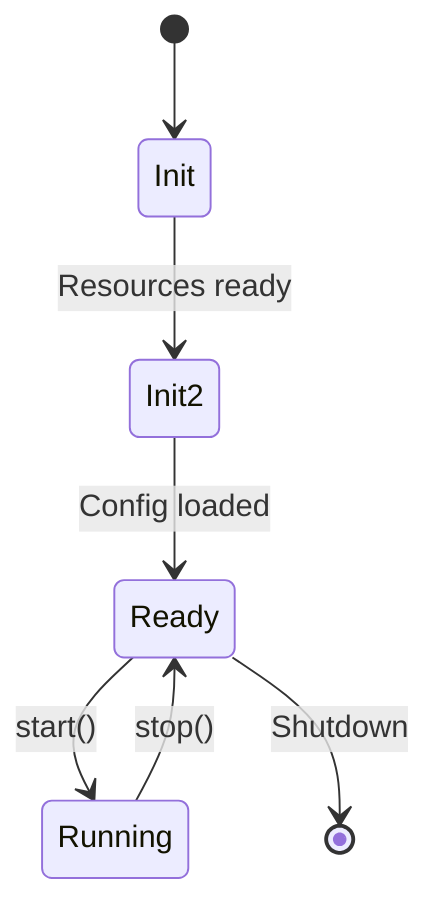

---

## Strategy Framework Architecture

### Persistent Hierarchy (DB-backed)

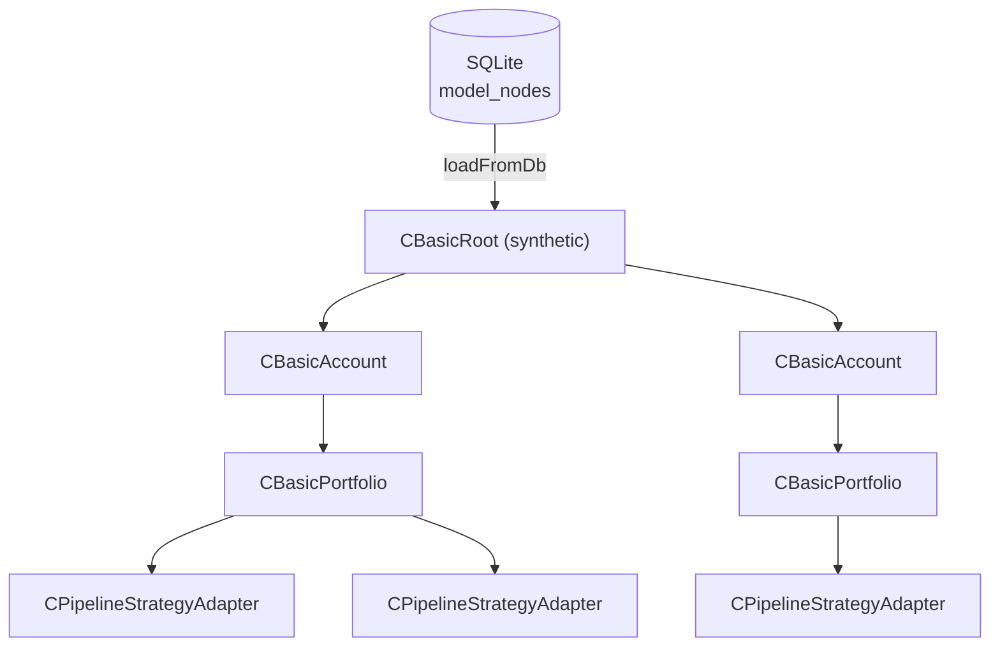

Only accounts, portfolios, and strategies are stored as rows in `model_nodes`. The root is always synthetic.

### Strategy Pipeline (Embedded in config_json)

Pipeline blocks are stored inside the strategy's `config_json` under `pipelineConfig`. They are NOT independent rows in `model_nodes`.

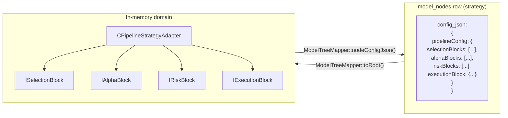

### Base Class Hierarchy

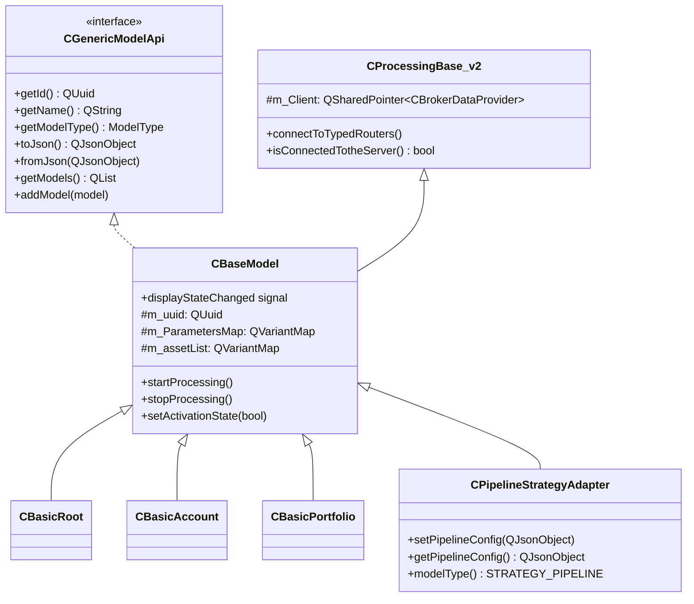

---

## Strategy Catalog and Versioning

The strategy catalog provides centralized strategy management with immutable versioned config snapshots. It is the single source of truth for strategy authoring, versioning, and lifecycle management.

### Schema (v3)

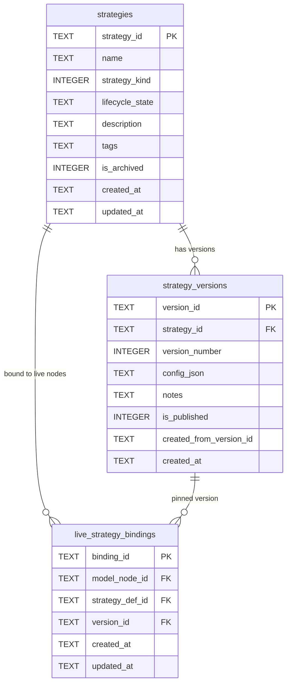

**Key concepts:**

- **Strategy** = long-lived family/container with metadata and lifecycle state (draft, active, testing, retired).
- **Strategy Version** = immutable config snapshot. Once created, a version's `config_json` never changes. Versions can be marked as `published` (eligible for deployment and shown in pickers by default).
- **Live binding** pins a live tree node to a specific version. Changing live parameters creates divergence, not a new version.
- **Backtest runs** reference both `strategy_id` and `version_id` for reproducibility.
- **Gated versioning**: version creation is always explicit and user-confirmed. The `detectVersionDivergence()` helper detects config drift but never silently creates versions.

### Migration (v2 → v3)

Schema migration in `ModelTreeRepository::initialize()`:
1. `ALTER TABLE live_strategy_bindings ADD COLUMN version_id` (runs before migration)
2. For each row in legacy `strategy_definitions`: insert into `strategies` + `strategy_versions` + update bindings
3. Rename `strategy_definitions` to `strategy_definitions_backup` (kept for rollback safety)
4. Recreate empty `strategy_definitions` for legacy code compatibility
5. Set `schema_version = "3"`

### Strategy Management Tab

The **Strategy Management** tab (index 2 in `m_mainTabWidget`) is the single UI surface for strategy authoring and versioning:

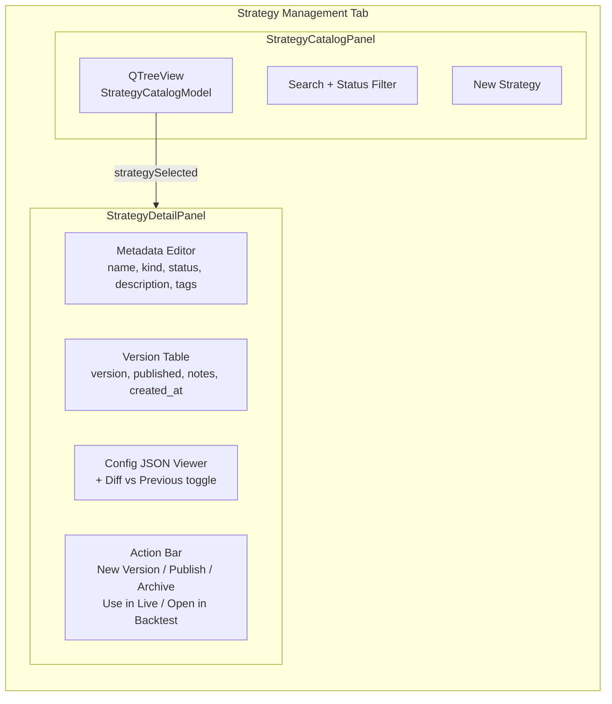

- `StrategyCatalogModel` (`QAbstractItemModel`) — flat list with columns: Name, Kind, Status, Versions, Last Updated. Supports sorting and combined filtering via `CatalogFilterProxy` (`QSortFilterProxyModel`).
- `StrategyDetailPanel` shows metadata, version history, read-only JSON viewer with diff toggle, and action buttons.
- `StrategyManagementPanel` combines both panels in a `QSplitter`.

### Live Integration

Context menu on portfolio nodes offers:
- **Add New Strategy** — creates a new catalog entry + v1 + live tree node + binding.
- **Use Existing Strategy** — picks a published version from the catalog via `QInputDialog`, creates a live tree node bound to the existing catalog entry (via `createLiveNodeForExistingCatalog()`), and loads the version's pipeline config.

When starting a live strategy, if the node's config has diverged from its pinned version, the presenter prompts the user to save a new version before proceeding.

### Backtest Integration

`BacktestStrategySelector` shows both live-tree strategies and a "Catalog Strategies" section with expandable version lists. Selecting a catalog version populates the backtest workspace with that version's config and records `catalogStrategyId` + `catalogVersionId` in the `BacktestRuns` table.

After a backtest run, the presenter compares the run's pipeline config against the pinned version's config. If they differ, the user is prompted to save as a new version.

---

## Data Flow Architecture

### IB Connection Flow

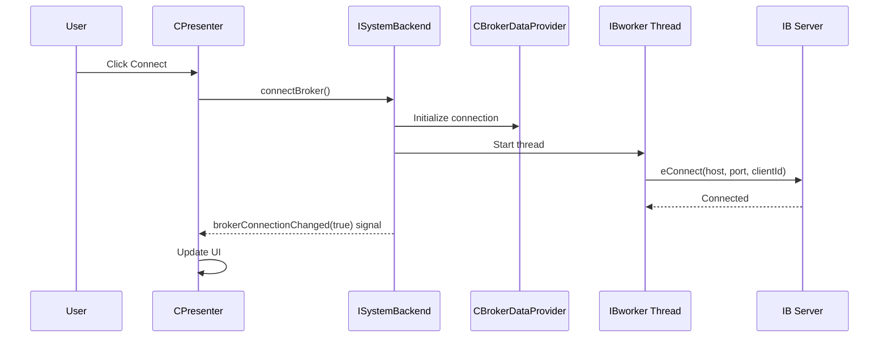

### Mutation Data Flow (example: createAccount)

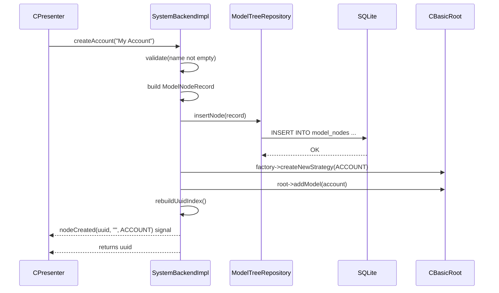

### moveNode() Validation Rules

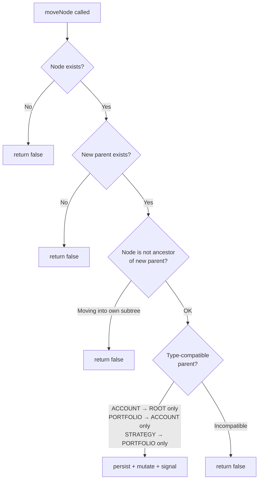

---

## Threading Architecture

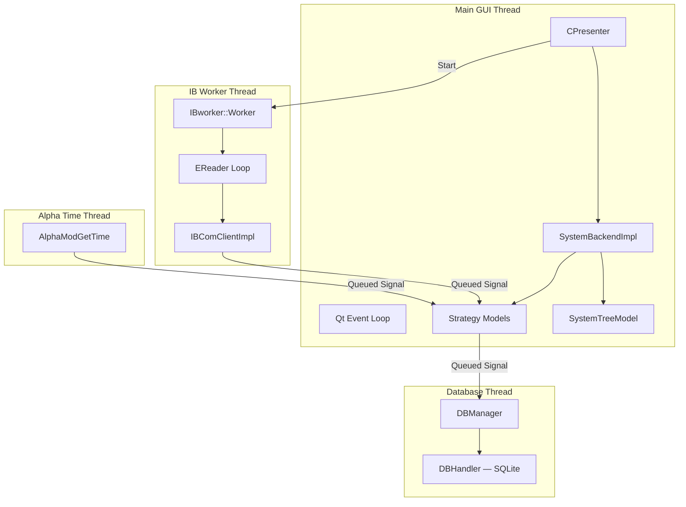

**Synchronization:** Qt `Qt::QueuedConnection` for all cross-thread signals. `model_nodes` writes happen on the main thread via `ModelTreeRepository`.

---

## Database Architecture

### model_nodes (persistent model tree)

Managed exclusively by `ModelTreeRepository`. Written only through `ISystemBackend` mutations.

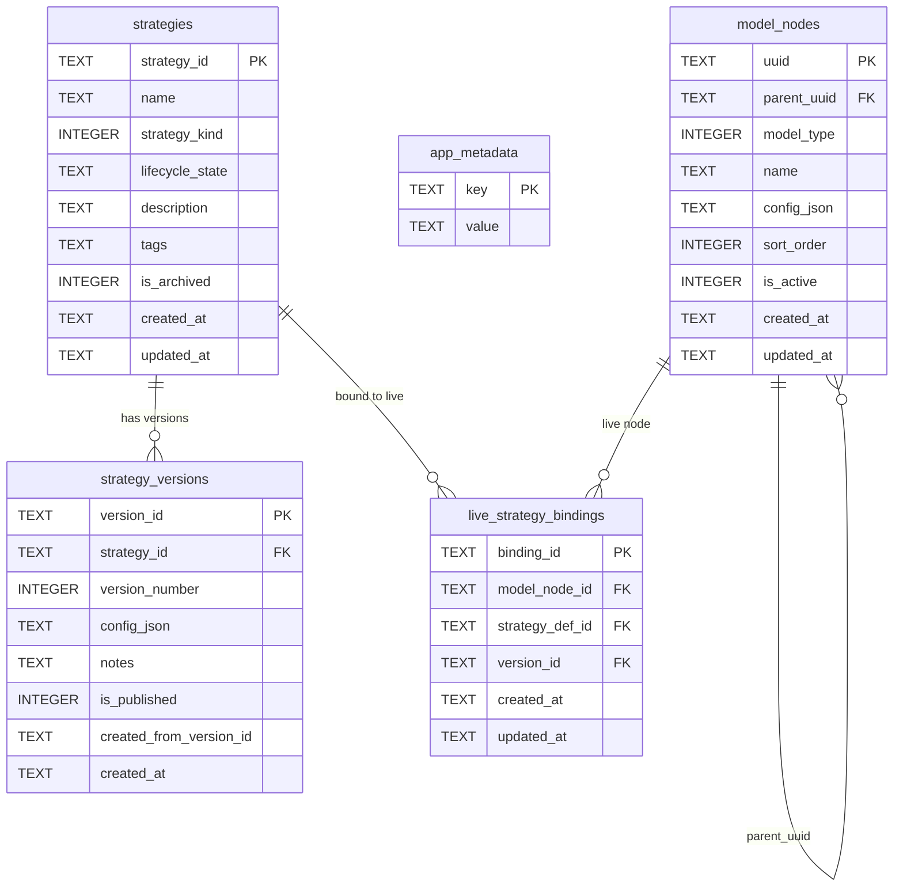

**config_json rules (hard principle):**
- Persisted: `parameters`, `assetList`, `pipelineConfig`
- NOT persisted: `models` array, `genericInfo`, runtime state (PnL, displayState, broker connection)

### Legacy SQLite (trading state)

Managed by `DBManager` / `DBHandler`. Independent of `model_nodes`. Stores:
- `OpenPositions` — current open positions per strategy
- `Trades` — executed trade history
- `ModelInfo` — legacy model metadata
- `StrategyData` — strategy statistics (P&L, fees)

### PostgreSQL (market data)

External database for high-throughput storage of real-time bars and tick-by-tick data. Not covered here; see IB SDK integration.

---

## UI Architecture

### Main Window Layout

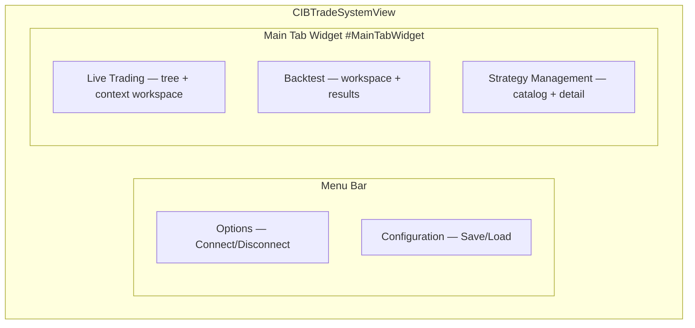

The main window uses a `QTabWidget` (object name `MainTabWidget`) with three tabs:
- **Live Trading** (index 0) — model tree, context workspace, diagram dock
- **Backtest** (index 1) — backtest workspace, strategy selector, results
- **Strategy Management** (index 2) — `StrategyManagementPanel` (catalog + detail splitter)

### CPresenter and Coordinators

`CPresenter` is a thin router that delegates to specialized coordinators:

```mermaid
flowchart TB
    subgraph CPresenter[CPresenter]
        TreeSelect[Tree selection routing]
        ContextMenu[Context menu]
        Diagram[Diagram dock]
        CrossWire[Coordinator cross-wiring]
    end

    subgraph BacktestCoord[BacktestWorkspaceCoordinator]
        BTController[BacktestController lifecycle]
        BTRun[Run / Load / Finish]
        BTSelector[Strategy selector wiring]
    end

    subgraph StratMgmtCoord[StrategyManagementCoordinator]
        SMCatalog[Catalog refresh]
        SMDeploy[Deploy to live]
        SMBacktest[Open in Backtest]
    end

    CPresenter --> BacktestCoord
    CPresenter --> StratMgmtCoord
    StratMgmtCoord -->|openInBacktest| BacktestCoord
    BacktestCoord -->|catalogRefreshNeeded| StratMgmtCoord
```

See [UI_DECOUPLING.md](UI_DECOUPLING.md) for full presenter/coordinator architecture and diagrams.

### Backend-Routed UI Mutations (Live Trading Tree)

The Live Trading tree context menu routes through `ISystemBackend`. **Block add/remove is not available** in the Live tree — only in Strategy Management:

```mermaid
flowchart LR
    subgraph ContextMenu[Live Tree Context Menu]
        AddAccount[Add Account]
        AddPortfolio[Add Portfolio]
        AddStrategy[Add New Strategy]
        UseExisting[Use Existing Strategy]
        RemoveNode[Remove Node]
        OpenBacktest[Open in Backtest]
    end

    subgraph Presenter[CPresenter]
        RebuildTree[rebuildTree lambda]
    end

    subgraph Backend[ISystemBackend]
        Create[createAccount/Portfolio/Strategy]
        Remove[removeNode]
        CreateLive[createLiveNodeForExistingCatalog]
        PipelineCfg[pipelineConfig]
    end

    AddAccount --> Create --> RebuildTree
    AddPortfolio --> Create --> RebuildTree
    AddStrategy --> Create --> RebuildTree
    UseExisting --> CreateLive --> RebuildTree
    RemoveNode --> Remove --> RebuildTree
    OpenBacktest --> PipelineCfg
```

Add Block / Remove Block are available only in the **Strategy Management** tab (see `StrategyManagementCoordinator`).

### Tree View Styling

Tree views use a finance-suitable monospace font (Consolas, 11px) defined in `MainSystem/style/operations-console.qss`. The `StrategyTreeDelegate` applies `opt.font` from the styled widget so QSS font settings are respected during custom painting. Tab content styling uses `QTabWidget#MainTabWidget` selector. See [UI_DECOUPLING.md](UI_DECOUPLING.md) for details.

### SystemTreeModel

`SystemTreeModel` extends `QAbstractItemModel` and reads from `CBasicRoot`. When the user toggles the active checkbox in the tree:

```cpp
// SystemTreeModel::setData() — routes activation through backend
if (m_backend) {
    m_backend->setNodeActive(uuid, newState);
} else {
    node->model->setActivationState(newState);  // fallback
}
```

---

## CLI Architecture

A standalone CLI application (`cli/`) uses the same `ISystemBackend` / `SystemBackendImpl` / `ModelTreeRepository` stack without any GUI components.

```mermaid
flowchart LR
    subgraph CLI[cli/main.cpp]
        A[QCoreApplication]
        B[ModelTreeRepository]
        C[SystemBackendImpl]
        D[CLI Commands\nlist/create/remove/move]
    end

    subgraph Persistence[SQLite]
        DB[("model_nodes\napp_metadata")]
    end

    A --> B
    B --> DB
    A --> C
    C --> B
    D --> C
```

The `tst_cli_proof.h` test suite validates the CLI workflow with no GUI:
- `testCliWorkflowNoGui` — create account/portfolio/strategy, remove node, all without GUI
- `testCliConnectDisconnectWithoutGui` — broker state queries without connecting
- `testCliMoveNode` — move node via backend API

---

## Key Classes Reference

### Backend Layer (new)

| Class | File | Responsibility |
|-------|------|----------------|
| `ISystemBackend` | `Backend/ISystemBackend.h` | Pure virtual interface — system boundary for all clients |
| `SystemBackendImpl` | `Backend/SystemBackendImpl.h/cpp` | Concrete backend: CRUD, validation, signal emission |
| `ModelTreeRepository` | `Backend/ModelTreeRepository.h/cpp` | SQLite CRUD for `model_nodes` table — DTO-only |
| `ModelTreeMapper` | `Backend/ModelTreeMapper.h/cpp` | Domain ↔ `ModelNodeRecord` mapping |
| `ModelNodeRecord` | `Backend/ModelNodeRecord.h` | DTO struct representing one `model_nodes` row |

### Application Core

| Class | File | Responsibility |
|-------|------|----------------|
| `CApplicationController` | `MainSystem/capplicationcontroller.h/cpp` | Lifecycle, backend init, migration from JSON |
| `CPresenter` | `MainSystem/cpresenter.h/cpp` | Thin router — tree selection, context menu, coordinator cross-wiring |
| `BacktestWorkspaceCoordinator` | `MainSystem/BacktestWorkspaceCoordinator.h/cpp` | Backtest tab wiring, controller lifecycle, run/load/finish |
| `StrategyManagementCoordinator` | `MainSystem/StrategyManagementCoordinator.h/cpp` | Strategy Management tab wiring, catalog, deploy, open in backtest |
| `CIBTradeSystemView` | `MainSystem/ibtradesystemview.h/cpp` | Main window |
| `SystemTreeModel` | `MainSystem/SystemTreeModel.h/cpp` | `QAbstractItemModel` for tree view — routes `setData` through backend |

### SharedUI (Presenters, ViewModels, Delegate)

| Class | File | Responsibility |
|-------|------|----------------|
| `VM` (namespace) | `SharedUI/ViewModels.h` | DTOs for Presenter→View data transfer |
| `WorkspacePresenterBase` | `SharedUI/WorkspacePresenterBase.h/cpp` | Base presenter with bind/unbind, refresh |
| `StrategyWorkspacePresenter` | `SharedUI/StrategyWorkspacePresenter.h/cpp` | Metrics, overview, properties for strategy workspace |
| `BacktestPresenter` | `SharedUI/BacktestPresenter.h/cpp` | Fills→TradeRow, run history, chart data conversion |
| `BlockInspectorPresenter` | `SharedUI/BlockInspectorPresenter.h/cpp` | Block parameter resolution, edit application |
| `StrategyDetailPresenter` | `SharedUI/StrategyDetailPresenter.h/cpp` | Catalog entry loading, version rows, metadata |
| `StrategyTreeDelegate` | `SharedUI/StrategyTreeDelegate.h/cpp` | Column-aware tree painting, applies QSS font |

### IB Communication

| Class | File | Responsibility |
|-------|------|----------------|
| `IBComClientImpl` | `IBComm/IBComClientImpl.h` | IB TWS API client, EWrapper callbacks |
| `CBrokerDataProvider` | `IBComm/cbrokerdataprovider.h` | Broker API facade, request management |
| `MarketDataRouter` | `IBComm/MarketDataRouter.h` | Typed router: tick prices, bars |
| `OrderRouter` | `IBComm/OrderRouter.h` | Typed router: orders, executions |
| `PositionRouter` | `IBComm/PositionRouter.h` | Typed router: positions |
| `HistoricalDataRouter` | `IBComm/HistoricalDataRouter.h` | Typed router: historical bars |
| `AccountRouter` | `IBComm/AccountRouter.h` | Typed router: account summary |
| `TimeRouter` | `IBComm/TimeRouter.h` | Typed router: current time |
| `IBworker` | `IBComm/IBworker.h` | Worker thread for IB message processing |

### Strategy Framework

| Class | File | Responsibility |
|-------|------|----------------|
| `CGenericModelApi` | `Strategies/Generic/cgenericmodelApi.h` | Pure virtual interface for all models |
| `CBaseModel` | `Strategies/Generic/cbasemodel.h` | Base implementation with lifecycle and pipeline models |
| `CBasicRoot` | `Strategies/Generic/cbasicroot.h` | Synthetic root (never persisted) |
| `CBasicAccount` | `Strategies/Generic/cbasicaccount.h` | Account node |
| `CBasicPortfolio` | `Strategies/Generic/cbasicportfolio.h` | Portfolio node |
| `CPipelineStrategyAdapter` | `Strategies/Generic/cpipelinestrategyadapter.h` | LEGO pipeline strategy, bridges into CGenericModelApi tree |
| `CStrategyFactory` | `Strategies/Generic/cstrategyfactory.h` | Factory for creating model instances |

### Pipeline Framework

| Class | File | Responsibility |
|-------|------|----------------|
| `IAlphaBlock` | `Pipeline/IAlphaBlock.h` | Alpha signal generation interface |
| `ISelectionBlock` | `Pipeline/ISelectionBlock.h` | Asset universe filter interface |
| `IRebalanceBlock` | `Pipeline/IRebalanceBlock.h` | Target position calculation interface |
| `IRiskBlock` | `Pipeline/IRiskBlock.h` | Risk constraint enforcement interface |
| `IExecutionBlock` | `Pipeline/IExecutionBlock.h` | Order placement interface |
| `BlockRegistry` | `Pipeline/BlockRegistry.h` | Block ID → factory registry |
| `StrategyPipelineRunner` | `Pipeline/StrategyPipelineRunner.h` | Runs one pipeline cycle |
| `Supervisor` | `Supervision/Supervisor.h` | Health checks, restart policies |
| `StrategyRuntime` | `Supervision/StrategyRuntime.h` | Per-strategy thread + queue + runner |

### Strategy Management UI

| Class | File | Responsibility |
|-------|------|----------------|
| `StrategyCatalogModel` | `StrategyManagementUI/StrategyCatalogModel.h/cpp` | `QAbstractItemModel` — flat list of strategy families with columns |
| `StrategyCatalogPanel` | `StrategyManagementUI/StrategyCatalogPanel.h/cpp` | Left panel: `QTreeView` + search + status filter + "New Strategy" button |
| `StrategyDetailPanel` | `StrategyManagementUI/StrategyDetailPanel.h/cpp` | Right panel: metadata editor, version table, JSON viewer + diff, action buttons |
| `StrategyManagementPanel` | `StrategyManagementUI/StrategyManagementPanel.h/cpp` | `QSplitter` container combining catalog + detail as tab index 2 |

### Database Layer

| Class | File | Responsibility |
|-------|------|----------------|
| `DBManager` | `DB/dbmanager.h` | Trading state DB thread manager |
| `DBHandler` | `DB/dbhandler.h` | SQLite operations for positions/trades |

### Common

| Class | File | Responsibility |
|-------|------|----------------|
| `CProcessingBase_v2` | `Common/cprocessingbase_v2.h` | Base class with typed router adapter slots |
| `GlobalReqManager` | `ReqManager/globalreqmanager.h` | Request ID allocation and tracking |
| `MyLogger` | `Logger/mylogger.h` | Application-wide logging |

---

## Test Coverage

The test suite includes dedicated backend tests:

| Suite | File | Coverage |
|-------|------|----------|
| `TestModelTreeRepository` | `tests/backend/tst_model_tree_repository.h` | CRUD, mapper roundtrip |
| `TestSystemBackend` | `tests/backend/tst_system_backend.h` | CRUD, moveNode, addBlock, signals, queries |
| `TestPersistence` | `tests/backend/tst_persistence.h` | Schema version, restart persistence, migration |
| `TestRuntime` | `tests/backend/tst_runtime.h` | Broker state, runtime/persistent separation, backtester integration |
| `TestCliProof` | `tests/backend/tst_cli_proof.h` | Full CLI workflow without GUI |
| `TestStrategyCatalog` | `tests/backend/tst_strategy_catalog.h` | Strategy catalog CRUD, v2→v3 migration, versioning, divergence detection, gated versioning, catalog model, backtest integration, full lifecycle |

---

*See [PIPELINE_ARCHITECTURE.md](PIPELINE_ARCHITECTURE.md) for the LEGO pipeline block system, [BACKTESTER_DESIGN.md](BACKTESTER_DESIGN.md) for the backtester design, and [UI_DECOUPLING.md](UI_DECOUPLING.md) for the UI decoupling architecture (presenters, coordinators, ViewModels, styling).*
