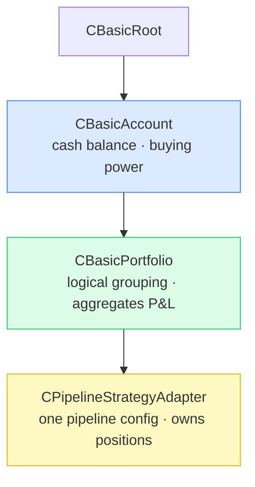
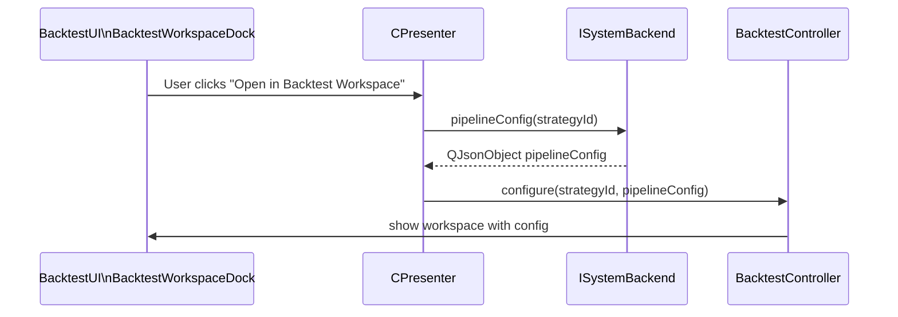
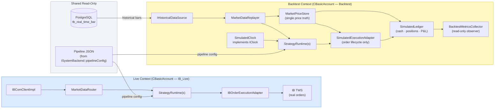
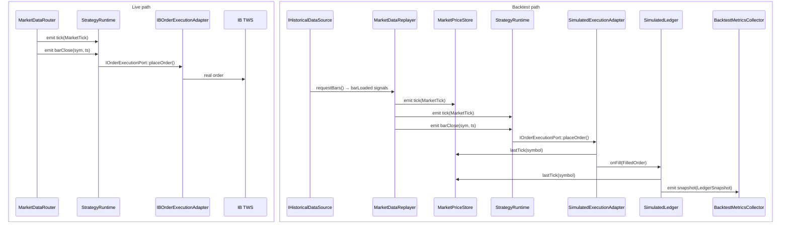
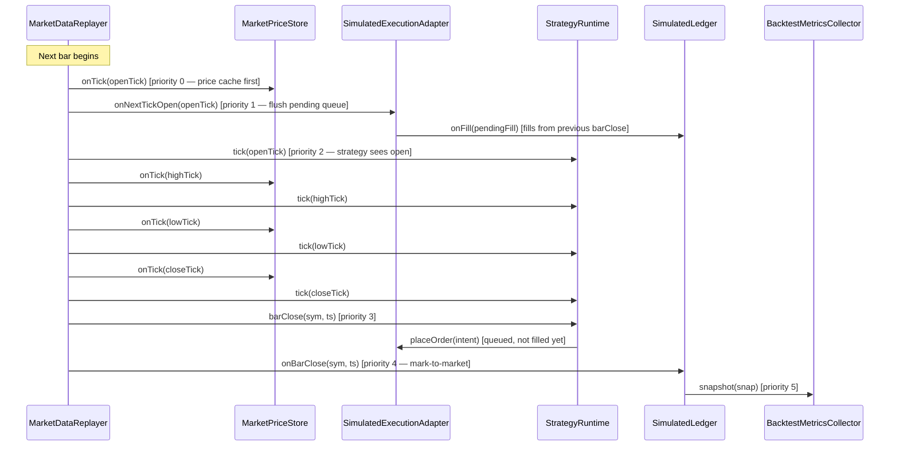

# Backtester Design — Isolated, Parallel-to-Live

**Status:**
- ✅ **Implemented:** Backend integration — backtester retrieves pipeline config via `ISystemBackend::pipelineConfig(strategyId)`.
- ✅ **Implemented:** `BacktestController` and `BacktestUI::BacktestWorkspaceDock` exist and are wired into the presenter.
- 🔲 **Planned:** Full `BacktestSession` orchestrator, historical data sources, `SimulatedLedger`, metrics.

The document below describes the full intended design. Sections marked **[IMPLEMENTED]** reflect actual code; all others are forward-looking.

---

## Table of Contents

1. [Motivation and Goals](#1-motivation-and-goals)
2. [Backtest Scope](#2-backtest-scope)
3. [One Broker per Account — Architecture Decision](#3-one-broker-per-account--architecture-decision)
4. [Backend Integration — Pipeline Config Source [IMPLEMENTED]](#4-backend-integration--pipeline-config-source-implemented)
5. [Current State — What Already Exists](#5-current-state--what-already-exists)
6. [Proposed Architecture](#6-proposed-architecture)
7. [New Components to Build](#7-new-components-to-build)
8. [Data Flow — Live vs Backtest Side by Side](#8-data-flow--live-vs-backtest-side-by-side)
9. [Clock Abstraction — IClock Interface](#9-clock-abstraction--iclock-interface)
10. [Fill Model and Timing](#10-fill-model-and-timing)
11. [Historical Data Sources](#11-historical-data-sources)
12. [Performance Metrics](#12-performance-metrics)
13. [UI Integration](#13-ui-integration)
14. [Implementation Roadmap](#14-implementation-roadmap)
15. [File Map](#15-file-map)
16. [Determinism and Event Ordering](#16-determinism-and-event-ordering)

---

## 1. Motivation and Goals

The pipeline strategy system is already broker-agnostic at the strategy level. The goal of this design is to:

- Run a full backtest of any pipeline strategy config against historical data **while live trading continues uninterrupted**.
- Keep the backtester **completely isolated** — it owns its own market data source, execution adapter, position repository, clock, and supervisor.
- Reuse 100% of the existing pipeline block code (alpha blocks, risk blocks, execution blocks) without modification.
- **[IMPLEMENTED]** Get pipeline configuration from the backend service (`ISystemBackend::pipelineConfig()`), not from live strategy objects.
- Produce a structured performance report (P&L curve, trade log, Sharpe, drawdown) at the end of the run.
- Allow multiple concurrent backtest sessions (e.g., parameter sweep).

**Non-goals for v1:**
- Order book simulation / market impact modeling.
- Transaction cost modelling beyond slippage bps.
- Options-specific P&L.

---

## 2. Backtest Scope

The tree hierarchy has four meaningful levels:



### Strategy-level backtest (v1 target)

Backtest a single `CPipelineStrategyAdapter` pipeline config in isolation. The pipeline config is retrieved from `ISystemBackend::pipelineConfig(strategyId)` — the backend is the source of truth, not the live strategy object.

- **Capital:** fixed initial capital injected into `BacktestSession` (e.g. $100k).
- **Positions:** tracked by `SimulatedLedger` scoped to that one strategy.
- **Orders:** routed through `SimulatedExecutionAdapter` — no interaction with live orders.

### Portfolio-level backtest (v2, planned)

Backtest all strategies under a `CBasicPortfolio` simultaneously, with a **shared capital pool** (`BacktestCapitalPool`).

### Account-level backtest (v3, deferred)

Requires simulating broker margin rules — out of scope.

**Decision:** v1 implements strategy-level backtest. The API is designed so v2 can wrap multiple `BacktestSession` instances without changing strategy-level code.

---

## 3. One Broker per Account — Architecture Decision

### Current state

`CApplicationController` creates a **single** `IBComClientImpl` and propagates it down the entire tree via `setBrokerDataProvider()`. Every account, portfolio, and strategy shares one broker connection object.

### Proposed rule: one broker connection per `CBasicAccount`

Each `CBasicAccount` should own its broker connection. A **backtest account** is a `CBasicAccount` with `BrokerType = "Backtest"`. It creates no real broker connection — instead it creates a `BacktestSession`.

```mermaid
graph TD
    subgraph Live["CBasicAccount — IB_Live (port 4001)"]
        L1["IBComClientImpl"]
        L2["MarketDataRouter\nOrderRouter\nPositionRouter"]
        L3["IBOrderExecutionAdapter"]
        L1 --> L2
        L2 --> L3
    end

    subgraph BT["CBasicAccount — Backtest_2024"]
        B1["IHistoricalDataSource"]
        B2["MarketDataReplayer"]
        B3["SimulatedExecutionAdapter"]
        B4["MarketPriceStore"]
        B5["SimulatedLedger"]
        B6["BacktestMetricsCollector"]
        B1 --> B2
        B2 --> B4
        B4 --> B3
        B4 --> B5
        B3 --> B5
        B5 --> B6
    end

    style Live fill:#dbeafe,stroke:#3b82f6
    style BT fill:#fef9c3,stroke:#eab308
```



The current single-broker setup stays intact. Per-account broker ownership is introduced as an **opt-in** path (Phase 4 of the roadmap).

---

## 4. Backend Integration — Pipeline Config Source [IMPLEMENTED]

This section describes what is already implemented in the codebase.

### How the backtester gets strategy configuration

Previously the backtester would have needed to access the live `CPipelineStrategyAdapter` object directly to get its pipeline config. This is now done cleanly through the backend service:



**Code in `CPresenter::MapSignals()`:**
```cpp
// "Open in Backtest Workspace" context menu action
auto config = backend->pipelineConfig(strategyId);
// config is the pipeline JSON: selectionBlocks, alphaBlocks, riskBlocks, executionBlock
// Passed to BacktestController — no direct access to live strategy object
```

### Why this matters

- The backtester never touches the live `CPipelineStrategyAdapter` object.
- `ISystemBackend::pipelineConfig()` returns the **DB-backed** copy of the config, not in-memory state.
- A backtest can be run even if the strategy is currently running live — they share no mutable state.
- The config is stable across restarts: if the app is restarted, the backtester can still reload the last-known config from DB.

### Runtime state stays separate

`ISystemBackend::runtimeState(uuid)` returns transient runtime info (display state, connection status). This is never mixed with the pipeline config. The backtester uses only `pipelineConfig()`, not `runtimeState()`.

---

## 5. Current State — What Already Exists

The codebase already provides most of the building blocks for a full backtester:

| Component | File | Role in Backtester |
|-----------|------|--------------------|
| `MarketDataReplayer` | `Replay/MarketDataReplayer.h` | Emits `tick`, `barClose`, and `tickByTick` signals — identical interface to `MarketDataRouter` |
| `MockExecutionAdapter` | `Adapters/MockExecutionAdapter.h` | Implements `IOrderExecutionPort`. Records placed orders. Needs fill model upgrade. |
| `MockPositionRepository` | `Adapters/MockPositionRepository.h` | Implements `IPositionRepositoryPort`. In-memory position tracking. |
| `IOrderExecutionPort` | `Ports/IOrderExecutionPort.h` | Clean order interface — pipeline strategies call only this |
| `IPositionRepositoryPort` | `Ports/IPositionRepositoryPort.h` | Clean position query interface |
| `PipelineFactory::createRuntime` | `Pipeline/PipelineFactory.h` | Creates a `StrategyRuntime` from JSON config + injected ports |
| `Supervisor` | `Supervision/Supervisor.h` | Manages strategy lifecycle — can host backtest runtimes |
| `MarketDataRecorder` | `Replay/MarketDataRecorder.h` | Records live sessions to JSONL for replay |
| `ISystemBackend::pipelineConfig()` | `Backend/ISystemBackend.h` | **[IMPLEMENTED]** Get strategy pipeline config from DB |
| `BacktestController` | `BacktestUI/` | **[IMPLEMENTED]** Basic controller wired into presenter |
| `BacktestWorkspaceDock` | `BacktestUI/BacktestWorkspaceDock.h` | **[IMPLEMENTED]** UI dock for backtest configuration |

**What is still missing (for full v1 backtesting):**
- `IClock` interface and `SimulatedClock`
- `BacktestSession` orchestrator
- `SimulatedLedger` (cash + positions + P&L owner)
- `SimulatedExecutionAdapter` with realistic fill models
- `MarketPriceStore` (single price truth)
- `BacktestMetricsCollector`
- `IHistoricalDataSource` implementations (PostgreSQL, CSV, IB, JSONL)
- Per-instance dependency injection in `CPipelineStrategyAdapter`

---

## 6. Proposed Architecture



Each **backtest context** is a self-contained object graph. It has no shared mutable state with the live context or with other backtest contexts.

---

## 7. New Components to Build

### 7.1 Per-Instance Dependency Injection in `CPipelineStrategyAdapter`

Add `BacktestContext` struct and `injectBacktestContext()` to `cpipelinestrategyadapter.h`:

```cpp
struct BacktestContext {
    IBComm::MarketDataRouter*       router     = nullptr;
    Supervision::Supervisor*        supervisor = nullptr;
    Ports::IOrderExecutionPort*     execPort   = nullptr;
    Ports::IPositionRepositoryPort* posRepo    = nullptr;
};

void injectBacktestContext(const BacktestContext& ctx);
```

In `start()`, prefer `m_injectedContext` over the static globals when `m_useInjectedContext` is true.

**Guard:** backtest mode must never silently fall back to static globals:
```cpp
Q_ASSERT_X(m_useInjectedContext,
    "CPipelineStrategyAdapter::start",
    "Backtest mode requires injected context — static globals must not be used");
```

### 7.2 `BacktestSession`

**File:** `Backtest/BacktestSession.h`

The orchestrator. Owns all backtest-specific objects and drives the replay loop.

```cpp
namespace Backtest {

struct BacktestConfig {
    QString     strategyConfigPath;  // or pass QJsonObject directly
    QJsonObject pipelineConfig;      // from ISystemBackend::pipelineConfig()
    QDateTime   startDate;
    QDateTime   endDate;
    QStringList symbols;
    BarResolution resolution = BarResolution::Day1;
    double      initialCapital = 100'000.0;
    QString     dataSourceId;        // "postgres" | "csv" | "ib" | "yahoo" | "jsonl"
    FillModelType  fillModel  = FillModelType::BidAsk;
    FillTiming     fillTiming = FillTiming::SignalOnClose_FillNextBarOpen;
    double      slippageBps = 1.0;
};

class BacktestSession : public QObject {
    Q_OBJECT
public:
    explicit BacktestSession(const BacktestConfig& config, QObject* parent = nullptr);
    void setLiveBrokerApi(IBrokerAPI* api, IBComm::HistoricalDataRouter* router);
    void run();
    void cancel();
    const BacktestResult& result() const;

signals:
    void progressChanged(int percent);
    void finished(const Backtest::BacktestResult& result);
    void failed(const QString& reason);
};

} // namespace Backtest
```

### 7.3 `IHistoricalDataSource`

**File:** `Backtest/IHistoricalDataSource.h`

A `QObject`-based interface with signals. `IBComm::HistoricalBar` (open, high, low, close, volume, timestamp, symbol) is the canonical bar type for all sources.

```cpp
class IHistoricalDataSource : public QObject {
    Q_OBJECT
public:
    virtual void requestBars(const QStringList& symbols,
                             const QDateTime& from,
                             const QDateTime& to,
                             BarResolution resolution) = 0;
    virtual QString sourceId() const = 0;
    virtual bool requiresLiveBroker() const = 0;
signals:
    void barLoaded(const IBComm::HistoricalBar& bar);
    void tickLoaded(const IBComm::MarketTick& tick);
    void tickByTickLoaded(const IBComm::TickByTickTrade& trade);
    void loadFinished();
    void loadFailed(const QString& reason);
};
```

Concrete implementations:

| Class | Delivery | Requires broker | Max resolution |
|-------|----------|-----------------|----------------|
| `PostgresHistoricalDataSource` | Sync | No | Whatever was recorded |
| `CsvHistoricalDataSource` | Sync | No | Tick (if file has per-trade rows) |
| `JsonlHistoricalDataSource` | Sync | No | Tick (exact recorded session) |
| `IbHistoricalDataSource` | Async | Yes | Tick (up to 30 days) |
| `YahooFinanceDataSource` | Async | No | Day1 only |

### 7.4 `IClock`, `WallClock`, `SimulatedClock`

**File:** `Common/IClock.h`

```cpp
class IClock {
public:
    virtual ~IClock() = default;
    virtual QDateTime now() const = 0;
};

class WallClock : public IClock {
public:
    QDateTime now() const override { return QDateTime::currentDateTime(); }
};

class SimulatedClock : public IClock {
public:
    void setCurrentTime(const QDateTime& t) { m_current = t; }
    QDateTime now() const override { return m_current; }
private:
    QDateTime m_current;
};
```

`IClock` is passed into `PipelineFactory::createRuntime()` as an optional parameter. Alpha blocks that need the current time call `m_clock->now()` where `m_clock` is set via `IAlphaBlock::setClock(IClock*)`.

### 7.5 `SimulatedExecutionAdapter`

**File:** `Backtest/SimulatedExecutionAdapter.h`

Responsible for order lifecycle only: accepting `ExecutionIntent`, computing fill price from `MarketPriceStore`, and notifying `SimulatedLedger`.

Fill price models:

| Model | Buy fill | Sell fill |
|-------|---------|---------|
| `Instant` / `MidPrice` | `mid()` | `mid()` |
| `BidAsk` | `ask` | `bid` |
| `SlippageBps` | `ask * (1 + slippage)` | `bid * (1 - slippage)` |

### 7.6 `SimulatedLedger`

**File:** `Backtest/SimulatedLedger.h`

Single source of truth for all mutable financial state: cash, positions, average cost, realized P&L, unrealized P&L. Also implements `IPositionRepositoryPort` so pipeline risk blocks can query it directly.

**Ownership invariant:** `SimulatedLedger` is the **only** component that writes to position state. Position transitions happen exclusively through `onFill()`. `IPositionRepositoryPort::updatePosition()` is **disabled** in backtest mode (returns error + Q_ASSERT).

### 7.7 `BacktestMetricsCollector`

**File:** `Backtest/BacktestMetricsCollector.h`

A pure observer. Subscribes to `SimulatedLedger::snapshot()` and `SimulatedExecutionAdapter::filled()`. Computes all performance metrics only in `finalize()`.

```cpp
struct BacktestResult {
    QVector<FilledOrder>    tradeLog;
    QVector<LedgerSnapshot> equityCurve;
    double  totalReturn;
    double  annualizedReturn;
    double  sharpeRatio;
    double  maxDrawdown;
    double  winRate;
    int     totalTrades;
    QDateTime startDate;
    QDateTime endDate;
    double  initialCapital;
    double  finalCapital;
    double  totalCommission;   // zero in v1, field reserved
    double  totalFees;         // zero in v1, field reserved
    DataQuality dataQuality;   // RealTicks | SynthesizedOHLC | DailyBars
};
```

### 7.8 `MarketPriceStore`

**File:** `Backtest/MarketPriceStore.h`

Owns the last known bid/ask tick per symbol. Shared (by pointer) between `SimulatedExecutionAdapter` (fill price) and `SimulatedLedger` (mark-to-market). No other component caches prices independently.

---

## 8. Data Flow — Live vs Backtest Side by Side



The `StrategyRuntime`, alpha blocks, risk blocks, and execution blocks are **identical objects** in both paths. The pipeline config comes from `ISystemBackend::pipelineConfig()` in both cases.

---

## 9. Clock Abstraction — IClock Interface

| Context | Clock used | How time advances |
|---------|-----------|-------------------|
| Live trading | `WallClock` | Returns `QDateTime::currentDateTime()` |
| Backtest | `SimulatedClock` | Advanced by `BacktestSession` before each event |
| Unit tests | `SimulatedClock` | Advanced manually by the test |

Two parallel backtest sessions each own their own `SimulatedClock` instance — no shared state.

---

## 10. Fill Model and Timing

### Preventing look-ahead bias

> **Warning:** A strategy that signals on `barClose` and fills using the same bar's close price is trading on information that only exists *after* the bar closes. This overstates results. The `FillTiming` setting enforces correct execution.

| `FillTiming` | When signal fires | When fill executes | Look-ahead risk |
|---|---|---|---|
| `SignalOnClose_FillNextBarOpen` | `barClose` | Next bar open | None — **safe default** |
| `SignalOnTick_FillAtBidAsk` | `tick` | Same tick | None |
| `SignalOnClose_FillAtClose` | `barClose` | Same bar close | **Yes — use only if intentional** |

---

## 11. Historical Data Sources

All sources produce `IBComm::HistoricalBar`. `MarketDataReplayer` receives bars via `addBar()` and synthesises tick events from them (open → high → low → close → barClose).

> **OHLC synthesis limitation:** This technique is widely used but has significant accuracy limits. Stop orders, limit orders, and path-sensitive execution logic will produce **unreliable results** with synthesised ticks. Results should be labelled as `DataQuality::SynthesizedOHLC`.

---

## 12. Performance Metrics

`BacktestMetricsCollector` is a **read-only observer** — it never writes to position or cash state.

| Metric | Formula |
|--------|---------|
| Total return | `(finalCapital - initialCapital) / initialCapital` |
| Annualized return | `totalReturn ^ (252 / tradingDays) - 1` |
| Sharpe ratio | `mean(dailyReturns) / stddev(dailyReturns) * sqrt(252)` |
| Max drawdown | `max((peak - trough) / peak)` |
| Win rate | `winningTrades / totalTrades` |

---

## 13. UI Integration

### Entry points — right-click at any level

| Tree node | Context menu item | v1 behaviour |
|-----------|------------------|--------------|
| `CBasicAccount` | "Backtest account..." | "Coming in v2" dialog |
| `CBasicPortfolio` | "Backtest portfolio..." | "Coming in v2" dialog |
| `CPipelineStrategyAdapter` | "Open in Backtest Workspace" | **[IMPLEMENTED]** Opens `BacktestWorkspaceDock` with `pipelineConfig` loaded |

### Implemented UI flow [IMPLEMENTED]

1. User right-clicks a strategy → "Open in Backtest Workspace"
2. `CPresenter` calls `backend->pipelineConfig(strategyId)`
3. Config is passed to `BacktestController` / `BacktestWorkspaceDock`
4. Workspace shows strategy configuration, ready to set backtest parameters

### Full backtest dialog (planned)

```
┌─────────────────────────────────────────┐
│  Run Backtest: "My Momentum Strategy"   │
├─────────────────────────────────────────┤
│  Start date:  [2024-01-01]              │
│  End date:    [2024-12-31]              │
│  Symbols:     [AAPL, MSFT, NVDA]        │
│  Data source: [PostgreSQL ▼]            │
│  Resolution:  [1 min ▼]                 │
│  Fill model:  [BidAsk ▼]               │
│  Fill timing: [Signal→NextBarOpen ▼]    │
│  Slippage:    [1.0] bps                 │
│  Capital:     [100,000]                 │
├─────────────────────────────────────────┤
│  [Cancel]              [Run Backtest]   │
└─────────────────────────────────────────┘
```

---

## 14. Implementation Roadmap

```mermaid
gantt
    title Implementation Phases
    dateFormat  D
    axisFormat  Phase %d

    section Phase 1 · Foundations
    IClock + WallClock + SimulatedClock    :p1a, 1, 0.5d
    setClock() on IAlphaBlock              :p1b, after p1a, 0.5d
    MarketPriceStore                       :p1c, after p1b, 0.5d
    SimulatedLedger                        :p1d, after p1c, 1d
    BacktestMetricsCollector               :p1e, after p1d, 1d
    SimulatedExecutionAdapter              :p1f, after p1e, 1d
    CPipelineStrategyAdapter DI refactor   :p1g, after p1f, 1d
    MarketDataReplayer new methods         :p1h, after p1g, 0.5d
    IHistoricalDataSource + JsonlSource    :p1i, after p1h, 0.5d
    BacktestSession orchestrator           :p1j, after p1i, 1d
    Unit tests                             :p1k, after p1j, 1d

    section Phase 2 · DB and IB Sources
    PostgresHistoricalDataSource           :p2a, after p1k, 1d
    IbHistoricalDataSource                 :p2b, after p2a, 1d
    Integration test                       :p2c, after p2b, 0.5d

    section Phase 3 · Full UI
    BacktestConfigDialog                   :p3a, after p2c, 1d
    BacktestResultWidget                   :p3b, after p3a, 1d
    Tree context menu wiring               :p3c, after p3b, 0.5d

    section Phase 4 · One Broker per Account
    BrokerContext struct in CBasicAccount  :p4a, after p3c, 1d
    CApplicationController opt-in path    :p4b, after p4a, 1d
    BrokerType=Backtest account            :p4c, after p4b, 1d

    section Phase 5 · Portfolio Backtest
    BacktestCapitalPool                    :p5a, after p4c, 1d
    PortfolioBacktestSession               :p5b, after p5a, 1d
    Portfolio UI                           :p5c, after p5b, 1d

    section Phase 6 · External Sources
    CsvHistoricalDataSource                :p6a, after p5c, 0.5d
    YahooFinanceDataSource                 :p6b, after p6a, 1d
    Export results to CSV                  :p6c, after p6b, 0.5d
```



---

## 15. File Map

### New files (to be created)

```
Common/
  IClock.h                         — IClock + WallClock + SimulatedClock

Backtest/
  IHistoricalDataSource.h          — QObject-based interface; BarResolution enum
  PostgresHistoricalDataSource.h/cpp
  CsvHistoricalDataSource.h/cpp
  JsonlHistoricalDataSource.h
  IbHistoricalDataSource.h/cpp
  YahooFinanceDataSource.h/cpp
  MarketPriceStore.h
  SimulatedLedger.h/cpp
  BacktestMetricsCollector.h/cpp
  SimulatedExecutionAdapter.h/cpp
  BacktestSession.h/cpp
  BacktestConfig.h
  BacktestResult.h
  LedgerSnapshot.h
  FilledOrder.h
  DataQuality.h
  BrokerContext.h                  (Phase 4)
  PortfolioBacktestSession.h/cpp   (Phase 5)
  BacktestCapitalPool.h            (Phase 5)

UI/
  BacktestConfigDialog.h/cpp
  BacktestResultWidget.h/cpp
```

### Modified files (when implementing)

```
Strategies/Generic/cpipelinestrategyadapter.h
  — Add BacktestContext struct
  — Add injectBacktestContext() method
  — Add ExecutionMode::Backtest
  — Q_ASSERT_X guard for backtest mode

Replay/MarketDataReplayer.h
  — Add addBar(IBComm::HistoricalBar) with OHLC 4-tick synthesis
  — Add addTick(), addBarClose(), addTickByTick()
  — Add tickByTick(TickByTickTrade) signal

Pipeline/IAlphaBlock.h
  — Add virtual setClock(IClock*) with default implementation

Pipeline/PipelineFactory.h
  — Add optional IClock* parameter to createRuntime()
```

### Unchanged files

```
Ports/IOrderExecutionPort.h        — already broker-agnostic
Ports/IPositionRepositoryPort.h    — already broker-agnostic
Supervision/Supervisor.h           — already supports multiple independent instances
IBComm/MarketDataRouter.h          — live path untouched
Adapters/MockExecutionAdapter.h    — kept as-is for DryRun mode
Backend/ISystemBackend.h           — pipelineConfig() already implemented
```

---

## 16. Determinism and Event Ordering

A backtester that produces different results on two runs of the same config is broken. The exact event ordering must be enforced by `BacktestSession::driveReplayLoop()`.

### Sort key for all events

```
(timestamp, eventTypePriority, symbol, sequenceNo)
```

### Event type priority table

| Priority | Event | Notes |
|----------|-------|-------|
| 0 | `MarketPriceStore::onTick` | Price cache updated first |
| 1 | `SimulatedExecutionAdapter::onNextTickOpen` | Flush pending orders before strategy sees new tick |
| 2 | `StrategyRuntime tick(MarketTick)` | Strategy alpha blocks receive the tick |
| 3 | `StrategyRuntime barClose(sym, ts)` | Strategy places orders (queued, not filled yet) |
| 4 | `SimulatedLedger::onBarClose` | Mark-to-market after strategy processed the bar |
| 5 | `SimulatedLedger::snapshot` → `BacktestMetricsCollector` | Equity snapshot |

### One bar cycle sequence



---

*See [ARCHITECTURE.md](ARCHITECTURE.md) for the backend service layer and [PIPELINE_ARCHITECTURE.md](PIPELINE_ARCHITECTURE.md) for the LEGO pipeline block system.*
