# IbTradeQt Pipeline Architecture
## Selection → Alpha → Rebalance → Risk → Execution

---

## Table of Contents

1. [Executive Summary](#executive-summary)
2. [Pipeline in the System Context](#pipeline-in-the-system-context)
3. [Pipeline Block System](#pipeline-block-system)
4. [CPipelineStrategyAdapter — Tree Bridge](#cpipelinestrategyadapter--tree-bridge)
5. [Data Contracts](#data-contracts)
6. [Block Interfaces and Concrete Implementations](#block-interfaces-and-concrete-implementations)
7. [Typed Routers — Data Delivery](#typed-routers--data-delivery)
8. [Ports and Adapters (Hexagonal Architecture)](#ports-and-adapters-hexagonal-architecture)
9. [Supervision Layer](#supervision-layer)
10. [Pipeline Config Persistence](#pipeline-config-persistence)
11. [Backend Service Integration](#backend-service-integration)
12. [Strategy Lifecycle](#strategy-lifecycle)
13. [Concrete Block Implementations](#concrete-block-implementations)
14. [Multi-Level Risk and Rebalance (Sub-Models)](#multi-level-risk-and-rebalance-sub-models)
15. [Test Coverage](#test-coverage)
16. [Directory Structure](#directory-structure)
17. [Broker boundary + live vs backtest](#broker-boundary-multi-broker-alignment)

---

## Executive Summary

The IbTradeQt pipeline implements a **composable LEGO block architecture** for algorithmic trading. Each strategy is an assembly of typed blocks:

```
Selection → Alpha → [Merge Policy] → Rebalance → Risk → Execution
```

Key characteristics:
- **All mutations go through `ISystemBackend`** — no client adds or removes blocks directly from the domain model. The backend is the single gate.
- **Blocks are embedded** — they live inside the strategy's `config_json.pipelineConfig` in the database, not as independent rows.
- **Typed `Q_GADGET` contracts** — data flowing between blocks is strongly typed (`Signal`, `TargetPosition`, `ExecutionIntent`), not `void*`.
- **Hexagonal ports** — the pipeline never calls IB directly; it calls `IOrderExecutionPort` and `IPositionRepositoryPort`, which are swappable (live vs mock).
- **Client independence** — backtester, GUI, CLI, and tests all use the same block code with different injected ports.

---

## Pipeline in the System Context

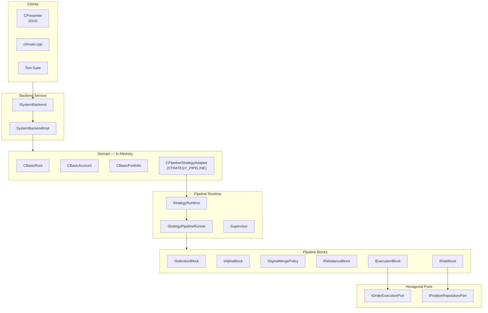

### Where the pipeline config lives

A strategy's pipeline configuration is stored in the `model_nodes.config_json` column under the `pipelineConfig` key:

```json
{
  "parameters": { ... },
  "assetList": { ... },
  "pipelineConfig": {
    "selectionBlocks": [
      { "blockId": "PassAll", "config": {} }
    ],
    "alphaBlocks": [
      { "blockId": "Momentum", "config": { "period": 20, "threshold": 0.02 } }
    ],
    "mergePolicy": "FirstWins",
    "rebalanceBlock": { "blockId": "SimpleRebalance", "config": {} },
    "riskBlocks": [
      { "blockId": "MaxPosition", "config": { "maxPositionValue": 10000 } }
    ],
    "executionBlock": { "blockId": "MarketOrder", "config": {} }
  }
}
```

`ISystemBackend::pipelineConfig(strategyId)` returns this JSON object. `ISystemBackend::addBlock()` and `removeBlock()` modify it through the DB-first mutation pattern.

---

## Pipeline Block System

### Block types and flow

```mermaid
flowchart LR
    subgraph Pipeline[Strategy Pipeline]
        direction LR
        Sel["ISelectionBlock\nAsset Filter"]
        Alpha["IAlphaBlock\nSignal Generation"]
        Merge["ISignalMergePolicy\nMulti-Alpha Merge"]
        Reb["IRebalanceBlock\nTarget Positions"]
        Risk["IRiskBlock\nPosition Limits"]
        Exec["IExecutionBlock\nOrder Placement"]

        Sel -->|"filtered symbols"| Alpha
        Alpha -->|"Signal[]"| Merge
        Merge -->|"merged Signal[]"| Reb
        Reb -->|"TargetPosition[]"| Risk
        Risk -->|"ExecutionIntent[]"| Exec
    end

    MarketTick["MarketTick\n(from Typed Router)"] --> Sel
    Exec -->|"IOrderExecutionPort"| Broker["IB TWS\nor Mock"]
```

### Multiple alpha blocks

Multiple alpha blocks are supported. When more than one alpha block is configured, their outputs are combined by `ISignalMergePolicy`:

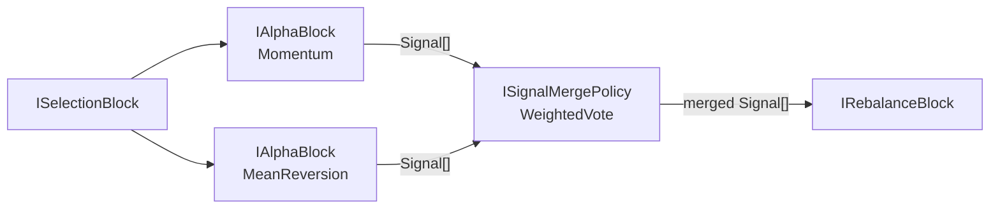

---

## CPipelineStrategyAdapter — Tree Bridge

`CPipelineStrategyAdapter` bridges the LEGO pipeline into the `CGenericModelApi` tree hierarchy. It inherits `CBaseModel` so it appears in the portfolio tree alongside accounts and portfolios.

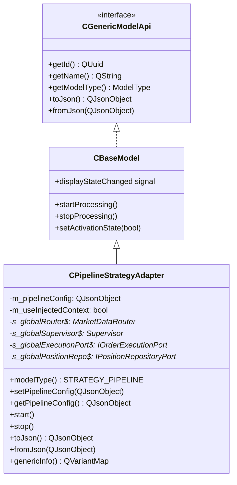

| `CGenericModelApi` method | `CPipelineStrategyAdapter` behavior |
|--------------------------|-------------------------------------|
| `modelType()` | Returns `STRATEGY_PIPELINE` |
| `getParameters()` | Flattens pipeline JSON config into `QVariantMap` |
| `setParameters()` | Updates pipeline config from edited `QVariantMap` |
| `start()` | Creates `StrategyRuntime` via `PipelineFactory`, wires to router + supervisor |
| `stop()` | Removes runtime from Supervisor |
| `toJson()` / `fromJson()` | Standard fields + `"pipelineConfig"` JSON object |
| `genericInfo()` | Runtime stats: pipeline runs, uptime, healthy status, execution mode |

**Execution Mode:** Each pipeline strategy has a `DryRun`/`Live` toggle (default: `DryRun`). In `DryRun`, orders go to `MockExecutionAdapter`. In `Live`, orders go to `IBOrderExecutionAdapter` via the global ports.

**Static globals (live path):**
```cpp
static inline IBComm::MarketDataRouter*        s_globalRouter = nullptr;
static inline Supervision::Supervisor*         s_globalSupervisor = nullptr;
static inline Ports::IOrderExecutionPort*      s_globalExecutionPort = nullptr;
static inline Ports::IPositionRepositoryPort*  s_globalPositionRepo = nullptr;
```

Set at application startup via `setGlobalRouter()`, `setGlobalSupervisor()`, etc. The backtest path will use per-instance injection instead (see `BACKTESTER_DESIGN.md`).

---

## Data Contracts

All data flowing through the pipeline uses typed, serializable Qt value types defined in `Pipeline/Contracts.h`:

| Contract | Purpose | Key Fields |
|----------|---------|------------|
| `Signal` | Alpha block output | `symbol`, `confidence`, `direction` (Buy/Sell/Hold), `correlationId` |
| `TargetPosition` | Rebalance output | `symbol`, `targetQuantity`, `currentQuantity`, `reason` |
| `ExecutionIntent` | Risk-approved order | `symbol`, `quantity` (signed), `orderType` (Market/Limit/Stop) |
| `MarketTick` | Router output | `symbol`, `bid`, `ask`, `volume`, `timestamp` |
| `HistoricalBar` | Historical data | `symbol`, `open`, `high`, `low`, `close`, `volume`, `timestamp` |

All are `Q_GADGET` structs — serializable, copyable, no inheritance.

---

## Block Interfaces and Concrete Implementations

### Interface summary

| Interface | File | Method |
|-----------|------|--------|
| `ISelectionBlock` | `Pipeline/ISelectionBlock.h` | `selectAssets(MarketTick) → QStringList` |
| `IAlphaBlock` | `Pipeline/IAlphaBlock.h` | `onTick(MarketTick)`, `onBarClose(sym, ts)` → emit `Signal` |
| `ISignalMergePolicy` | `Pipeline/ISignalMergePolicy.h` | `merge(QVector<Signal>) → QVector<Signal>` |
| `IRebalanceBlock` | `Pipeline/IRebalanceBlock.h` | `rebalance(signals, positions) → QVector<TargetPosition>` |
| `IRiskBlock` | `Pipeline/IRiskBlock.h` | `filter(targets, positions) → QVector<ExecutionIntent>` |
| `IExecutionBlock` | `Pipeline/IExecutionBlock.h` | `execute(intents, execPort)` |

### Concrete block implementations

| Interface | Concrete Blocks |
|-----------|-----------------|
| `ISelectionBlock` | `PassAllSelectionBlock`, `StaticListSelectionBlock` |
| `IAlphaBlock` | `MomentumAlphaBlock`, `MeanReversionAlphaBlock`, `MovingAverageCrossoverAlphaBlock` |
| `ISignalMergePolicy` | `FirstWinsMerge`, `WeightedVoteMerge`, `UnanimousMerge` |
| `IRebalanceBlock` | `SimpleRebalanceBlock` |
| `IRiskBlock` | `MaxPositionRiskBlock` |
| `IExecutionBlock` | `MarketOrderExecutionBlock`, `LimitOrderExecutionBlock` |

### BlockRegistry

`BlockRegistry` (`Pipeline/BlockRegistry.h`) maps block ID strings to factory functions. Used by `PipelineFactory` to build block graphs from JSON config:

```cpp
// Register a block
BlockRegistry::instance().registerBlock("Momentum",
    [](const QJsonObject& cfg) { return std::make_unique<MomentumAlphaBlock>(cfg); });

// Build graph from JSON
auto graph = BlockRegistry::instance().buildGraph(pipelineConfig);
```

---

## Typed Routers — Data Delivery

All IB TWS callbacks flow through typed routers to both legacy models and pipeline strategies:

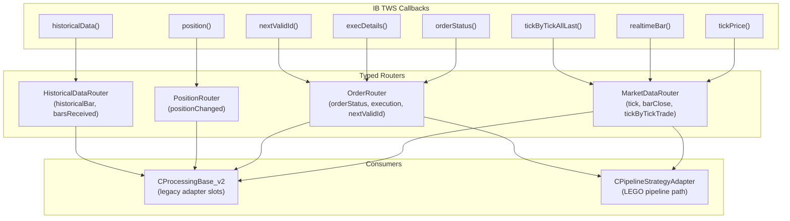

Legacy models receive data via adapter slots in `CProcessingBase_v2` that convert `Q_GADGET` types to legacy `CObject` types. Pipeline strategies receive typed signals directly.

---

## Ports and Adapters (Hexagonal Architecture)

The pipeline never calls IB directly. Two port interfaces define the boundary:

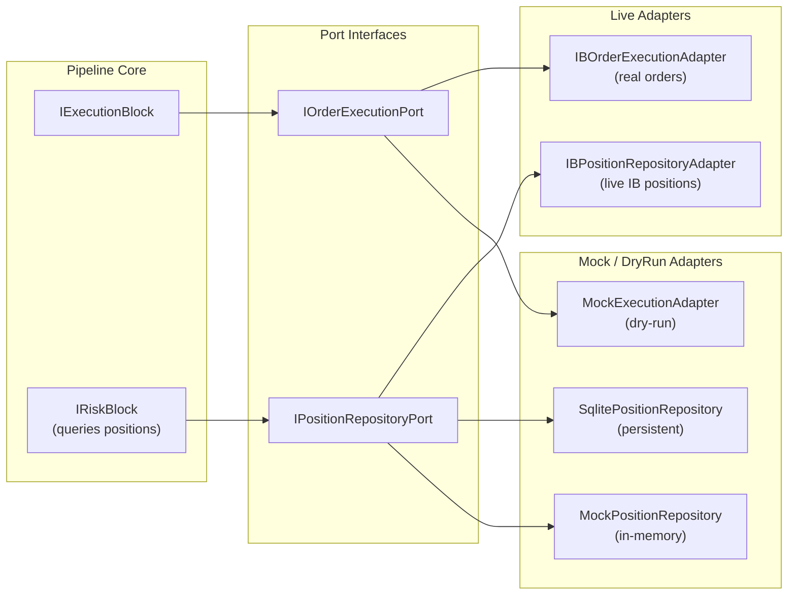

| Port | Purpose | Live Adapter | DryRun Adapter |
|------|---------|-------------|-------------|
| `IOrderExecutionPort` | Place/cancel orders | `IBOrderExecutionAdapter` | `MockExecutionAdapter` |
| `IPositionRepositoryPort` | Query/update positions | `IBPositionRepositoryAdapter` | `SqlitePositionRepository` or `MockPositionRepository` |

**OrderEventBridge** (`Adapters/OrderEventBridge.h`) relays IB order callbacks to the pipeline's execution adapter:
- `IBComClientImpl::orderStatus()` → `bridge.onOrderStatus()` → `IBOrderExecutionAdapter::updateOrderStatus()`
- This keeps `IBOrderExecutionAdapter` free of QObject overhead while providing thread-safe delivery.

### Broker boundary (multi-broker alignment)

- **Authoritative domain types** at the pipeline edge are `Pipeline::MarketTick`, `Pipeline::OHLCVBar`, and related contracts in `Pipeline/Contracts.h`. `Pipeline/` and `Blocks/` headers do not include IB SDK or `IBComm/*` router headers.
- **Historical warm-up for alphas** uses the same shape as bars: `QVector<Pipeline::OHLCVBar>`. IB-specific `IBComm::HistoricalBar` is converted once in `Adapters/PipelineHistoricalConversions.h` (`Adapters::toOhlcvBars`).
- **Live connection wiring** uses `Brokers::createBrokerApi("ib")` (see `Brokers/BrokerConnectionFactory.h`) so presenters do not construct `IBComClientImpl` directly; IB-only setup (e.g. `setMarketDataRouter`) runs only when the implementation is `IBComClientImpl`. A stub backend id `paper` exists for non-IB flows (`Brokers/PaperBrokerStub`).
- **Legacy processing** (`CProcessingBase_v2`) receives typed router signals via `IBComm::ProcessingRouterSink`, keeping concrete router types out of `Common/cprocessingbase_v2.h`.

### Live vs backtest — same pipeline path (not the legacy processing path)

For **LEGO / `STRATEGY_PIPELINE`** strategies, live and backtest are intentionally aligned on **one** execution shape:

| Concern | Live | Backtest |
|--------|------|----------|
| **Config → graph** | `CPipelineStrategyAdapter` + `PipelineFactory::buildGraph` / `createRuntime` from persisted `pipelineConfig` | Same adapter + factory; `BacktestSession` uses `CPipelineStrategyAdapter` with injected backtest context (`Backtest/BacktestSession.cpp`) |
| **Runner ingress** | `StrategyPipelineRunner::ingestTick` / `ingestOhlcvBar` only — types `Pipeline::MarketTick`, `Pipeline::OHLCVBar` | Same slots from `MarketDataReplayer` (`tick` / `ohlcvBar`) — **not** a separate “old strategy” tick pipeline |
| **Feed source** | `IBComm::MarketDataRouter` via `StrategyRuntime::connectToMarketData` → `StrategyPipelineRunner::connectToMarketData` (typically **queued** to the runner thread) | `MarketDataReplayer` (CSV/Yahoo/JSONL, etc.) — **direct** connections in-session for determinism |
| **Execution / positions** | `IBOrderExecutionAdapter` + `IBPositionRepositoryAdapter` when `ExecutionMode::Live` | `SimulatedExecutionAdapter`, `SimulatedLedger`, optional sqlite/mock position repos |

So: **same block graph and same runner API** for pipeline strategies; **different** feed implementations and **different** execution adapters — which is expected. What is *not* shared with this path is **legacy** `CBasicStrategy_V2` code that still runs through `CProcessingBase_v2` and IB routers for non-pipeline strategies.

---

## Supervision Layer

The `Supervisor` manages the lifecycle of all running pipeline strategies:

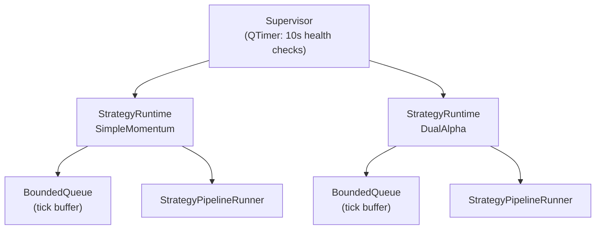

| Component | Role |
|-----------|------|
| `Supervisor` | Periodic health checks, restart crashed runtimes per `RestartPolicy` |
| `StrategyRuntime` | Owns a `BoundedQueue` + `StrategyPipelineRunner`, runs on its own thread |
| `BoundedQueue` | Lock-free tick buffer between `MarketDataRouter` and the pipeline thread |
| `StrategyPipelineRunner` | Executes the block graph: Selection → Alpha → Merge → Rebalance → Risk → Execution |

---

## Pipeline Config Persistence

### How config_json works

The `config_json` column in `model_nodes` stores stable configuration only. `ModelTreeMapper::nodeConfigJson()` strips the following before persisting:
- `"models"` array (child hierarchy — stored as separate rows)
- `"genericInfo"` (runtime stats — transient, never persisted)

What remains in `config_json`:
- `"parameters"` — strategy parameters (name, BP, cycle time, etc.)
- `"assetList"` — current asset list
- `"pipelineConfig"` — the full block graph JSON

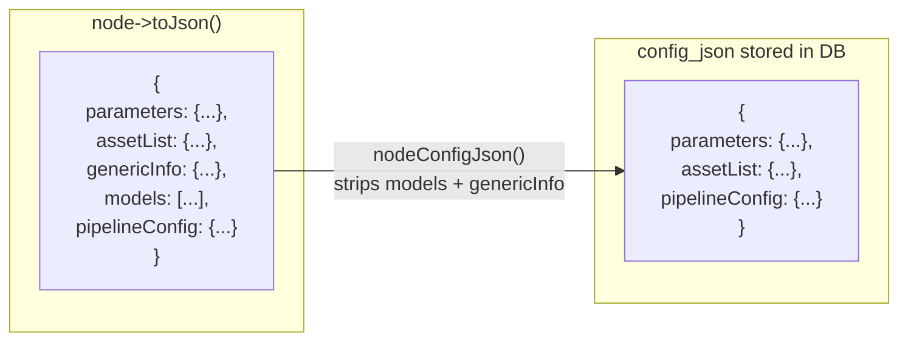

### addBlock / removeBlock flow

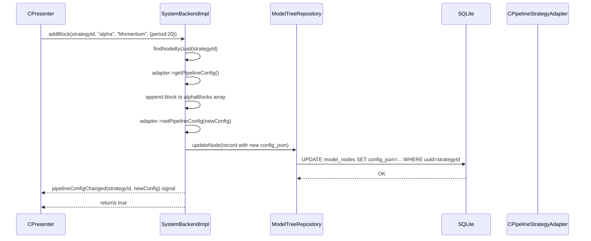

---

## Backend Service Integration

### All mutations go through ISystemBackend

Clients never manipulate block arrays directly. The mutation contract:

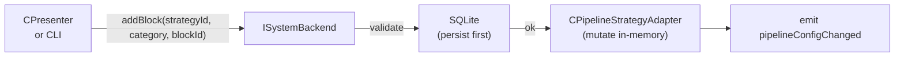

### pipelineConfig query

```mermaid
flowchart LR
    Client["CPresenter\nor CLI"] -->|"pipelineConfig(strategyId)"| Backend["SystemBackendImpl"]
    Backend -->|findNodeByUuid| Adapter["CPipelineStrategyAdapter"]
    Adapter -->|getPipelineConfig()| Config["QJsonObject pipelineConfig"]
    Config --> Client
```

The backtester uses this same API to get the pipeline config without touching the live strategy object:
```cpp
auto config = backend->pipelineConfig(strategyId);
// config is passed to BacktestController — no shared state with live strategy
```

### wireRuntimeSignals

After `loadFromDb()` reconstructs the domain tree, `wireAllRuntimeSignals()` connects each strategy's `CBaseModel::displayStateChanged` signal to `ISystemBackend::strategyStateChanged`:

```cpp
void SystemBackendImpl::wireRuntimeSignals(CGenericModelApi* node) {
    auto* baseModel = dynamic_cast<CBaseModel*>(node);
    if (!baseModel) return;
    QString uuid = node->getId().toString(QUuid::WithoutBraces);
    connect(baseModel, &CBaseModel::displayStateChanged, this,
        [this, uuid](DisplayState, DisplayState newState) {
            emit strategyStateChanged(uuid, static_cast<int>(newState));
        });
}
```

Note: `Qt::UniqueConnection` is NOT used here because it is incompatible with lambdas. The tree is rebuilt via `loadFromDb()` with fresh objects each time, so duplicate connections are not possible.

---

## Strategy Lifecycle

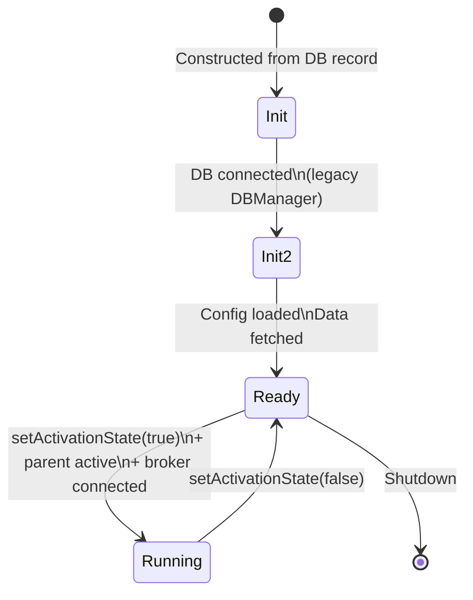

### Activation conditions

A strategy runs only when:
1. `isActive` = true (stored in `model_nodes.is_active`, toggled via `ISystemBackend::setNodeActive()`)
2. `parentActivated` = true (parent portfolio/account is active)
3. `serverConnected` = true (broker connected, checked via `m_Client` in `CProcessingBase_v2`)

The `setNodeActive()` call in `SystemTreeModel::setData()` routes through the backend:
```cpp
// SystemTreeModel::setData() — DB-first activation
if (m_backend) {
    m_backend->setNodeActive(uuid, newState);  // persists + propagates
} else {
    node->model->setActivationState(newState);  // fallback
}
```

### Broker connection null safety

`CProcessingBase_v2::isConnectedTotheServer()` includes a null check for `m_Client` (the `QSharedPointer<CBrokerDataProvider>`):
```cpp
bool CProcessingBase_v2::isConnectedTotheServer() {
    if (!m_Client) return false;  // safe in test/CLI environments
    return m_Client->isConnected();
}
```

This prevents crashes when strategies are constructed in headless environments (tests, CLI) where no broker is injected.

---

## Concrete Block Implementations

### MomentumAlphaBlock

- **File:** `Blocks/MomentumAlphaBlock.h`
- **Config:** `period` (lookback bars), `threshold` (minimum signal strength)
- **Logic:** Computes price change over `period` bars. Emits `Signal` with `direction=Buy` if change > threshold, `Sell` if change < -threshold.

### MeanReversionAlphaBlock

- **File:** `Blocks/MeanReversionAlphaBlock.h`
- **Config:** `window` (rolling mean window), `stdDevThreshold`
- **Logic:** Emits `Signal` when price deviates more than N standard deviations from rolling mean.

### MovingAverageCrossoverAlphaBlock

- **File:** `Blocks/MovingAverageCrossoverAlphaBlock.h`
- **Config:** `fastPeriod`, `slowPeriod`
- **Logic:** Emits `Buy` on fast MA crossover above slow MA, `Sell` on crossover below.

### MaxPositionRiskBlock

- **File:** `Blocks/MaxPositionRiskBlock.h`
- **Config:** `maxPositionValue` (USD)
- **Logic:** Queries `IPositionRepositoryPort`, rejects `ExecutionIntent` if resulting position value would exceed limit.

### MarketOrderExecutionBlock

- **File:** `Blocks/MarketOrderExecutionBlock.h`
- **Logic:** Calls `IOrderExecutionPort::placeOrder()` for each `ExecutionIntent`. Supports both buy and sell.

### LimitOrderExecutionBlock

- **File:** `Blocks/LimitOrderExecutionBlock.h`
- **Config:** `slippageTicks` (ticks of offset from market price for limit)
- **Logic:** Places limit orders at market price ± slippage.

### StaticListSelectionBlock

- **File:** `Blocks/StaticListSelectionBlock.h`
- **Config:** `symbols` (list)
- **Logic:** Returns a fixed asset list regardless of market data. Useful for strategy testing with a known universe.

---

## Multi-Level Risk and Rebalance (Sub-Models)

Strategies can also have classic sub-models (not LEGO blocks) at the strategy level. These are stored in the strategy's `config_json` under `selectionModel`, `alphaModel`, `rebalanceModel`, `riskModel`, `executionModel` keys. They use the legacy `UnifiedModelData` / `DataListPtr` pipeline.

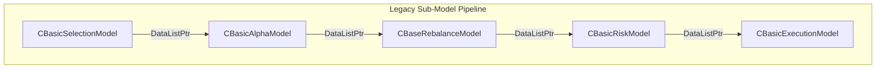

The `UnifiedModelData` structure:
```cpp
struct UnifiedModelData {
    QString   symbol;
    eDirection direction;    // DIRECTION_UP / DOWN / FLAT / UNDEFINED
    double    probability;   // signal confidence
    double    amount;        // position size in shares
    double    currentPrice;  // current market price
};
```

Sub-models can exist at Account and Portfolio levels too (for hierarchical risk management), though the UI currently exposes this at strategy level only.

---

## Test Coverage

| Suite | File | Coverage |
|-------|------|----------|
| Contracts | `tests/` | `Signal`, `TargetPosition`, `ExecutionIntent` types |
| MergePolicies | `tests/` | `FirstWinsMerge`, `WeightedVoteMerge`, `UnanimousMerge` |
| MarketDataRouter | `tests/` | Tick routing, barClose events |
| BlockInterfaces | `tests/` | Interface contracts and mock implementations |
| BlockRegistry | `tests/` | Registration, lookup, unknown block handling |
| PipelineRunner | `tests/` | Full pipeline run, block chaining |
| Supervision | `tests/` | `Supervisor`, `StrategyRuntime`, `BoundedQueue` |
| DefaultPipelines | `tests/integration/` | `simple_momentum_pipeline.json`, `dual_alpha_pipeline.json` |
| PipelineStrategyAdapter | `tests/integration/` | Adapter config/lifecycle, `toJson`/`fromJson` |
| LiveExecutionWiring | `tests/integration/` | `IBOrderExecutionAdapter`, `OrderEventBridge`, tickSize |
| TestRuntime | `tests/backend/tst_runtime.h` | Broker state, backtester integration, config persistence across restart |
| TestSystemBackend | `tests/backend/tst_system_backend.h` | `addBlock`, `removeBlock`, `pipelineConfig` queries |

---

## Directory Structure

```
IbTradeQt/
├── Pipeline/                    # Core pipeline framework
│   ├── Contracts.h              # Q_GADGET data types
│   ├── Scope.h
│   ├── IAlphaBlock.h
│   ├── ISelectionBlock.h
│   ├── IRebalanceBlock.h
│   ├── IRiskBlock.h
│   ├── IExecutionBlock.h
│   ├── ISignalMergePolicy.h
│   ├── BlockRegistry.h
│   ├── BlockGraphSerializer.h
│   ├── StrategyPipelineRunner.h
│   └── PipelineFactory.h
│
├── Blocks/                      # Concrete block implementations
│   ├── MomentumAlphaBlock.h
│   ├── MeanReversionAlphaBlock.h
│   ├── MovingAverageCrossoverAlphaBlock.h
│   ├── MaxPositionRiskBlock.h
│   ├── MarketOrderExecutionBlock.h
│   ├── LimitOrderExecutionBlock.h
│   └── StaticListSelectionBlock.h
│
├── Ports/                       # Hexagonal port interfaces
│   ├── IOrderExecutionPort.h
│   └── IPositionRepositoryPort.h
│
├── Adapters/                    # Port adapters (live + mock)
│   ├── IBOrderExecutionAdapter.h
│   ├── MockExecutionAdapter.h
│   ├── MockPositionRepository.h
│   ├── SqlitePositionRepository.h
│   ├── IBPositionRepositoryAdapter.h
│   ├── OrderEventBridge.h
│   ├── AlphaModelAdapter.h      # Wraps legacy CBasicAlphaModel as IAlphaBlock
│   ├── RiskModelAdapter.h
│   └── ExecutionModelAdapter.h
│
├── Supervision/                 # Runtime lifecycle
│   ├── Supervisor.h
│   ├── StrategyRuntime.h
│   └── BoundedQueue.h
│
├── Logging/
│   └── StructuredLogger.h       # JSON-line logger with correlation IDs
│
├── Metrics/
│   └── MetricsCollector.h       # Counters, gauges, latency p99
│
├── Replay/
│   ├── MarketDataRecorder.h     # Records live ticks to JSONL
│   └── MarketDataReplayer.h     # Replays ticks from JSONL
│
├── Testing/
│   ├── MockMarketDataRouter.h
│   └── IntegrationTestHarness.h
│
├── Strategies/
│   ├── Generic/
│   │   └── cpipelinestrategyadapter.h   # Bridges LEGO pipeline into CGenericModelApi tree
│   └── DefaultPipelines/
│       ├── simple_momentum_pipeline.json
│       └── dual_alpha_pipeline.json
│
└── tests/
    ├── backend/
    │   ├── tst_model_tree_repository.h
    │   ├── tst_system_backend.h
    │   ├── tst_persistence.h
    │   ├── tst_runtime.h
    │   └── tst_cli_proof.h
    └── integration/
        ├── tst_default_pipelines.h
        ├── tst_pipeline_strategy_adapter.h
        └── tst_live_execution_wiring.h
```

---

## Unified market feed and execution host

**Domain inputs (explicit types, not a generic event bus):**

- `Pipeline::MarketTick` — bid/ask (and volume when available) for the quote path.
- `Pipeline::OHLCVBar` — **authoritative** completed bar OHLCV + symbol + bar timestamp. IB `realtimeBar` and replay `addBar` populate this at the adapter boundary; the runner does not infer OHLCV from ticks unless a separate documented mode is added.

**Feed contract (`Pipeline/IMarketDataFeed.h`):** Implementations emit `tick` and `ohlcvBar` on these types (`IBComm::MarketDataRouter`, `MarketDataReplayer`, `MockMarketDataRouter`). `StrategyPipelineRunner::connectMarketDataFeed()` is the only wiring from feed to blocks: it connects to `ingestTick` / `ingestOhlcvBar` (optional `connectTickByTickFeed*` for `tickByTickTrade`).

**Ingress rule:** No direct feed → alpha/risk connections in application code; backtest and live both go through the runner.

**Ordering:** Cross-thread live mode uses `Qt::QueuedConnection` into the runner so the worker thread processes a FIFO of queued calls. `StrategyRuntime::stop()` issues a blocking `ping` on the runner to drain queued ingress before quitting the thread. `Pipeline::PipelineExecutionHost` offers the same drain for tests or custom hosts.

**Bar-close deduplication:** `ingestOhlcvBar` runs `onBarClose` on each alpha, then runs the full pipeline once per **unique bar timestamp** (first bar at that time wins), matching the prior `(symbol, timestamp)` bar-close behavior for multi-symbol sessions.

**Dispatch tie-breaker:** Block order follows persisted pipeline JSON; topological ties use selection/alpha/risk array order; fallback is stable lexical block `id` (see plan invariants).

---

## Legacy-aligned semantic pipeline (ModelDataList)

- **Inter-stage payload:** `Pipeline::ModelDataList` (`DataListPtr` / `UnifiedModelData`) is the canonical semantic handoff; OHLCV is **not** carried on that chain. Conversions to `Pipeline::Signal` for rebalance are centralized in `Pipeline/SemanticModelDataMapper.{h,cpp}` (single source of truth).
- **`semanticPipeline`:** When the strategy pipeline JSON sets `"semanticPipeline": true` (top-level key, same object as `alphas` / `rebalance` / `execution`), `StrategyPipelineRunner::runPipeline` builds a model-data list from selection, runs each alpha’s `processSemantic()` (sync or async — see below), then **`Pipeline::mergeModelDataWithTickSignals`** (`SemanticPipelineChain.cpp`) merges tick-accumulated `Signal`s into that `ModelDataList` (last row wins per symbol when combining). Config `combineTickAndSemanticSignals` (default `true`) controls that merge.
- **`semanticModelRebalance`:** When `true` (default if omitted), after the merge above the runner keeps **`ModelDataList`** through rebalance/risk/execution: `IRebalanceBlock::processSemantic`, `IRiskBlock::processSemantic`, then `IExecutionBlock::executeSemantic` (defaults delegate to existing `rebalance` / `evaluate` / `execute` via the mapper). When `false`, the merged model is converted once to `Pipeline::Signal` via `SemanticMapping::signalsFromModelData`, then the legacy **`rebalance(Signal…)` → `applyRiskBlock` → intents** path runs (same as a non-semantic pipeline after alpha output).
- **Runtime ports:** `Pipeline::PipelineRuntimeContext` injects `IMarketDataAccessor`, `IHistoricalRead`, and the runner reuses execution/position ports. Backtest wires `BacktestMarketDataAccessor` over `MarketPriceStore`. When `BacktestController` prefetches Yahoo bars, it keeps a worker-thread `HistoricalDataManager` alive for the whole session and passes it to `BacktestSession::setHistoricalDataManager`; the session builds `BacktestHistoricalReadAdapter` so native blocks use the same cache via `IHistoricalRead::getBars`. Live subscription union uses `Pipeline::MarketDataCoordinator` inside `CPipelineStrategyAdapter::syncLiveMarketDataSubscriptionsTo` (Option C — no ad hoc `reqMktData` in native blocks).
- **Correlation:** Each `runPipeline` pass generates a UUID `correlationId` passed through `processSemantic`, `Signal`, `TargetPosition`, and `ExecutionIntent` for tracing.
- **Async alphas:** If `IAlphaBlock::semanticCompletionIsAsync()` is `true`, the runner waits for `semanticReady(ModelDataList, correlationId)` instead of using the synchronous return value of `processSemantic` for that block (e.g. `AlphaModelAdapter` when the legacy model finishes in `dataProcessed`). Otherwise `processSemantic` completes on the bar-close thread. Tick/bar `signalGenerated` still applies for non-semantic or parallel paths; use `combineTickAndSemanticSignals: false` if tick and semantic paths must not double-count.
- **Signals:** `Pipeline::Signal::suggestedQuantity` maps to `UnifiedModelData::amount`; `SimpleRebalanceBlock` uses it when `> 0`.

**Live historical check (optional):** Set `IBTRADING_SEMANTIC_LIVE_TESTS=1` when running `ibtrading_tests` so `TestSemanticPipelineLiveHistorical` is registered; it downloads real Yahoo daily bars and runs a short-window backtest with `semanticPipeline` + `semanticModelRebalance` (see `tests/BACKTEST_TESTING.md`).

---

*See [ARCHITECTURE.md](ARCHITECTURE.md) for the full system architecture and [BACKTESTER_DESIGN.md](BACKTESTER_DESIGN.md) for the backtester design.*
