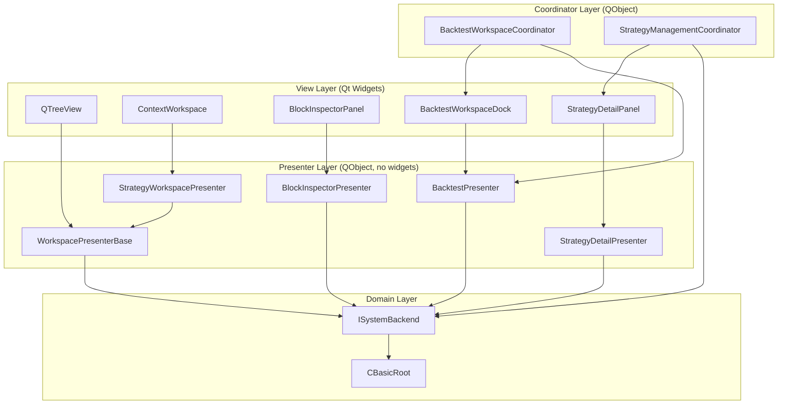
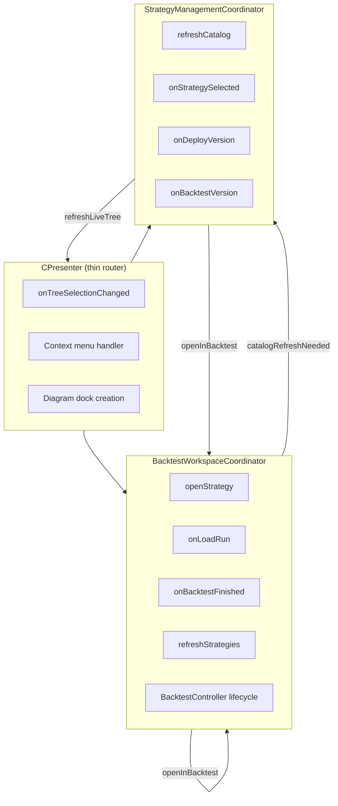
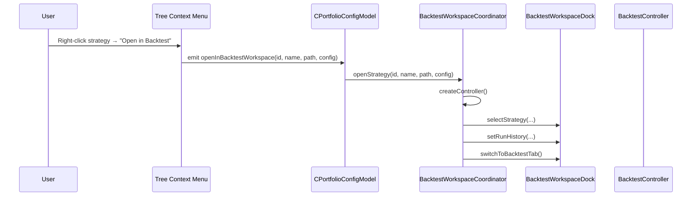
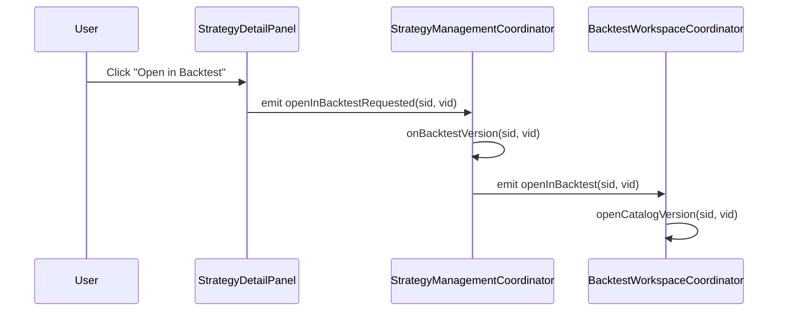
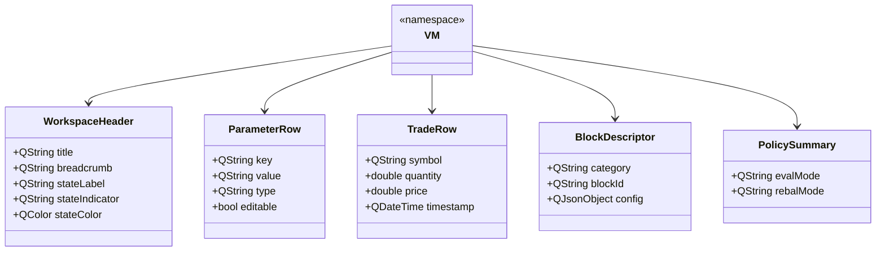
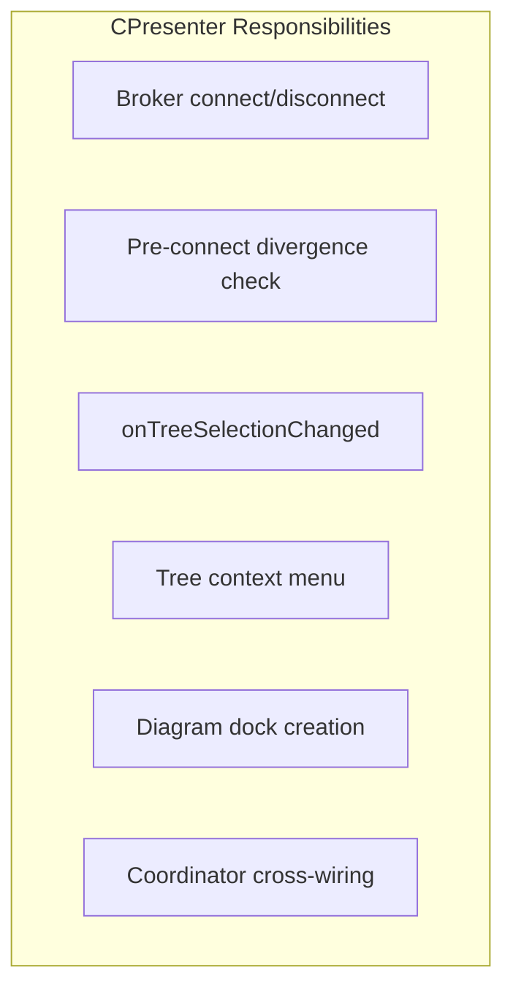
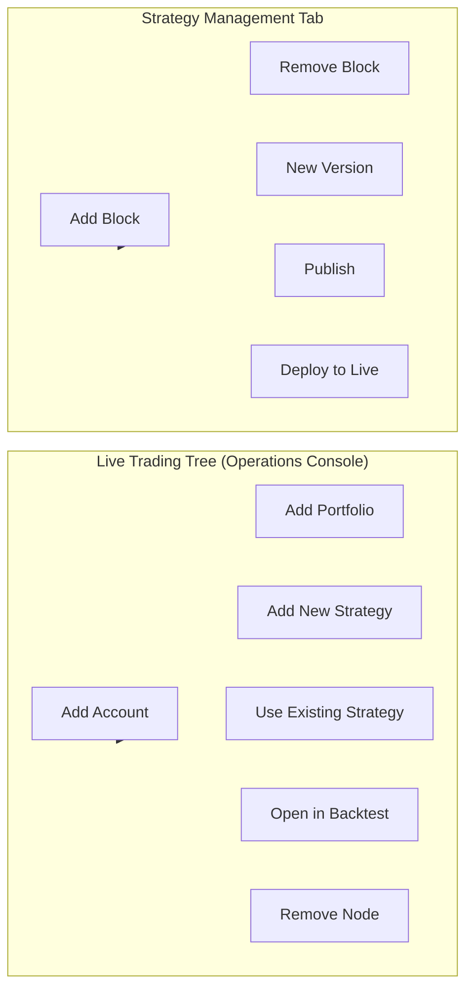
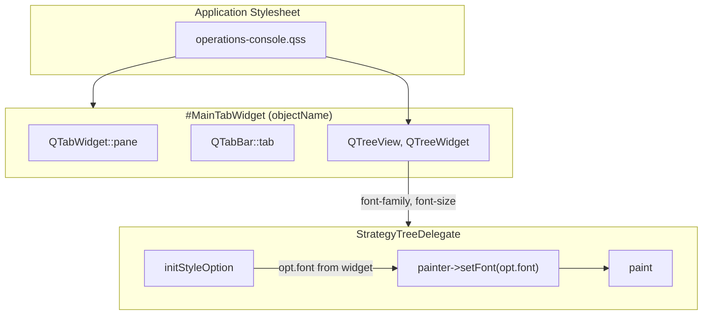

# UI Decoupling Architecture

**Last updated**: March 2026

This document describes the UI decoupling refactoring that separates presentation logic from Qt widgets, enabling modularity, testability, and future compatibility with alternative frontends (e.g., web via WebSocket/REST).

---

## Table of Contents

1. [Overview](#overview)
2. [Architectural Principles](#architectural-principles)
3. [Layer Diagram](#layer-diagram)
4. [Presenter and Coordinator Architecture](#presenter-and-coordinator-architecture)
5. [ViewModels (DTOs)](#viewmodels-dtos)
6. [CPresenter Decomposition](#cpresenter-decomposition)
7. [Live Trading vs Strategy Management](#live-trading-vs-strategy-management)
8. [Tree View Styling](#tree-view-styling)
9. [Key Classes Reference](#key-classes-reference)

---

## Overview

The UI decoupling refactoring achieves:

- **Zero Qt widget dependency** in the model/presenter layer — presenters and coordinators are pure C++ (QObject-only) and can be unit-tested without GUI
- **ViewModels (DTOs)** for all Presenter→View data transfer — no direct domain model exposure to views
- **Thin CPresenter** acting as a router that delegates to specialized coordinators
- **Per-workspace coordinators** owning backtest and strategy management wiring
- **Unified tree styling** via QSS with finance-suitable fonts

---

## Architectural Principles



**Key rules:**

1. **Views** only render data and emit user actions; they never call domain APIs directly.
2. **Presenters** transform domain data into ViewModels and handle user actions via the backend.
3. **Coordinators** wire signals between views and presenters, manage controller lifecycle, and bridge cross-tab communication.
4. **Domain** is accessed only through `ISystemBackend`.

---

## Layer Diagram

```mermaid
flowchart LR
    subgraph User["User"]
        Clicks[Clicks / Selections]
    end

    subgraph View["View"]
        V1[StrategyWorkspace]
        V2[BlockInspectorPanel]
        V3[BacktestWorkspaceDock]
        V4[StrategyDetailPanel]
    end

    subgraph VM["ViewModels"]
        VM1[VM::WorkspaceHeader]
        VM2[VM::ParameterRow]
        VM3[VM::TradeRow]
        VM4[VM::BlockDescriptor]
    end

    subgraph Presenter["Presenter"]
        P1[StrategyWorkspacePresenter]
        P2[BlockInspectorPresenter]
        P3[BacktestPresenter]
        P4[StrategyDetailPresenter]
    end

    subgraph Backend["Backend"]
        ISB[ISystemBackend]
    end

    Clicks --> View
    View -->|applyHeader(VM)| View
    View -->|user action signals| Presenter
    Presenter -->|buildMetrics, buildOverview, etc.| VM
    Presenter -->|backend calls| ISB
```

---

## Presenter and Coordinator Architecture

### Coordinator Hierarchy



### Signal Flow: Open Strategy in Backtest



### Signal Flow: Strategy Management → Backtest



---

## ViewModels (DTOs)

All Presenter→View data transfer uses plain structs in `SharedUI/ViewModels.h`:



---

## CPresenter Decomposition

### Before vs After

| Aspect | Before | After |
|--------|--------|-------|
| CPresenter lines | ~1366 | ~455 |
| Backtest logic | In CPresenter | BacktestWorkspaceCoordinator |
| Strategy Mgmt logic | In CPresenter | StrategyManagementCoordinator |
| Block add/remove in Live tree | Yes | No (Strategy Management only) |

### What Remains in CPresenter



### Coordinator Responsibilities

| Coordinator | Responsibilities |
|-------------|------------------|
| **BacktestWorkspaceCoordinator** | BacktestController lifecycle, run/load/finish/fail handling, strategy selector wiring, run history population, catalog refresh after version save |
| **StrategyManagementCoordinator** | Catalog refresh, strategy selection, new/archive/publish, add/remove block, deploy to live, open in backtest |

---

## Live Trading vs Strategy Management

### Context Menu Split



**Rule:** Adding or removing pipeline blocks (Selection, Alpha, Risk, Rebalance, Execution) is allowed **only** in the Strategy Management tab. The Live Trading tree context menu does not offer "Add Block" or "Remove Block" actions.

---

## Tree View Styling

### QSS Architecture



### Key Styling Rules (operations-console.qss)

| Selector | Purpose |
|----------|---------|
| `QTabWidget#MainTabWidget::pane` | Tab content area border |
| `QTabWidget#MainTabWidget QTabBar::tab` | Tab button padding and font |
| `QTabWidget#MainTabWidget QTreeView` | Tree font inside tabs (pipeline, backtest, catalog) |
| `QTreeView, QTreeWidget` | Global tree styling (background, selection) |
| `QTreeView::item` | Row height (22px), padding |

### Font Stack

- **Tree view:** `Consolas`, `SF Mono`, `Roboto Mono`, `DejaVu Sans Mono`, monospace @ 11px
- **Header:** Same family @ 10px, uppercase, letter-spacing

### Delegate Font Application

The `StrategyTreeDelegate` performs custom painting. To respect QSS font settings, it must explicitly apply `opt.font` to the painter:

```cpp
// StrategyTreeDelegate::paint()
initStyleOption(&opt, index);
painter->setFont(opt.font);  // Critical: opt.font carries QSS font
paintBackground(painter, opt);
// ... dispatch to paintNameWithIcon, paintStatusText, etc.
```

Without `painter->setFont(opt.font)`, the delegate would use the default application font and ignore QSS.

### Row and Icon Sizing

| Constant | Value | Purpose |
|----------|-------|---------|
| RowHeight | 22px | Compact finance-terminal density |
| IconSize | 14px | Smaller icons for dense layout |
| IconLeftPad | 3px | Tight padding |
| CellPadH | 3px | Horizontal cell padding |

---

## Key Classes Reference

### SharedUI (Presenter/Model Layer)

| Class | File | Responsibility |
|-------|------|----------------|
| `VM` (namespace) | `SharedUI/ViewModels.h` | DTOs for Presenter→View data |
| `IWorkspaceView` | `SharedUI/IWorkspaceView.h` | Pure virtual view interface |
| `WorkspacePresenterBase` | `SharedUI/WorkspacePresenterBase.h/cpp` | Base presenter with bind/unbind, refresh timer |
| `StrategyWorkspacePresenter` | `SharedUI/StrategyWorkspacePresenter.h/cpp` | Metrics, overview, properties, policy for strategy workspace |
| `BacktestPresenter` | `SharedUI/BacktestPresenter.h/cpp` | Fills→TradeRow, run history, chart data conversion |
| `BlockInspectorPresenter` | `SharedUI/BlockInspectorPresenter.h/cpp` | Block parameter resolution, edit application, JSON diff |
| `StrategyDetailPresenter` | `SharedUI/StrategyDetailPresenter.h/cpp` | Catalog entry loading, version rows, metadata, dirty state |
| `PipelineDiagramModel` | `SharedUI/PipelineDiagramModel.h/cpp` | Pipeline config parsing, block building, diagram data |
| `StrategyTreeDelegate` | `SharedUI/StrategyTreeDelegate.h/cpp` | Column-aware tree painting, applies `opt.font` from QSS |
| `AbstractPipelineTreeModel` | `SharedUI/AbstractPipelineTreeModel.h` | Abstract tree model with virtual nodes |

### MainSystem (Coordinators)

| Class | File | Responsibility |
|-------|------|----------------|
| `BacktestWorkspaceCoordinator` | `MainSystem/BacktestWorkspaceCoordinator.h/cpp` | Backtest tab wiring, controller lifecycle, run/load/finish |
| `StrategyManagementCoordinator` | `MainSystem/StrategyManagementCoordinator.h/cpp` | Strategy Management tab wiring, catalog, deploy, open in backtest |
| `CPresenter` | `MainSystem/cpresenter.h/cpp` | Thin router: tree selection, context menu, coordinator cross-wiring |

### Styling

| Resource | Path | Purpose |
|----------|------|---------|
| Operations console QSS | `MainSystem/style/operations-console.qss` | Global + tab-specific styles, tree font |
| Tab widget object name | `MainTabWidget` | QSS selector for tab content styling |

---

*See [ARCHITECTURE.md](ARCHITECTURE.md) for the overall system architecture and [PIPELINE_ARCHITECTURE.md](PIPELINE_ARCHITECTURE.md) for the pipeline block system.*
